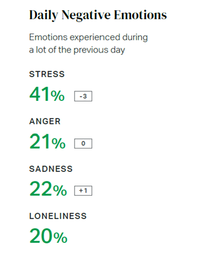
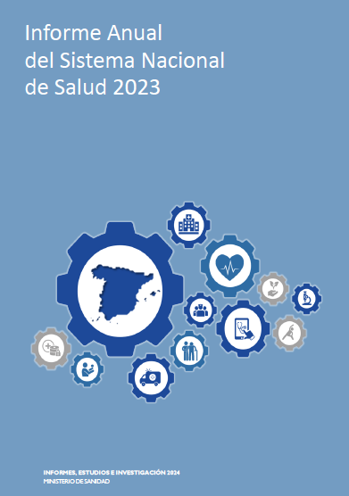
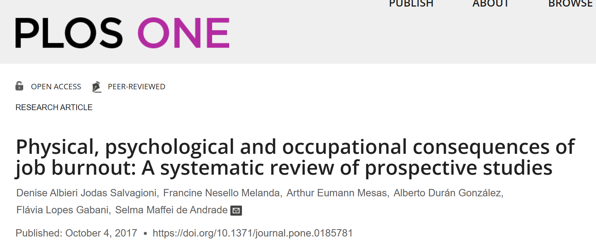

# Efectos negativos del estrés y burnout

## El panorama actual: estrés y salud mental en datos

#imagen #referencia 
 Portada del informe Gallup "State of the Global Workplace" - The Voice of the World's Employees.

#imagen #referencia 
 Informe Gallup "State of the Global Workplace" - Gráfico "Daily Stress" mostrando evolución del % YES global desde 2009 (31%) hasta 2023 (41%).

#imagen #referencia 
 Comparativa "Managers have more negative experiences than non-managers" con datos de 2023: Stress 40%/41%, Anger 19%/24%, Sadness 21%/24%, Loneliness 20%/21%, Worry 36%/39%.

#imagen #referencia 
 Estadísticas "Daily Negative Emotions": STRESS 41% (-3), ANGER 21% (0), SADNESS 22% (+1), LONELINESS 20%.

#imagen #referencia 
 Informe Anual del Sistema Nacional de Salud 2023 - Problemas de salud mental más frecuentes en España 2016-2022: Trastornos de ansiedad, trastornos del sueño, trastornos depresivos.

#imagen #referencia 
 Gráfico "Problemas de salud mental más frecuentes" - Prevalencia por 1.000 habitantes en España 2016-2022: Trastornos de la ansiedad (de 49,6 a 106,5), Trastornos del sueño (de 39,1 a 47,8), Trastornos depresivos (de 41,3 a 81,6).

---

## Consecuencias físicas, psicológicas y ocupacionales del burnout

#teoria
**Consecuencias físicas, psicológicas y ocupacionales del burnout**

- **Enfermedades cardiovasculares:** La fatiga laboral se ha asociado significativamente con un mayor riesgo de hipercolesterolemia, diabetes tipo 2 y enfermedades coronarias.

- **Dolor musculoesquelético:** El burnout es un factor de riesgo para el desarrollo de dolor musculoesquelético, aunque los mecanismos exactos que conectan estas condiciones aún no están claros.

- **Problemas de salud mental:** La fatiga laboral es un predictor significativo de síntomas depresivos y del uso de medicamentos antidepresivos. También se ha observado una mayor incidencia de hospitalizaciones por trastornos mentales entre personas con burnout.

- **Consecuencias ocupacionales:** La fatiga laboral puede llevar a una disminución en la satisfacción laboral, un aumento del ausentismo laboral, y un mayor riesgo de recibir una pensión por discapacidad.

#imagen
 Artículo científico PLOS ONE: "Physical, psychological and occupational consequences of job burnout: A systematic review of prospective studies" (Salvagioni et al., 2017). DOI: https://doi.org/10.1371/journal.pone.0185781

---

## Efectos en la alimentación y el autocuidado

#teoria
**Efectos del estrés en la alimentación:**

- **Hiperfagia:** El estrés puede llevar a comer en exceso (hiperfagia), especialmente alimentos ricos en carbohidratos, como una forma de lidiar con las emociones.

- **Malas elecciones alimentarias:** Bajo estrés, las personas tienden a elegir alimentos poco saludables, como comida rápida y procesada, que brindan una satisfacción inmediata pero contribuyen a la disbiosis y a problemas de salud a largo plazo.

- **Disbiosis:** El estrés crónico altera el equilibrio de la microbiota intestinal, lo que se conoce como disbiosis.

**Efectos del estrés en el autocuidado:**

- **Negligencia:** El estrés puede llevar a descuidar el autocuidado, como dormir poco, no hacer ejercicio y no dedicar tiempo a actividades placenteras.

- **Comportamientos autodestructivos:** En respuesta al estrés, algunas personas recurren a comportamientos autodestructivos como el exceso de trabajo, el consumo excesivo de alcohol, tabaco o drogas.

- **Dificultad para cambiar hábitos:** El estrés puede dificultar la adopción de hábitos saludables y el abandono de los negativos, ya que las personas buscan alivio inmediato en lugar de bienestar a largo plazo.

#imagen #referencia 
 Noticia 20minutos SALUD: "La falta de sueño y el estrés aumentan el riesgo de sufrir cáncer de colon, según nuevos estudios científicos" (Jorge García, 16.10.2024). Dos estudios han relacionado el estrés crónico y la falta de sueño con el cáncer de colon, a través de cambios en la diversidad del microbioma intestinal.

---

## Impacto en el liderazgo y la organización

#teoria
**Impacto en la Gestión Directiva:**

- **Deterioro del Proceso de Toma de Decisiones:** El estrés, especialmente el crónico, puede nublar la claridad mental y la capacidad de análisis, cruciales para una toma de decisiones eficaz. Puede llevar a decisiones impulsivas o basadas en el miedo, en lugar de un análisis objetivo de la situación.

- **Afectación del Liderazgo:** Un líder estresado puede tener dificultades para inspirar, motivar y guiar a su equipo. La irritabilidad, la falta de paciencia y la dificultad para comunicarse efectivamente, síntomas del estrés, crean un ambiente de trabajo tenso y poco productivo.

- **Reducción de la Creatividad e Innovación:** El estrés limita la capacidad de pensar con flexibilidad y encontrar soluciones novedosas, elementos esenciales para la innovación.

**Impacto en las Personas de la Organización:**

- **Contagio Emocional:** El estrés es contagioso. Un líder estresado puede transmitir esa tensión al equipo, generando un clima laboral negativo.

- **Conflictos Interpersonales:** La irritabilidad y la falta de paciencia, consecuencia del estrés, pueden aumentar la probabilidad de conflictos interpersonales, afectando la colaboración y el trabajo en equipo.

- **Pérdida de Motivación y Rendimiento:** Un ambiente laboral estresante disminuye la motivación y el rendimiento del equipo.

#imagen #referencia 
 Informe Gallup "State of the Global Workplace" - Hallazgo 02: "When managers are engaged, employees are more likely to be engaged." Gráfico de dispersión "Country-Level Relationship Between Manager and Non-Manager Engagement" (r=0.58) mostrando correlación positiva entre % Engaged-Manager y % Engaged-Non-Manager.
