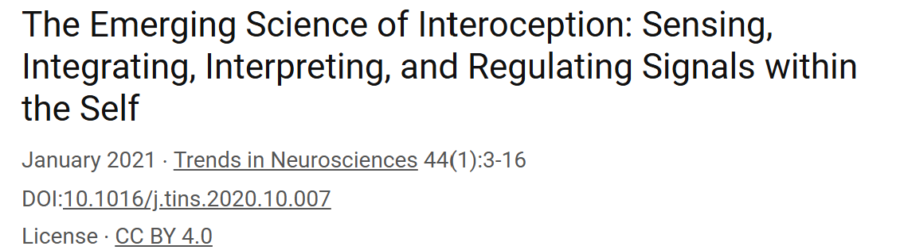

# El mapa interoceptivo en el cerebro

## Las vías de comunicación cuerpo-cerebro

#imagen #referencia
 Recuadro con referencia bibliográfica: "The Emerging Science of Interoception: Sensing, Integrating, Interpreting, and Regulating Signals within the Self" - January 2021, Trends in Neurosciences 44(1):3-16, DOI:10.1016/j.tins.2020.10.007, License: CC BY 4.0

#teoria
El cerebro integra la información de los órganos internos mediante una red neuronal distribuida. Las señales interoceptivas viajan al cerebro a través del nervio vago y la médula espinal. El tálamo las recibe y distribuye a las áreas corticales, donde se procesan e integran con información sensorial, emocional y cognitiva.

Este sistema opera de forma continua y mayormente automática: el cuerpo informa, el cerebro integra. La consciencia registra solo una fracción del proceso.

---

## La ínsula: centro de integración interoceptiva

#imagen
 Ilustración anatómica del cerebro humano en vista lateral, con dos áreas señaladas: la "Corteza somatosensorial" (parte superior, sombreada en gris oscuro) y la "Ínsula" (parte inferior central, sombreada en gris). Dibujo en estilo científico con líneas limpias.

#teoria
**La corteza insular** proporciona un contexto emocional para cada experiencia sensorial. Su posición estratégica —en la profundidad del cerebro— le permite combinar información sobre el estado del cuerpo y ponerla a disposición de los procesos cognitivos y emocionales superiores.

Según los investigadores Antonio Damasio y Bud Craig, la ínsula constituye una piedra angular de la consciencia. Esta capacidad emerge de su función integradora: combina información visceral, emocional y del entorno para crear lo que se denomina el "momento emocional global".

El mecanismo opera en cuatro fases:

- **Recepción de señales**: La ínsula recibe señales interoceptivas del tálamo, que a su vez las obtiene del nervio vago, la médula espinal y los nervios que inervan los órganos internos.

- **Procesamiento multimodal**: Integra estas señales con información sensorial externa (vista, oído, tacto, olfato, gusto) y con información emocional de la amígdala.

- **Creación de un mapa interno**: Genera una representación del estado del cuerpo que incluye sensaciones viscerales, emociones y la percepción del "yo".

- **Conexión con áreas corticales superiores**: Está conectada con la corteza prefrontal —responsable de la planificación, toma de decisiones y control de la conducta— permitiendo que el estado corporal informe la cognición.

#explicacion
La implicación práctica: el estado del cuerpo no es información separada del pensamiento. La ínsula garantiza que cada decisión, cada evaluación, cada juicio ocurra sobre un fondo corporal que lo tiñe. Esa sensación difusa antes de una reunión importante, ese impulso de hablar o callar en una conversación tensa —no son ruido. Son datos que el cerebro ya ha integrado en la experiencia consciente.

Reconocer este mecanismo permite distinguir cuándo una reacción proviene del análisis de la situación y cuándo del estado corporal del momento.

---

## Notas para revisión

### 1. Contenido eliminado por redundancia

- **Sección 1 (#explicacion original)**: Eliminado bloque completo porque solo reformulaba el contenido de #teoria con ligeras expansiones ("señales interoceptivas, que son las señales que provienen del interior del cuerpo") sin añadir perspectiva, aplicación ni conexión con experiencia.

- **Sección 2 (#explicacion original - parte 1)**: Eliminada subsección "La Ínsula: Un Centro de Integración Interoceptiva" porque repetía la afirmación de Damasio y Craig ya mencionada, y la descripción del "momento emocional global" era redundante con el contenido integrado en #teoria.

- **Sección 2 (#explicacion original - parte 2)**: Eliminada subsección "Contexto Emocional para las Experiencias Sensoriales" porque reproducía literalmente el contenido de #teoria sobre la corteza insular.

### 2. Decisiones de reorganización

- **Lista de 4 fases**: Integrada en el bloque #teoria porque describe mecanismo (no aplicación). La información era valiosa pero estaba mal ubicada en #explicacion.

- **Nuevo #explicacion generado**: Se creó un bloque #explicacion breve que aporta implicación práctica y conexión con experiencia —contenido que faltaba en el original pero que es necesario para cumplir la función pedagógica del módulo.

### 3. Ausencias estructurales detectadas

- El archivo original carecía de transiciones entre secciones. Se añadió una frase de cierre en la primera sección y el bloque #explicacion final conecta con la aplicación práctica.

- No hay preguntas reflexivas en el original. No se añadieron para respetar límite FONDO.

### 4. Referencias sugeridas

- El concepto de "momento emocional global" mencionando a Damasio y Craig podría beneficiarse de una referencia bibliográfica específica (la referencia general al principio del documento es sobre interocepción en general, no específicamente sobre la ínsula).
