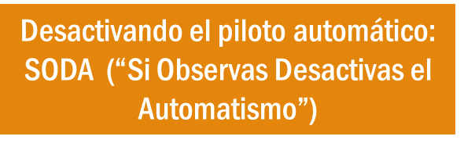

# Tema 8: La atencion como puerta de la consciencia

## Por que este tema es necesario

#### Lo que no atiendes no existe para ti

**Pregunta que responde:**
Que determina de que soy consciente y de que no?

Este tema introduce el concepto central del programa: la atencion como recurso limitado y como "puerta" de la consciencia.

Lo que no atiendes no llega a la consciencia; lo que captura tu atencion domina tu experiencia.

Este es el eslabon entre la arquitectura mental (T1-T7) y la posibilidad de intervencion (T9-T10).

---

## Dos sistemas de atencion

#### Sistema de abajo-arriba (Bottom-up)

**El sistema de abajo-arriba opera con rapidez y automatismo.** Su función: captar estímulos externos que podrían ser significativos antes de que la consciencia deliberada intervenga.

Esta atención es espontánea. Funciona en modo "piloto automático" —un mecanismo privilegiado por la orientación a la supervivencia. Un movimiento en la periferia visual, un sonido inesperado, un cambio súbito en el entorno: el sistema responde antes de que haya decisión consciente de atender.

**Caracteristicas:**
- Automatico
- No requiere esfuerzo
- Capturado por estimulos externos
- Orientado a la supervivencia

**Funcion evolutiva:** Detectar amenazas y oportunidades rapidamente. Un ruido repentino, un movimiento en la periferia, un olor de comida.

**Mecanismo:** La amigdala y otras estructuras "secuestran" la atencion hacia lo potencialmente relevante.

#imagen
Imagen de un muñeco cabezón (bobblehead) de un piloto o policía con gorra azul, representando metafóricamente el modo "piloto automático" del sistema de atención de abajo-arriba.

#imagen
  Diagrama con silueta de persona y ondas concéntricas entrando hacia ella, etiquetado "Stimulus Driven Attention". Representa la atención capturada por estímulos externos (sistema abajo-arriba).

#### Sistema de arriba-abajo (Top-down)

**El sistema de arriba-abajo contrasta radicalmente.** Es más lento, deliberado, controlado por la corteza prefrontal. Permite dirigir intencionalmente la atención hacia lo que se decide priorizar.

Este sistema requiere esfuerzo consciente. Es crucial para mantener el foco en tareas complejas, para la planificación, para la regulación de emociones. Cuando se elige concentrarse en una lectura profunda o evitar responder impulsivamente a una situación emocional, es el sistema de arriba-abajo ejerciendo control sobre los impulsos automáticos generados por el sistema de abajo-arriba.

**Caracteristicas:**
- Voluntario
- Requiere esfuerzo
- Controlado por la corteza prefrontal
- Orientado a objetivos

**Funcion:** Dirigir la atencion hacia lo que hemos decidido que importa, ignorando distracciones.

**Mecanismo:** La corteza prefrontal "gobierna" la atencion, inhibiendo estimulos irrelevantes.

#imagen
Fotografía de un director de orquesta visto desde atrás, dirigiendo a una orquesta sinfónica completa. Representa el sistema de atención de arriba-abajo: la capacidad de dirigir intencionalmente la atención, como un director que coordina y focaliza los diferentes elementos de la orquesta.

#imagen
 Diagrama con silueta de persona y flechas saliendo de ella hacia afuera, etiquetado "Goal Directed Attention". Representa la atención dirigida intencionalmente hacia objetivos (sistema arriba-abajo).

---

## La competencia entre sistemas

**El de abajo-arriba es mas rapido

Los procesos de arriba-abajo ejercen un poder considerable sobre la información que accede momento a momento. Están respaldados por una conectividad neural muy potente[^1]. La información del aquí y ahora —de abajo-arriba— tiene dificultades para hacer llegar a la consciencia su auténtico mensaje. La riqueza de matices presente en los niveles sensoriales iniciales se va perdiendo a medida que los procesos de arriba-abajo surten efecto, asimilando el contenido informativo a categorías previamente determinadas.

La atencion capturada opera en milisegundos. La atencion dirigida tarda mas en activarse y requiere energia.

En un entorno rico en estimulos (como el entorno digital actual), el sistema de abajo-arriba esta constantemente activado, dificultando el control top-down.Daniel Goleman resalta la importancia de la atención en ambos sistemas y cómo cada uno responde de manera diferente a los estímulos —algo fundamental para la autoconciencia y la autorregulación[^2]. Un objeto brillante, un ruido fuerte: el sistema de abajo-arriba captura la atención instantáneamente, sin pensarlo. Sin embargo, en un contexto de constantes distracciones —notificaciones en el móvil, interrupciones continuas— este sistema puede activarse con demasiada frecuencia, fragmentando la atención y dificultando el enfoque en tareas importantes.

**El de arriba-abajo es mas estrategico

Prestar atención especial y detallada a la información entrante dificulta el funcionamiento de los procesos de arriba-abajo y favorece la llegada de más riqueza informativa a las instancias prefrontales. Este proceso requiere que la corteza prefrontal dorso-lateral (DLPFC) se active mientras recibe la información privilegiada en ese momento. **Una vez dirigida la atención a una de las corrientes sensoriales, si se implica simultáneamente la capacidad de autoobservación —la metacognición que permite hacerse consciente de los procesos mentales en marcha— surge la oportunidad de flexibilizar la respuesta**, desconectando la automaticidad que, sin esta intervención consciente, se hubiera producido.

Solo la atencion dirigida permite:
- Mantener el foco en objetivos de largo plazo
- Resistir la tirania de lo urgente
- Observar la propia experiencia (metaconsciencia)

---

## SODA: Si Observas, Desactivas el Automatismo

El modo en que se despliega la atención determina lo que se ve.

#imagen
 "Desactivando el piloto automático: SODA ('Si Observas Desactivas el Automatismo')". Concepto clave que sintetiza cómo la observación consciente desactiva las respuestas automáticas.

**El principio

Cuando observas conscientemente un proceso automatico, este se desacelera o se interrumpe. La atencion consciente "rompe" el piloto automatico.

**Por que funciona

La observacion activa la corteza prefrontal, que puede modular la reactividad de estructuras mas primitivas (amigdala, ganglios basales).

**Implicacion practica

No necesitas "controlar" tus reacciones automaticas. Solo necesitas **observarlas**. La observacion misma cambia el proceso.

#cita
"La atención proporciona el mecanismo «que subyace a nuestra conciencia del mundo y a la regulación voluntaria de nuestros pensamientos y sentimientos".
*Michael Posner y Mary Rothbart (neurocientíficos cognitivos)*[^3]

#cita
"La capacidad de centrar deliberadamente la atención errante una y otra vez constituye el fundamente del discernimiento, el carácter y la voluntad. Una estructura educativa que se dedicara a adiestrar esta facultad sería la educación por antonomasia"
*William James, "The Principles of Psychology"*[^4]

---

## La atencion como recurso limitado

**El "ancho de banda" de la consciencia

Solo podemos atender conscientemente a una cantidad muy limitada de informacion en cada momento. Estimaciones: 40-60 bits por segundo de procesamiento consciente, frente a 11 millones de bits por segundo de procesamiento inconsciente.

**Consecuencias

- La multitarea consciente es un mito
- Lo que no atiendes literalmente no existe para tu consciencia
- La "economia de la atencion" moderna explota este recurso escaso

---

## La atencion es entrenable

**La atención es un recurso cognitivo limitado que puede ser entrenado y fortalecido.**

Esta limitación no es un defecto del sistema. Es una característica de diseño que obliga a seleccionar. No se puede atender a todo simultáneamente —y esa restricción da valor a la elección de hacia dónde se dirige el foco.

La buena noticia: como cualquier capacidad, la atención responde al entrenamiento. La práctica deliberada de dirigir y sostener la atención fortalece los circuitos neurales implicados. Lo que hoy requiere esfuerzo consciente puede convertirse, con práctica sostenida, en una capacidad más accesible.

#imagen
Secuencia de tres bombillas representando niveles de atención: una bombilla encendida con luz cálida intensa (atención plena), una bombilla con luz media (atención parcial), y una bombilla apagada (sin atención). Metáfora visual de cómo la atención es un recurso limitado que puede "agotarse".

#imagen
 Ilustración de un cerebro antropomorfizado con brazos y piernas levantando una barra de pesas. Representa el concepto de que la atención, como un músculo, puede ser entrenada y fortalecida mediante la práctica deliberada.

---

## Integracion con M1

### Conexion con T1-T7

- **T1 (Cerebro predictivo):** La atencion determina que datos entran al sistema predictivo
- **T2 (Sentidos):** Los sentidos alimentan el modelo, pero la atencion filtra que entra
- **T3 (Memoria):** La atencion determina que experiencias se consolidan como automatismos
- **T4 (Emociones y aprendizaje):** Las emociones determinan que captura atencion y se graba
- **T5 (Integracion):** La corteza prefrontal (T5) es la que dirige la atencion top-down
- **T6 (Sistema 1/2):** El Sistema 1 opera con atencion automatica; el Sistema 2 requiere atencion dirigida
- **T7 (Sesgos):** Los sesgos actuan cuando no hay atencion deliberada

### Conexion con T9-T10

- **T9 (Descubriendo mindfulness):** El mindfulness es el metodo para entrenar esta capacidad atencional
- **T10 (Entrenando atencion):** La practica concreta que fortalece las redes atencionales

---

## Conexion con el programa

- **M6:** Desarrollara la metaconsciencia: observar donde esta la atencion
- **Todo el programa:** Cada practica de mindfulness entrena la atencion

La progresion del programa es, en esencia, una progresion de entrenamiento atencional:

| Modulo | Foco de atencion |
|--------|------------------|
| M1 | Respiracion (ancla basica) |
| M2 | Cuerpo (sensaciones) |
| M3 | Pensamientos y emociones |
| M4 | Estres y regulacion |
| M5 | El otro (compasion) |
| M6 | El proceso mismo de atencion |
| M7 | La direccion etica |

---

## Dimension experiencial

Reflexiona:

- Que captura tu atencion habitualmente? Lo urgente? Lo amenazante? Lo placentero?
- Cuanto tiempo puedes mantener la atencion en algo que has elegido, sin ser "secuestrado"?
- Quien o que decide a que prestas atencion: tu o tus estimulos?

Las organizaciones compiten por la atencion de sus lideres:

- Los correos urgentes
- Las reuniones consecutivas
- Las metricas que "hay que vigilar"
- Las crisis del dia

---

## Referencias incluidas
[^1]: Siegel, D. (2007). The Mindful Brain.
[^2]: Daniel Goleman, sobre la importancia de la atención en ambos sistemas para la autoconciencia y la autorregulación.
[^3]: Michael Posner y Mary Rothbart (neurocientíficos cognitivos).
[^4]: William James, "The Principles of Psychology".

**Otras posibles referencias a valorar:

- Posner, M. & Rothbart, M.K. (2007). *Research on attention networks as a model for the integration of psychological science.* Annual Review of Psychology.
- Goleman, D. (2013). *Focus: The Hidden Driver of Excellence.* Harper.
- Jha, A. (2021). *Peak Mind.* HarperOne.
