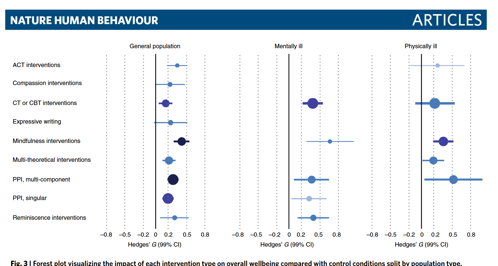

# Tema 6: Mindfulness y regulacion emocional

## Por que este tema es necesario

**Pregunta que responde:**
Como funciona el mindfulness a nivel cerebral, y que evidencia respalda su eficacia para regular el estres?

Este tema cierra el modulo con la base cientifica del mindfulness como herramienta de regulacion.

Descubriras que la aceptacion (T5) no es solo una actitud filosofica: tiene efectos medibles en el cerebro y el cuerpo.

---

## MBSR: de la teoria a la practica

El programa MBSR (Reduccion del Estres Basada en Mindfulness), desarrollado por Jon Kabat-Zinn[^1], cuenta con amplia evidencia empirica. Un metanalisis de Khoury y colaboradores[^2] —29 estudios, 2.668 participantes— confirmo su alta eficacia en la reduccion de estres en individuos sanos.

#imagen
 Cabecera de articulo "Nature Human Behaviour" (https://doi.org/10.1038/s41562-021-01093-w) - "A systematic review and meta-analysis of psychological interventions on wellbeing" por Joep van Agteren, Zoe Kopsaftis et al.

#imagen
 Grafico "Forest plot visualizing the impact of each intervention type on overall wellbeing compared with control conditions split by population type" (Fig. 3). Muestra Hedges' G (99% CI) para diferentes intervenciones en tres poblaciones (General population, Mentally ill, Physically ill): ACT interventions, Compassion interventions, CT or CBT interventions, Expressive writing, Mindfulness interventions (efecto notable en poblacion general), Multi-theoretical interventions, PPI multi-component, PPI singular, Reminiscence interventions.

#imagen
 Fotografia de Jon Kabat-Zinn, creador del programa MBSR.

---

## Evidencia cientifica: el estudio de Davidson

#ejemplo
Richard Davidson y colaboradores (2003) estudiaron la actividad cerebral de 25 empleados de una empresa de biotecnologia sometidos a un programa MBSR de 8 semanas[^3].

**El protocolo

El programa, conducido por el propio Kabat-Zinn, incluia:
- Reuniones semanales de 3 horas para practicar meditacion
- Un retiro en silencio durante la sexta semana
- Practica diaria de una hora durante 6 dias a la semana

El EEG de los participantes se registro en tres momentos:
1. Antes del programa
2. Inmediatamente despues
3. Cuatro meses tras finalizarlo

**El hallazgo central

Los meditadores, comparados con el grupo control, experimentaron un mayor incremento de la activacion cerebral izquierda en las zonas anteriores y medias.

Este patron esta asociado a la disposicion afectiva positiva.

**Tras 8 semanas de mindfulness, la actividad cerebral de los meditadores se habia desplazado hacia la izquierda.**

#imagen
 Grafico del estudio Davidson et al. (2003): "Baseline EEG prefrontal alpha-asymmetry at Time 1 and Time 3" - Grafico de barras comparando grupo Control (barras negras) vs Treatment (barras rayadas grises) en Time 1 y Time 3. Eje Y: "Log Right-Left Alpha Power in uV/Hz" (-0.25 a 0.2). Nota: "Higher numbers indicate left-sided activation". Muestra incremento significativo de activacion izquierda en grupo Treatment en Time 3.

**Por que importa la asimetria prefrontal

Una extensa literatura cientifica documenta:
- Mayor activacion izquierda → estado de animo mas positivo
- Mayor activacion izquierda → reactividad aumentada ante estimulos positivos
- Mayor activacion izquierda → mejor capacidad para afrontar estados negativos
- Mayor activacion izquierda → capacidad para suprimir voluntariamente el afecto negativo

**Efecto en el sistema inmunitario

El estudio tambien midio la respuesta de anticuerpos a una vacuna de gripe.

Los meditadores mostraron una respuesta inmunitaria significativamente mayor que el grupo control.

#imagen
 Grafico del estudio Davidson et al. (2003): "Antibody rise from the 3- to 5-week to the 8- to 9-week" - Grafico de barras comparando Control (~2.19) vs Meditation (~2.29). Eje Y: "Log Transformed Antibody Rise from 3-5 Week to 8-9 Week Post-Vaccine".

---

## Como afecta el mindfulness a las emociones

La investigación sobre mindfulness y regulación emocional constituye un área ampliamente documentada. **El mindfulness tiene un impacto significativo en la conciencia y el etiquetado de las emociones, la experiencia emocional y los niveles de afecto positivo y negativo.** Varias conceptualizaciones del constructo incluyen procesos específicamente relacionados con la regulación emocional.

**El mindfulness se ha estudiado como diferencia individual natural (mindfulness de rasgo o disposicional): la tendencia a observar y aceptar las experiencias del momento presente en la vida cotidiana.**

**Los investigadores también han examinado los efectos de ejercicios breves (inducciones de mindfulness) y programas de entrenamiento (tratamientos basados en mindfulness) dirigidos a aumentar esta capacidad.** Aunque existen diferencias entre estas operacionalizaciones, el mindfulness de rasgo, las inducciones y los tratamientos se asocian consistentemente con una mejor regulación emocional. Los tratamientos basados en mindfulness frecuentemente abordan o implican específicamente la regulación emocional.

#### Efectos clave del mindfulness en la regulación emocional

- **Reduce la reactividad emocional.** Las personas con altos niveles de mindfulness tienden a ser menos reactivas ante estimulos emocionales. Un estudio encontro que los participantes en un programa MBCT exhibieron menor reactividad emocional despues de la Prueba de Estres Social de Trier[^4]. Esta reduccion de la reactividad al estres medio parcialmente las mejoras en sintomas depresivos observadas en el grupo MBCT.

- **Aumenta la disposición a experimentar emociones negativas.** El mindfulness facilita una mayor conciencia y aceptación de las emociones, incluyendo las negativas. Esto conduce a mayor disposición para experimentar emociones negativas sin suprimirlas ni evitarlas. Una breve inducción de mindfulness (15 min) impactó las respuestas a estímulos afectivos neutrales y negativos: los participantes en condiciones de atención desenfocada o preocupación respondieron más negativamente a diapositivas neutras, mientras quienes practicaron respiración enfocada mantuvieron respuestas moderadamente positivas.

- **Promueve emociones positivas.** El mindfulness se relaciona con niveles más altos de afecto positivo y más bajos de afecto negativo. Este hallazgo se replica en muestras diversas (clínicas y no clínicas), edades (desde jóvenes hasta adultos) y conceptualizaciones del constructo (especialmente disposicional y de tratamiento).

- **Reduce la inestabilidad emocional.** El mindfulness facilita la conciencia de las emociones conforme surgen y pasan, promoviendo mayor estabilidad emocional. En un estudio, los participantes reportaron su experiencia emocional aproximadamente seis veces diarias durante una semana. El mindfulness disposicional predijo menos dificultades de regulación emocional autoinformadas y mayor diferenciación emocional. Una mayor diferenciación emocional (positiva y negativa) medió la relación entre mindfulness y reducción de la inestabilidad emocional.

**La investigación indica que el mindfulness desempeña un papel importante en la regulación emocional efectiva.** La forma en que las personas regulan sus emociones afecta diversos resultados conductuales, incluyendo el uso de sustancias y los resultados de abstinencia. La regulación emocional puede ser un mecanismo por el cual el mindfulness promueve patrones de alimentación más saludables.

#imagen
 Portada del libro "Handbook of Mindfulness and Self-Regulation"[^5] (Springer) editado por Brian D. Ostafin, Michael D. Robinson y Brian P. Meier. Portada con diseno abstracto en tonos azules y naranjas.

---

## Las bases cerebrales de la regulación emocional

La investigación indica que el mindfulness afecta las redes neurobiológicas implicadas en la emoción: **la red afectiva central ventral, la red de procesamiento de emociones dorsal y las regiones de la corteza prefrontal (PFC) implicadas en la regulación emocional**.

#### Red Afectiva Central Ventral

- **Amígdala:** La amígdala desempeña un papel clave en el procesamiento de las emociones, especialmente el miedo y otras emociones negativas. El mindfulness —tanto como rasgo como a través del entrenamiento— puede **reducir la actividad de la amígdala en respuesta a estímulos emocionales**. Esto indica que **el mindfulness puede ayudar a regular las respuestas emocionales, reduciendo la reactividad ante desencadenantes emocionales**. Se ha documentado reducción de la activación de la amígdala en estudios de mindfulness de rasgo y de estado. Algunos estudios han relacionado la reducción del estrés percibido tras un programa MBSR con una disminución de la densidad de materia gris en la amígdala derecha.

- **Corteza Prefrontal Ventromedial (VMPFC):** La VMPFC está implicada en la **valoración subjetiva de las experiencias** y en la toma de decisiones basadas en el valor. El mindfulness se asocia con **alteraciones en la actividad de la VMPFC**, indicando un **cambio de la valoración subjetiva y autorreferencial hacia un compromiso más objetivo y no evaluativo** con la experiencia del momento presente.

- **Corteza Cingulada Anterior (ACC):** La ACC participa en la **detección de conflictos y la regulación de las respuestas emocionales**. El mindfulness se relaciona con **actividad alterada en la ACC**, reflejando una **mayor comprensión y control de los contenidos mentales, restando importancia a las atribuciones sobre el propio afecto**. Se ha informado reducción de la activación de la sgACC (región subgenual de la ACC) relacionada con el deseo en respuesta a señales de fumar asociadas con la práctica de mindfulness.

- **Ínsula:** La ínsula desempeña un papel en la **interocepción (conciencia de las sensaciones corporales)** y el procesamiento emocional. **El mindfulness aumenta la activación de la ínsula**, indicando **cambios en la interocepción y la evaluación de eventos sensoriales relevantes**.

#### Red de Procesamiento de Emociones Dorsal

- **Corteza Prefrontal Dorsomedial (DMPFC):** La DMPFC está implicada en la **generación de atribuciones sobre el estado emocional**. **El mindfulness puede aumentar la actividad de la DMPFC en respuesta a estímulos emocionales**, sugiriendo que **los individuos con mayor mindfulness pueden reclutar más eficazmente regiones reguladoras de la PFC durante el procesamiento emocional**.

- **Corteza Prefrontal Medial (MPFC):** La MPFC participa en las **atribuciones sobre las causas del afecto central**. **El mindfulness se asocia con una reducción de la actividad de la MPFC**, indicando un **alejamiento de la valoración subjetiva y la elaboración narrativa hacia una conciencia más experiencial y objetiva de la experiencia presente**.

#### Regiones de la PFC implicadas en la regulación emocional

- **Corteza Prefrontal Ventrolateral (VLPFC):** La VLPFC participa en la **regulación emocional explícita, como el reetiquetado de las emociones**. **El mindfulness disposicional está asociado con una mayor activación de la VLPFC durante tareas de reetiquetado afectivo**, sugiriendo que **los individuos con mayor mindfulness son más eficaces en el reclutamiento de regiones reguladoras de la PFC**.

- **Corteza Prefrontal Dorsolateral (DLPFC):** La DLPFC participa en el **control cognitivo y la regulación emocional**. **El mindfulness se ha relacionado con una mayor activación de la DLPFC, apoyando la capacidad de regular las respuestas emocionales**.

#### Otros hallazgos relevantes

- **Red de Modo Predeterminado (DMN):** La DMN es una red de regiones cerebrales activas cuando la mente divaga o está en reposo. **El mindfulness puede reducir la actividad de la DMN y aumentar la actividad en una red lateralizada izquierda**, indicando un **cambio de un enfoque narrativo y autorreferencial hacia un enfoque más experiencial y basado en el presente**.

- **Cambios estructurales:** **El mindfulness a largo plazo puede conducir a cambios estructurales en el cerebro**, incluyendo un **aumento de la densidad de materia gris en el hipocampo y la corteza prefrontal, y una disminución del volumen de la amígdala**.

La investigación sobre los efectos del mindfulness en el cerebro indica que esta práctica modula la actividad en varias regiones cerebrales clave implicadas en el procesamiento y la regulación emocional. Estos cambios contribuyen a los beneficios del mindfulness para la salud mental y el bienestar.

---

## Implicaciones para la conducta y el bienestar

La investigacion sobre otros resultados conductuales (por ejemplo, alimentacion) tambien demuestra evidencia creciente de que el mindfulness ayuda en la autorregulacion de conductas a traves de sus efectos en la regulacion emocional. Por ejemplo, los programas de tratamiento basados en mindfulness se han aplicado a los antojos de comida y trastornos alimentarios con algunos resultados positivos[^6], y aspectos del mindfulness de rasgo (No-juzgar y Actuar con Conciencia) se han vinculado con menos sintomas de trastornos alimentarios[^7].

---
## La conexion con la aceptacion

Todo esto explica por que la aceptacion (T5) funciona a nivel neurobiologico:

| Aceptacion | Efecto cerebral |
|------------|-----------------|
| No luchar contra la emocion | Menor activacion de la amigdala |
| Observar sin juzgar | Cambio en VMPFC (menos autorreferencial) |
| Permitir que la experiencia sea | Reduccion de actividad en DMN (menos rumiacion) |
| Estar presente | Mayor activacion de insula (interocepcion) |

La aceptacion no es resignacion pasiva. Es una estrategia activa de regulacion con efectos medibles en el cerebro.

---

## Conexion con M2 y M3

**De M2:** La insula, que procesa la interocepcion, se activa mas con la practica de mindfulness. El cuerpo como fuente de informacion se integra con la regulacion emocional.

**De M3:** El espacio entre estimulo y respuesta tiene base neuroanatomica: la corteza prefrontal modulando la amigdala.

---

## Conexion con el programa

Este conocimiento sera la base de:
- **M5:** Regulacion emocional interpersonal (aplicar esto en relacion con otros)
- **M6:** Recuperacion de metaconsciencia bajo presion (entender que es posible recuperar claridad)

---

## Referencias incluidas
[^1]: Jon Kabat-Zinn. Creador del programa MBSR (Mindfulness-Based Stress Reduction).
[^2]: Khoury et al. Metanalisis sobre eficacia de MBSR.
[^3]: Davidson et al. (2003). "Alterations in Brain and Immune Function Produced by Mindfulness Meditation".
[^4]: Estudio sobre MBCT y Prueba de Estres Social de Trier.
[^5]: Ostafin, Robinson y Meier (eds.). "Handbook of Mindfulness and Self-Regulation". Springer.
[^6]: Kristeller, Baer y Quillian-Wolever (2006). Revision sobre mindfulness y trastornos alimentarios.
[^7]: Adams et al. (2012). Estudio sobre mindfulness de rasgo y sintomas de trastornos alimentarios.

**Otras posibles referencias de interés:
- Davidson, R.J. et al. (2003). *Alterations in brain and immune function produced by mindfulness meditation.* Psychosomatic Medicine.
- Kabat-Zinn, J. (1990). *Full Catastrophe Living.* Delacorte.
- Khoury, B. et al. (2015). *Mindfulness-based stress reduction for healthy individuals: A meta-analysis.* Journal of Psychosomatic Research.
- Van Agteren, J., Kopsaftis, Z. et al. (2021). *A systematic review and meta-analysis of psychological interventions on wellbeing.* Nature Human Behaviour.
- Ostafin, B.D., Robinson, M.D. y Meier, B.P. (eds.). *Handbook of Mindfulness and Self-Regulation.* Springer.
