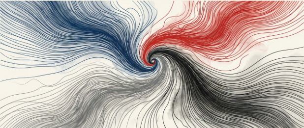
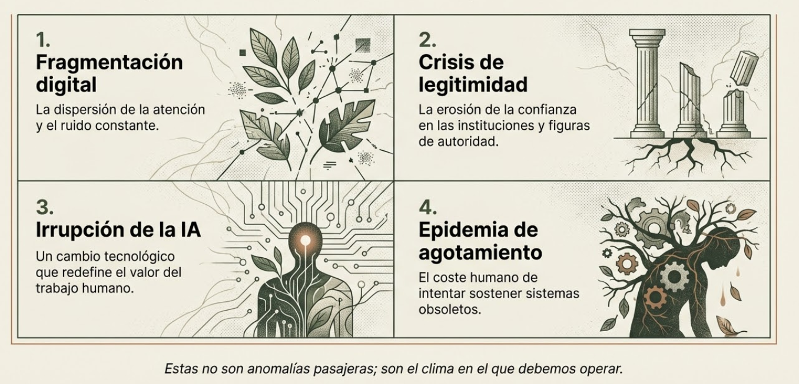
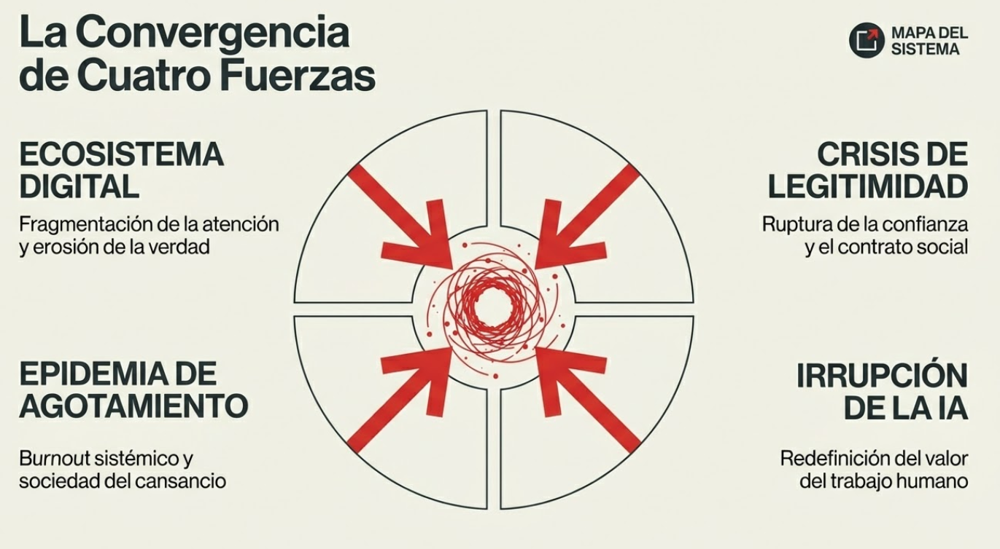
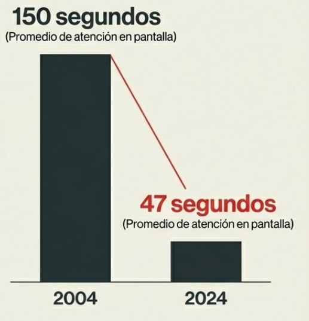
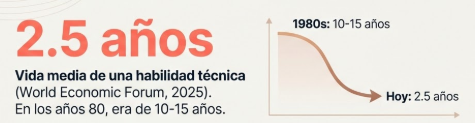
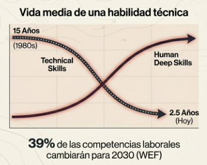
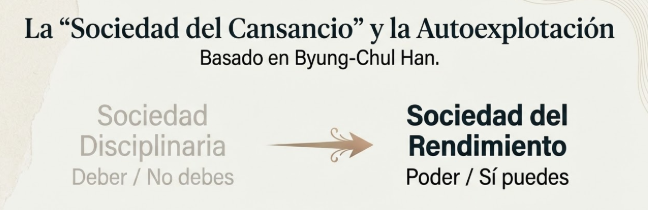

# Tema 1: La tormenta perfecta

- [Por que este tema es necesario](#por-que-este-tema-es-necesario)
	- [Cuatro fuerzas que convergen](#cuatro-fuerzas-que-convergen)
- [1. Las cuatro fuerzas convergentes](#1-las-cuatro-fuerzas-convergentes)
	- [1.1 Un ecosistema digital que fragmenta la atención y erosiona la verdad](#11-un-ecosistema-digital-que-fragmenta-la-atención-y-erosiona-la-verdad)
	- [1.2 Una crisis de legitimidad del liderazgo jerárquico](#12-una-crisis-de-legitimidad-del-liderazgo-jerárquico)
	- [1.3 La irrupción de la IA que redefine qué es valioso del trabajo humano](#13-la-irrupción-de-la-ia-que-redefine-qué-es-valioso-del-trabajo-humano)
	- [1.4 Una epidemia global de agotamiento](#14-una-epidemia-global-de-agotamiento)
- [2. La retroalimentación mutua](#2-la-retroalimentación-mutua)
- [Dimensión experiencial](#dimensión-experiencial)
- [Referencias](#referencias)
- [Material adicional del tema](#material-adicional-del-tema)
	- [Infografías del tema](#infografías-del-tema)

#imagen  Ilustración artística de cuatro corrientes convergiendo en un vórtice central, metáfora visual de las cuatro fuerzas que crean la "tormenta perfecta" del liderazgo actual.

---
## Por que este tema es necesario

#### Cuatro fuerzas que convergen

**Pregunta que responde:**
Que esta pasando en el mundo que hace que liderar sea mas dificil que nunca?

Llegas con la intuicion de que "algo no funciona". Este tema valida esa intuicion con datos y la eleva a comprension sistemica. No se trata de asustar, sino de nombrar lo que ya se siente.

Nombrar es el primer paso para responder.

---

## 1. Las cuatro fuerzas convergentes

El liderazgo actual enfrenta una convergencia sin precedentes de cuatro fuerzas que se amplifican mutuamente. Ninguna es nueva por separado; lo nuevo es su simultaneidad e interacción.

#ppt  Opción 1: Las 4 fuerzas en formato cuadrante con iconografía y descripción breve de cada una.

#ppt  Opción 2: Las 4 fuerzas convergiendo hacia el líder en el centro con líneas dinámicas de presión.

#ppt  Opción 3: Diagrama circular "Mapa del Sistema" con las 4 fuerzas y flechas hacia centro caótico.

### 1.1 Un ecosistema digital que fragmenta la atención y erosiona la verdad

 **A. El Colapso de la Atención y la Profundidad Cognitiva**
 
En la base de la crisis de liderazgo se encuentra una crisis fisiológica de atención. El liderazgo tradicional asume que la atención es un recurso constante, pero la realidad actual demuestra un **colapso cognitivo**. La investigación longitudinal dirigida por la Dra. Gloria Mark, de la Universidad de California, Irvine, proporciona datos devastadores sobre cómo el entorno digital ha recableado la capacidad de enfoque humano. A principios de la década de 2000, el promedio de tiempo que una persona podía mantener su atención en una sola pantalla o tarea antes de cambiar de foco era de 150 segundos (2.5 minutos). Para el año 2024, tras la aceleración impuesta por los algoritmos de redes sociales y la hiperconectividad pandémica, esta métrica ha colapsado a un promedio de **47 segundos**[^1]

Esta fragmentación extrema tiene **consecuencias directas sobre la calidad del pensamiento estratégico**. La gestión de problemas complejos requiere lo que en psicología cognitiva se denomina "memoria de trabajo" y "procesamiento controlado". Cuando la atención se fragmenta en intervalos de menos de un minuto, el cerebro nunca logra entrar en estados de flujo o procesamiento profundo. Mark identifica que, tras una interrupción, el cerebro humano tarda un promedio de 25 minutos en volver a la tarea original con el mismo nivel de profundidad cognitiva. Si consideramos que un directivo promedio sufre interrupciones (externas o autogeneradas) cada pocos minutos, la conclusión matemática es que el "trabajo profundo" (Deep Work) ha desaparecido de la jornada laboral estándar.

#grafica  Colapso de la atención: de 150 segundos (2004) a 47 segundos (2024). Dato de Gloria Mark, UC Irvine.

**B. La Erosión de la Verdad y la "Infodemia"**

El estudio del MIT Media Lab (Vosoughi, Roy, Aral, 2018)[^2] con 126,000 historias tuiteadas encontró que las noticias falsas son **70% más propensas a ser compartidas** y alcanzan a 1,500 personas **6 veces más rápido**. Los humanos—no los bots—son los principales propagadores.
Paralelamente, la desinformación viaja **6 veces más rápido** que la verdad. El 59% de personas tiene dificultades para distinguir lo real de lo falso online. Los algoritmos explotan sesgos cognitivos para maximizar engagement, no efectividad ni bienestar.

#grafica  Estudio MIT: noticias falsas viajan 6x más rápido y son 70% más propensas a compartirse.
 "Encontramos que la falsedad se difunde significativamente más lejos, más rápido, más profundo y más ampliamente que la verdad, en todas las categorías de información. Las noticias falsas son más novedosas, y las personas son más propensas a compartir información novedosa."
> — **Sinan Aral**, MIT Sloan, coautor del estudio sobre fake news (2018)

Contrario a la creencia de que "más información equivale a mejores decisiones", la literatura científica actual (Arnold, Goldschmitt, Rigotti, 2023)[^3] valida la hipótesis de la **curva en U invertida**:

	• La información adicional mejora la calidad de la decisión solo hasta un punto de saturación.

	• Al cruzar ese umbral, la calidad de la decisión cae precipitadamente mientras la ansiedad y el estrés aumentan. Esto conduce a la "fatiga de decisión", donde el cerebro, abrumado, recurre a heurísticos simplistas (atajos mentales) que resultan frecuentemente en errores estratégicos

#grafica  Curva U invertida: la calidad de decisión cae con exceso de información, llevando a parálisis cognitiva.
La fatiga informativa se ve exacerbada por lo que la RAND Corporation define como _Truth Decay_[^4]. No es solo que haya mucha información, es que la calidad de esta se ha degradado por cuatro tendencias:

1. **Desacuerdo sobre hechos objetivos:** Se ha fracturado el consenso sobre la realidad base (datos financieros, hechos científicos).

2. **Desdibujamiento de fronteras:** Es cada vez más difícil distinguir entre un análisis fáctico y una opinión editorial.

3. **Volumen de opinión:** La cantidad de contenido subjetivo ha explotado en comparación con el contenido verificado.

4. **Erosión de la confianza:** La credibilidad de las instituciones tradicionales ha caído, desplazando la confianza hacia "influencers" y personalidades online, lo que fragmenta aún más la verdad corporativa.

El _Reuters Institute Digital News Report 2024_[^5] revela que el **39% de las personas evitan activamente las noticias**, un aumento significativo frente al 29% de 2017. **Crisis de Verdad:** El 59% de las personas está preocupada por no saber distinguir lo real de lo falso en internet.

**Implicación para el líder:** Tu atención y la de tu equipo están bajo asedio constante. La capacidad de concentración sostenida se ha convertido en ventaja competitiva.

---

### 1.2 Una crisis de legitimidad del liderazgo jerárquico

Durante décadas, el mundo corporativo operó bajo un contrato tácito: la jerarquía otorgaba autoridad, y el cargo garantizaba el respeto. Sin embargo, hoy nos enfrentamos a la segunda fuerza de una "tormenta perfecta": **el colapso estructural de la confianza en el poder tradicional**. No estamos ante una simple racha de mala gestión, sino ante una ruptura profunda entre quienes dirigen y quienes ejecutan.

**1. La ruptura del contrato de confianza** El primer síntoma de esta crisis es una sospecha generalizada. Ya no asumimos que el líder tiene buenas intenciones. Según el _Edelman Trust Barometer 2025_[^6], hemos cruzado un umbral peligroso donde **7 de cada 10 personas creen que los líderes empresariales y gubernamentales les engañan deliberadamente**.

Esta desconfianza ha dado lugar a lo que se denomina la "Crisis de Agravio" (_Crisis of Grievance_). La mayoría de la población percibe que las instituciones actúan activamente en contra de sus intereses, lo que ha hundido la confianza en los CEOs a un precario 51%, llegando a caer al 30% en los sectores más desencantados. El líder ya no empieza con credibilidad; empieza en números rojos.

**2. La trampa biológica del poder (La Paradoja de Keltner)** ¿Por qué sucede esto? La respuesta más inquietante no viene de la economía, sino de la neurociencia. Dacher Keltner, de la Universidad de California en Berkeley, ha documentado un fenómeno conocido como la **"Paradoja del Poder"**[^7]: ascendemos a posiciones de liderazgo gracias a nuestras mejores cualidades humanas —empatía, colaboración y apertura—, pero la experiencia misma de tener poder erosiona esas capacidades.

Keltner descubrió que el poder induce un estado de "desinhibición" que, neurológicamente, **reduce la actividad de las neuronas espejo**, responsables de la empatía. Literalmente, el cerebro del líder jerárquico pierde la capacidad fisiológica de leer las emociones de los demás. Los estudios son reveladores y casi cómicos en su tragedia: las personas con mayor estatus son cuatro veces más propensas a cortar el paso a otros vehículos en el tráfico y, en experimentos controlados, toman el doble de dulces de un frasco reservado explícitamente para niños. El liderazgo tradicional falla porque el poder, sin consciencia, convierte a los líderes en figuras impulsivas que objetivan a sus empleados, tratándolos como instrumentos y no como personas.

**3. El colapso de la transmisión: Gerentes que quieren huir** Esta desconexión tiene un costo devastador en la trinchera. Gallup (2025)[^8] reporta que el compromiso global ha caído al **21%**, y sabemos que el **70% de la varianza en ese compromiso depende directamente del gerente**.

Pero aquí reside el drama oculto: la cadena de transmisión está rota. Los propios mandos intermedios, presionados por una jerarquía que exige resultados y equipos que exigen bienestar, están colapsando. Un dato alarmante de Perceptyx (2025)[^9] muestra que el **58% de los gerentes renunciarían a su rol de liderazgo** si pudieran mantener su salario. No quieren liderar bajo este modelo obsoleto. El resultado es un liderazgo "zombi", donde quienes deben inspirar están, en realidad, buscando la salida.

#grafica  Edelman Trust Barometer: 7 de cada 10 creen que líderes engañan deliberadamente. Confianza en CEOs al 51%.

**4. El rechazo del futuro** Finalmente, el modelo jerárquico de "mando y control" se enfrenta a la obsolescencia demográfica. Para 2030, la Generación Z y los Millennials representarán el 74% de la fuerza laboral, y ellos no compran el viejo sueño corporativo.

Los datos del _Deloitte Global Gen Z and Millennial Survey_[^10] son contundentes: solo el **6%** de la Generación Z tiene como objetivo alcanzar un puesto de liderazgo senior tradicional. La "escalera corporativa" ya no seduce. Además, el 89% exige trabajos con propósito y está dispuesto a rechazar empleadores que no se alineen con sus valores éticos.

En resumen, la autoridad posicional ha muerto. En este nuevo entorno, la legitimidad no se impone por decreto; se gana a través de la conexión humana, la empatía y el servicio, precisamente las cualidades que el viejo poder tiende a destruir.

---

### 1.3 La irrupción de la IA que redefine qué es valioso del trabajo humano

La tercera fuerza que convergen en esta crisis de liderazgo es la irrupción de la Inteligencia Artificial. No estamos hablando simplemente de una nueva herramienta tecnológica, sino de una redefinición ontológica de qué significa "trabajar" y "aportar valor". El viejo paradigma del líder como "la persona que más sabe técnicamente en la sala" ha muerto, víctima de una obsolescencia acelerada sin precedentes.

**1. La caducidad del conocimiento técnico** Durante décadas, la carrera profesional se basó en la acumulación de conocimientos técnicos. Sin embargo, esa lógica se ha derrumbado. Mientras que en los años 80 una habilidad técnica tenía una vida útil de 10 a 15 años, datos de **múltiples análisis recogidos por el World Economic Forum (2025)**[^11] indican que hoy la "vida media" de una habilidad ha colapsado a solo **2.5 años**. Esto significa que cualquier ventaja competitiva basada exclusivamente en el "saber hacer" técnico se evapora casi tan rápido como se adquiere. Confirmando esta volatilidad, el **"Future of Jobs Report 2025" del WEF** proyecta que el **39% de las competencias laborales** actuales habrán cambiado para 2030, obligando al líder a dejar de ser un repositorio de respuestas para convertirse en un arquitecto de preguntas.

#grafica  Opción 1: Vida media de habilidad técnica: de 10-15 años (1980s) a 2.5 años (hoy). Versión texto grande.

#grafica  Opción 2: Curvas cruzadas Technical Skills (bajan) vs Human Deep Skills (suben). Incluye dato 39% WEF.

**2. El terremoto laboral: Desplazamiento y Creación** El impacto en la estructura laboral es sísmico. El _World Economic Forum Future of Jobs Report 2025_[^11] proyecta un escenario de destrucción creativa masiva: para 2030, surgirán **170 millones de empleos nuevos**, pero **92 millones serán desplazados**, resultando en un saldo neto positivo pero traumático de 78 millones de roles. La ansiedad ante este cambio es palpable: el **52% de los trabajadores** en Estados Unidos ya expresa preocupación por el impacto de la IA en sus medios de vida, mientras que solo un 36% siente esperanza. El líder debe gestionar esta incertidumbre no con falsas promesas de estabilidad, sino con una hoja de ruta para la reinvención.

**3. El Nuevo Código de Valor: El Marco EPOCH** Si la IA automatiza la lógica, el cálculo y el procesamiento de datos, ¿qué nos queda? Investigadores del MIT Sloan (Loaiza y Rigobon, 2025)[^12] han dado con la respuesta científica a través del marco **EPOCH**. Tras analizar 19,000 tareas en 950 ocupaciones, identificaron cinco capacidades humanas que la IA no puede replicar auténticamente y que ahora constituyen el verdadero "oro" del talento humano:

- **E (Empatía):** La conexión emocional genuina. Estudios del NIH (2021)[^13] advierten que la empatía simulada por IA no solo es falsa, sino "manipulativa" y opuesta a la empatía real.
- **P (Presencia):** La capacidad de estar física y mentalmente disponible para otro, generando confianza.
- **O (Opinión/Juicio Ético):** La capacidad de discernir lo correcto de lo incorrecto, algo que ningún algoritmo probabilístico puede hacer.
- **C (Creatividad):** No la generación de variaciones (que la IA hace bien), sino la creatividad con intención y significado.
- **H (Hope/Esperanza):** La capacidad de visionar un futuro mejor e inspirar a otros hacia él.

Roberto Rigobon, del MIT, aclara que estas ya no son "habilidades blandas" (_soft skills_). Enseñar matemáticas (habilidad dura) es fácil; enseñar esperanza o empatía es el verdadero reto difícil del liderazgo moderno.
#grafica  Marco EPOCH del MIT: las 5 capacidades humanas que la IA no puede replicar (Empatía, Presencia, Opinión, Creatividad, Hope).

---

### 1.4 Una epidemia global de agotamiento

La cuarta fuerza de la tormenta no es un síntoma más; es el resultado acumulativo de las tres anteriores. El burnout ha dejado de ser un problema individual para convertirse en una **epidemia estructural** reconocida institucionalmente.

**1. Del diagnóstico individual al fenómeno sistémico**

En 2019, la OMS incluyó el burnout en la Clasificación Internacional de Enfermedades (ICD-11)[^14], definiéndolo como resultado del "estrés crónico del lugar de trabajo que no ha sido manejado exitosamente". El matiz es crucial: la responsabilidad recae en las **organizaciones, no en los individuos**.

Los datos confirman la magnitud del problema:
- El **82%** de empleados está en riesgo de burnout
- El **41%** reporta niveles altos de estrés diario
- Solo el **34%** de empleados está "prosperando"; el 58% está "luchando"
- Los empleados con burnout tienen un **63% más de probabilidad** de visitar urgencias médicas

#grafica  82% de empleados en riesgo de burnout. Definición OMS (CIE-11): estrés crónico del trabajo no gestionado.

**2. Los seis desajustes que predicen el burnout**

Christina Maslach[^15], la investigadora que definió el constructo científico del burnout, identificó seis desajustes críticos entre la persona y el trabajo que predicen el agotamiento:

1. **Sobrecarga:** Demasiado trabajo, muy poco tiempo
2. **Falta de control:** Poca autonomía sobre cómo hacer el trabajo
3. **Recompensa insuficiente:** Reconocimiento inadecuado (económico o social)
4. **Ausencia de comunidad:** Aislamiento, falta de apoyo social
5. **Falta de equidad:** Percepción de injusticia o favoritismo
6. **Conflicto de valores:** Desalineación entre valores personales y organizacionales

> "La mejor respuesta al burnout es enfocarse en arreglar el lugar de trabajo, no en arreglar al trabajador."
> — Christina Maslach, UC Berkeley

Cada uno de estos desajustes está bajo la influencia del líder directo.

**3. La "Sociedad del Cansancio": autoexplotación voluntaria**

El filósofo Byung-Chul Han[^16] ofrece la explicación más incómoda del burnout moderno. En *La Sociedad del Cansancio* argumenta que hemos pasado de una "Sociedad Disciplinaria" (donde un externo nos decía "no debes") a una **"Sociedad del Rendimiento"** (donde nosotros mismos nos decimos "sí puedes").

En este nuevo régimen, el empleado se convierte en "empresario de sí mismo", sometiéndose a una **autoexplotación voluntaria**. Esta forma de explotación es más eficiente y perniciosa porque se disfraza de libertad y autorrealización. El sujeto compite contra sí mismo en una carrera sin meta.

Han describe la "violencia neuronal" de la positividad: el exceso de estímulos no encuentra barrera porque no se percibe como amenaza, sino como oportunidad. Esto satura el sistema nervioso hasta el colapso.

> "El burnout representa la consecuencia patológica de la autoexplotación voluntaria. El explotador es simultáneamente el explotado... Perpetrador y víctima ya no pueden distinguirse."
> — Byung-Chul Han, *La sociedad del cansancio* (2010)

#grafica  Byung-Chul Han: transición de Sociedad Disciplinaria ("no debes") a Sociedad del Rendimiento ("sí puedes") y autoexplotación.
**Implicación para el líder:** El agotamiento no es debilidad individual; es resultado de un sistema que tú, como líder, co-creas. 

---

## 2. La retroalimentación mutua

Estas fuerzas no operan aisladamente; se amplifican mutuamente en un ciclo que se perpetúa:

- La fragmentación atencional dificulta el liderazgo empático
- La desconfianza institucional aumenta el estrés laboral
- La ansiedad por IA erosiona el engagement
- El agotamiento reduce la capacidad de discernimiento crítico
- El líder agotado fragmenta más la atención de su equipo

El resultado es un sistema que se refuerza negativamente. No basta con abordar una fuerza; hay que entender su interconexión.

#ppt  Ciclo de retroalimentación negativa: las 4 fuerzas se amplifican mutuamente en bucle continuo.

---
## Dimensión experiencial #insight

Toma un momento para reflexionar:

- ¿Reconoces estas fuerzas en tu día a día?
- ¿Cuál te afecta más directamente?
- ¿Cómo se manifiestan en tu equipo y organización?
- ¿Qué has intentado que no ha funcionado?
---

## Referencias

[^1]: Mark, G. (2023). _Attention Span: A Groundbreaking Way to Restore Balance, Happiness and Productivity._ Hanover Square Press.
[^2]: Vosoughi, S., Roy, D., & Aral, S. (2018). The spread of true and false news online. _Science_, 359(6380), 1146-1151.
[^3]: Arnold, Goldschmitt, Rigotti (2023).
[^4]: RAND Corporation. _Truth Decay._
[^5]: Reuters Institute (2024). _Digital News Report._
[^6]: Edelman (2025). _Trust Barometer: Crisis of Grievance._
[^7]: Keltner, D. (2016). _The Power Paradox._ Penguin.
[^8]: Gallup (2025). _State of the Global Workplace Report._
[^9]: Perceptyx (2025).
[^10]: Deloitte. _Global Gen Z and Millennial Survey._
[^11]: World Economic Forum (2025). _Future of Jobs Report._
[^12]: Loaiza, I. & Rigobon, R. (2025). The EPOCH Framework. _MIT Sloan Management Review._
[^13]: NIH (2021).
[^14]: OMS (2019). Clasificación Internacional de Enfermedades, 11ª revisión (CIE-11).
[^15]: Maslach, C. & Leiter, M.P. (2022). _The Burnout Challenge._ Harvard University Press.
[^16]: Han, B.C. (2010). _La sociedad del cansancio._ Herder.

---

## Material adicional del tema #aux
### Infografías del tema 

#infografia 

