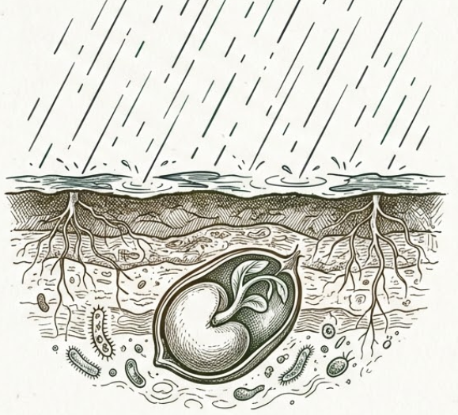
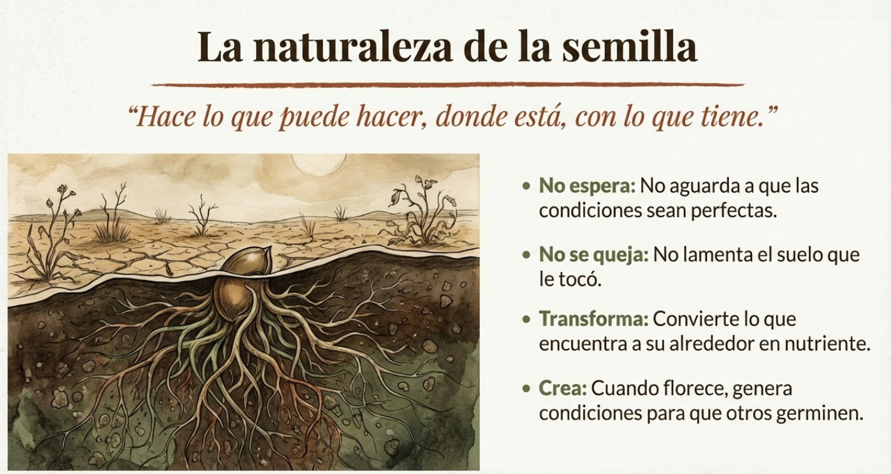
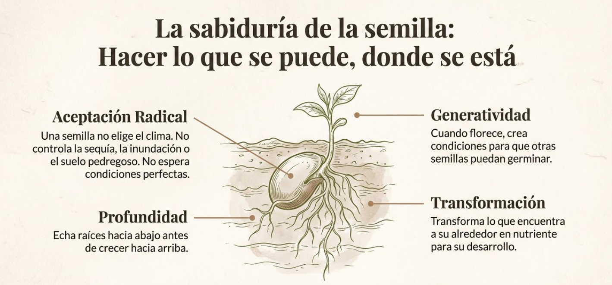
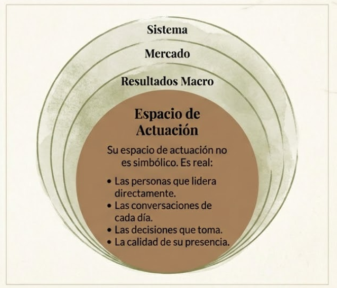
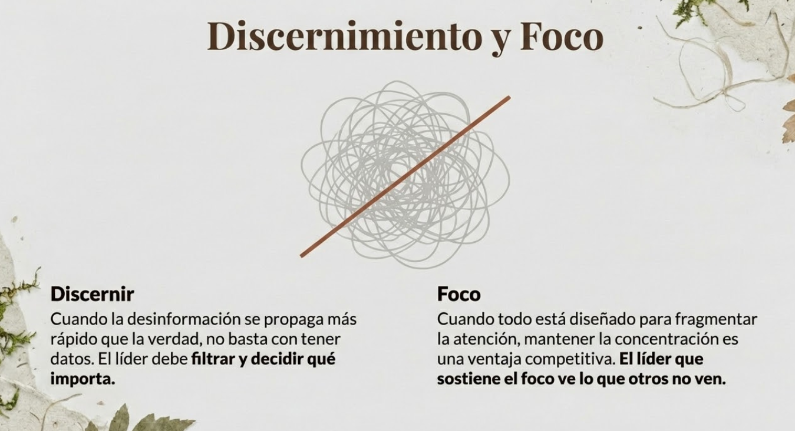
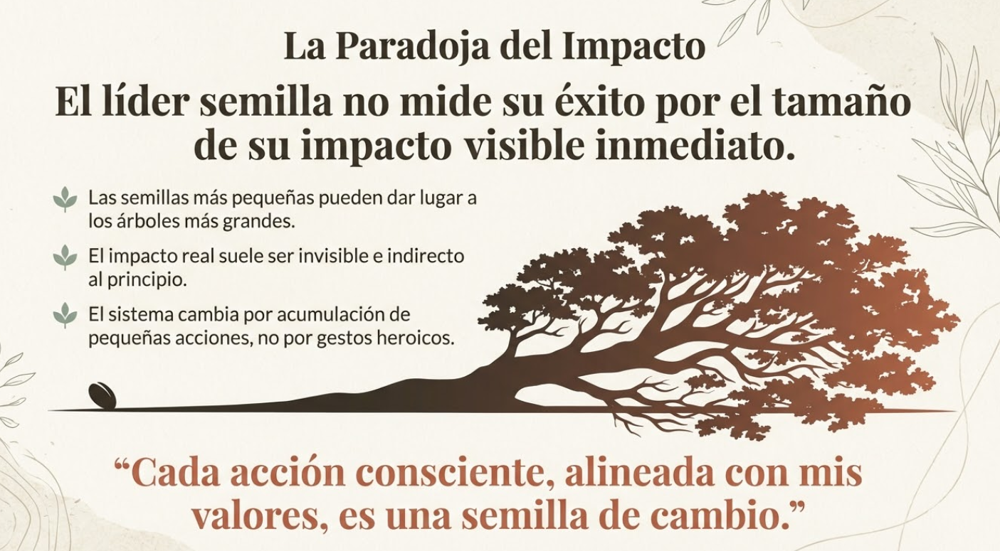
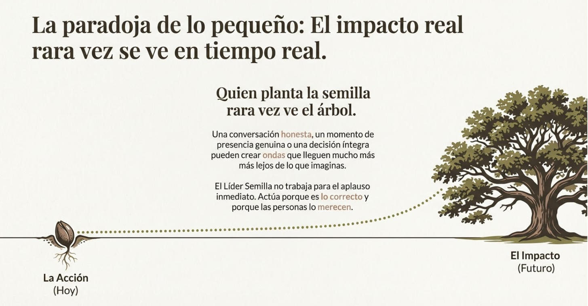

# Tema 3: El líder semilla

- [Por qué este tema es necesario](#por-qué-este-tema-es-necesario)
	- [Una forma de estar en el mundo](#una-forma-de-estar-en-el-mundo)
- [1. La semilla](#1-la-semilla)
- [2. El líder semilla](#2-el-líder-semilla)
- [3. Lo que la tormenta exige](#3-lo-que-la-tormenta-exige)
- [4. La capacidad raíz: por qué consciencia](#4-la-capacidad-raíz-por-qué-consciencia)
- [5. Lo que hace diferente al líder semilla](#5-lo-que-hace-diferente-al-líder-semilla)
- [6. La paradoja de lo pequeño](#6-la-paradoja-de-lo-pequeño)
- [7. Lo que el líder semilla no es](#7-lo-que-el-líder-semilla-no-es)
- [8. El reto que acepta](#8-el-reto-que-acepta)
- [Dimensión experiencial](#dimensión-experiencial)
- [El viaje que comienza](#el-viaje-que-comienza)
- [Referencias](#referencias)
- [Material adicional del tema](#material-adicional-del-tema)
	- [Infografías del tema](#infografías-del-tema)

#imagen  Brote pequeño junto a árbol grande inclinado. Contraste de escala y resiliencia.

#imagen  Semilla germinando bajo tierra con lluvia cayendo. El trabajo invisible antes del crecimiento.

---

## Por qué este tema es necesario

#### Una forma de estar en el mundo

**Pregunta que responde:** ¿Qué tipo de líder puedo ser en medio de esta tormenta?

El Tema 2 terminó con una invitación: comprometerte con hacer bien lo que sí está en tus manos, trabajar en ti mismo para poder estar de verdad con las personas que lideras.

Este tema le da nombre y forma a ese compromiso. No es una técnica ni un modelo de competencias. Es una metáfora que puede guiar tu forma de estar en el mundo como líder.

---

## 1. La semilla

Una semilla no elige el clima en el que le toca germinar. No controla si habrá sequía o inundación, si el suelo será fértil o pedregoso, si vendrán heladas tempranas o plagas inesperadas.

Pero la semilla hace lo que está en su naturaleza: echa raíces hacia abajo, crece hacia la luz, transforma lo que encuentra a su alrededor en nutriente para su desarrollo. Y cuando florece, crea condiciones para que otras semillas puedan germinar.

No espera a que el clima sea perfecto. No se queja del suelo que le tocó. No mide su éxito por el tamaño del bosque que no puede ver. Simplemente hace lo que puede hacer, donde está, con lo que tiene.

#ppt  Opción 1: "La naturaleza de la semilla" - lista con 4 puntos (No espera, No se queja, Transforma, Crea).
#ppt  Opción 2: "La sabiduría de la semilla" - diagrama con semilla central y 4 conceptos alrededor.

---

## 2. El líder semilla

El líder semilla ha hecho una elección.

Ha elegido dejar de esperar a que el sistema cambie para empezar a actuar. Ha elegido dejar de medir su valor por resultados que no controla. Ha elegido volver a conectar quién es con cómo lidera.

Esta elección no nace del optimismo ingenuo. El líder semilla ve la tormenta con claridad —la fragmentación, la desconfianza, la disrupción, el agotamiento. No la niega ni la minimiza. Pero ha decidido que la magnitud del problema no es excusa para la inacción en el espacio donde sí puede actuar.

Y ese espacio no es pequeño.

Las personas que lidera directamente, las conversaciones que tiene cada día, las decisiones que toma, los momentos en que está presente —o ausente— para su equipo: ahí se juega algo real. No simbólico, no marginal. Real.

#grafica  Círculos concéntricos: Sistema > Mercado > Resultados > Espacio de Actuación (donde el líder tiene impacto real).

---

## 3. Lo que la tormenta exige

La tormenta descrita en el Tema 1 no solo ha hecho el liderazgo más difícil. Ha cambiado las reglas del juego.

Las habilidades que antes bastaban —conocimiento técnico, capacidad de análisis, gestión de procesos— siguen siendo necesarias, pero ya no son suficientes. El contexto actual exige algo más:

Cuando la información satura y la desinformación se propaga más rápido que la verdad, **la capacidad de discernir** se vuelve crítica. No basta con tener datos; hay que saber qué datos importan y cuáles son ruido.

Cuando todo está diseñado para fragmentar la atención, **la capacidad de sostener el foco** es ventaja competitiva. El líder que puede mantener la concentración en lo importante, mientras todo a su alrededor salta de estímulo en estímulo, ve lo que otros no ven.

Cuando la complejidad hace imposible predecir, **la capacidad de leer el momento presente** supera al plan perfecto. Los planes se quedan obsoletos; la presencia permite ajustar en tiempo real.

Cuando la presión empuja hacia la reactividad, **la capacidad de crear espacio antes de responder** marca la diferencia entre una decisión lúcida y un error costoso. El líder secuestrado por sus reacciones automáticas no decide; es decidido por sus impulsos.

Cuando el poder tiende a erosionar la empatía, **la capacidad de seguir viendo a las personas como personas** protege contra la ceguera que arruina equipos y destruye confianza.

Estas no son habilidades "blandas" en el sentido de opcionales o decorativas. Son habilidades **críticas para liderar en este contexto**. Y la buena noticia es que son entrenables. La mala noticia es que requieren trabajo serio —no un taller de fin de semana, no un libro de moda, no una app de meditación usada tres veces.

#ppt  "Nuevas capacidades para un nuevo contexto": Discernimiento, Foco, Lectura del presente, Espacio y Pausa, Humanidad.

#ppt  Detalle de Discernimiento y Foco con garabato atravesado por línea (filtrar el ruido).
#ppt  "De la fuerza al cultivo: Cómo opera el Líder Semilla" - 4 contrastes con iconos.

---
## 4. La capacidad raíz: por qué consciencia

Las capacidades que acabamos de describir —discernir, sostener el foco, leer el presente, crear espacio antes de responder, seguir viendo personas— parecen diversas. Pero comparten una raíz común: todas requieren **darte cuenta** de algo antes de poder actuar sobre ello.

No puedes discernir si no te das cuenta de qué sesgo está operando en tu juicio. No puedes sostener el foco si no te das cuenta de que tu atención se ha ido. No puedes crear espacio si no te das cuenta de que estás a punto de reaccionar. No puedes ver al otro como persona si no te das cuenta de que lo estás tratando como instrumento.

Esa capacidad de "darte cuenta" tiene un nombre técnico en neurociencia: es lo que la investigación distingue como **awareness** — el contenido de la consciencia, aquello de lo que somos conscientes en cada momento. La neurociencia contemporánea diferencia entre el _estado_ de consciencia (estar despierto, vigilia) y el _contenido_ de consciencia (lo que percibimos, sentimos y reconocemos). El estado lo damos por sentado. Lo que este programa entrena es el contenido: la capacidad de percibir con mayor claridad lo que ocurre dentro y fuera de ti.

Antonio Damasio[^1], uno de los neurocientíficos más influyentes en el estudio de la consciencia, ha descrito este proceso como una progresión evolutiva: primero el organismo _siente_ (registra estados corporales), luego _sabe que siente_ (tiene experiencia subjetiva de esos estados), y finalmente _puede actuar desde ese saber_. Lo que Damasio llama "el sentimiento de saber que se siente" es exactamente lo que este programa desarrolla: no solo sentir estrés, sino saber que lo sientes; no solo tener un sesgo, sino reconocerlo; no solo reaccionar, sino observar tu reacción antes de que te arrastre.

Y aquí aparece un dato clave: esa capacidad de observar los propios procesos mentales — lo que la investigación en meditación denomina **meta-awareness** — es entrenable. Los estudios de Dahl, Lutz y Davidson[^2] han documentado que prácticas contemplativas específicas desarrollan la capacidad de monitorear la propia atención, los propios pensamientos y las propias reacciones emocionales. No como ejercicio intelectual, sino como habilidad que se fortalece con la práctica, de forma análoga a como un músculo se fortalece con el entrenamiento.

Esto es lo que significa "consciencia" en este programa. No un estado místico. No una reflexión filosófica abstracta. Una **capacidad entrenada de darte cuenta** — de tus automatismos, de tu cuerpo, de tus emociones, de lo que necesitas, de lo que el otro necesita, de cómo decides y de si tus acciones están alineadas con tus valores.

Y hay algo que juega a nuestro favor: en español, "consciencia" tiene una amplitud que en inglés se reparte entre tres palabras distintas. _Awareness_ (darte cuenta), _consciousness_ (la experiencia subjetiva) y _conscience_ (la dimensión moral). Las tres están presentes en el viaje que vas a recorrer. Cuando decimos "Liderar con Consciencia", las incluimos todas: la lucidez para ver, la presencia para estar, y la brújula para actuar bien.

Cada módulo de este programa desarrolla una dimensión de esa consciencia. Juntos, trazan un camino que va desde conocerte a ti mismo hasta actuar éticamente en el mundo. El siguiente tema te mostrará ese mapa.

---
## 5. Lo que hace diferente al líder semilla

No es lo que sabe. En un mundo donde el conocimiento técnico caduca en meses, acumular información ya no es ventaja.

No es su posición. La autoridad formal genera cumplimiento, no compromiso. Y el cumplimiento vacío no transforma nada.

No es la escala de sus resultados. Los grandes números pueden esconder relaciones rotas, equipos agotados, personas que cumplen sin creer.

Lo que hace diferente al líder semilla es **su forma de estar presente**.

Es la calidad de atención que ofrece cuando alguien de su equipo habla. Es la capacidad de no reaccionar automáticamente cuando la presión aprieta. Es poder sostener la incertidumbre sin transmitir ansiedad. Es ver a las personas como personas, no como recursos.

Y precisamente porque está presente de esta manera, **también toma mejores decisiones**. Ve más, porque no está cegado por la prisa. Escucha mejor, porque no está preparando su respuesta mientras el otro habla. Lee las situaciones con más precisión, porque puede observar lo que pasa en lugar de solo confirmar lo que esperaba.

La presencia no es solo ética; es también eficacia. El líder semilla no elige entre ser buena persona y ser buen profesional. Ha descubierto que, en el fondo, son la misma cosa.

#imagen  Gota de agua sobre piedra. Metáfora del impacto pequeño pero constante.

---

## 6. La paradoja de lo pequeño

El líder semilla ha entendido algo que la cultura del éxito visible suele ignorar: **el impacto real rara vez se ve en tiempo real**.

Una conversación honesta con alguien de tu equipo puede cambiar la trayectoria de su carrera —y nunca lo sabrás. Un momento de presencia genuina en medio de una crisis puede ser lo que alguien recuerde años después como el punto de inflexión. Una decisión tomada desde tus valores, aunque nadie la aplauda, puede crear ondas que lleguen mucho más lejos de lo que imaginas.

Las semillas más pequeñas pueden dar los árboles más grandes. Pero quien planta la semilla rara vez ve el árbol.

El líder semilla no trabaja para el reconocimiento. No mide su valor por el aplauso. Actúa bien porque es lo correcto, porque las personas que lidera lo merecen, porque ahí puede vivir con integridad. Y confía en que las semillas que planta —aunque no las vea germinar— tienen su propia fuerza.

#ppt  Opción 1: "La paradoja de lo pequeño" - versión compacta con árbol inclinado.
#ppt  Opción 2: "La Paradoja del Impacto" - versión con cita y árbol grande.

#ppt  Opción 3: Versión horizontal con semilla→árbol mostrando "La Acción (Hoy)" vs "El Impacto (Futuro)".

---

## 7. Lo que el líder semilla no es

Conviene aclarar lo que esta metáfora _no_ significa.

**No es pasividad.** La semilla no es inerte; está en constante actividad bajo la superficie. El líder semilla no se retira del mundo; se compromete con él de otra manera.

**No es resignación.** Aceptar que no controlas el sistema no significa renunciar a influir en él. Significa elegir dónde poner tu energía: en lamentar lo que no puedes cambiar, o en actuar donde sí puedes.

**No es conformismo.** Enfocarte en tu espacio de impacto no es "conformarte con poco". Es reconocer que ese espacio —las vidas de las personas que lideras— no es poco. Es mucho. Es donde la vida laboral de otros seres humanos se hace más o menos habitable.

**No es superioridad moral.** El líder semilla no se cree mejor que otros. Sabe que también cae en el cinismo, en la desconexión, en el agotamiento. La diferencia es que ha elegido un camino de vuelta: el trabajo constante sobre sí mismo.

#ppt  "Lo que el Líder Semilla NO es": no pasivo, no renuncia a la ambición, no evita responsabilidad, no es solo "buena persona".

---

## 8. El reto que acepta

Ser líder semilla no es declarar una intención bonita. Es aceptar un compromiso exigente.

El líder semilla ha entendido que la función que ejerce se ha vuelto más compleja, y que estar a la altura de esa complejidad requiere desarrollar capacidades que antes podían parecer secundarias. No por moda, no por ideología, sino por necesidad práctica: el contexto lo exige.

Y ha entendido también que estas capacidades no se adquieren leyendo sobre ellas. Se entrenan. Como un atleta entrena su cuerpo, el líder semilla entrena su atención, su capacidad de autorregulación, su habilidad para crear espacio interior en medio del ruido exterior.

Este entrenamiento requiere tiempo, constancia y honestidad consigo mismo. No hay atajos. Pero el líder semilla sabe que este esfuerzo no es un extra opcional —es parte central de su profesionalidad. En un mundo que cambia tan rápido, invertir en el desarrollo de estas capacidades es quizás la inversión más estratégica que puede hacer.

Este programa existe para acompañar ese entrenamiento.

---
## Dimensión experiencial #insight 

Antes de continuar, una pausa:

- ¿Qué semillas has plantado en tu vida profesional que quizás hayan germinado sin que lo vieras?
- ¿En qué situaciones recientes una mayor capacidad de presencia o de pausa te habría ayudado a tomar mejores decisiones?
- ¿Qué te costaría y qué te daría comprometerte con este camino de desarrollo?

---

## El viaje que comienza

Has llegado al final del contexto y al inicio del camino.

El Tema 1 describió la tormenta. El Tema 2 exploró las respuestas naturales y la posibilidad de otra forma de estar. Este tema ha dado nombre a esa posibilidad: el líder semilla.

El siguiente tema presentará el mapa del viaje: qué capacidades desarrollarás, cómo se conectan entre sí, qué transformación puedes esperar en cada etapa.

Pero antes de mirar el mapa, vale la pena detenerse un momento en la pregunta que sostiene todo este programa:

_¿Estás dispuesto a trabajar en ti mismo para poder liderar mejor a los otros?_

Si la respuesta es sí —aunque sea un sí tentativo, un sí con dudas, un sí que no sabe bien en qué se está metiendo— entonces el viaje tiene sentido.

Las semillas no necesitan certezas para germinar. Solo necesitan empezar.

---
## Referencias

[^1]: Damasio, A. (2021). _Feeling & Knowing: Making Minds Conscious._ Pantheon.
[^2]: Dahl, C.J., Lutz, A. & Davidson, R.J. (2015). Reconstructing and deconstructing the self: Cognitive mechanisms in meditation practice. _Trends in Cognitive Sciences_, 19(9), 515-523.

**Otras posibles referencias de interes:

- Greenleaf, R. (1970). _The Servant as Leader._ Greenleaf Center.
- Scharmer, O. (2009). _Theory U._ Berrett-Koehler.
- Wheatley, M. (2006). _Leadership and the New Science._ Berrett-Koehler.
- - Damasio, A. (2021). _Feeling & Knowing: Making Minds Conscious._ Pantheon.
- Dahl, C.J., Lutz, A. & Davidson, R.J. (2015). Reconstructing and deconstructing the self: Cognitive mechanisms in meditation practice. _Trends in Cognitive Sciences_, 19(9), 515-523.
- Zeman, A. (2006). What do we mean by "conscious" and "aware"? _Neuropsychological Rehabilitation_, 16(4), 356-376.

---
## Material adicional del tema #aux

### Infografías del tema

Diferentes posibilidades de infografías del tema

#infografia  Opción 1: "Cultiva el Cambio, No lo Controles" - 7 capacidades en espiral.

#infografia  Opción 2: "De la Consciencia Interior a la Acción Ética" - árbol con 7 módulos.

#infografia  Opción 3: "Una Progresión de Consciencia" - árbol vertical con 3 fases.

#infografia  Opción 4: "El Viaje del Líder Semilla" - formato horizontal con fases y módulos.

#infografia  Opción 5: Variante adicional del concepto "Cultiva el Cambio".

