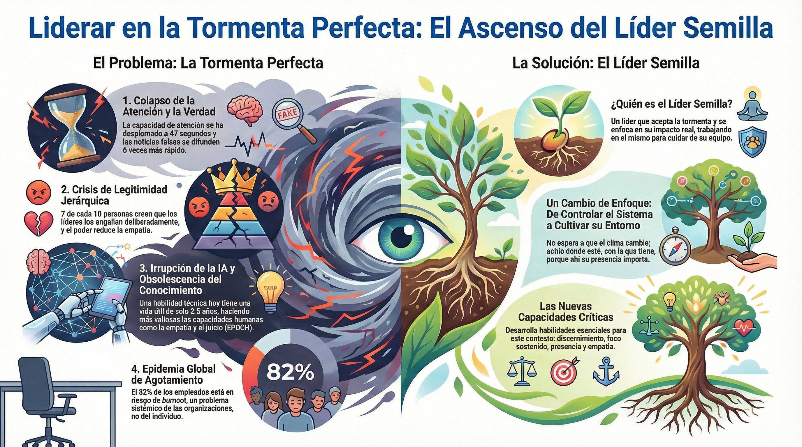

# Sintesis del Modulo 0

- [El momento que nos convoca](#el-momento-que-nos-convoca)
	- [Lo que hemos recorrido](#lo-que-hemos-recorrido)
- [La transformación de M0](#la-transformación-de-m0)
- [Preparación para M1](#preparación-para-m1)
- [El viaje comienza](#el-viaje-comienza)
- [Material adicional del tema](#material-adicional-del-tema)
	- [Infografías del tema](#infografías-del-tema)

## El momento que nos convoca

---

### Lo que hemos recorrido

Este módulo ha trazado un arco desde el diagnóstico hasta el compromiso.

**El Tema 1** nombró la tormenta: cuatro fuerzas convergentes —fragmentación digital, crisis de legitimidad, irrupción de la IA, epidemia de agotamiento— que hacen del liderazgo actual un reto sin precedentes.

**El Tema 2** exploró las respuestas naturales ante lo que nos desborda —desconexión, cinismo, agotamiento autoimpuesto— y abrió la posibilidad de otra forma de estar: reconectar con el impacto real que tienes como líder, comprometerte con hacer bien lo que sí está en tus manos.

**El Tema 3** dio nombre a ese compromiso: el líder semilla. Alguien que ha elegido trabajar en sí mismo para poder liderar mejor a otros. Que entiende que la tormenta exige capacidades nuevas y que esas capacidades se entrenan.

**El Tema 4** presentó el mapa del viaje: las tres fases del programa —Consciencia Activada, Consciencia Aplicada, Consciencia Dirigida— y el compromiso que implica recorrerlo.

---

## La transformación de M0

Al completar este módulo, has integrado algo fundamental:

> _"El mundo es difícil, pero yo tengo impacto real en las personas que lidero. Puedo ser una semilla de cambio en mi entorno. Ese compromiso exige desarrollar capacidades que no se improvisan —y estoy dispuesto a entrenarlas."_

No es optimismo ingenuo. No es resignación. Es una posición lúcida y comprometida ante la realidad.

---

## Preparación para M1

M0 ha establecido el contexto y el compromiso. Ahora comienza el trabajo interior.

M1 abrirá con una pregunta aparentemente simple: _¿Qué tipo de sistema soy?_

Descubrirás que tu mente no percibe la realidad —la construye. Que opera en piloto automático mucho más de lo que crees. Que los sesgos no son errores sino características de diseño de un cerebro que evolucionó para sobrevivir, no para liderar en el siglo XXI.

Esta comprensión no es académica. Es el primer paso hacia la libertad interior. Porque solo puedes cambiar aquello que primero puedes ver.

La transformación de M1 será:

> _"No soy tan racional como creía."_

Y desde esa humildad, todo lo demás se hace posible.

---

## El viaje comienza

Has entrado por el pórtico. Ahora empieza el camino.

Las semillas no necesitan certezas para germinar. Solo necesitan empezar.

---
## Material adicional del tema #aux

### Infografías del tema

#infografia  Opción 1: Infografía síntesis del módulo 0.

#infografia  Opción 2: Variante de la infografía síntesis.
#infografia  Opción 3: Tercera variante de la infografía síntesis.
