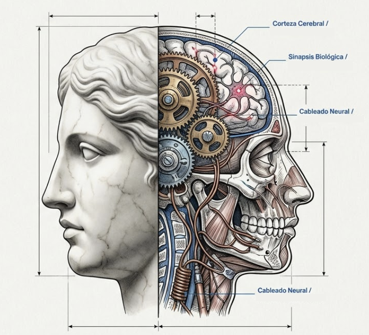
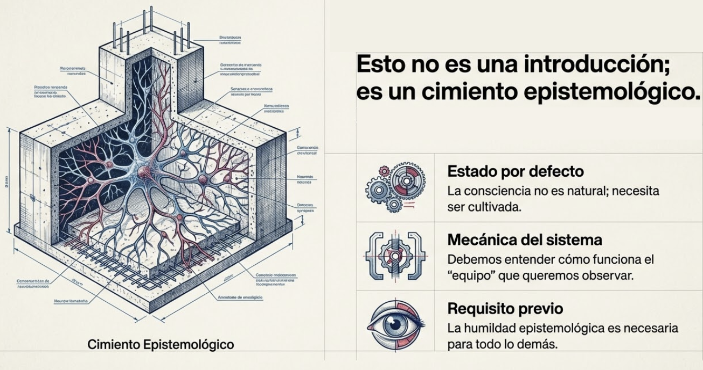
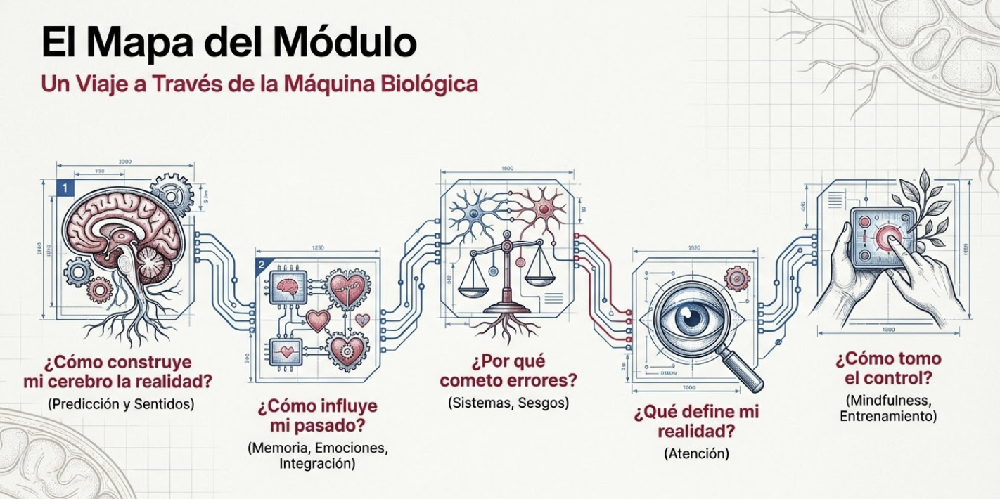

# Modulo 1: Consciente de lo que soy

- [El cerebro que crees ser vs. el cerebro que realmente eres](#el-cerebro-que-crees-ser-vs-el-cerebro-que-realmente-eres)
- [Por que este modulo es el cimiento](#por-que-este-modulo-es-el-cimiento)
- [Pregunta central](#pregunta-central)
- [Transformacion esperada](#transformacion-esperada)
- [Lo que encontraras en este modulo](#lo-que-encontraras-en-este-modulo)
- [Primera caracteristica del lider semilla](#primera-caracteristica-del-lider-semilla)
- [Material adicional del tema](#material-adicional-del-tema)
	- [Infografías del tema](#infografías-del-tema)

## El cerebro que crees ser vs. el cerebro que realmente eres

#imagen  Mitad escultura clásica / mitad maquinaria cerebral. El cerebro que crees ser vs. el que realmente eres.

---

## Por que este modulo es el cimiento

M1 no es un modulo "introductorio" en sentido debil. Es el cimiento epistemologico del programa. Establece:

- Por que la consciencia necesita ser cultivada (porque no es el estado por defecto)
- Como funciona el sistema que queremos observar
- Por que la humildad epistemologica es prerequisito para todo lo demas

Sin M1, el mindfulness se convierte en tecnica superficial. Con M1, se convierte en necesidad existencial.

#ppt  "Esto no es una introducción; es un cimiento epistemológico." Estado por defecto, mecánica del sistema, requisito previo.

---

## Pregunta central

> Que tipo de sistema soy, y por que necesito entrenamiento para verme a mi mismo?

---

## Transformacion esperada

Al terminar este modulo, habras integrado una verdad incomoda pero liberadora:

> "No soy tan racional como creia. Mi cerebro es una maquina de prediccion y supervivencia que opera en piloto automatico la mayor parte del tiempo. La buena noticia: puedo entrenar la atencion para observar ese proceso y, desde ahi, elegir."

---

## Lo que encontraras en este modulo

| Tema | Contenido                                 | Pregunta que responde                                           |
| ---- | ----------------------------------------- | --------------------------------------------------------------- |
| T1   | El cerebro como maquina de prediccion     | Por que mi cerebro no percibe la realidad tal como es?          |
| T2   | Los sentidos ajustando la realidad        | Como construye mi cerebro lo que percibo como "realidad"?       |
| T3   | La memoria y los automatismos             | Como usa mi cerebro la experiencia pasada para responder?       |
| T4   | Las emociones en el aprendizaje           | Por que recordamos unas experiencias y olvidamos otras?         |
| T5   | La integracion cerebral                   | Como integra el cerebro toda esta informacion?                  |
| T6   | Dos sistemas de pensamiento               | Por que tomo decisiones que luego no entiendo?                  |
| T7   | Sesgos y heuristicas                      | Por que cometo errores sistematicos sin darme cuenta?           |
| T8   | La atencion como puerta de la consciencia | Que determina de que soy consciente y de que no?                |
| T9   | Descubriendo el mindfulness               | Que es el mindfulness y por que funciona?                       |
| T10  | Entrenando la atencion                    | Como puedo entrenar mi capacidad de atencion consciente?        |

#ppt  "El Mapa del Módulo" - 5 etapas: predicción/sentidos, memoria/emociones, sistemas/sesgos, atención, mindfulness.

---

## Primera caracteristica del lider semilla

**Humildad epistemologica:** Sabe que no sabe todo; que su cerebro construye la realidad, no la percibe.

Esta humildad es el primer paso para poder aprender. Sin ella, no hay transformacion posible.

---

## Material adicional del tema #aux
### Infografías del tema 

#infografia  Infografía resumen del módulo 1: Consciente de lo que soy.