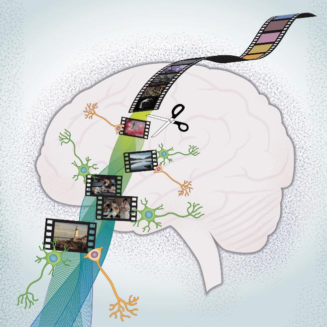

# La Memoria: Aprendiendo a Predecir

## El modelo mental basado en la experiencia

#teoria

El cerebro construye su modelo del mundo a partir de la experiencia pasada, almacenada como recuerdos. Ante una situación nueva, busca en la memoria experiencias similares para anticipar lo que sucederá.

El hipocampo no solo consolida los recuerdos —los ancla con información espacial y temporal. Esta capacidad de situar cada memoria en un cuándo y un dónde permite construir una narrativa coherente de la propia vida, no solo un archivo de datos sueltos.

La memoria participa activamente en la generación de comportamientos automáticos. El cerebro automatiza respuestas para optimizar energía y tiempo. Estos comportamientos se basan en secuencias aprendidas de activación neuronal que se desencadenan de forma automática una vez iniciadas.

#imagen
 Ilustración de un cerebro humano con cinta de película cinematográfica atravesándolo, simbolizando el almacenamiento de recuerdos como "fotogramas" de experiencias. Las neuronas se muestran conectándose en la base del cerebro.

---

## La memoria como sistema predictivo

#teoria

La función central de la memoria: permitir que el cerebro construya un modelo del mundo capaz de predecir el futuro. El cerebro almacena y organiza información sobre cómo funcionan las cosas, prestando especial atención a las relaciones de causa y efecto. Esto significa que recuerda experiencias pasadas que le permiten estimar lo que probablemente ocurrirá en situaciones similares.

El proceso de predicción se basa en la identificación de patrones y relaciones causales aprendidas a través de la experiencia.

Uno de los mecanismos más importantes es el proceso de "compleción" propuesto por Donald Hebb. Cuando dos neuronas se activan al mismo tiempo, tienden a conectarse entre sí, formando un vínculo más fuerte. Este vínculo permite que, en el futuro, la activación de una neurona dispare automáticamente la otra, desencadenando recuerdos o respuestas complejas con solo un estímulo.

Ese mecanismo explica por qué oler algo familiar puede activar el conjunto completo de neuronas relacionadas con esa memoria, trayendo consigo toda una serie de recuerdos asociados. Un aroma dispara una escena entera.

El cerebro usa esta misma propiedad para aprender relaciones de causa y efecto. Si dos eventos suceden uno tras otro repetidamente, las neuronas asociadas a esos eventos se conectan más fuertemente —la presencia de uno hace que el cerebro "espere" el siguiente. Así se aprenden patrones que permiten predecir y adaptarse mejor a lo que podría ocurrir, guiando decisiones y respuestas.

#explicacion

La compleción tiene un papel fundamental en el "teatro del mundo":

- **Memoria**: Permite evocar recuerdos completos a partir de un fragmento de información.
- **Percepción**: Facilita la identificación de objetos y patrones a partir de información sensorial incompleta.
- **Automatismos**: Permite ejecutar secuencias complejas de acciones a partir de un estímulo inicial simple.

Puedes notarlo en tu propia experiencia: una melodía que dispara un recuerdo completo, un olor que trae una escena entera, el inicio de un movimiento que desencadena toda la secuencia —el cerebro completa el patrón antes de que lo solicites conscientemente.

---

## Los automatismos en acción

#imagen #ejercicio
Fotografía de hombre conduciendo al inicio del aprendizaje de conducir con mucha tensión por requerir el máximo de atención esa fase de aprendizaje

#imagen #ejercicio
 Fotografía de un hombre conduciendo un coche mientras habla por teléfono. Ilustra el concepto de automatismos: conducir es una actividad que se automatiza con la práctica, permitiendo realizar otras tareas simultáneamente.

---

## Ejercicio: rompiendo patrones mentales

#imagen #ejercicio
 Acertijo con cerillas sobre fondo negro mostrando la ecuación "II + II = IX" (en números romanos con cerillas). Ejercicio de pensamiento lateral donde hay que mover una cerilla para corregir la ecuación.

#imagen #ejercicio
 Solución al primer acertijo de cerillas: "II + II = IV" (2 + 2 = 4 en números romanos). Se ha movido una cerilla de la X para formar la V.

#imagen #ejercicio
 Segundo acertijo con cerillas sobre fondo negro mostrando la ecuación "II = X - XII" (en números romanos con cerillas). Ejercicio donde hay que mover una cerilla para corregir la ecuación.

#imagen #ejercicio
 Solución al segundo acertijo de cerillas: "II = X - VIII" (2 = 10 - 8 en números romanos). Se ha movido una cerilla del XII para formar VIII.

#imagen #ejercicio
 Tercer acertijo con cerillas sobre fondo negro mostrando la ecuación "VI = VI + VI" (en números romanos con cerillas). Ejercicio donde hay que mover una cerilla para corregir la ecuación.

#Gif  #ejercicio
 Gif dinámico que muestra la resolución del ejercicio final de las cerillas para mostrar cómo el patrón inicialmente detectado impedía una resolución final obvia

---

## Notas para revisión

### 1. Contenido eliminado por redundancia

- **Sección "La memoria como sistema predictivo"**: Eliminado tag `#explicacion` original del bloque principal porque solo repetía los puntos del `#teoria` de la sección anterior (modelo mental basado en experiencia, hipocampo, automatismos). El contenido valioso sobre Hebb, compleción y predicción se integró en un nuevo bloque `#teoria`.
- **Sección "El modelo mental basado en la experiencia"**: Reformulado de lista con viñetas a párrafos narrativos para mejorar flujo y densidad, sin perder información.

### 2. Ausencias estructurales detectadas

- **Secciones "Los automatismos en acción" y "Ejercicio: rompiendo patrones mentales"**: Carecen de texto explicativo —solo contienen imágenes. No se añadió texto nuevo (respetando límite FONDO), pero podrían beneficiarse de breve contextualización si el autor lo considera necesario.

### 3. Referencias sugeridas

- El concepto de compleción hebbiana (Donald Hebb) está mencionado pero sin referencia bibliográfica. Podría reforzarse con referencia a "The Organization of Behavior" (1949) si se desea mayor rigor académico.
- El papel del hipocampo en la memoria espacial y temporal podría respaldarse con estudios de O'Keefe y Moser sobre células de lugar y grid cells.
