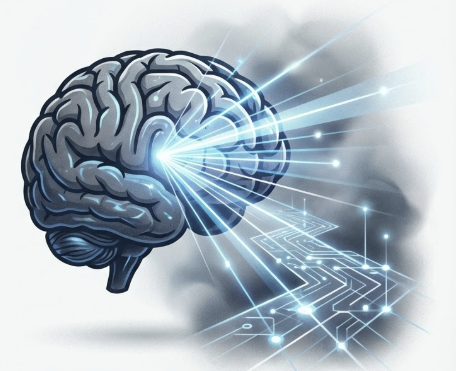
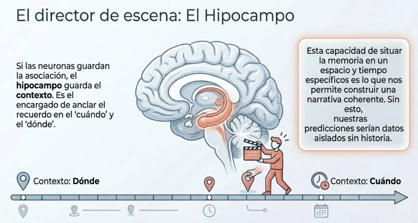
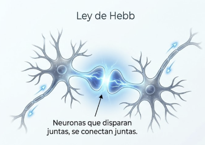
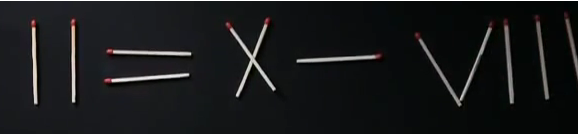
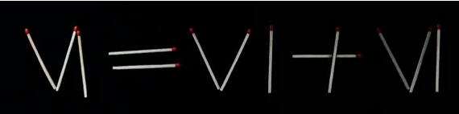

# Tema 3: La memoria y los automatismos

- [Por que este tema es necesario](#por-que-este-tema-es-necesario)
		- [El pasado programando el futuro](#el-pasado-programando-el-futuro)
- [1. La memoria como sistema predictivo](#1-la-memoria-como-sistema-predictivo)
		- [1.1 El modelo mental basado en la experiencia](#11-el-modelo-mental-basado-en-la-experiencia)
		- [1.2 El mecanismo de complecion de Hebb](#12-el-mecanismo-de-complecion-de-hebb)
		- [1.3 Aprendiendo causa y efecto](#13-aprendiendo-causa-y-efecto)
- [2. Los automatismos en accion](#2-los-automatismos-en-accion)
- [3. Implicaciones para el lider](#3-implicaciones-para-el-lider)
- [Referencias incluidas](#referencias-incluidas)
- [Material adicional del tema](#material-adicional-del-tema)
	- [Infografías del tema](#infografías-del-tema)

---
## Por que este tema es necesario

#### El pasado programando el futuro

**Pregunta que responde:**
Como usa mi cerebro la experiencia pasada para responder automaticamente?

T1 introdujo que la memoria existe para predecir el futuro, no para archivar el pasado. T2 mostro como los sentidos alimentan el modelo predictivo.

Este tema profundiza en el **mecanismo**: como el cerebro convierte experiencias pasadas en respuestas automaticas. Aqui nace el "piloto automatico" que domina nuestra vida cotidiana.

Entender los automatismos es prerequisito para entender por que el Sistema 1 (T5) es tan poderoso y tan dificil de supervisar.

#imagen  Cerebro con circuitos y rayos de luz. La memoria como red de conexiones.

---

## 1. La memoria como sistema predictivo

El cerebro almacena y organiza informacion sobre como funcionan las cosas, prestando especial atencion a las **relaciones de causa y efecto**.

#### 1.1 El modelo mental basado en la experiencia

Ante una situacion nueva, el cerebro busca en la memoria experiencias similares para anticipar lo que sucedera. No recordamos "por recordar" —recordamos para predecir.

**El hipocampo: anclaje espacial y temporal

El hipocampo no solo consolida los recuerdos —los ancla con informacion de **cuando** y **donde**. Esta capacidad de situar cada memoria en contexto permite construir una narrativa coherente de la propia vida.

#ppt  "El Hipocampo: Director de escena" - Guarda contexto (dónde/cuándo).

#### 1.2 El mecanismo de complecion de Hebb

Uno de los mecanismos más importantes es el proceso de "compleción" propuesto por Donald Hebb[^1]. Cuando dos neuronas se activan al mismo tiempo, tienden a conectarse entre sí, formando un vínculo más fuerte. Este vínculo permite que, en el futuro, la activación de una neurona dispare automáticamente la otra, desencadenando recuerdos o respuestas complejas con solo un estímulo. Ese mecanismo explica por qué oler algo familiar puede activar el conjunto completo de neuronas relacionadas con esa memoria, trayendo consigo toda una serie de recuerdos asociados. Un aroma dispara una escena entera. Este es el "clic" biológico que permite al cerebro completar patrones parciales y anticipar lo que falta.

#imagen  Ley de Hebb: "Neuronas que disparan juntas, se conectan juntas".

**La complecion en accion

Este mecanismo explica:

- **Memoria:** Un aroma dispara una escena entera porque las neuronas asociadas se activaron juntas cuando se formo el recuerdo
- **Percepcion:** Reconoces un objeto parcialmente oculto porque el cerebro completa el patron
- **Automatismos:** El inicio de un movimiento desencadena toda la secuencia aprendida

#### 1.3 Aprendiendo causa y efecto

**La función central de la memoria: permitir que el cerebro construya un modelo del mundo capaz de predecir el futuro.** El cerebro almacena y organiza información sobre cómo funcionan las cosas, prestando especial atención a las relaciones de causa y efecto. Esto significa que recuerda experiencias pasadas que le permiten estimar lo que probablemente ocurrirá en situaciones similares.

El cerebro usa esta misma propiedad de la compleción para aprender relaciones de causa y efecto. Si dos eventos suceden uno tras otro repetidamente, las neuronas asociadas a esos eventos se conectan más fuertemente —la presencia de uno hace que el cerebro "espere" el siguiente. Así se aprenden patrones que permiten predecir y adaptarse mejor a lo que podría ocurrir, guiando decisiones y respuestas. El proceso de predicción se basa en la identificación de patrones y relaciones causales aprendidas a través de la experiencia.

---
## 2. Los automatismos en accion

**De la atencion plena al piloto automatico

Cuando aprendes algo nuevo (conducir, tocar un instrumento), requieres atencion consciente en cada paso. Con la practica, el cerebro automatiza la secuencia completa.

#grafica  Diagrama: Aprendizaje complejo → compresión → Hábito automático.

**Ventaja:** Libera recursos cognitivos para otras tareas.
**Coste:** El proceso escapa a la supervision consciente.

**El ejemplo de conducir

- **Novato:** Atencion plena a cada accion (embrague, cambio, volante, espejos...)
- **Experto:** Conduce "sin pensar" mientras mantiene una conversacion

El cerebro ha convertido una secuencia compleja en un **programa automatico** que se ejecuta sin intervencion consciente.

#imagen
*Fotografía de hombre conduciendo al inicio del aprendizaje de conducir con mucha tensión por requerir el máximo de atención esa fase de aprendizaje

#imagen
*Fotografía de un hombre conduciendo un coche mientras habla por teléfono. Ilustra el concepto de automatismos: conducir es una actividad que se automatiza con la práctica, permitiendo realizar otras tareas simultáneamente.

#imagen  Novato (alto coste, atención plena) vs Experto (bajo coste, automatismo).

Este tema incluye ejercicios que revelan como operan los automatismos:

- Acertijos que el cerebro intenta resolver con patrones previos
- Situaciones donde el "patron aprendido" impide ver la solucion obvia
- Experiencias de "ruptura de patron" que muestran el automatismo en accion

Estos ejercicios demuestran que no "pensamos" la mayoria de respuestas —las ejecutamos automaticamente.

#ejercicio
*Acertijo con cerillas sobre fondo negro mostrando la ecuación "II + II = IX" (en números romanos con cerillas). Ejercicio de pensamiento lateral donde hay que mover una cerilla para corregir la ecuación.

#ejercicio
*Solución al primer acertijo de cerillas: "II + II = IV" (2 + 2 = 4 en números romanos). Se ha movido una cerilla de la X para formar la V.

#ejercicio
*Segundo acertijo con cerillas sobre fondo negro mostrando la ecuación "II = X - XII" (en números romanos con cerillas). Ejercicio donde hay que mover una cerilla para corregir la ecuación.

#ejercicio
*Solución al segundo acertijo de cerillas: "II = X - VIII" (2 = 10 - 8 en números romanos). Se ha movido una cerilla del XII para formar VIII.

#ejercicio
*Tercer acertijo con cerillas sobre fondo negro mostrando la ecuación "VI = VI + VI" (en números romanos con cerillas). Ejercicio donde hay que mover una cerilla para corregir la ecuación.

#ejercicio
*Gif dinámico que muestra la resolución del ejercicio final de las cerillas para mostrar cómo el patrón inicialmente detectado impedía una resolución final obvia

---
## 3. Implicaciones para el lider

**Las respuestas "instintivas" son aprendidas

#imagen  Edificio con estructura visible. Metáfora de arquitectura mental.

Lo que parece "intuicion" o "instinto" son frecuentemente automatismos construidos por experiencia. Pueden ser valiosos o pueden estar desactualizados.

**Los patrones del pasado no siempre sirven al presente

Un lider que "siempre ha hecho asi las cosas" esta ejecutando automatismos. El lider que confía ciegamente en su experiencia está ejecutando probablemente automatismos biológicos.  En contextos nuevos, esos automatismos pueden ser inadecuados. Tus neuronas están buscando completar patrones de un pasado que probablemente ya no existe.

#imagen  Rueda en surco de carretera. Metáfora de patrones automáticos.

**Romper patrones requiere esfuerzo consciente

El cerebro prefiere ejecutar lo conocido porque es eficiente. Cambiar patrones requiere atencion deliberada y repeticion hasta formar nuevos automatismos.

---

## Referencias incluidas

[^1]: Donald Hebb. Concepto de compleción hebbiana, relacionado con la teoría de que "neuronas que disparan juntas, se conectan juntas".

**Otras posibles referencias a valorar:

---

## Material adicional del tema #aux
### Infografías del tema 

#infografia  Infografía: "Tu Cerebro en Piloto Automático".