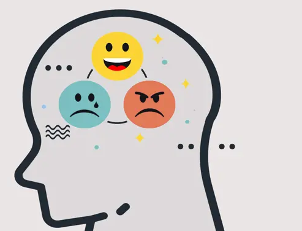

# Jerarquía de las Emociones en el Aprendizaje

## Las emociones como marcadores de importancia

#teoria

Las emociones determinan qué experiencias se graban en la memoria y cuáles se desvanecen. Cuando un evento tiene carga emocional intensa —positiva o negativa—, el cerebro lo etiqueta como relevante para la supervivencia.

Este marcaje no es metafórico: las emociones desencadenan la liberación de neuromoduladores, particularmente dopamina, que actúan como señales de refuerzo. El mensaje al sistema: "esto importa, presta atención, actualiza tu modelo del mundo".

#imagen
 Ilustración de una silueta de cabeza humana de perfil con tres emoticonos en su interior representando diferentes emociones: alegría (amarillo sonriente), tristeza (azul), enfado (naranja). Representa cómo las emociones habitan en nuestra mente e influyen en el procesamiento de la información.

#explicacion

Las emociones operan como un "turbo" para el aprendizaje: amplifican la señal neuronal y fortalecen las conexiones sinápticas. Este mecanismo evolutivo asegura que los eventos importantes para la supervivencia —que suelen tener carga emocional— se graben con mayor fuerza en la memoria.

La implicación práctica: no solo recordamos mejor lo que nos emociona; lo que nos emociona configura literalmente qué tipo de aprendizaje se consolida y cuál se pierde.

---

## El poder emocional de los recuerdos

#video
Escena de la película Ratatouille (Pixar) donde el crítico gastronómico Anton Ego prueba el plato de ratatouille. Al probarlo, es transportado instantáneamente a un recuerdo vívido de su infancia, cuando su madre le preparaba ese mismo plato. Ilustra perfectamente cómo un estímulo sensorial (el sabor) cargado de emoción puede activar todo un conjunto de recuerdos asociados, demostrando el poder de las emociones en la consolidación y evocación de la memoria.

---

## Cómo las emociones fortalecen el aprendizaje

#teoria

El mecanismo opera en varios niveles simultáneos:

**La dopamina como señal de error y refuerzo.** La dopamina se libera en respuesta a eventos inesperados, tanto recompensas como errores de predicción. Esta señal indica al cerebro que debe ajustar su modelo del mundo. La dopamina también facilita la plasticidad sináptica, fortaleciendo las conexiones entre las neuronas involucradas en la experiencia.

**El hipocampo como modulador.** El hipocampo —estructura fundamental para la formación de nuevos recuerdos— está estrechamente conectado con las áreas que procesan emociones. Esta conexión permite que las emociones modulen directamente la formación de recuerdos: los eventos emocionales activan con mayor intensidad el hipocampo, favoreciendo la consolidación.

**Conjuntos neuronales más robustos.** La liberación de dopamina y la mayor actividad del hipocampo fortalecen las conexiones sinápticas entre las neuronas que forman los conjuntos neuronales. Esto explica por qué los recuerdos emocionales son más vívidos, más duraderos y se activan con mayor facilidad en el futuro.

El resultado: las emociones no solo colorean la experiencia de recordar; determinan qué se recuerda y con qué fuerza.

---

## Notas para revisión

### 1. Contenido eliminado por redundancia

- **Sección 1 (#explicacion)**: Eliminado contenido que repetía íntegramente los puntos de #teoria (dopamina como señal, plasticidad, etc.). Preservada únicamente la metáfora del "turbo" y la implicación práctica, que aportan perspectiva nueva.
- **Sección 3 (#explicacion)**: Eliminado bloque completo que era duplicado literal de la sección 1. El contenido teórico se integró en un único bloque #teoria estructurado.
- **Sección 1 (#teoria)**: Eliminada la línea suelta "Mecanismo evolutivo" (fragmento sin desarrollo).

### 2. Ausencias estructurales detectadas

- La sección "Cómo las emociones fortalecen el aprendizaje" carece de bloque #explicacion propio. No se añadió porque el original tampoco lo tenía de forma diferenciada (el contenido era repetición de sección 1).
- El módulo no contiene preguntas reflexivas ni invitaciones directas a observar experiencia propia.

### 3. Referencias sugeridas

- El concepto de dopamina como "señal de error de predicción" podría reforzarse con referencia a estudios de Wolfram Schultz sobre neuronas dopaminérgicas.
- La relación hipocampo-emociones podría beneficiarse de referencia a estudios sobre consolidación de memoria emocional (McGaugh, Cahill).
