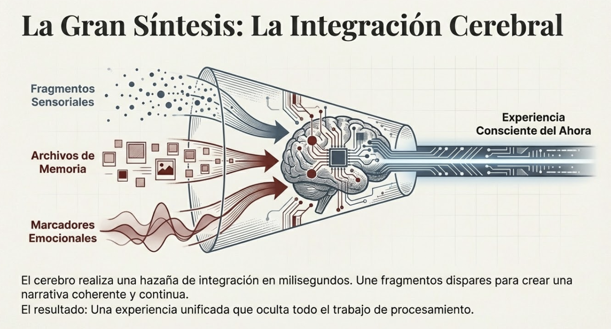
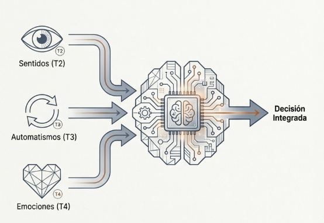
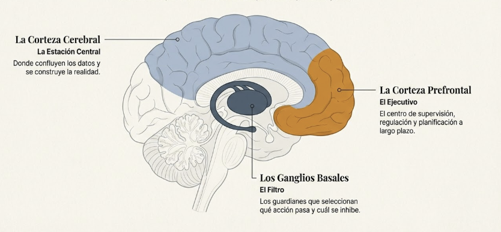
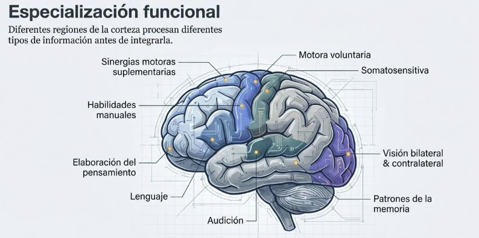
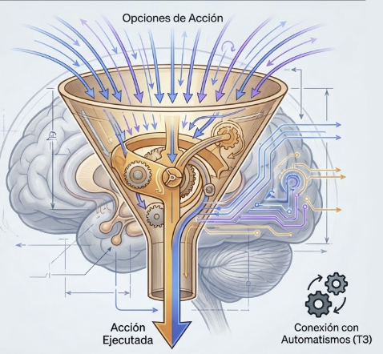
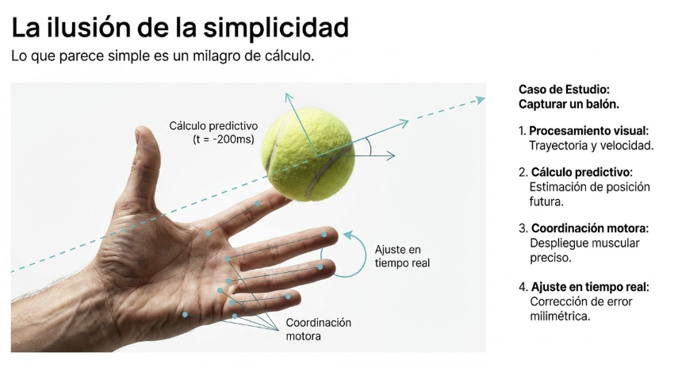
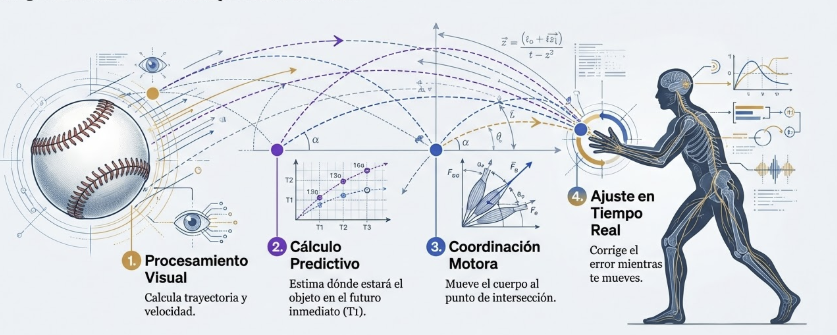
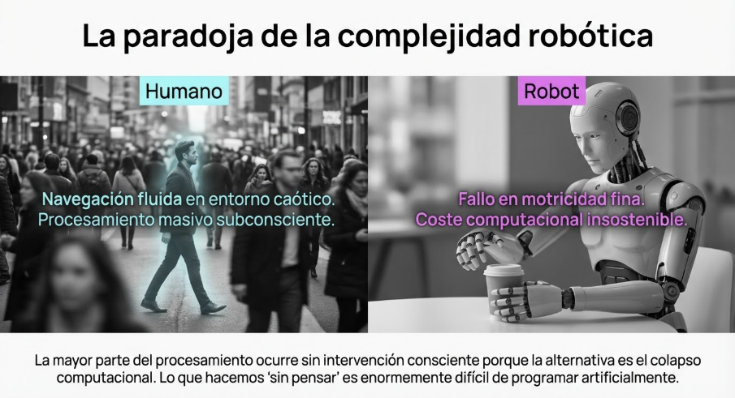
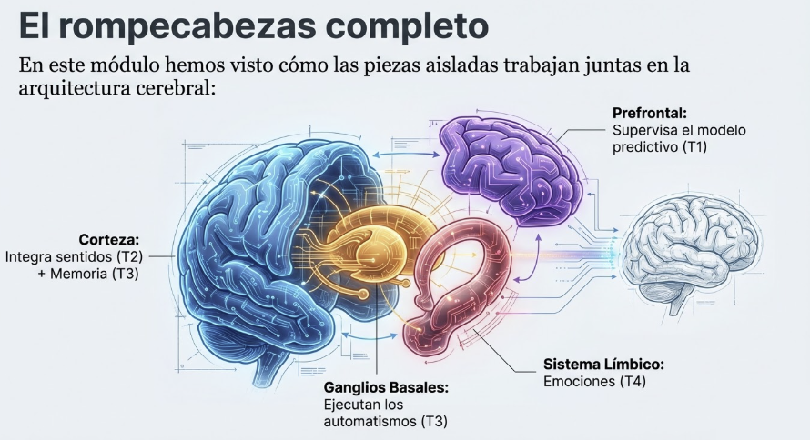
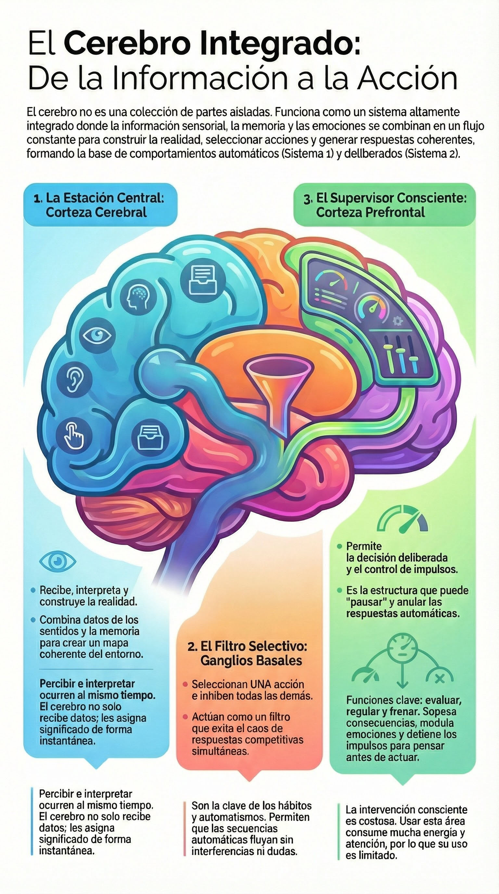

# Tema 5: La integracion cerebral

- [Por que este tema es necesario](#por-que-este-tema-es-necesario)
		- [Como trabajan juntas las piezas](#como-trabajan-juntas-las-piezas)
- [1. La corteza cerebral: estacion central](#1-la-corteza-cerebral-estacion-central)
- [2. Los ganglios basales: el filtro selectivo](#2-los-ganglios-basales-el-filtro-selectivo)
- [3. La corteza prefrontal: decision consciente](#3-la-corteza-prefrontal-decision-consciente)
- [4. La complejidad del procesamiento](#4-la-complejidad-del-procesamiento)
- [5. Implicaciones para el lider](#5-implicaciones-para-el-lider)
- [Conexion con M1](#conexion-con-m1)
- [Referencias incluidas](#referencias-incluidas)
- [Material adicional del tema](#material-adicional-del-tema)
	- [Infografías del tema](#infografías-del-tema)

---
## Por que este tema es necesario

#### Como trabajan juntas las piezas

**Pregunta que responde:**
Como integra el cerebro toda esta informacion para generar una respuesta?

T1-T4 presentaron las piezas: prediccion, sentidos, memoria, automatismos, emociones. Este tema muestra **como se integran** en la arquitectura cerebral.

Entender esta integracion prepara para el modelo de Sistema 1/Sistema 2 (T6): no son "dos cerebros" sino diferentes modos de operacion de las mismas estructuras.

#grafica  "La Gran Síntesis" - Fragmentos → Experiencia unificada.

#grafica  Sentidos+Automatismos+Emociones → Decisión Integrada.

#grafica  Opción 1: Jerarquía texto (Corteza→Ganglios→Prefrontal).

#grafica  Opción 2: Jerarquía visual con colores en cerebro.

---

## 1. La corteza cerebral: estacion central

La corteza cerebral opera como la estacion central de procesamiento donde confluyen datos sensoriales, memoria y emocion.

#grafica  "Corteza Cerebral: La Estación Central" - Realidad integrada.

**No solo recibe, interpreta

La corteza no se limita a recibir informacion de los sentidos; la combina, la contrasta con experiencias previas y construye una representacion coherente del entorno.

**Percibir e interpretar son procesos simultaneos** —el cerebro identifica patrones y asigna significado en el mismo acto de recibir datos.

**Especializacion por areas

Diferentes regiones de la corteza procesan diferentes tipos de informacion:
- Areas visuales, auditivas, somatosensoriales
- Areas de asociacion que integran multiples fuentes
- La corteza prefrontal: planificacion y decision consciente

#grafica  Opción 1: Mapa funcional corteza (beige/gris).

#grafica  Opción 2: Especialización funcional (azul/morado).

---

## 2. Los ganglios basales: el filtro selectivo

Los ganglios basales funcionan como un **filtro selectivo**: ante multiples opciones de accion que llegan desde la corteza, seleccionan una e inhiben las demas.

#grafica  Opción 1: Embudo inhibición (esquemático).

#grafica  Opción 2: Embudo con cerebro y automatismos.

**Por que importa

Sin este filtro, cada estimulo generaria respuestas competitivas simultaneas. **La capacidad de inhibir lo irrelevante es tan critica como la capacidad de activar lo necesario.**

**Conexion con automatismos

Los ganglios basales son clave en la ejecucion de secuencias automaticas (T3). Una vez iniciado un patron, permiten que fluya sin interferencia de opciones competidoras.

---

## 3. La corteza prefrontal: decision consciente

#ppt  Opción 1: "El Ejecutivo costoso" - 3 funciones.

#ppt  Opción 2: "El director ejecutivo" - supervisión.

La corteza prefrontal interviene en la toma de decisiones conscientes a traves de tres funciones clave:

**Evaluacion y planificacion

Sopesa informacion sensorial, anticipa consecuencias y alinea acciones con objetivos a largo plazo.

**Regulacion emocional

Modula la actividad del sistema limbico, ajustando la intensidad de las respuestas emocionales al contexto.

**Control inhibitorio

Frena impulsos y respuestas automaticas, permitiendo que la deliberacion preceda a la accion.

**Esta es la estructura que puede "supervisar" a los automatismos** —pero requiere energia y atencion para hacerlo.

#grafica  "Arquitectura del procesamiento invisible" - 10%/90%.

---

## 4. La complejidad del procesamiento

#ppt  Opción 1: Secuencia 4 pasos (película).

#ejercicio  Opción 2: Mano atrapando pelota tenis.
**Lo que parece simple no lo es

Capturar un balon lanzado requiere:
- Procesamiento visual (trayectoria, velocidad)
- Calculo predictivo (donde estara en X milisegundos)
- Coordinacion motora (mover el cuerpo al punto correcto)
- Ajuste en tiempo real (correccion continua)

Todo esto ocurre en fracciones de segundo, sin "pensar".

#video*Vídeo documental (aparece logo de La 2 de TVE) mostrando una escena urbana/industrial con una persona en movimiento. Ilustra el procesamiento e integración de información que realiza el cerebro constantemente mientras navegamos por el entorno, tomando decisiones automáticas y conscientes de forma simultánea.

#imagen  Proceso captura balón: Visual→Predictivo→Motor→Ajuste.

**Los robots lo hacen peor

Los intentos de replicar comportamientos humanos "simples" en robots revelan la extraordinaria complejidad del procesamiento cerebral. Lo que hacemos "sin pensar" resulta enormemente dificil de programar.

#ppt  Humano vs Robot - complejidad computacional.

#video*Vídeo de fallos a la hora de construir robots intentando reproducir comportamiento humano para demostrar la complejidad de lo que hace el cerebro de forma cotidiana en nuestras vidas

---

## 5. Implicaciones para el lider

#ppt  Opción 1: Modo Automático vs Supervisión (velocímetros).

#ppt  Opción 2: Baterías verde vs roja.
**El sistema integrado opera sin supervision

La mayor parte del procesamiento ocurre sin intervencion consciente. La corteza prefrontal puede intervenir, pero no puede supervisarlo todo.

**La intervencion consciente es costosa

Activar la corteza prefrontal para supervisar procesos automaticos consume energia. No es sostenible hacerlo constantemente.

**Elegir donde intervenir

El lider consciente no intenta controlarlo todo —**elige estrategicamente donde aplicar atencion deliberada**.

#grafica  Sistema Integrado (engranaje) vs Ejecutivo (batería).

---

## Conexion con M1

**Integracion con T1-T4

T5 muestra como las piezas presentadas en T1-T4 trabajan juntas:
- La corteza integra informacion sensorial (T2) con memoria (T3)
- Los ganglios basales ejecutan automatismos (T3)
- Las emociones amplifican el aprendizaje (T4) mediante la conexion hipocampo-amigdala
- La corteza prefrontal puede supervisar el modelo predictivo (T1)
#ppt  "El rompecabezas completo" - 4 estructuras cerebrales.

**Preparacion para T6

Con esta base neuroanatomica, T6 introducira el modelo de Kahneman:
- **Sistema 1:** Operacion automatica de corteza + ganglios basales
- **Sistema 2:** Intervencion deliberada de la corteza prefrontal

---

## Referencias incluidas

---

## Material adicional del tema #aux
### Infografías del tema

#infografia  Infografía: "El Cerebro Integrado".