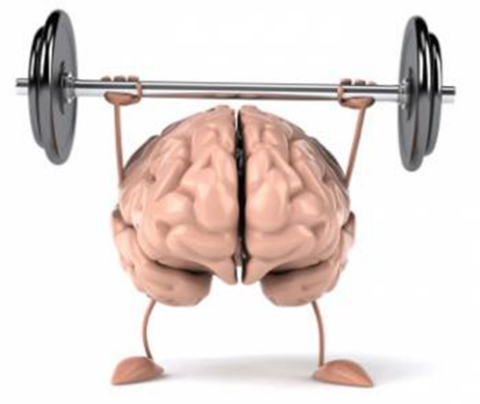

# La Atención: Puerta de Entrada a la Consciencia

## Sistema de abajo-arriba: atención automática

**El sistema de abajo-arriba opera con rapidez y automatismo.** Su función: captar estímulos externos que podrían ser significativos antes de que la consciencia deliberada intervenga.

Esta atención es espontánea. Funciona en modo "piloto automático" —un mecanismo privilegiado por la orientación a la supervivencia. Un movimiento en la periferia visual, un sonido inesperado, un cambio súbito en el entorno: el sistema responde antes de que haya decisión consciente de atender.

#imagen
Imagen de un muñeco cabezón (bobblehead) de un piloto o policía con gorra azul, representando metafóricamente el modo "piloto automático" del sistema de atención de abajo-arriba.

#imagen
  Diagrama con silueta de persona y ondas concéntricas entrando hacia ella, etiquetado "Stimulus Driven Attention". Representa la atención capturada por estímulos externos (sistema abajo-arriba).

---

## Sistema de arriba-abajo: atención dirigida

**El sistema de arriba-abajo contrasta radicalmente.** Es más lento, deliberado, controlado por la corteza prefrontal. Permite dirigir intencionalmente la atención hacia lo que se decide priorizar.

Este sistema requiere esfuerzo consciente. Es crucial para mantener el foco en tareas complejas, para la planificación, para la regulación de emociones. Cuando se elige concentrarse en una lectura profunda o evitar responder impulsivamente a una situación emocional, es el sistema de arriba-abajo ejerciendo control sobre los impulsos automáticos generados por el sistema de abajo-arriba.

#imagen
Fotografía de un director de orquesta visto desde atrás, dirigiendo a una orquesta sinfónica completa. Representa el sistema de atención de arriba-abajo: la capacidad de dirigir intencionalmente la atención, como un director que coordina y focaliza los diferentes elementos de la orquesta.

#imagen
 Diagrama con silueta de persona y flechas saliendo de ella hacia afuera, etiquetado "Goal Directed Attention". Representa la atención dirigida intencionalmente hacia objetivos (sistema arriba-abajo).

#### El poder de los procesos de arriba-abajo

Los procesos de arriba-abajo ejercen un poder considerable sobre la información que accede momento a momento. Están respaldados por una conectividad neural muy potente[^1]. La información del aquí y ahora —de abajo-arriba— tiene dificultades para hacer llegar a la consciencia su auténtico mensaje. La riqueza de matices presente en los niveles sensoriales iniciales se va perdiendo a medida que los procesos de arriba-abajo surten efecto, asimilando el contenido informativo a categorías previamente determinadas.

#### Atención detallada y metacognición

Prestar atención especial y detallada a la información entrante dificulta el funcionamiento de los procesos de arriba-abajo y favorece la llegada de más riqueza informativa a las instancias prefrontales. Este proceso requiere que la corteza prefrontal dorso-lateral (DLPFC) se active mientras recibe la información privilegiada en ese momento. **Una vez dirigida la atención a una de las corrientes sensoriales, si se implica simultáneamente la capacidad de autoobservación —la metacognición que permite hacerse consciente de los procesos mentales en marcha— surge la oportunidad de flexibilizar la respuesta**, desconectando la automaticidad que, sin esta intervención consciente, se hubiera producido.

#### La atención en un mundo de distracciones

Daniel Goleman resalta la importancia de la atención en ambos sistemas y cómo cada uno responde de manera diferente a los estímulos —algo fundamental para la autoconciencia y la autorregulación[^2]. Un objeto brillante, un ruido fuerte: el sistema de abajo-arriba captura la atención instantáneamente, sin pensarlo. Sin embargo, en un contexto de constantes distracciones —notificaciones en el móvil, interrupciones continuas— este sistema puede activarse con demasiada frecuencia, fragmentando la atención y dificultando el enfoque en tareas importantes.

---

## SODA: Si Observas Desactivas el Automatismo

El modo en que se despliega la atención determina lo que se ve.

#imagen
 "Desactivando el piloto automático: SODA ('Si Observas Desactivas el Automatismo')". Concepto clave que sintetiza cómo la observación consciente desactiva las respuestas automáticas.

#cita
"La atención proporciona el mecanismo «que subyace a nuestra conciencia del mundo y a la regulación voluntaria de nuestros pensamientos y sentimientos".
*Michael Posner y Mary Rothbart (neurocientíficos cognitivos)*[^3]

#cita
"La capacidad de centrar deliberadamente la atención errante una y otra vez constituye el fundamente del discernimiento, el carácter y la voluntad. Una estructura educativa que se dedicara a adiestrar esta facultad sería la educación por antonomasia"
*William James, "The Principles of Psychology"*[^4]

---

## La atención como recurso limitado y entrenable

**La atención es un recurso cognitivo limitado que puede ser entrenado y fortalecido.**

Esta limitación no es un defecto del sistema. Es una característica de diseño que obliga a seleccionar. No se puede atender a todo simultáneamente —y esa restricción da valor a la elección de hacia dónde se dirige el foco.

La buena noticia: como cualquier capacidad, la atención responde al entrenamiento. La práctica deliberada de dirigir y sostener la atención fortalece los circuitos neurales implicados. Lo que hoy requiere esfuerzo consciente puede convertirse, con práctica sostenida, en una capacidad más accesible.

#imagen
Secuencia de tres bombillas representando niveles de atención: una bombilla encendida con luz cálida intensa (atención plena), una bombilla con luz media (atención parcial), y una bombilla apagada (sin atención). Metáfora visual de cómo la atención es un recurso limitado que puede "agotarse".

#imagen
 Ilustración de un cerebro antropomorfizado con brazos y piernas levantando una barra de pesas. Representa el concepto de que la atención, como un músculo, puede ser entrenada y fortalecida mediante la práctica deliberada.

---

[^1]: Siegel, D. (2007). The Mindful Brain.
[^2]: Daniel Goleman, sobre la importancia de la atención en ambos sistemas para la autoconciencia y la autorregulación.
[^3]: Michael Posner y Mary Rothbart (neurocientíficos cognitivos).
[^4]: William James, "The Principles of Psychology".
