# Tema 9: Descubriendo el mindfulness

- [Por que este tema es necesario](#por-que-este-tema-es-necesario)
- [1. Definiciones de mindfulness](#1-definiciones-de-mindfulness)
- [2. Lo que NO es el mindfulness](#2-lo-que-no-es-el-mindfulness)
- [3. Componentes esenciales de la atencion plena](#3-componentes-esenciales-de-la-atencion-plena)
- [4. Raices budistas y evolucion occidental](#4-raices-budistas-y-evolucion-occidental)
- [5. Jon Kabat-Zinn y el programa MBSR](#5-jon-kabat-zinn-y-el-programa-mbsr)
- [6. Mindfulness en el mainstream](#6-mindfulness-en-el-mainstream)
- [7. Beneficios del mindfulness](#7-beneficios-del-mindfulness)
		- [7.1 Beneficios psicológicos](#71-beneficios-psicológicos)
		- [7.2 Beneficios biológicos](#72-beneficios-biológicos)
		- [7.3 Beneficios sociales](#73-beneficios-sociales)
- [8. Reflexion critica: mas alla del McMindfulness](#8-reflexion-critica-mas-alla-del-mcmindfulness)
- [Integracion con M1](#integracion-con-m1)
- [Conexion con el programa](#conexion-con-el-programa)
- [Dimension experiencial](#dimension-experiencial)
- [Referencias incluidas](#referencias-incluidas)
- [Material adicional del tema](#material-adicional-del-tema)
	- [Infografías del tema](#infografías-del-tema)

---

## Por que este tema es necesario

**Que es y por que funciona

**Pregunta que responde:**
Que es el mindfulness y por que funciona?

T8 establecio que la atencion es la puerta de la consciencia y que es entrenable. Este tema presenta el mindfulness como el metodo de entrenamiento con mayor evidencia cientifica.

El participante necesita entender que es el mindfulness (y que NO es) antes de aprender a practicarlo (T10).

#imagen  Puerta abierta con llave etiquetada "Mindfulness": metáfora del mindfulness como llave de acceso a la consciencia.

---

## 1. Definiciones de mindfulness

#grafica 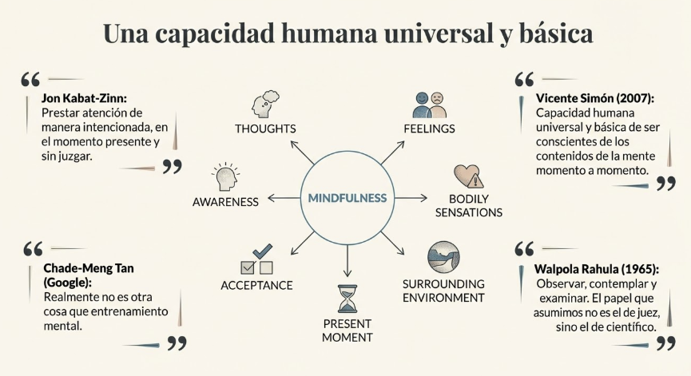 "Una capacidad humana universal y básica": mapa con definiciones de Kabat-Zinn, Vicente Simón, Chade-Meng Tan y Walpola Rahula.

#cita
- Una de las definiciones más conocidas es la de **Jon Kabat-Zinn**[^1] quien afirma que Mindfulness significa prestar atención de manera especial (intencionadamente), en el momento presente y sin juzgar.

- **Vicente Simon**[^2] (2007) define Mindfulness como la capacidad humana universal y básica, que consiste en la posibilidad de ser conscientes de los contenidos de la mente momento a momento.

- **Chade-Meng TAN**[^3] (2012 – Google – Search Inside Yourself) "Realmente no es otra cosa que entrenamiento mental".

- **Walpola Rahula**[^4] (1965): «Consiste simplemente en observar, contemplar y examinar. Y el papel que asumimos no es el de juez, sino el de científico».

---

## 2. Lo que NO es el mindfulness

Mindfulness puede entenderse en dos sentidos: como **estado mental natural** y como **tecnica desarrollada para cultivarlo**. Diferenciar ambos aclara confusiones comunes.

**Confusiones habituales

#ppt  "Desmontando Mitos: Lo que NO es el Mindfulness" - tabla comparativa de confusiones vs realidad.

**"Dejar la mente en blanco"**
No. Mindfulness no busca eliminar pensamientos. Su objetivo es tomar conciencia del proceso de pensamiento y las emociones sin reprimirlos.

**"Buscar la iluminacion o aislarse"**
No. Aunque algunas practicas se originaron en contextos monasticos, su proposito en la vida diaria es aumentar la consciencia de uno mismo en la interaccion con el mundo.

**"Suprimir las emociones"**
No. Mindfulness permite observar como surgen las emociones y responder a ellas sin reaccionar automaticamente.

**"Una escapatoria del dolor"**
No. El mindfulness no evita el dolor; ensena a aceptarlo sin reaccionar de manera impulsiva, lo que puede reducir el sufrimiento asociado.

**"Autoconciencia enjuiciadora"**
No. No significa analizar o criticar constantemente pensamientos o emociones. Es una experiencia sin juicio, no verbal y no conceptual.

**"Una practica egoista"**
No. Permite comprender mejor las propias acciones y aumenta la empatia hacia los demas.

---

## 3. Componentes esenciales de la atencion plena

Las definiciones de mindfulness siempre incluyen los siguientes aspectos[^5]:
- Evitar automatismo (mind wandering)
- Lo que estamos experimentando en cada momento
- Orientado a la observación y conocimiento

#ppt  Opción 1: "Mecánica Cognitiva: Los Tres Pilares" - persona meditando con diagrama de Intención, Atención y Actitud.

#grafica  Opción 2: "Los tres componentes del trípode de la atención" - diagrama de Venn con intención, experiencia presente y aceptación.
#ppt  "Los 4 Pilares de la Atención Plena": estar atento, en el presente, intencional y con aceptación.

**1. Capacidad de estar atento

El individuo no esta distraido, somnoliento o indolente, sino atento y centrado en lo que esta viviendo.

**2. En el presente

Puedes estar atento en el pasado echandolo de menos (depresion), o centrado en el futuro, temiendo algo que va a ocurrir (ansiedad). **En el mindfulness, la atencion se ancla exclusivamente en el fenomeno presente.**

**3. Intencional

Entrar en estado de mindfulness constituye un ejercicio de la voluntad, al menos al principio de la practica. Con el tiempo, el proceso se vuelve natural.

**4. Con aceptacion

No juzgas, criticas o estas a disgusto con la experiencia presente; la aceptas radicalmente. Aqui, aceptacion difiere de resignacion o pasividad: el sentido es de apertura y curiosidad no critica ante cada experiencia. **Cualquier elemento de no aceptacion hace perder el estado de mindfulness.**

---

## 4. Raices budistas y evolucion occidental

Reconocimiento de las raíces budistas, evolucionando hacia una forma "occidental" o "moderna"[^6]:
- La práctica clave es el mindfulness
- La práctica puede ser laica
- Tradición racional, empírica y científica
- Se incorpora al mainstream

#imagen  Imagen de un monje budista en posición de meditación, representando las raíces budistas del mindfulness con escáner cerebral detrás.

El mindfulness tiene sus raíces en el término budista *sati*, que significa "recordar" o "tener en mente". En el contexto budista, *sati* se asocia con la práctica de recordar las enseñanzas de la tradición y mantener en mente los dharmas virtuosos.

La interpretación de *sati* como "atención desnuda" es un desarrollo reciente y no se encuentra en los textos budistas tradicionales. Esta interpretación surge de una epistemología empirista de origen occidental.

**La llegada del budismo a Occidente

El budismo llega a Occidente a través de diferentes vías, siendo una de las más significativas la del "budismo moderno" o "budismo protestante", del cual se deriva el movimiento mindfulness. Este tipo de budismo, surgido de las interacciones entre la tradición budista y Occidente, se caracteriza por:

- **Centrarse en la meditación como elemento principal**: A diferencia del budismo tradicional, que se enfocaba en prácticas rituales y devocionales, el budismo moderno coloca a la meditación en el centro de la práctica.

- **Promover la práctica laica**: La meditación ya no es exclusiva de los monjes, sino que se abre a laicos con poca formación en los textos budistas tradicionales.

- **Buscar la compatibilidad con la ciencia**: El budismo se presenta como una tradición racional y empírica, compatible con la visión occidental del mundo.

- **Integrarse en la sociedad**: A diferencia del budismo tradicional que requería la renuncia a la vida mundana, el budismo moderno no exige este tipo de renunciación, facilitando su integración en la sociedad occidental.

El budismo moderno surge en parte como una crítica al budismo tradicional, similar a la crítica del protestantismo al catolicismo. Se buscaba adaptar el budismo Theravada a un estilo de vida secular, sin la necesidad de ser un monje.

---

## 5. Jon Kabat-Zinn y el programa MBSR

**Inicios del mindfulness en Occidente

El mindfulness, tal como lo conocemos hoy, fue impulsado en Occidente por Jon Kabat-Zinn en 1979, cuando creó el Programa de Reducción de Estrés y Relajación (hoy conocido como MBSR, o Mindfulness-Based Stress Reduction). Kabat-Zinn tuvo una formación intensa en meditación zen y vipassana, lo que lo motivó a adaptar estas prácticas para ayudar a personas que no accederían a un centro budista. **Su objetivo: ofrecer un método que aliviara el sufrimiento sin los términos y conceptos budistas que podrían ser rechazados en un contexto occidental y médico.**

#ppt 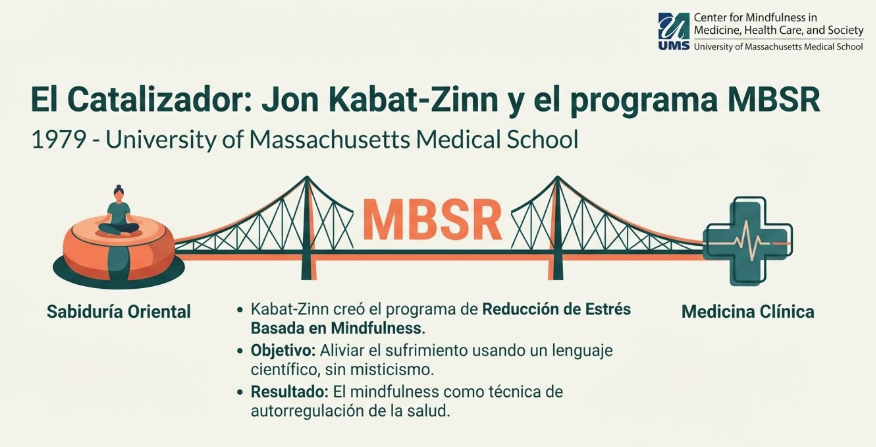 Opción 1: "El Catalizador: Jon Kabat-Zinn y el programa MBSR" - puente entre sabiduría oriental y medicina clínica.
#ppt  Opción 2: "1979: El Nacimiento del MBSR" - retrato de Kabat-Zinn con su misión, estrategia y programa.

#imagen  Logo del Center for Mindfulness in Medicine, Health Care, and Society de la University of Massachusetts Medical School. Centro fundado por Jon Kabat-Zinn donde se desarrolló el programa MBSR.

#imagen  Fotografía de Jon Kabat-Zinn, fundador del programa MBSR, con estetoscopio. Texto: "¿Meditar en los hospitales contra el estrés? La historia de Jon Kabat-Zinn y el MBSR".

**Ciencia y budismo: una convergencia

Kabat-Zinn enfatizó la universalidad del mindfulness y su vínculo entre el budismo y la ciencia. Para tender un puente entre ambas tradiciones, hizo hincapié en la relación entre medicina y meditación, posicionando el mindfulness como una práctica de autorregulación. Aunque su intención no fue descontextualizar el mindfulness del budismo, buscó adaptarlo para que pudiera ser aplicado en el sistema de salud, en particular en la medicina y la psicología.

**Creación y expansión del programa MBSR

El MBSR comenzó como un programa de ocho semanas en la Escuela de Medicina de la Universidad de Massachusetts, diseñado para que los pacientes pudieran mejorar su autogestión de la salud. Los instructores de MBSR se comprometieron a practicar el mindfulness de manera diaria, asegurando la autenticidad de la intervención. Este programa se convirtió en una vía para que la esencia del Dharma —las enseñanzas budistas— llegara a un público general sin necesidad de ser etiquetado como budista, místico o religioso.

**Evolución y psicoterapias de tercera generación

El mindfulness dio paso a las terapias de tercera generación en la psicología, una evolución de las terapias conductuales y cognitivo-conductuales que se enfocan en aceptar los pensamientos y emociones en lugar de cambiarlos.  Se caracterizan por:

- **Enfoque contextual**: A diferencia de las TCC de primera y segunda generación que se centraban en técnicas específicas para aliviar síntomas, las terapias de tercera generación adoptan un modelo contextual que considera la interacción entre el entorno, la relación terapéutica y la persona.

- **Énfasis en la aceptación y la atención plena**: En lugar de intentar cambiar directamente los pensamientos y emociones negativos, estas terapias se centran en aceptarlos sin juzgarlos y cultivar la atención plena al momento presente.

- **Flexibilidad psicológica**: El objetivo principal es aumentar la flexibilidad psicológica: la capacidad de aceptar las experiencias internas, conectar con el presente y actuar en función de los valores personales, incluso en presencia de malestar.

Entre estas terapias se incluyen la Terapia de Aceptación y Compromiso (ACT), la Terapia Dialéctica Conductual (DBT), y la Mindfulness-Based Cognitive Therapy (MBCT), una adaptación del MBSR que integra técnicas cognitivas para reducir recaídas en depresión.

#ppt 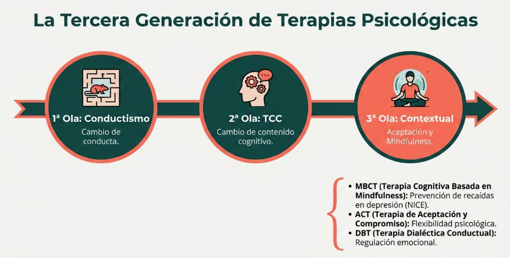 "La Tercera Generación de Terapias Psicológicas": tres olas (Conductismo → TCC → Contextual con MBCT, ACT, DBT).
1. Terapia de aceptación y compromiso (ACT por sus siglas en inglés)[^7]
2. Dialectical Behavior Therapy (DBT)[^8]
3. Mindfulness-Based Cognitive Therapy (MBCT)[^9]: disminución significativa del riesgo de recaída en la depresión[^10]. La MBCT fue diseñada específicamente para prevenir recaídas en la depresión mayor recurrente, ayudando a los pacientes a observar sus pensamientos y emociones sin identificarse con ellos. Estudios clínicos han demostrado su eficacia en diversas patologías como la depresión, el trastorno bipolar y la ansiedad, lo que ha llevado a su recomendación por instituciones como el NICE en el Reino Unido para la prevención de recaídas en la depresión.

---
## 6. Mindfulness en el mainstream

#ppt  "Adopción Institucional y Corporativa": tres columnas (Salud Pública/NHS, Corporativo, Academia).

El mindfulness ha sido adoptado por:

- **Empresas:** Google, Apple, Goldman Sachs, McKinsey, Nike, Ford, IKEA
- **Universidades:** Harvard, Oxford, Stanford, MIT
- **Sistemas de salud:** El NHS britanico recomienda terapias basadas en mindfulness

El NICE recomienda que los empleadores pongan el mindfulness a disposicion de todos los empleados para apoyar el bienestar mental en el trabajo.

#ppt  Opción 1: "La revolución mediática (The Mindful Revolution)": portadas de TIME y National Geographic con texto explicativo.

#imagen  Opción 2: Collage de portadas originales: TIME "The Mindful Revolution"[^11], TIME "The Science of Meditation"[^12], National Geographic "What's in your mind"[^13].

#ppt 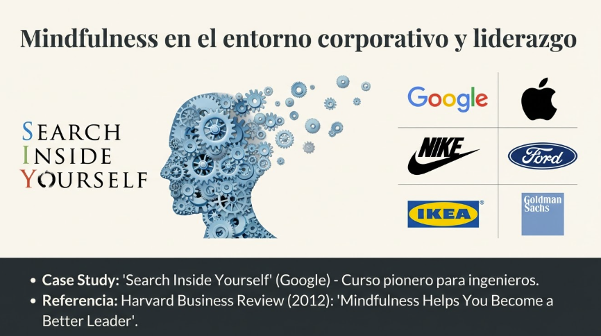 Opción 1: "Mindfulness en el entorno corporativo y liderazgo": logos Google, Apple, Nike, Ford, IKEA, Goldman Sachs + Search Inside Yourself + referencia HBR.

#ppt  Opción 2: "Adopción Corporativa Global": Client Wall con logos (Google, IBM, Intel, McKinsey, Apple, Goldman Sachs, Nike, Sony, Ford, LinkedIn).

#imagen  Captura de Harvard Business Review con artículo "Mindfulness Helps You Become a Better Leader" por Bill George[^14] (October 26, 2012). Muestra la adopción del mindfulness en el mundo empresarial y del liderazgo.

#imagen  Logo del programa "Search Inside Yourself" de Google, con silueta de cabeza hecha de engranajes. Texto: "The groundbreaking course developed at Google, as featured in The New York Times".

#imagen  Opción 3: Panel "Mindful Business Companies" mostrando logos de 17 empresas que implementan programas de mindfulness.

#ppt  Opción 1: "Respaldo Institucional y Académico": logos Oxford, UMass, UCLA, Wisconsin, NHS con texto explicativo.

#ppt  Opción 2: "Integración en universidades y sistemas de salud": escudos Oxford, Harvard, Stanford + NHS.

#imagen  Opción 3: Collage de centros de investigación: Oxford Mindfulness Centre, UMass, UCLA MARC, Wisconsin, Master Mindfulness Barcelona, Complutense.

#imagen  Logo del NHS británico. El National Institute for Health and Care Excellence (NICE) recomienda las terapias basadas en mindfulness como tratamiento para la depresión menos severa. NICE también recomienda que los empleadores pongan el mindfulness a disposición de todos los empleados para apoyar el bienestar mental en el trabajo.

---

## 7. Beneficios del mindfulness

#grafica 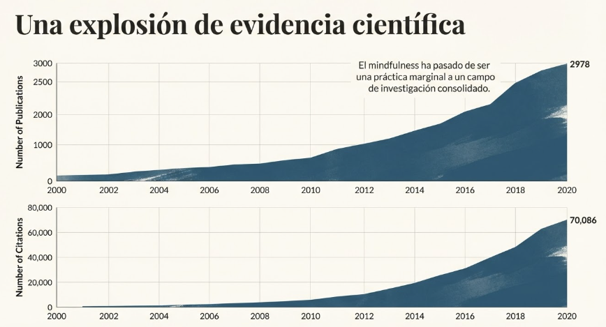 "Una explosión de evidencia científica": gráficas de publicaciones (2978) y citaciones (70,086) sobre mindfulness entre 2000-2020.

#### 7.1 Beneficios psicológicos

- **Mejora la regulación emocional**: permite tomar distancia de las respuestas emocionales automáticas, promoviendo una gestión más adaptativa.
- Disminuye la rumiación: ayuda a reconocer y soltar los patrones de pensamiento repetitivos que generan malestar.
- Reduce el estrés, la ansiedad y la depresión: diversos estudios muestran la eficacia del mindfulness en el tratamiento de estos trastornos.
- Aumenta el bienestar subjetivo: la práctica regular de mindfulness se asocia a mayor felicidad, satisfacción con la vida y emociones positivas.

#### 7.2 Beneficios biológicos

- **Reduce la activación de la amígdala**: la amígdala, un área del cerebro relacionada con el procesamiento de las emociones, muestra menor actividad en meditadores, lo que sugiere una menor reactividad emocional.
- Modifica la actividad del córtex prefrontal: el mindfulness se asocia a cambios en la actividad de la corteza prefrontal, un área del cerebro implicada en la regulación emocional y la atención.
- Reduce la secreción de cortisol: el cortisol, una hormona del estrés, se reduce con la práctica del mindfulness.

#ppt 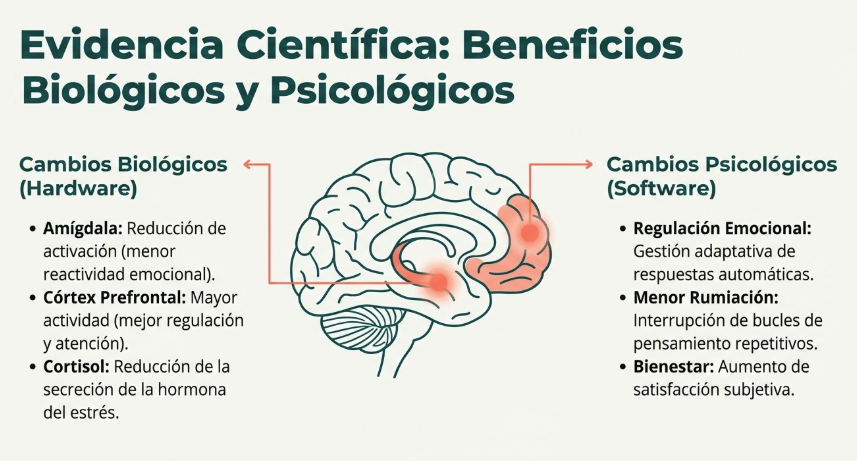 "Evidencia Científica: Beneficios Biológicos y Psicológicos": cerebro con cambios hardware (amígdala, cortisol) y software (regulación emocional, rumiación, bienestar).
#ppt 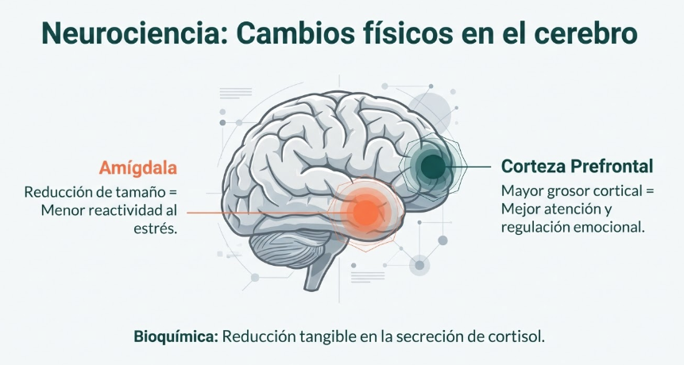 "Neurociencia: Cambios físicos en el cerebro": amígdala (reducción de tamaño), corteza prefrontal (mayor grosor cortical), cortisol (reducción).

#grafica  "Neurociencia del cambio: Engrosamiento cortical": gráficas de grosor de ínsula y corteza prefrontal en meditadores vs controles por edad.

#### 7.3 Beneficios sociales

- Promueve la compasión y la empatía: el mindfulness aumenta la capacidad de conectar con el sufrimiento propio y ajeno, favoreciendo una actitud compasiva.
- **Mejora las relaciones interpersonales**: el mindfulness facilita la comunicación, la comprensión y la conexión con los demás.
- Fomenta el comportamiento ético: el mindfulness se asocia a una mayor conciencia moral y a la tendencia a actuar de acuerdo a valores éticos.

---

## 8. Reflexion critica: mas alla del McMindfulness

#imagen  Collage crítico sobre la comercialización y trivialización del mindfulness ("McMindfulness") mostrando portadas de libros como "Catfulness" (mindfulness para gatos), "Mindfulness for Dogs", "Mindful Cooking", "Dancing Mindfulness", "Mindfulsex". Ilustra la banalización y mercantilización del concepto de mindfulness.

La crítica del "McMindfulness" advierte sobre los riesgos de la comercialización y trivialización del mindfulness[^15].

#ppt 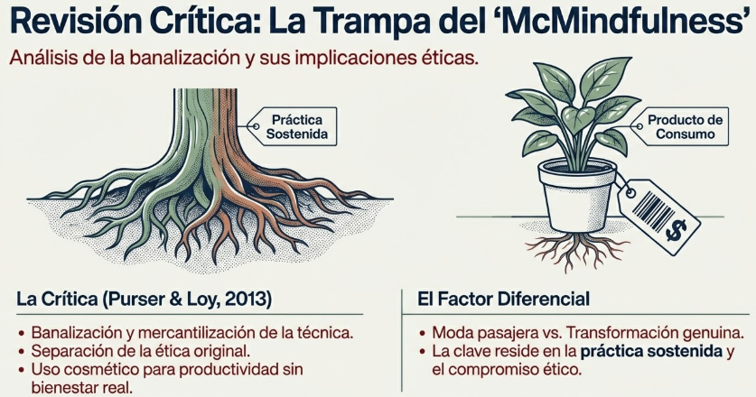 Opción 1: "Revisión Crítica: La Trampa del McMindfulness" - árbol con raíces (práctica sostenida) vs planta en maceta (producto de consumo).

#ppt 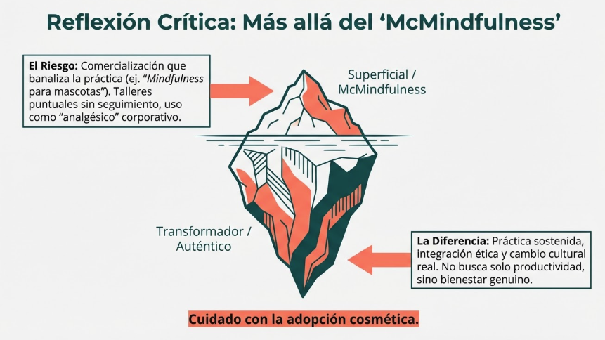 Opción 2: "Reflexión Crítica: Más allá del McMindfulness" - iceberg con superficial/McMindfulness vs transformador/auténtico.

---

## Integracion con M1

**Conexion con T1-T8

T1-T7 revelaron como funciona el cerebro. T8 establecio que la atencion es la puerta de la consciencia.

Este tema (T9) presenta la respuesta: **el mindfulness es el metodo con mayor evidencia para entrenar esa capacidad atencional**.

**Conexion con T10

T10 desarrollara **como practicar**: el ciclo de la meditacion, las redes cerebrales implicadas, la practica de atencion focalizada.

---

## Conexion con el programa

El mindfulness es la practica transversal del programa:

| Modulo | Aplicacion del mindfulness |
|--------|---------------------------|
| M1 | Atencion focalizada (respiracion) |
| M2 | Body Scan (sensaciones corporales) |
| M3 | Observacion de pensamientos y emociones |
| M4 | Regulacion del estres |
| M5 | Compasion (hacia otros) |
| M6 | Open Monitoring (metaconsciencia) |
| M7 | Intencion benevolente (metta) |

---

## Dimension experiencial #insight 

Reflexiona:

- Que ideas previas tenias sobre el mindfulness? Cuales eran correctas y cuales confusiones?
- Por que crees que el mindfulness ha llegado a empresas y hospitales?
- Que resistencias sientes ante la idea de "practicar" mindfulness?

---

## Referencias incluidas

[^1]: Kabat-Zinn, J. Definición de mindfulness.
[^2]: Simon, V. (2007). Definición de mindfulness.
[^3]: Tan, C.M. (2012). Search Inside Yourself. Google.
[^4]: Rahula, W. (1965). Definición de mindfulness.
[^5]: García Campayo, J. y Demarzo, M. (2015), pp. 18-20.
[^6]: Sharf, R. (1995; 2015).
[^7]: Hayes y cols. (1999).
[^8]: Linehan, M. (1993).
[^9]: Segal y cols. (2002).
[^10]: Dimidjian, S. (2016).
[^11]: TIME Magazine. "The Mindful Revolution".
[^12]: TIME Magazine. "The Science of Meditation".
[^13]: National Geographic. "What's in your mind".
[^14]: George, B. (2012). "Mindfulness Helps You Become a Better Leader". Harvard Business Review, October 26, 2012.
[^15]: Purser, R. y Loy, D. (2013). "Más allá del McMindfulness".

---

## Material adicional del tema #aux
### Infografías del tema

#infografia 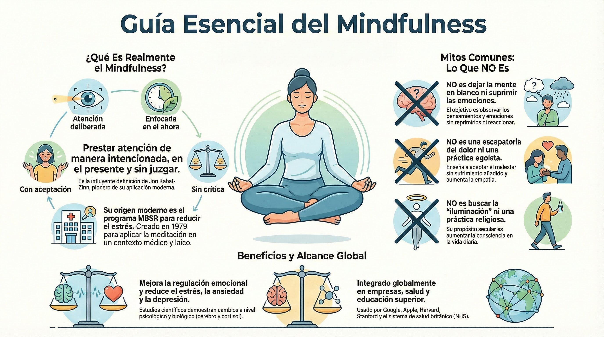 Infografía síntesis: "Guía Esencial del Mindfulness" - qué es, mitos comunes, beneficios y alcance global.

#infografia 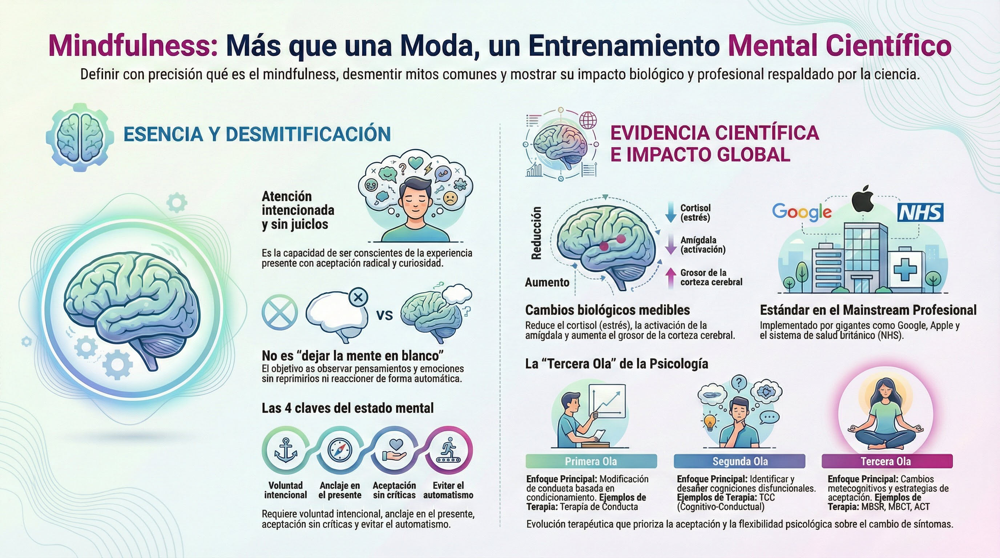 Infografía síntesis v2: "Mindfulness: Más que una Moda, un Entrenamiento Mental Científico" - esencia, desmitificación, evidencia científica e impacto global.