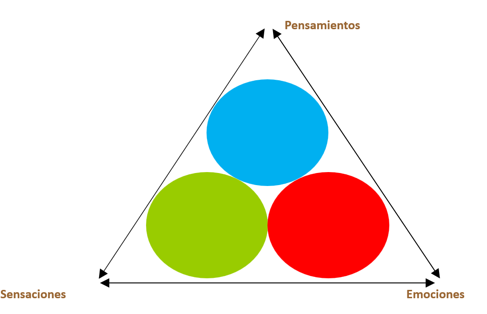

# Entrenando la Atención a través del Mindfulness

## El círculo de la atención

#imagen
 Ilustración de un cerebro antropomorfizado corriendo en una cinta de correr sobre fondo azul. Representa el concepto de entrenamiento mental a través del mindfulness, como si la atención fuera un músculo que se ejercita.

#teoria
**El círculo de la atención**

El proceso de meditación mindfulness sigue un ciclo continuo:
1. **Concentración en el objeto** - Foco inicial en el objeto de meditación (ej: respiración)
2. **Mente se distrae** - La mente inevitablemente divaga
3. **Darse cuenta de la mente distraída** - Reconocer que la mente ha divagado
4. **Soltar el objeto de la distracción** - Desengancharse del pensamiento distractor
5. **Volver al objeto de la atención** - Redirigir la atención al objeto original

#imagen
 Diagrama circular con 5 etapas del ciclo de atención en meditación, representado con círculos de colores conectados por flechas: Concentración en el objeto (naranja) → Mente se distrae (amarillo) → Darse cuenta de la mente distraída (verde oscuro) → Soltar el objeto de la distracción (verde claro) → Volver al objeto de la atención (azul) → y vuelta al inicio.

---

## Redes cerebrales implicadas

#imagen #referencia
 Diagrama científico de Malinowski (2013) mostrando el proceso de meditación y las redes cerebrales implicadas. Panel A: Círculo concéntrico del proceso meditativo (Alerting, Sustaining, focus on object, Default Mode/Distraction/mind wanders, Salience/Monitoring/recognize wandering, Executive/Disengaging/letting go, Orienting/Shifting/return to object). Panel B: Redes cerebrales correspondientes (Alerting, Default Mode, Salience, Executive, Orienting) con ilustraciones de cerebros mostrando las áreas activadas. Referencia: Malinowski, Peter. (2013). Neural mechanisms of attentional control in mindfulness meditation. Frontiers in Neuroscience. 7. 8. 10.3389/fnins.2013.00008.

#explicacion
Sustained Attention
Conflict monitoring or executive attention: to detect mind wandering and prioritizes among competing thoughts, feelings, and responses
Attention switching: the ability to disengage from a distracting object without further involvement and the ability to redirect focus promptly to the chosen object / the ability to shift the focus of attention between objects or mental sets at will
- La habilidad para desengancharse (disengage) de la distracción sin ningún efecto
- La habilidad para redirigir la atención (redirect) al objeto seleccionado de forma ágil

Selective Attention or Cognitive inhibition: ability to inhibit secondary elaborative processing of thoughts, feelings and sensations. The self-regulation of attention also fosters nonelaborative awareness of thoughts, feelings, and sensations as they arise. Rather than getting caught up in ruminative, elaborative thought streams about one's experience and its origins, implications, and associations, mindfulness involves a direct experience of events in the mind and body (Teasdale, Segal, Williams, & Mark, 1995).

---

## Efectos del mindfulness en las habilidades atencionales

#teoria
**Efectos del mindfulness en las habilidades atencionales**

| Componente | Evidencia |
|------------|-----------|
| **ALERTA** | ★★★★☆ |
| **ATENCIÓN SOSTENIDA** | ★★★☆☆ |
| **ORIENTACIÓN** | ★★★☆☆ |
| **CONTROL EJECUTIVO** | ★★★★★ |

#imagen #referencia
 Gráfico de dispersión mostrando el crecimiento exponencial de estudios sobre "Mindfulness Training of Attention" desde 1973 hasta 2018. Los puntos representan estudios individuales, con un aumento notable a partir de 2010. El gráfico incluye criterios de calidad metodológica: Discussion of group content, Attention to reduction of demand characteristics, Inclusion of an active control group, Randomization of participants to groups, Following of reporting guidelines (such as CONSORT).Prakash, R.S. et al. (2020) "Mindfulness and Attention: Current State-of-Affairs and Future Considerations" J Cogn Enhanc.

#imagen
Referencias a artículos científicos clave: Chiesa, A. et al. (2011) "Does mindfulness training improve cognitive abilities? A systematic review of neuropsychological findings" Clinical Psychology Review; Gallant, S.N. (2016) "Mindfulness meditation practice and executive functioning: Breaking down the benefit" Consciousness and Cognition; 

#explicacion
1. Componentes de la Atención

Alerta: Es la preparación de la mente para responder a estímulos entrantes y se divide en:
- Alerta fásica: Se refiere a fluctuaciones momentáneas de atención en respuesta a señales. Estudios muestran que el mindfulness intensivo (como en retiros) mejora esta alerta, especialmente en tareas de detección y discriminación visual.
- Alerta tónica: Involucra la vigilancia o mantenimiento de un estado de atención sostenida. Estudios de retiros a largo plazo indican mejoras en la atención sostenida y una reducción en la divagación mental. Sin embargo, estudios a corto plazo muestran resultados contradictorios sobre los beneficios del mindfulness en este tipo de atención.

Orientación: Este componente se refiere a dirigir la atención hacia estímulos internos o externos y puede ocurrir:
- De arriba hacia abajo: La atención se dirige a estímulos según objetivos internos o generados por el propio sujeto.
- De abajo hacia arriba: La atención es capturada automáticamente por estímulos externos.
La investigación sobre los efectos del mindfulness en la orientación es limitada y los resultados han sido inconsistentes, por lo que se necesita más investigación para comprender plenamente este componente.

Control Ejecutivo: Es el mecanismo que ayuda a resolver conflictos entre información competitiva, fortaleciendo la respuesta a estímulos relevantes y suprimiendo aquellos irrelevantes.
Estudios que emplean la tarea Flanker (para medir la capacidad de atención frente a distracciones) y la tarea Stroop (que mide la habilidad para ignorar información irrelevante) muestran mejoras en el control de conflictos tras el entrenamiento en mindfulness. Estos beneficios han sido observados incluso después de entrenamientos cortos, y algunos estudios indican que estas mejoras pueden mantenerse hasta seis meses.

2. Efectos del Mindfulness en los Componentes de la Atención

Alerta Fásica: El mindfulness muestra un efecto positivo en la alerta fásica, facilitando la capacidad para responder rápidamente a estímulos en tareas de discriminación visual. Sin embargo, la falta de grupos de comparación en algunos estudios limita la certeza sobre los efectos específicos del mindfulness.

Alerta Tónica: Estudios en retiros a largo plazo sugieren que el mindfulness ayuda a mantener la atención sostenida y reduce la distracción mental. Los estudios a corto plazo, en cambio, ofrecen resultados mixtos, lo que sugiere que la mejora de la vigilancia puede requerir un entrenamiento más prolongado.

Orientación: La literatura actual muestra un apoyo limitado para los efectos del mindfulness en la orientación atencional. La falta de efectos claros y el bajo número de estudios específicos sobre este componente dificultan la obtención de conclusiones definitivas.

Control Ejecutivo: El mindfulness tiene efectos positivos en el control de conflictos, como se observa en tareas de Flanker y Stroop, con mejoras en la resolución de conflictos en estudios controlados. Esto sugiere que el entrenamiento en mindfulness es efectivo para desarrollar la capacidad de mantener la atención en estímulos relevantes y reducir las distracciones, incluso después de entrenamientos cortos.

3. Conclusión
En general, el mindfulness ofrece beneficios prometedores en ciertos componentes de la atención, en particular en el control de conflictos y, en menor medida, en la alerta fásica. Sin embargo, los efectos en la orientación y la alerta tónica requieren más estudios.

---

## El triángulo de la atención

#teoria
**El TRIÁNGULO DE LA ATENCIÓN**

Los tres vértices del triángulo representan los tres canales principales de la experiencia consciente:
- **Pensamientos** (vértice superior)
- **Sensaciones** (vértice inferior izquierdo)
- **Emociones** (vértice inferior derecho)

#imagen
 Diagrama del Triángulo de la Atención con tres vértices etiquetados: Pensamientos (arriba), Sensaciones (abajo izquierda), Emociones (abajo derecha). En el interior del triángulo hay tres círculos de colores (azul, verde, rojo) que representan las tres fuentes de experiencia consciente y su interrelación.

---

## Los afluentes de la consciencia

#teoria
**Los afluentes de la consciencia**

#imagen
 Metáfora visual de los afluentes de la consciencia: imagen de varios grifos vertiendo agua a través de un embudo hacia un cerebro hecho de agua/cristal. Representa cómo diferentes canales de información (sensaciones, pensamientos, emociones) fluyen y convergen en la consciencia.

#explicacion
En el mindfulness, la metáfora de la "rueda de la conciencia" ilustra cómo diferentes aspectos de la experiencia fluyen hacia el centro de nuestra mente, alimentando el "río de la conciencia". Estos aspectos se conocen como los afluentes de la conciencia y son cuatro:

Sensación: Implica la experiencia sensorial directa (vista, oído, tacto, gusto, olfato y propiocepción). En mindfulness, se cultiva una atención plena a las sensaciones del momento presente, sin juicios.

Observación: Permite observar pensamientos, emociones y experiencias sin identificarse con ellos, lo cual proporciona claridad y distancia emocional. Esto se cultiva mediante la metacognición, o la "atención a la atención".

Conceptualización: La mente crea conceptos y narrativas a partir de las experiencias sensoriales. En mindfulness, se observa esta tendencia sin aferrarse a los juicios y sin confundir estas construcciones mentales con la realidad absoluta.

Conocimiento no conceptual: Surge de la integración de los otros afluentes y representa un tipo de comprensión intuitiva y directa que no depende del lenguaje. En mindfulness, se cultiva al prestar atención plena a la experiencia presente.

Equilibrio entre los Afluentes
Para una práctica de mindfulness efectiva, es fundamental equilibrar estos afluentes. Excesiva atención a la sensación puede llevar a una inmersión sensorial que limita la claridad, mientras que la conceptualización excesiva puede crear juicios y narrativas que nos apartan del momento presente. El conocimiento no conceptual proporciona una comprensión profunda y evita que la experiencia sea solo racional o superficial.
