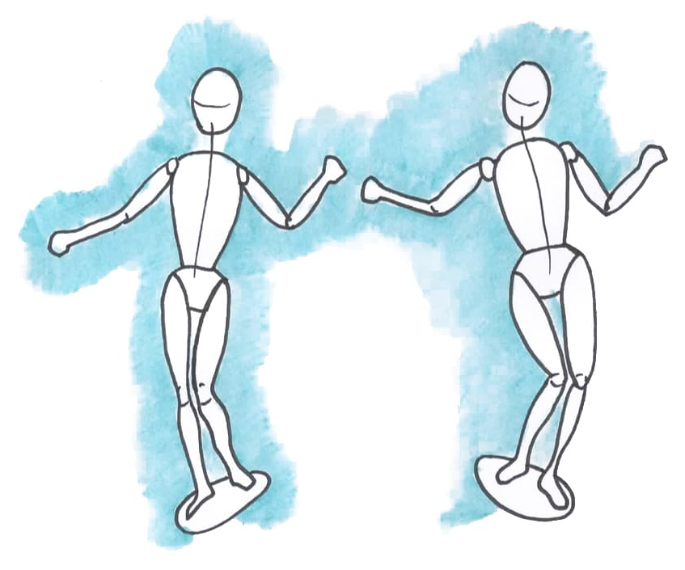

# Sensaciones: Más allá de los cinco sentidos

#teoria
SENSACIONES

#imagen
 Diagrama del triángulo de la atención con tres vértices etiquetados: "Pensamientos" (vértice superior), "Emociones" (vértice inferior derecho) y "SENSACIONES" (vértice inferior izquierdo, destacado en azul). En el interior del triángulo hay tres círculos superpuestos: uno verde (asociado a Sensaciones, resaltado), y dos grises (asociados a Pensamientos y Emociones). El círculo verde indica el foco temático del módulo.

---

#teoria
¿Cuántos sentidos tenemos?

**EXTEROCEPCIÓN**

#imagen
 Ilustración de una silueta de cabeza humana de perfil con iconos de los cinco sentidos tradicionales alrededor: ojo (vista), oreja (oído), nariz (olfato), lengua (gusto) y mano (tacto), conectados por líneas al cerebro. Fondo gris claro.

#teoria
**INTEROCEPCIÓN**

#imagen
 Ilustración artística de una figura humana estilizada en tonos naranjas y cálidos sobre fondo oscuro azulado. La figura muestra órganos internos visibles (cerebro, corazón, intestinos) representando la percepción del interior del cuerpo.

#teoria
- La interocepción es como un "sexto sentido" que nos permite percibir las sensaciones internas de nuestro cuerpo.
- Nos permite "sentir" nuestro cuerpo desde dentro, percibiendo sensaciones como la frecuencia cardíaca, la respiración, la temperatura corporal, la saciedad, el dolor visceral y la necesidad de ir al baño.

**PROPIOCEPCIÓN**

#imagen
 Ilustración de dos figuras humanas esquemáticas en movimiento (tipo maniquí articulado) sobre fondo azul acuarela, mostrando diferentes posturas corporales que representan la percepción del movimiento y posición en el espacio.

#teoria
Se refiere a la capacidad de percibir la posición y el movimiento del cuerpo en el espacio.
- La propiocepción nos permite saber dónde están nuestras extremidades sin tener que mirarlas, coordinar nuestros movimientos y mantener el equilibrio.
- Los receptores sensoriales de la propiocepción se encuentran en la piel, los músculos, los huesos y las articulaciones, informando al cerebro sobre la postura corporal.

#explicacion
Los cinco sentidos tradicionales, también conocidos como exterocepción, son: la vista, el oído, el olfato, el gusto y el tacto. Estos sentidos nos permiten percibir el mundo exterior y juegan un papel fundamental en nuestra experiencia de la realidad.

La vista: Este sentido nos permite percibir la luz y las formas, permitiéndonos "ver" el mundo que nos rodea. El proceso visual comienza con la luz que impacta sobre el papel y rebota, llegando a nuestros ojos cargados de información. La retina procesa esta imagen y la envía al nervio óptico, que a su vez la transmite al tálamo en el centro del cerebro. El tálamo actúa como la puerta de entrada del mundo a nuestro organismo.

El oído: El oído nos permite percibir las ondas sonoras, lo que nos permite "escuchar" el mundo. Los receptores del oído se activan con los sonidos y transmiten esta información al cerebro a través de los nervios auditivos.

El olfato: El olfato nos permite percibir los olores. A diferencia de los demás sentidos, el olfato sigue un único recorrido en el cerebro y no pasa por el tálamo. El bulbo olfativo, la primera estación cerebral del olfato, tiene fuertes conexiones con el hipocampo, lo que explica por qué los olores pueden evocar recuerdos tan vívidamente.

El gusto: El gusto nos permite percibir los sabores. La lengua contiene miles de botones gustativos que detectan las sustancias químicas de los alimentos y bebidas. Estos receptores envían señales al cerebro a través de los nervios facial y glosofaríngeo.

El tacto: El tacto nos permite percibir la presión, la temperatura y el dolor. Los receptores sensoriales del tacto se encuentran en la piel y envían señales al cerebro a través de los nervios.

Es importante recordar que estos cinco sentidos no funcionan de forma aislada, sino que se complementan y se influyen mutuamente para crear una experiencia sensorial completa.

---

#teoria
Los sentidos permiten la representación en la mente del mundo interno y externo

#cita
"los sentidos, como forma básica de cognición, son el punto de partida para el desarrollo de la mente, los sentimientos y la consciencia" (Antonio Damasio)

#teoria
1. Los Sentidos como el Primer Paso de Cognición
2. De Sentir a Experimentar
3. De Sentir a Conocer
4. Los Sentidos Como Base de la Consciencia

#imagen
 Fotografía de girasoles amarillos vistos desde abajo contra un cielo azul intenso con rayos de sol brillantes. Imagen que evoca la percepción sensorial y la orientación hacia la luz.

#explicacion
Los sentimientos son una evolución directa de esta capacidad inicial de sentir. Cuando un organismo empieza a percibir su propio estado interno (por ejemplo, hambre o dolor) en relación con los estímulos externos, se da el paso de una mera respuesta sensorial a la experiencia subjetiva de un sentimiento. En los humanos, por ejemplo, sentir frío o hambre no solo es un estímulo físico, sino que está acompañado de una experiencia subjetiva de incomodidad o malestar, que impulsa acciones específicas para modificar la situación.

Damasio argumenta que los sentimientos son la manera en que la biología "siente" la vida misma, ayudando al organismo a monitorear su estado interno y a actuar para preservar su bienestar, en un proceso ligado estrechamente a la homeostasis.

Los Sentidos como el Primer Paso de Cognición:
Todos los organismos, desde los más simples hasta los más complejos, dependen de la capacidad de percibir su entorno. En sus formas más básicas, esto no se parece a lo que entendemos como "pensamiento", pero sí es un primer paso en el desarrollo de la mente. La planta que se inclina hacia la luz es un ejemplo sencillo: siente la luz y responde moviéndose hacia ella. Este "sentir" básico es el origen de una respuesta organizada y orientada a la supervivencia.

De Sentir a Experimentar:
En los animales y en los seres humanos, estos sentidos no solo reaccionan, sino que evolucionan en sistemas complejos que pueden integrar información de manera más profunda. Por ejemplo, un perro puede oír un sonido y, a través de sus sentidos, interpretar que alguien se acerca. Esta interpretación es más avanzada que una simple reacción y muestra cómo la percepción se vuelve más sofisticada en animales con sistemas nerviosos.

En los Humanos: De Sentir a Conocer:
En los humanos, esta capacidad se ha expandido a un nivel superior, donde el cerebro interpreta las sensaciones y construye experiencias. Por ejemplo, al escuchar una canción, no solo percibimos los sonidos: también sentimos emociones, recuerdos o ideas que se activan en nuestra mente. Este tipo de percepción más avanzada nos permite construir pensamientos complejos, experimentar emociones y desarrollar una autoconciencia (es decir, una percepción de quiénes somos).

Los Sentidos Como Base de la Consciencia:
Sin los sentidos, no tendríamos la base para formar una "imagen" del mundo en nuestra mente. Los sentidos brindan la información que el cerebro necesita para construir lo que experimentamos como la realidad. Esto permite que, al integrar todas estas percepciones, surja una mente consciente, capaz de reflexionar sobre sí misma, tomar decisiones y reaccionar emocionalmente.
