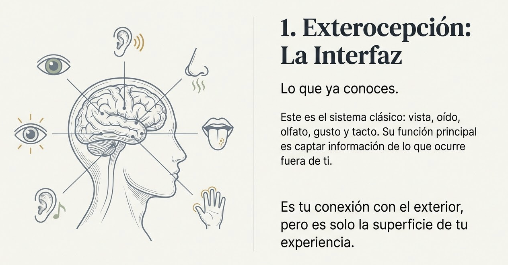
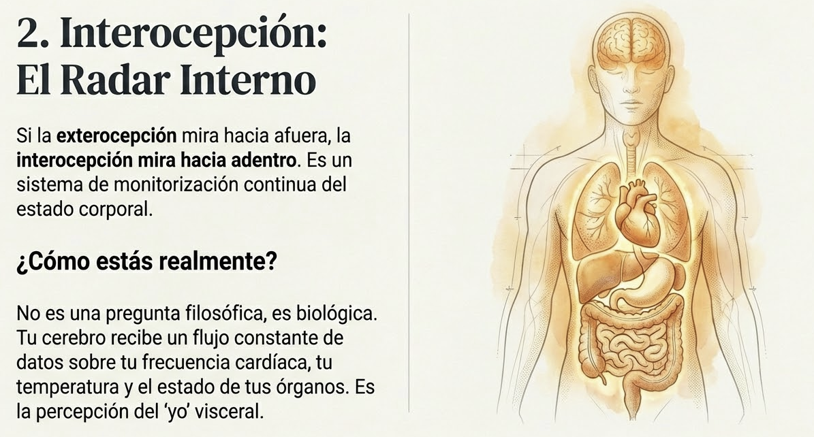
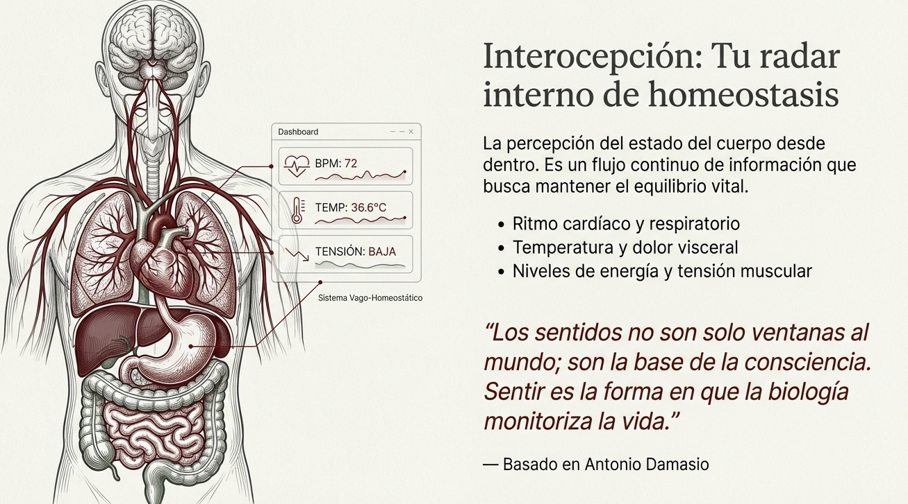
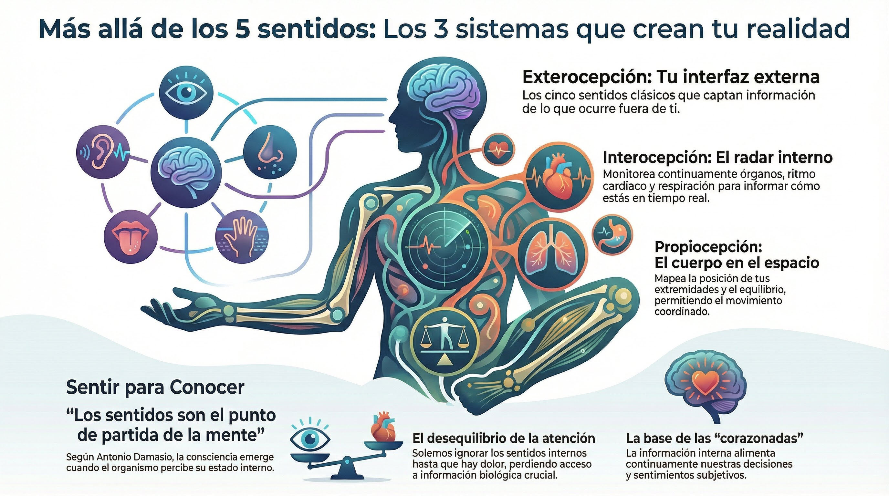

# Tema 1: Mas alla de los cinco sentidos

- [Por que este tema es necesario](#por-que-este-tema-es-necesario)
		- [Los tres sistemas perceptivos](#los-tres-sistemas-perceptivos)
- [1. Los tres sistemas](#1-los-tres-sistemas)
		- [1. 1 Exterocepcion](#1-1-exterocepcion)
		- [1. 2 Interocepcion](#1-2-interocepcion)
		- [1.3 Propiocepcion](#13-propiocepcion)
- [2. Los sentidos como base de la consciencia](#2-los-sentidos-como-base-de-la-consciencia)
- [3. Lo que sueles ignorar](#3-lo-que-sueles-ignorar)
- [Conexion con M1](#conexion-con-m1)
- [Dimension experiencial](#dimension-experiencial)
- [Referencias incluidas](#referencias-incluidas)
- [Material adicional del tema](#material-adicional-del-tema)
	- [Infografías del tema](#infografías-del-tema)

---
## Por que este tema es necesario

#### Los tres sistemas perceptivos

**Pregunta que responde:**
Cuantas formas tengo de percibir, y cuales he ignorado?

Este tema amplia la nocion de "sentidos" mas alla de la exterocepcion clasica. Descubriras que tienes tres sistemas perceptivos, dos de los cuales (interocepcion y propiocepcion) operan continuamente pero rara vez alcanzan la consciencia.

Esta ampliacion prepara para el resto del modulo.

---

## 1. Los tres sistemas

#### 1. 1 Exterocepcion

#ppt  Diapositiva "Exterocepción: La Interfaz" con iconos de los cinco sentidos clásicos (vista, oído, olfato, gusto, tacto) y perfil de cabeza con cerebro.

Los cinco sentidos clasicos: vista, oido, olfato, gusto, tacto.

**Funcion:** Interfaz con el mundo exterior. Captan informacion de lo que ocurre fuera de ti.

Este es el sistema que conoces. Lo que probablemente no sabias es que es solo uno de tres.

#### 1. 2 Interocepcion

#ppt  Opción 1: Diapositiva "Interocepción: El Radar Interno" con silueta anatómica mostrando órganos y descripción del sistema de monitorización corporal.

#ppt  Opción 2: Diapositiva "Interocepción: Tu radar interno de homeostasis" con cuerpo anatómico, indicadores vitales y cita basada en Damasio.

El "radar interno": percepcion del estado de los organos.La interocepción funciona como un radar interno: un sistema de monitorización continua del estado corporal. Registra frecuencia cardíaca, ritmo respiratorio, temperatura, saciedad, dolor visceral, necesidad de evacuar. Es la percepción del cuerpo desde dentro —información que el cerebro procesa constantemente, aunque rara vez alcance la consciencia.

**Que percibe:**
- Frecuencia cardiaca
- Ritmo respiratorio
- Temperatura interna
- Saciedad/hambre
- Dolor visceral
- Tension/relajacion

**Funcion:** El cuerpo desde dentro. Informa sobre como estas en tiempo real.

#### 1.3 Propiocepcion

#ppt  Diapositiva "Propiocepción: El Mapa Espacial" con figuras articuladas de madera en movimiento, ilustrando el GPS corporal.

La propiocepción mapea la posición y el movimiento del cuerpo en el espacio. Permite saber dónde están las extremidades sin necesidad de mirarlas, coordinar movimientos y mantener el equilibrio. Los receptores propioceptivos —ubicados en piel, músculos, huesos y articulaciones— informan al cerebro sobre la postura corporal en tiempo real.

**Que percibe:**
- Posicion de las extremidades
- Equilibrio
- Coordinacion
- Movimiento

**Funcion:** El cuerpo en movimiento. Permite saber donde estan tus partes sin mirarlas.

---

## 2. Los sentidos como base de la consciencia

#imagen  Silueta anatómica mostrando la integración de los tres sistemas: procesamiento visceral, integración emocional e interpretación consciente en el cerebro.

Los tres sistemas perceptivos trabajan en paralelo, pero la cultura occidental ha privilegiado la exterocepcion (lo "objetivo") sobre la interocepcion (lo "subjetivo").

#cita
"los sentidos, como forma básica de cognición, son el punto de partida para el desarrollo de la mente, los sentimientos y la consciencia"[^1]

Los sentimientos emergen de esta capacidad inicial de sentir. Cuando un organismo percibe su estado interno —hambre, dolor, temperatura— en relación con estímulos externos, el sistema pasa de respuesta sensorial a experiencia subjetiva. Sentir frío no es solo un dato fisiológico: viene acompañado de una experiencia de incomodidad que impulsa a actuar.

Damasio sostiene que los sentimientos son la forma en que la biología "siente" la vida misma —un mecanismo de monitorización del estado interno vinculado a la homeostasis, orientado a preservar el bienestar del organismo.

**Los sentidos como primer paso de cognición

Todo organismo, desde los más simples hasta los más complejos, depende de percibir su entorno. Una planta que se inclina hacia la luz ejemplifica esta capacidad básica: detecta el estímulo y responde orientándose hacia él. Este "sentir" primario constituye el origen de toda respuesta organizada hacia la supervivencia.

**De sentir a experimentar

En animales y humanos, los sentidos no solo reaccionan: integran información de manera progresivamente más sofisticada. Un perro que oye un sonido no solo lo detecta —interpreta que alguien se acerca. Esta interpretación muestra cómo la percepción se complejiza en sistemas nerviosos más desarrollados.

**De sentir a conocer

En humanos, esta capacidad alcanza otro nivel. El cerebro no solo procesa sensaciones: construye experiencias. Al escuchar una canción, no percibes únicamente sonidos —se activan emociones, recuerdos, asociaciones. Esta percepción expandida permite construir pensamientos complejos, experimentar emociones y desarrollar autoconciencia.

**Los sentidos como base de la consciencia

Sin los sentidos, no existiría la base para formar una representación del mundo en la mente. Los sentidos proporcionan la información que el cerebro necesita para construir lo que experimentamos como realidad. La integración de estas percepciones genera una mente consciente —capaz de reflexionar sobre sí misma, tomar decisiones y reaccionar emocionalmente.

---

## 3. Lo que sueles ignorar

La mayoria de las personas:

- Usan conscientemente la exterocepcion
- Ignoran la interocepcion hasta que hay dolor o malestar intenso
- Dan por sentada la propiocepcion (hasta que falla)

Este desequilibrio tiene consecuencias: pierdes acceso a informacion crucial sobre tu estado.

---

## Conexion con M1

M1 establecio que el cerebro construye la realidad.

M2 especifica: **esa construccion utiliza tres sistemas perceptivos, no solo los cinco sentidos clasicos**.

La informacion interoceptiva alimenta al Sistema 1 continuamente. Tus "corazonadas" tienen base fisiologica.

---

## Dimension experiencial #insight

Reflexiona:

- Cuando fue la ultima vez que prestaste atencion deliberada a una sensacion interna (no dolor)?

---

## Referencias incluidas

[^1]: Antonio Damasio.- Damasio, A. (2021). *Feeling & Knowing: Making Minds Conscious.* Pantheon.

**otras posibles referencias de interés
- Craig, A.D. (2015). *How Do You Feel? An Interoceptive Moment with Your Neurobiological Self.* Princeton University Press.
- Sherrington, C. (1906). *The Integrative Action of the Nervous System.* Yale University Press. (origen del termino "propiocepcion")

---
## Material adicional del tema #aux
### Infografías del tema 

#infografia  Infografía "Más allá de los 5 sentidos: Los 3 sistemas que crean tu realidad" — exterocepción, interocepción y propiocepción con sus funciones y la base de las corazonadas.