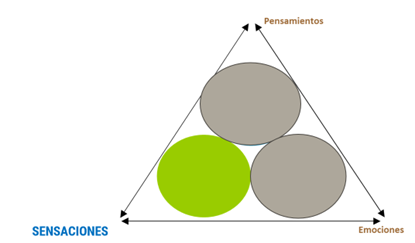

# Mindfulness e Interocepción

#teoria
En el mindfulness y en muchas tradiciones meditativas, **el cuerpo es el anclaje de la atención por antonomasia,** ya que nos permite relacionarnos de una forma diferente con nuestra experiencia. El cuerpo siempre está en el presente, por lo que poner la atención en él inhibe el vagabundeo mental, las rumiaciones. La forma más sencilla de poner la atención en el presente cuando nuestra mente está errante es llevar la atención al cuerpo. Por eso, todas las prácticas del mindfulness tienen como anclaje la atención en el cuerpo de una forma u otra: la respiración (una actividad del cuerpo), body scan, atención a los movimientos corporales.

**Aumentar la Conciencia Corporal y mejorar la Precisión Interoceptiva:** El mindfulness aumenta la sensibilidad para percibir sensaciones corporales y la exactitud introspectiva.

**Conectar con el Estado Emocional (Espiar" las Emociones):** Prestar atención a las sensaciones corporales nos permite detectar las emociones en sus etapas tempranas, antes de que se hagan conscientes y desencadenen reacciones automáticas. Al reconocer las señales tempranas del cuerpo, como la tensión muscular, los cambios en la respiración o el ritmo cardíaco, podemos intervenir para regular nuestras respuestas emocionales y evitar reacciones impulsivas. Cuando aparecen, en vez de rumiar nuevos pensamientos que generan más emociones, nos permiten parar el procesamiento mental automático que mantiene los patrones rumiativos (La ansiedad se asocia con una mayor atención a las señales interoceptivas, lo que puede crear un círculo vicioso. Por ejemplo, la persona ansiosa puede percibir con mayor intensidad las palpitaciones o la dificultad para respirar, lo que a su vez aumenta su preocupación y miedo, intensificando la experiencia de ansiedad)
#imagen 
 imagen de un cuerpo humano con raíces que se adentran en la tierra

#imagen
 Ilustración abstracta mostrando ondas concéntricas rojas/naranjas (como ondas de radar o sismógrafo) emanando de un punto central, con líneas diagonales grises en el fondo. Representa la atención focalizada en las sensaciones corporales internas y la amplificación de la consciencia interoceptiva.

#imagen
 Diagrama del triángulo de la atención con los tres vértices: "Pensamientos" (arriba, gris), "Emociones" (derecha, gris) y "SENSACIONES" (izquierda, destacado en azul). En el interior, tres círculos superpuestos: el círculo verde (Sensaciones) resaltado en primer plano, los otros dos grises. Representa el foco del mindfulness en las sensaciones corporales.

---

#teoria
**Beneficios de una Interocepción Mejorada**

**REGULACIÓN EMOCIONAL:**
- **Identificación temprana de las emociones:** Una mayor conciencia interoceptiva nos permite detectar las emociones en sus etapas iniciales, a través de sus manifestaciones físicas, como la tensión muscular, los cambios en la respiración o el ritmo cardíaco. Esto nos da la oportunidad de intervenir antes de que las emociones se intensifiquen y desencadenen reacciones impulsivas.
- **Modulación de las respuestas fisiológicas:** Al ser conscientes de las sensaciones corporales asociadas a las emociones, podemos utilizar técnicas como la respiración consciente o el movimiento para modular la actividad neuronal y regular la respuesta del cuerpo.
- **Romper el círculo vicioso de la ansiedad:** La ansiedad se asocia con una mayor atención a las señales interoceptivas, lo que puede generar un ciclo de preocupación y malestar físico. Al reconocer y aceptar las sensaciones corporales sin juzgarlas, podemos evitar que la ansiedad se intensifique.

**TOMA DE DECISIONES:**
- **Mayor sensibilidad a las señales de riesgo y beneficio:** Las personas con mayor conciencia interoceptiva tienden a tomar decisiones más acertadas, ya que son más sensibles a las señales corporales que indican riesgo o beneficio.
- **Acceso a una sabiduría intuitiva:** Al sintonizar con nuestro cuerpo, podemos acceder a una sabiduría intuitiva que nos guía hacia elecciones más saludables y alineadas con nuestras necesidades.

**BIENESTAR GENERAL:**
- **Mayor bienestar físico y mental:** Una mayor conciencia interoceptiva se asocia con un mayor bienestar general, una mejor capacidad para afrontar el estrés y una mayor resiliencia.
- **Mejor autocuidado:** La interocepción nos ayuda a mantener la homeostasis, alertándonos sobre necesidades como el hambre, la sed o el descanso.

#imagen
 Diagrama del triángulo de la atención mostrando los tres componentes (Pensamientos, Sensaciones, Emociones) con sus círculos superpuestos. Ilustra cómo la mejora de la interocepción beneficia la integración de estos tres elementos.

---

#teoria #referencia 
**IMPACTO MINDFULNESS EN INTEROCEPCION**

**Cambios estructurales y funcionales INSULA**
- Incremento activación ínsula tras curso MBSR (Farb et al, 2007)
- Mayor activación ínsula ante imágenes tristes (Farb et al, 2010)

#imagen #referencia 
 Panel científico titulado "Cortical areas thicker in meditators" con fondo beige. Contiene: imagen de resonancia magnética de un cerebro en vista lateral con áreas coloreadas (ínsula señalada en verde/amarillo, corteza prefrontal en rojo), y debajo dos gráficos de dispersión comparando el grosor cortical de la Ínsula (izquierda) y la corteza Prefrontal (derecha) entre meditadores (puntos azules) y controles (puntos rojos) según la edad. Referencia: Lazar et al, 2007; Holzel et al, 2008.

#referencia 
Se ha encontrado un incremento de la activación de la ínsula en individuos tras un curso MBSR (comparado con sujetos que no habían practicado mindfulness) (Farb et al, 2007). Este estudio encontró también un incremento de la activación de la corteza somatosensorial secundaria, que es relevante para el procesamiento de sucesos sensoriales exteroceptivos.

#referencia  En otro estudio, un grupo de participantes que habían seguido un entrenamiento mindfulness mostraron una mayor activación de la ínsula derecha cuando se les presentaron imágenes tristes (Farb et al, 2010).

#referencia Otra investigación neurocientífica mantiene esta misma línea en relación con estudios en el contexto del dolor. Cuando se les presentó estímulos desagradables durante el estado mindful, los sujetos meditadores mostraron una mayor activación en la ínsula posterior y en el cortex somatosensorial secundario (Gard et al, 2010). De forma similar, los meditadores mindfulness activaron con mayor fuerza la ínsula izquierda anterior, posterior y media así como el tálamo (Grant, Courtemanche & Rainville, 2010).

Por lo tanto, el fortalecimiento del procesamiento sensorial se sugiere que representa un incremento del procesamiento bottom-up de los estímulos, es decir, una consciencia de la sensación actual "as it is".

#referencia DESDE UN PUNTO DE VISTA ESTRUCTURAL, dos estudios cross-sectional que comparan la morfometría de la materia gris de los cerebros de meditadores expertos y grupos de control mostró que los meditadores tenían un mayor grosor cortical (Lazar et al, 2005) y una mayor concentración de materia gris (Holzel et al, 2008) en ínsula anterior derecha.

#referencia Aunque 8 semanas de práctica mindfulness no revelaron cambios en la concentración de materia gris en la ínsula (Holzel et al, 2011), el mismo estudio reveló que las 8 semanas de prácticas dieron lugar a un incremento de la concentración de materia gris en la unión temporal-parietal, que se considera una estructura crucial para la generación de la perspectiva personal de los estados corporales (Blanke et al, 2005) o el "embodiment" (Arzy, Thut, Mohr, Michel & Blanke, 2006) y que el procesamiento inadecuado en esta zona es el que explicaría experiencias patológicas del self, así como las experiencias extracorporales (Blanke & Arzy, 2005). Cambios morfológicos en la unión temporo-parietal estarían asociadas con un incremento de la consciencia sobre la experiencia de uno mismo dentro del cuerpo.
