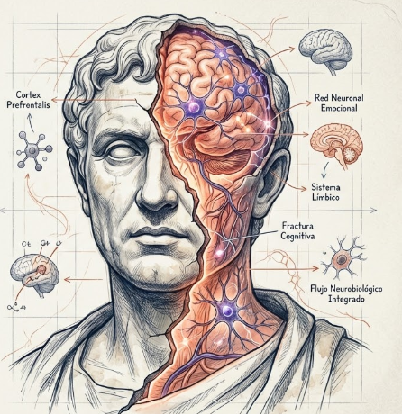
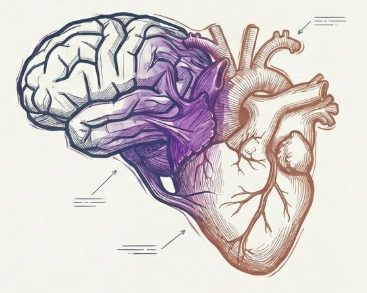
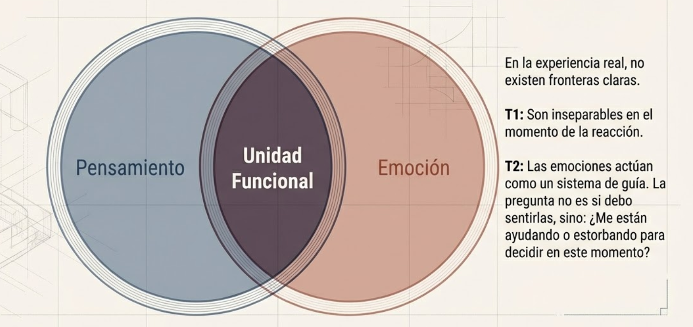
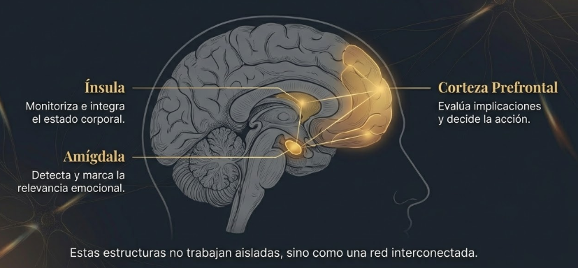
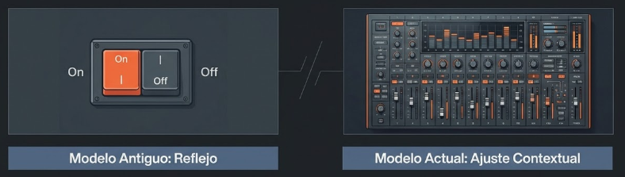
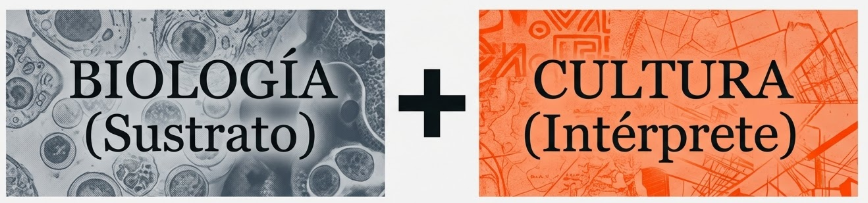
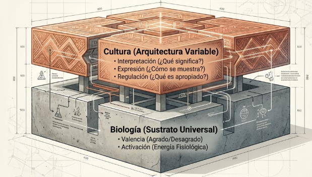
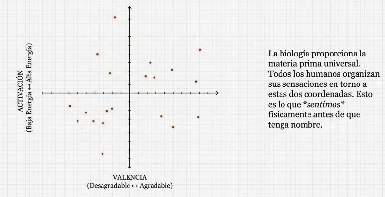
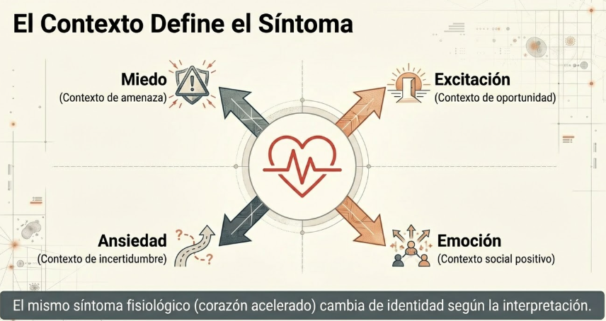
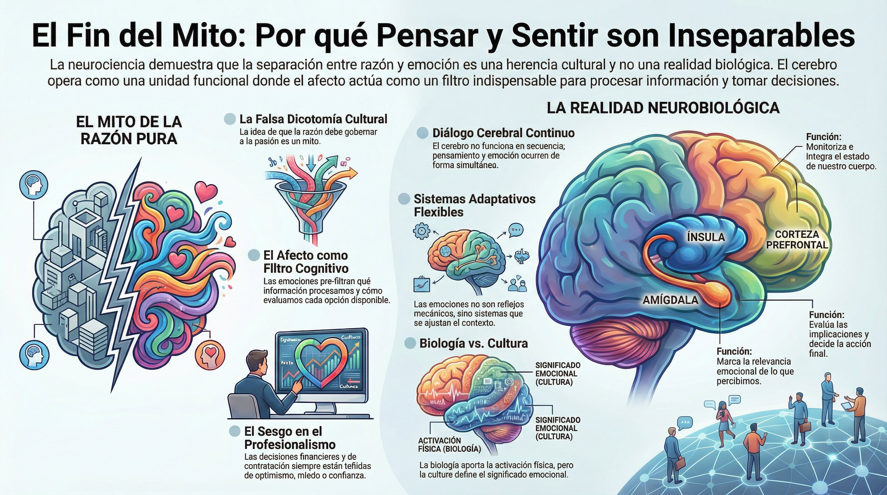

# Tema 1: La inseparabilidad de la emoción y el pensamiento

- [Por que este tema es necesario](#por-que-este-tema-es-necesario)
	- [Una unidad funcional](#una-unidad-funcional)
- [1. La falsa dicotomia](#1-la-falsa-dicotomia)
- [2. El afecto como filtro](#2-el-afecto-como-filtro)
- [3. La integracion cerebral](#3-la-integracion-cerebral)
- [4. La revolucion en la ciencia de las emociones](#4-la-revolucion-en-la-ciencia-de-las-emociones)
- [5. Biologia y cultura](#5-biologia-y-cultura)
- [Conexion con M1](#conexion-con-m1)
- [Conexion con M2](#conexion-con-m2)
- [Dimension experiencial](#dimension-experiencial)
- [Referencias incluidas](#referencias-incluidas)
- [Material adicional del tema](#material-adicional-del-tema)
	- [Infografías del tema](#infografías-del-tema)

#imagen  Busto con cerebro expuesto mostrando corteza prefrontal, sistema límbico, red neuronal emocional y flujo neurobiológico integrado.

---
## Por que este tema es necesario

#### Una unidad funcional

**Pregunta que responde:**
Por que no puedo separar lo que pienso de lo que siento?

Este tema desmonta la dicotomia razon/emocion. Descubriras que nunca piensas "en frio": todo proceso cognitivo va acompanado de afecto.

Esta comprension prepara para entender por que las emociones influyen en las decisiones (T2) y como se encadenan con los pensamientos (T3).

#imagen  Cerebro y corazón fusionados con flechas bidireccionales, representando la unidad funcional pensamiento-emoción.

---

## 1. La falsa dicotomia

La dicotomía clásica entre razón y emoción no sobrevive a la evidencia neurocientífica. **Pensamiento y emoción operan como una unidad funcional**: los procesos mentales —percepción, memoria, razonamiento, imaginación— siempre van acompañados de afectos. El afecto no es un ruido que contamina el pensamiento limpio; actúa como un filtro que determina qué información se procesa y cómo se evalúa.

#grafica  "El Mito del Ruido": gráfico que muestra el modelo incorrecto del afecto como contaminante del pensamiento puro.

Las emociones surgen automáticamente, pero no desencadenan respuestas mecánicas como los reflejos. El cerebro integra la señal emocional junto con otros factores —contexto, objetivos, consecuencias anticipadas— para calcular la respuesta más adecuada. Esta arquitectura permite una flexibilidad que un sistema basado únicamente en reglas o reflejos no podría alcanzar.

La separacion razon/emocion es herencia cultural, no realidad neurobiologica:

- **Tradicion occidental:** "La razon debe gobernar las pasiones"
- **Ideal del lider:** Frio, calculador, no se deja llevar
- **Cultura profesional:** "Dejemos las emociones fuera"

Pero el cerebro no funciona asi.

**Pensamiento y emocion operan como unidad funcional.**

#ppt  Slide "No existe el pensamiento sin emoción": dos árboles (cognición y afecto) entrelazados como realidad biológica.

#grafica  Diagrama de Venn: pensamiento ∩ emoción = "Unidad Funcional", con anotaciones de T1 y T2.

---

## 2. El afecto como filtro

El afecto no contamina el pensamiento; **determina que informacion se procesa y como se evalua**.

No hay percepcion "objetiva" libre de coloracion emocional:

- Lo que te parece una "evaluacion racional" ya esta tenida de afecto
- Las opciones que consideras ya han sido pre-filtradas emocionalmente
- Lo que te parece "evidente" refleja tu estado emocional
#grafica  Opción 1: Ilustración artística del filtro afectivo — datos crudos pasan por embudo y emergen como percepción evaluada.
#grafica  Opción 2: Diagrama esquemático del filtro afectivo — entrada de datos neutrales → filtro → salida de evidencia percibida.

---

## 3. La integracion cerebral

La integración ocurre en múltiples niveles simultáneamente. La amígdala detecta la relevancia emocional del estímulo. La ínsula monitoriza el estado corporal. La corteza prefrontal evalúa implicaciones y posibilidades de acción. Estas estructuras no trabajan en secuencia aislada; forman un sistema en el que la información emocional y cognitiva se entrelazan continuamente.

#grafica  Cerebro señalando ínsula, amígdala y corteza prefrontal como red interconectada.

Las estructuras cerebrales relevantes trabajan en red, no en secuencia aislada:

| Estructura | Funcion |
|------------|---------|
| Amigdala | Marca relevancia emocional |
| Insula | Integra estado corporal |
| Corteza prefrontal | Evalua y decide |

Estas tres estan en dialogo continuo. No hay "primero pienso, luego siento" ni "primero siento, luego pienso".

Es simultaneo e integrado.

#ppt  Slide "Simultaneidad, no secuencia": símbolo infinito mostrando que información emocional y cognitiva se entrelazan continuamente.

---

## 4. La revolucion en la ciencia de las emociones

La comprensión científica de las emociones ha experimentado una transformación radical. La visión tradicional, inspirada en Darwin, consideraba la emoción como un vestigio primitivo —un obstáculo para el pensamiento racional que la evolución aún no había eliminado. La neurociencia afectiva ha invertido esta perspectiva: las emociones no son residuos arcaicos sino sistemas sofisticados, esenciales para el bienestar y la toma de decisiones.

**Cambios de paradigma

- **De emociones básicas a un espectro amplio**: La investigación ha superado el modelo de un puñado de emociones universales (miedo, ira, tristeza, alegría) para reconocer emociones sociales complejas —vergüenza, culpa, orgullo, celos— igualmente fundamentales para la vida humana.
#grafica  Barra de espectro: de emociones básicas (miedo, ira) a espectro complejo (vergüenza, orgullo, celos).

- **De respuestas fijas a sistemas adaptativos**: Las emociones no son reacciones programadas que estímulos específicos disparan automáticamente. Operan como sistemas flexibles que se ajustan al contexto, la historia personal y las metas del momento.
#grafica  Modelo antiguo (interruptor on/off reflejo) vs modelo actual (mesa de mezclas de ajuste contextual).

- **De estructuras aisladas a redes distribuidas**: Asociar cada emoción a una estructura cerebral única (amígdala = miedo) ha dado paso a modelos de redes neuronales complejas donde múltiples regiones participan en la generación de cualquier experiencia emocional.

#grafica  Cerebro en wireframe con red neuronal iluminada, mostrando redes distribuidas en lugar de estructuras aisladas.

- **De dicotomía a integración**: Razón y emoción no compiten por el control de la conducta; colaboran. Las emociones informan juicios, motivan decisiones y guían el comportamiento en coordinación con procesos cognitivos.
#grafica  Trenza de hilos azules (razón) y naranjas (emoción) entrelazados: de dicotomía a integración.

- **De lo negativo a lo positivo**: El foco tradicional en emociones negativas —miedo, ansiedad, tristeza— ha incorporado el estudio sistemático de emociones positivas: alegría, gratitud, compasión, amor. Estas no son meros extras; son recursos para la resiliencia y el desarrollo.

#grafica  Venn: foco tradicional negativo (miedo, ansiedad) vs foco moderno que incluye lo positivo (resiliencia, alegría, compasión).

- **De lo universal a lo cultural**: Las emociones tienen una base biológica compartida, pero la cultura moldea cómo se experimentan, expresan y regulan.

#grafica  "BIOLOGÍA (Sustrato) + CULTURA (Intérprete)" — imagen dividida mostrando los dos componentes de la experiencia emocional.

#imagen  Captura de publicación científica del Max Planck Institute of Geoanthropology[^1] titulada "The meaning of emotion: Cultural and biological evolution impact how humans feel feelings". Incluye tres gráficos de redes semánticas de emociones etiquetados como "Universal", "Austronesian" e "Indo-European", mostrando nodos de colores (azul, rojo, amarillo, verde) conectados representando diferentes emociones y sus relaciones en distintas familias lingüísticas.

---

## 5. Biologia y cultura

La experiencia emocional emerge del entrelazamiento de biología y cultura. La biología proporciona el sustrato: valencia (agradable-desagradable) y activación (nivel de excitación fisiológica) organizan universalmente cómo se agrupan las emociones. Pero la cultura introduce variación sustancial en la interpretación y expresión de esas señales.

#grafica  Edificio: biología como cimiento universal (valencia, activación) y cultura como arquitectura variable (interpretación, expresión, regulación).

#grafica  Scatter plot con ejes valencia (desagradable↔agradable) y activación (baja↔alta energía) como coordenadas universales.

Un estudio que analizó 2474 idiomas encontró que familias lingüísticas geográficamente cercanas comparten redes semánticas emocionales más similares[^2]. La historia compartida, el comercio y la migración moldean la forma en que cada cultura organiza el significado de las emociones.

#ejemplo
El concepto de "sorpresa" ilustra esta interacción. La respuesta fisiológica inicial a un estímulo repentino puede ser universal, pero la interpretación varía: en lenguas austronesias, "sorpresa" se asocia estrechamente con "miedo"; en lenguas tai-kadai, con "esperanza" y "deseo". Estas diferencias no son meras curiosidades lingüísticas —configuran respuestas conductuales divergentes ante la misma situación.

Cuando alguien de una cultura donde sorpresa connota miedo enfrenta un evento inesperado, su sistema nervioso se prepara para la amenaza. Cuando alguien de una cultura donde sorpresa connota esperanza enfrenta el mismo evento, su sistema se orienta hacia la oportunidad. La biología proporciona el marco; la cultura determina qué se construye dentro de él.

La biologia proporciona:
- **Valencia:** Agrado/desagrado
- **Activacion:** Alta/baja energia

La cultura moldea:
- **Interpretacion:** Que significa esta sensacion
- **Expresion:** Como se muestra
- **Regulacion:** Que es apropiado sentir

El mismo sintoma fisiologico (corazon acelerado) puede ser "emocion", "ansiedad", "excitacion" o "miedo" segun el contexto y la cultura.

#ppt  Slide "El Contexto Define el Síntoma": corazón acelerado interpretado como miedo, excitación, ansiedad o emoción según contexto.

---

## Conexion con M1

M1 introdujo las emociones como parte de la arquitectura mental.

M3 profundiza: no son un componente separado, sino que **impregnan todo proceso cognitivo**.

El Sistema 1 de Kahneman no opera solo con heuristicas cognitivas; opera con afecto integrado.

---

## Conexion con M2

M2 mostro que las emociones tienen sede corporal (interocepcion).

M3 anade: esa sede corporal **se integra continuamente con el pensamiento**.

La insula conecta cuerpo y cognicion; no hay separacion.

---

## Dimension experiencial #insight

Reflexiona:

- Has tomado alguna decision "puramente logica" que luego descubriste estaba emocionalmente motivada?
- Que emociones suelen acompanar tus "mejores" analisis?

La cultura del "profesionalismo racional" ignora que toda decision organizacional esta emocionalmente tenida:

- Las proyecciones financieras reflejan optimismo o pesimismo
- Las evaluaciones de riesgo reflejan miedo o confianza
- Las contrataciones reflejan afinidad o rechazo

Fingir que no hay emociones no las elimina; solo las hace invisibles.

---

## Referencias incluidas
[^1]: Max Planck Institute of Geoanthropology. Estudio sobre redes semánticas de emociones.
[^2]: Estudio de 2474 idiomas sobre redes semánticas emocionales y familias lingüísticas.

**Otras posibles referencias de interés
- Barrett, L.F. (2017). *How Emotions Are Made: The Secret Life of the Brain.* Houghton Mifflin Harcourt.
- Pessoa, L. (2013). *The Cognitive-Emotional Brain: From Interactions to Integration.* MIT Press.
- Phelps, E.A. (2006). *Emotion and cognition: Insights from studies of the human amygdala.* Annual Review of Psychology.

---
## Material adicional del tema #aux
### Infografías del tema 

#infografia  Infografía resumen "El Fin del Mito: Por qué Pensar y Sentir son Inseparables".
 