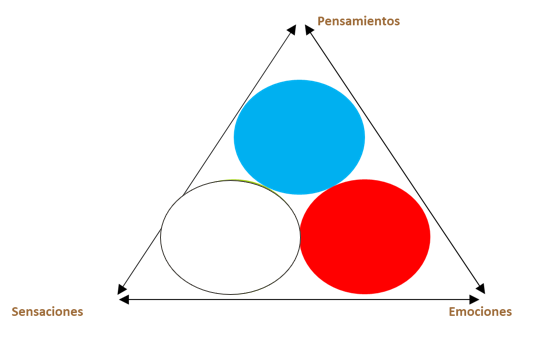

# La inseparabilidad de la emoción y el pensamiento

#imagen
 Imagen que muestra de forma destacada los dos circulos de la atención que hacen referencia a pensamiento y emoción después de haber analizado en el módulo anterior el círculo referido a las sensaciones

#teoria
La Inseparabilidad del Pensamiento y la Emoción

La neurociencia moderna ha demostrado que la emoción y el pensamiento, lejos de ser categorías separadas, están intrínsecamente interconectadas en el cerebro humano:
- Los procesos mentales, ya sea percepción, memoria, razonamiento o imaginación, siempre van acompañados de afectos.
- El afecto actúa como un filtro que colorea la información que procesamos, influyendo en nuestras decisiones y reacciones.
- Las emociones, aunque surgen automáticamente, no desencadenan respuestas automáticas como los reflejos. En cambio, el cerebro considera la emoción junto con otros factores para calcular la respuesta más adecuada.
- Esta interacción constante entre emoción y cognición permite una flexibilidad y adaptación mucho mayor que un sistema basado únicamente en reglas o reflejos.
- Diversas áreas del cerebro, como la amígdala, la ínsula y la corteza prefrontal, trabajan en conjunto para integrar la información emocional y cognitiva.

#imagen
 Diagrama conceptual mostrando tres elementos interconectados con flechas bidireccionales: un corazón con la etiqueta "EMOCIÓN", un cerebro con la etiqueta "PENSAMIENTO", y una espiral con la etiqueta "ACCIÓN". Estilo de dibujo a mano en trazos negros.

#teoria
La transformación de la concepción tradicional de la emoción en la ciencia

La ciencia moderna ha revolucionado nuestra comprensión de la emoción, desafiando la visión tradicional que prevaleció durante siglos. La teoría tradicional, inspirada en las ideas de Charles Darwin, consideraba la emoción como un vestigio primitivo de nuestro pasado evolutivo, un obstáculo para el pensamiento racional. La nueva ciencia de la emoción, impulsada por la neurociencia afectiva y las tecnologías modernas, ha revelado que las emociones son esenciales para nuestro bienestar y juegan un papel crucial en la forma en que pensamos, decidimos y actuamos.

- De un número limitado de emociones "básicas" a un espectro más amplio
- De respuestas fijas a un sistema flexible y adaptativo
- De estructuras cerebrales específicas a una red neuronal compleja
- De la dicotomía razón-emoción a una interacción inseparable
- Del enfoque en la emoción negativa a la importancia de la emoción positiva
- De la idea de emociones universales a la influencia de la cultura y la experiencia

#imagen #referencia 
 Captura de publicación científica del Max Planck Institute of Geoanthropology titulada "The meaning of emotion: Cultural and biological evolution impact how humans feel feelings". Incluye tres gráficos de redes semánticas de emociones etiquetados como "Universal", "Austronesian" e "Indo-European", mostrando nodos de colores (azul, rojo, amarillo, verde) conectados representando diferentes emociones y sus relaciones en distintas familias lingüísticas.

#explicacion
De un número limitado de emociones "básicas" a un espectro más amplio: La teoría tradicional se centraba en un pequeño conjunto de emociones consideradas universales, como el miedo, la ira, la tristeza y la felicidad. La neurociencia afectiva ha ampliado esta visión, reconociendo una gama mucho más amplia de emociones, incluyendo emociones sociales como la vergüenza, la culpa, el orgullo y los celos.

De respuestas fijas a un sistema flexible y adaptativo: La teoría tradicional postulaba que las emociones se desencadenaban por estímulos específicos del mundo exterior y provocaban comportamientos fijos y específicos. La investigación moderna ha demostrado que las emociones son mucho más flexibles y adaptativas de lo que se pensaba anteriormente.

De estructuras cerebrales específicas a una red neuronal compleja: La teoría tradicional asociaba cada emoción a una estructura específica del cerebro, como la amígdala con el miedo. Los estudios actuales han revelado que la generación de emociones involucra una red neuronal compleja y distribuida en varias áreas del cerebro.

De la dicotomía razón-emoción a una interacción inseparable: La visión tradicional consideraba la razón y la emoción como fuerzas opuestas en constante conflicto. La ciencia moderna ha demostrado que la emoción y la razón están inextricablemente entrelazadas. Las emociones influyen en nuestros pensamientos, juicios, motivaciones y decisiones, trabajando en conjunto con la razón para guiar nuestro comportamiento.

Del enfoque en la emoción negativa a la importancia de la emoción positiva: La investigación tradicional se centraba principalmente en las emociones negativas, como el miedo, la ansiedad y la tristeza, y en su impacto en la salud mental. La ciencia moderna ha reconocido la importancia de las emociones positivas, como la alegría, la gratitud, la compasión y el amor, para el bienestar, la resiliencia y el desarrollo personal.

De la idea de emociones universales a la influencia de la cultura y la experiencia: La teoría tradicional consideraba las emociones como respuestas innatas y universales. La investigación actual ha demostrado que la cultura y la experiencia personal juegan un papel importante en la forma en que experimentamos, expresamos y regulamos las emociones.

Tanto la evolución cultural como la biológica juegan un papel crucial en la forma en que los humanos experimentan las emociones. Si bien todos los humanos comparten una base biológica común que influye en nuestras respuestas emocionales, la cultura moldea y matiza la forma en que entendemos, expresamos y experimentamos esas emociones.

Influencia Biológica: Existe una estructura universal que subyace a la semántica de las emociones, influenciada por factores biológicos como la valencia (agradable o desagradable) y la activación (excitación fisiológica). Estos factores son predictores sólidos de cómo se agrupan y conectan las emociones en las diferentes culturas. Esto sugiere una base psicofisiológica común compartida por todos los humanos.

Diversidad Cultural: A pesar de esta base universal, la cultura introduce una amplia variedad en la forma en que las emociones se entienden y experimentan. Un estudio que analizó 2474 idiomas encontró que las familias lingüísticas geográficamente cercanas compartían redes de colexificación de emociones más similares. Esto indica que la cultura, a través de la historia compartida, el comercio y la migración, moldea la semántica emocional.

Ejemplo de la "Sorpresa": El concepto de "sorpresa" ilustra la interacción entre la biología y la cultura. Mientras que la respuesta fisiológica inicial a un estímulo repentino podría ser universal, la interpretación y la emoción asociada varían según la cultura. Algunas culturas asocian la "sorpresa" con el miedo, mientras que otras la vinculan a la esperanza y el deseo. Estas diferencias pueden influir en cómo las personas reaccionan ante una situación "sorprendente".

En resumen, la experiencia humana de las emociones es un complejo entramado de influencias biológicas y culturales. Si bien la biología proporciona un marco universal, la cultura añade matices y diversidad a la forma en que entendemos y experimentamos nuestros sentimientos.

Ejemplo de la "Sorpresa": El concepto de "sorpresa" ilustra cómo la cultura moldea la interpretación de las emociones. En las lenguas austronesias, la "sorpresa" está estrechamente asociada al "miedo", mientras que en las lenguas tai-kadai, se asocia con la "esperanza" y el "deseo". Estas diferentes asociaciones reflejan cómo la historia cultural y las experiencias compartidas dentro de una familia lingüística dan forma a las connotaciones emocionales. Imaginemos la reacción de alguien de una cultura donde la sorpresa se asocia al miedo ante una situación "sorpresa", comparada con la reacción de alguien de una cultura donde la sorpresa se asocia a emociones positivas. La diferencia en la interpretación de la emoción "sorpresa" puede llevar a respuestas conductuales y emocionales divergentes.
