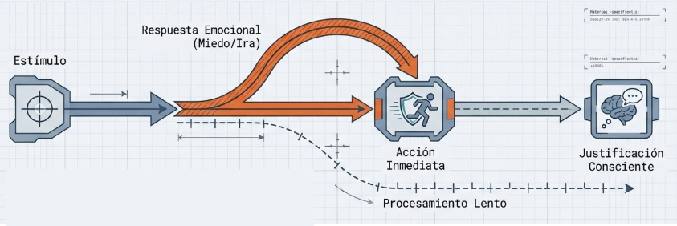
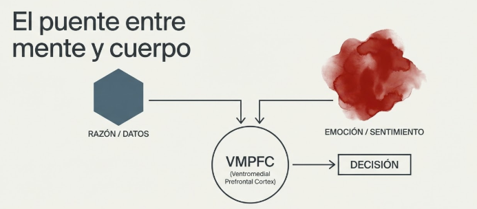
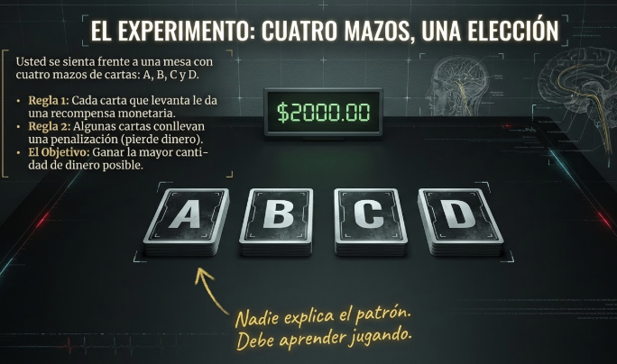
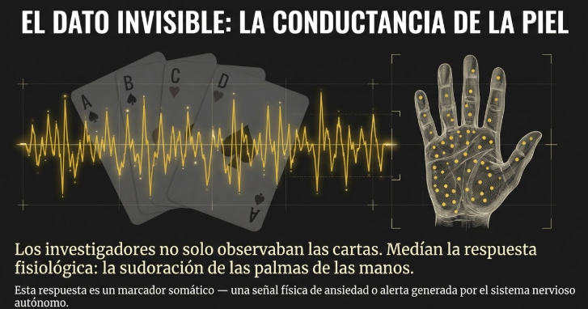
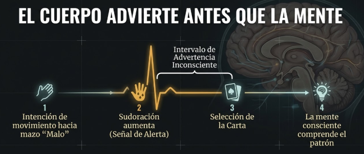
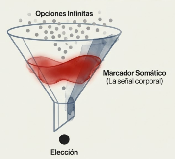

# Tema 2: Las emociones como sistema de guia de las decisiones

#imagen  Esfera geodésica con fluido orgánico atravesándola, representando la integración de estructura racional y emoción.

- [Por que este tema es necesario](#por-que-este-tema-es-necesario)
	- [El marcador somatico](#el-marcador-somatico)
- [1. Las emociones como sistema de guia](#1-las-emociones-como-sistema-de-guia)
- [2. El caso Damasio: El marcador somático](#2-el-caso-damasio-el-marcador-somático)
	- [2.1 El Iowa Gambling Task](#21-el-iowa-gambling-task)
	- [2.2 La hipotesis del marcador somatico](#22-la-hipotesis-del-marcador-somatico)
- [3. Implicacion para el lider](#3-implicacion-para-el-lider)
- [Conexiones](#conexiones)
- [Referencias incluidas](#referencias-incluidas)
- [Material adicional del tema](#material-adicional-del-tema)
	- [Infografías del tema](#infografías-del-tema)

---
## Por que este tema es necesario

#### El marcador somatico

**Pregunta que responde:**
Las emociones me ayudan o me estorban para decidir bien?

Este tema rehabilita las emociones como sistema de guia esencial. Descubriras que sin acceso emocional, la razon pura es insuficiente para decidir.

---

## 1. Las emociones como sistema de guia

#imagen  Brújula con cerebro y corazón en su interior, metáfora de las emociones como sistema de guía.

Las emociones no son ruido que interfiere con la razon. Son un sistema de guia sofisticado:
Las emociones operan como un sistema de guía interno que orienta acciones, pensamientos y decisiones hacia la supervivencia y el bienestar. No son obstáculos para la razón; son información procesada a velocidades que el análisis consciente no puede igualar.

**Guía para la supervivencia.** Las emociones básicas —miedo, ira, placer— activan respuestas rápidas ante situaciones que amenazan o benefician. El miedo prepara la huida; la alegría impulsa el acercamiento a experiencias beneficiosas. El cuerpo actúa; la consciencia justifica después.

#grafica  Diagrama de flujo: estímulo → respuesta emocional rápida → acción inmediata → justificación consciente posterior.

**Evaluación instantánea del entorno.** Las emociones funcionan como una alarma que detecta riesgos y oportunidades sin necesidad de análisis racional detallado. Permiten interpretar si algo es positivo o negativo antes de que el pensamiento deliberado intervenga.

#grafica  Radar detectando riesgos y oportunidades, representando la evaluación instantánea del entorno.

**Facilitación de decisiones.** Las emociones influyen directamente en el proceso de toma de decisiones, guiando elecciones de manera más rápida que el pensamiento racional. Antonio Damasio y otros neurocientíficos han demostrado que las emociones son cruciales para decidir de forma efectiva[^1]: una persona sin acceso a sus emociones puede quedar atrapada en indecisión crónica.

#grafica  Diagrama "Lógica + Emoción": análisis de datos y evaluación de riesgos convergen con emoción para decisión efectiva.

**Conexión social.** Expresar emociones permite comunicarse y empatizar con otros. Esto refuerza vínculos sociales y facilita cooperación, empatía y cohesión grupal —aspectos esenciales para la supervivencia como especie.

#grafica  Red social interconectada con nodos de empatía, cooperación y vínculo.

**Mantenimiento del equilibrio interno.** A nivel biológico, las emociones ayudan a mantener la homeostasis: están vinculadas a la regulación de la frecuencia cardíaca, la respiración y la liberación de hormonas. Impulsan conductas que mantienen el equilibrio y permiten responder a las demandas internas y externas.

#grafica  Monitor de signos vitales (frecuencia cardíaca, respiración, hormonas) representando el mantenimiento del equilibrio interno.

---

## 2. El caso Damasio: El marcador somático

Antonio Damasio observó algo desconcertante en pacientes con daño en la corteza prefrontal ventromedial: podían razonar con lógica impecable, pero eran incapaces de tomar decisiones efectivas en la vida cotidiana[^2]. Esta región del cerebro integra emociones en el proceso de decisión. Sin ella, la razón pura resulta insuficiente.

#grafica  Cerebro con corteza prefrontal ventromedial (VMPFC) señalada en rojo.

#grafica  "El puente entre mente y cuerpo": razón/datos + emoción/sentimiento → VMPFC → decisión.

Estos pacientes:
- Razonan con logica impecable
- Puntuan normal en tests de inteligencia
- Conocen las reglas sociales
- **Pero no pueden decidir eficazmente**

#ejemplo  Tenedor con infinidad de criterios entrelazados ilustrando la parálisis decisoria sin marcadores somáticos.

Pasan horas decidiendo donde almorzar. Toman decisiones que arruinan sus vidas.

**La razon sin emocion esta incompleta.**

#### 2.1 El Iowa Gambling Task

#ejercicio  Iowa Gambling Task: cuatro mazos A, B, C, D con $2000 iniciales.
#ejercicio  "La trampa oculta en el diseño": mazos malos con ganancias grandes pero pérdida neta vs mazos buenos con beneficio neto.
#ejercicio  Comportamiento del cerebro saludable: exploración → castigo → evitación instintiva de mazos peligrosos.
#ejercicio  "El dato invisible": conductancia de la piel — sudoración de palmas como marcador somático anticipatorio.
#ejercicio  "El cuerpo advierte antes que la mente": secuencia intención → sudoración → selección → comprensión consciente.
#ejercicio  Caso pacientes VMPFC: intelecto intacto pero incapacidad de procesar señales emocionales.
#ejercicio  Gráfica comparativa cerebro saludable vs paciente VMPFC: los pacientes siguen eligiendo mazos malos pese a pérdidas.
#ejercicio  "Saber vs Sentir": intelecto comprende pero el cuerpo no alerta — la desconexión clave del experimento.
#ejemplo
Para demostrar esta hipótesis, Damasio diseñó el Iowa Gambling Task —un juego de apuestas con cuatro mazos de cartas[^3]. Cada carta permitía ganar o perder dinero. La trampa estaba en el diseño:

- **Dos mazos "buenos"**: ganancias pequeñas, pocas pérdidas. Beneficio neto a largo plazo.
- **Dos mazos "malos"**: ganancias grandes, pérdidas devastadoras. Pérdida neta a largo plazo.

Los participantes desconocían el patrón de cada mazo. Debían aprenderlo jugando.

Las personas con cerebros saludables comenzaban a evitar los mazos peligrosos después de algunas rondas, guiadas por una sensación de riesgo antes de elegir. Al medir sus respuestas fisiológicas —sudoración de las palmas—, los investigadores observaron que estas aumentaban antes de seleccionar de los mazos "malos". El cuerpo advertía antes de que la mente consciente comprendiera el patrón.

Los pacientes con daño en la corteza prefrontal ventromedial no mostraban estas respuestas anticipatorias. Comprendían intelectualmente que algunas opciones eran perjudiciales, pero seguían eligiendo los mazos con grandes pérdidas. Carecían de la señal emocional de advertencia.

Demostracion experimental de que el cuerpo "sabe" antes que la mente consciente.

#### 2.2 La hipotesis del marcador somatico

#grafica  Embudo: opciones infinitas filtradas por el marcador somático (señal corporal) hasta una elección.

Damasio propuso que las emociones crean "marcadores" fisiológicos que guían decisiones[^4]. Estos marcadores somáticos —respuestas emocionales físicas— actúan como señales que ayudan a evitar opciones riesgosas sin necesidad de analizar cada detalle racionalmente. Las emociones generan una intuición basada en experiencias pasadas que facilita decidir.

Este estudio demostró que las emociones no obstaculizan el razonamiento; son componentes esenciales para decidir de forma efectiva. Sin la guía emocional, las personas pueden quedar atrapadas en análisis interminables o hacer elecciones riesgosas. Damasio concluyó que emociones y razonamiento trabajan juntos para permitir una toma de decisiones adaptativa y saludable.

Las emociones crean "marcadores" fisiologicos que guian decisiones sin analisis racional detallado:

1. Una situacion activa recuerdos de situaciones similares
2. Esos recuerdos traen consigo el "marcador" emocional asociado
3. El marcador (sensacion corporal) guia hacia o aleja de la opcion
4. Todo esto ocurre antes del analisis consciente

**La intuicion tiene base neurobiologica.**

#grafica  Venn: lógica (genera opciones) ∩ emoción (permite selección) = "Inteligencia Real".

---

## 3. Implicacion para el lider

La "intuicion" no es:
- Magia
- Irracionalidad
- Adivinacion

La intuicion **es** informacion procesada corporalmente que la consciencia verbal no alcanza a articular.

Ignorar la intuicion es ignorar informacion legitima.

Dejarse llevar ciegamente por ella tampoco es sabio.

El lider consciente **integra** analisis e intuicion.

#grafica  Venn: análisis riguroso ∩ procesamiento somático = "Liderazgo Consciente".

---

## Conexiones

**Conexion con M1

M1 introdujo que las emociones marcan relevancia para la memoria.

M3 amplia: tambien marcan relevancia para la decision.

Los sesgos de M1 (aversion a la perdida, por ejemplo) operan a traves de marcadores somaticos.

**Conexion con M2

El marcador somatico opera a traves de la interocepcion (M2).

La insula integra estas senales con la cognicion.

Por eso entrenar la consciencia corporal (Body Scan) mejora el acceso a la intuicion.

**Conexion con el programa

- **M6:** Trabajara la metaconsciencia bajo presion, donde el acceso a los marcadores somaticos se dificulta
- **M7:** Usara el cuerpo como fuente de informacion etica (plantilla DURANTE)

---

## Referencias incluidas
[^1]: Antonio Damasio. Investigación sobre emociones y toma de decisiones.
[^2]: Antonio Damasio. Estudios con pacientes con daño en corteza prefrontal ventromedial.
[^3]: Iowa Gambling Task. Experimento diseñado por Antonio Damasio.
[^4]: Antonio Damasio. Hipótesis del Marcador Somático.

**Otras posibles referencias de interés
- Damasio, A. (1994). *Descartes' Error: Emotion, Reason, and the Human Brain.* Putnam.
- Bechara, A. et al. (1997). *Deciding advantageously before knowing the advantageous strategy.* Science.
- Bechara, A. & Damasio, A. (2005). *The somatic marker hypothesis: A neural theory of economic decision.* Games and Economic Behavior.

---

## Material adicional del tema #aux
### Infografías del tema 

