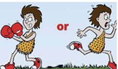

# La cadena automática de la reacción

## Del cuerpo a la acción: la cadena de la reacción

#teoria
La conexión entre cuerpo y emociones con nuestras decisiones y acciones

**Interocepción: Captar la Señal del Cuerpo**
La interocepción es un proceso fundamental que nos permite percibir las señales internas de nuestro cuerpo, como el ritmo cardíaco, la respiración, la temperatura y la tensión muscular. Estas señales interoceptivas actúan como indicadores tempranos de nuestro estado emocional.
Primero, captamos señales internas que nos indican nuestro estado físico. Por ejemplo, cuando sientes un "nudo en el estómago" antes de un evento social grande, estás percibiendo un cambio en el estado de tu cuerpo a través de la interocepción.

**Afecto de Base: Generar una Sensación General**
El cerebro no interpreta la información interoceptiva de forma aislada; en cambio, la combina con datos del entorno y de la memoria. Esto genera una sensación general o "afecto de base" que determina si, en un momento dado, nos sentimos bien, mal o neutrales. En este caso, el nudo en el estómago junto con la memoria de eventos similares (quizá experiencias pasadas de incomodidad social) hace que el cerebro genere un afecto de base de incomodidad o inquietud. Este afecto de base es una "impresión general" de cómo te sientes, y aquí surge el malestar emocional generalizado, pero aún sin definir una acción específica. Supongamos que sientes el ritmo cardíaco acelerado (interocepción). Si estás en un entorno seguro, como tu casa, el cerebro podría interpretar este estado físico como una respuesta a la emoción positiva de haber hecho ejercicio. Pero, si estás a punto de dar una presentación, el mismo síntoma se interpretaría como ansiedad.

**Valencia: Evaluar si el Afecto de Base es Positivo o Negativo**
La "valencia" del afecto se refiere a si la sensación general es positiva (placer) o negativa (displacer). Es una respuesta automática que nos empuja a acercarnos a lo que es bueno para nuestro bienestar y a evitar lo que podría dañarnos. Este proceso de placer/displacer es fundamental para generar emociones (como felicidad o miedo), que a su vez nos impulsan a actuar de manera que mejore nuestro bienestar o nos aleje del malestar.
La valencia negativa del afecto de base (incomodidad y displacer) motiva a que tomes alguna acción para reducir esa sensación incómoda. Puedes decidir evitar el evento social para reducir el malestar, o bien, prepararte emocionalmente, buscando sentirte más seguro (como respirando profundamente o recordando que puedes irte si no te sientes cómodo).

**Activación: Intensidad de la Respuesta**
La activación mide el nivel de energía o urgencia asociado a la emoción. Una activación alta impulsa una respuesta rápida y fuerte, mientras que una activación baja permite una respuesta más calmada. Ejemplo: Si tu activación es alta (tu corazón late rápidamente, estás en alerta), sentirás una urgencia más intensa por hacer algo para reducir el malestar. Podrías decidir practicar técnicas de respiración o incluso evitar el evento. Si la activación es baja, puedes decidir asistir, pero con cierta precaución y más control.

**Impulso hacia la Acción**
La combinación de valencia y activación guía tu decisión final. La valencia (displacer) te indica que necesitas reducir el malestar, mientras que el nivel de activación influye en qué tan urgente o intensa será tu respuesta.
Ejemplo: Si la activación es alta, podrías optar por evitar el evento. Si es baja, podrías ir al evento, pero preparándote mentalmente para manejar la incomodidad de forma calmada.

#imagen 
 imagen de radar representando captar señal cuerpo

#imagen 
 imagen de varios climas representando diferentes climas emocionales o afectos de base

#imagen 
 imagen de me gusta y no me gusta representado la valencia positiva o negativa de emociones
#imagen 
imagen de nivel de intensidad que refleja nivel de activación a la sensación
#imagen 
 imagen de lucha y huida que representa el impulso a la acción

#imagen
 Diagrama circular con cuatro elementos conectados por flechas en ciclo: "SENTIR" (arriba), "PENSAR" (derecha), "ACTUAR" (abajo-izquierda), y "PROCESO EMOCIONAL" (centro). Las flechas indican flujo bidireccional entre los elementos. Colores azul y blanco sobre fondo claro.

#explicacion
Resumen del Esquema Completo:
- Interocepción: Percepción de las señales internas del cuerpo (nudo en el estómago, ritmo cardíaco).
- Afecto de Base: Sensación general generada por el cerebro, combinando señales internas con el contexto (sensación de incomodidad).
- Valencia: Evaluación de la experiencia como positiva (placer) o negativa (displacer), que orienta hacia el bienestar.
- Activación: Nivel de energía o alerta que indica la intensidad de la necesidad de actuar (alta activación = respuesta más urgente).
- Impulso hacia la Acción: La valencia y la activación combinadas guían el tipo de acción que tomarás, desde una reacción rápida hasta una respuesta más moderada.

El afecto de base es la sensación general en el momento, mientras que la valencia es la evaluación de si esa sensación es buena o mala, lo cual impulsa la acción de buscar bienestar o evitar el malestar.

La interocepción actúa como un sistema de monitoreo constante que proporciona información crucial sobre nuestro estado fisiológico al cerebro. Esta información es esencial para la creación del afecto de base, el cual, a su vez, influye en nuestras emociones y, por lo tanto, en la toma de decisiones.

El afecto de base actúa como un filtro a través del cual percibimos el mundo y tomamos decisiones. Un afecto de base positivo tiende a promover un enfoque más optimista y exploratorio, mientras que un afecto de base negativo fomenta la precaución, la evitación y la toma de decisiones más conservadoras.

Importancia de la Conciencia del Afecto de Base:
- Comprender mejor nuestras reacciones: Al reconocer la conexión entre el cuerpo y las emociones, podemos comprender mejor nuestras reacciones ante diferentes situaciones y evitar respuestas impulsivas o desadaptativas.
- Tomar decisiones más informadas: Al ser conscientes del afecto de base, podemos evaluar con mayor precisión si nuestras decisiones están siendo influenciadas por emociones pasajeras o por una evaluación racional de la situación.
- Regular nuestras emociones: La conciencia del afecto de base nos permite emplear estrategias para modular nuestras emociones, como la revaloración, la meditación o técnicas de relajación, para promover un estado de bienestar.

1. Interocepción: El "Escaneo Interno" del Cuerpo

La interocepción es la capacidad de sentir señales internas del cuerpo, como el ritmo cardíaco o el estado del estómago. Por ejemplo, imagina que antes de dar una conferencia sientes un "nudo en el estómago". Este nudo es una señal que el cuerpo envía y tú lo percibes a través de la interocepción. Podemos entender la interocepción como un "radar interno" que constantemente monitorea tu cuerpo y te da información sobre tu estado físico.

2. Afecto de Base: El Clima Emocional del Momento

El afecto de base es la impresión general o "clima emocional" que tienes en un momento específico, una mezcla de señales físicas y recuerdos. Ese nudo en el estómago, combinado con experiencias previas de ansiedad en situaciones similares, puede hacer que sientas una incomodidad general. Es decir, el cerebro evalúa la señal del cuerpo en su contexto y genera una sensación emocional que puede ser incómoda o agradable. El afecto de base funciona como el "clima" emocional en el que te encuentras, así como el clima de un día puede influir en tu estado de ánimo sin que lo notes directamente.

3. Valencia: La Evaluación Positiva o Negativa

La valencia es la evaluación que hace el cerebro sobre el afecto de base: si es positivo (placentero) o negativo (desagradable). Si el afecto de base es el nudo en el estómago que asociamos con incomodidad, la valencia sería negativa, indicando al cerebro que "esto no es agradable" y activando una necesidad de reducir la incomodidad. La valencia actúa como un "filtro de evaluación" que le dice a tu mente si esa sensación general es algo a lo que deseas acercarte o algo de lo que quieres alejarte.

4. Activación: La Intensidad de la Sensación

La activación mide la energía o urgencia de la experiencia. Puede ser alta, como un impulso fuerte de actuar, o baja, lo que indica que la necesidad de responder es menor. Si sientes ansiedad intensa antes de un evento importante, la activación es alta, y tu impulso de actuar (tal vez evitar la situación) será más fuerte que si la ansiedad fuera leve. La activación funciona como el "volumen" de la experiencia: alta activación suena fuerte y pide atención urgente; baja activación es más silenciosa y menos urgente.

5. Impulso hacia la Acción: Decidir Basado en Sentimientos

La combinación de valencia y activación guía tus acciones. Una experiencia negativa y de alta activación puede llevar a evitar la situación o buscar calma. Si decides no ir al evento porque la ansiedad es intensa (alta activación y valencia negativa), has actuado para evitar el malestar. Alternativamente, puedes preparar estrategias para calmarte y enfrentarlo, equilibrando la respuesta. Este impulso es como un "sistema de navegación emocional" que te guía hacia acciones que te acercan al bienestar o te alejan del malestar.

---

## Emoción y atención: el filtro de la relevancia

#teoria
La Interconexión entre Emoción y Atención

Las emociones actúan como un filtro, determinando qué información capta nuestra atención y cómo la procesamos.

Las emociones fuertes, como el miedo o la ira, capturan la atención de manera automática y priorizan la información relacionada con la fuente de la emoción, ignorando otros estímulos. Por ejemplo, el miedo nos enfoca intensamente en cualquier posible amenaza, disminuyendo la capacidad de atención hacia otros detalles no relacionados.

La amígdala, una estructura clave en el cerebro, está involucrada en la detección de estímulos emocionales y en la orientación de la atención hacia estos estímulos. La amígdala tiene un rol crítico en captar información emocionalmente relevante antes de que tengamos plena conciencia de ella. Por ejemplo, un sonido repentino o una cara con una expresión de miedo captan nuestra atención automáticamente, ya que la amígdala activa una respuesta rápida de alerta, redirigiendo nuestra atención hacia el posible peligro. Este proceso es esencial para la supervivencia y muestra cómo la atención está naturalmente predispuesta a reaccionar ante estímulos emocionales, especialmente aquellos que pueden implicar amenazas o recompensas. Damasio argumenta que la interconexión entre sistemas emocionales y atencionales permite que el cerebro responda eficientemente a cambios en el entorno, asegurando una respuesta rápida y efectiva.

Las emociones determinan qué información consideramos relevante en un momento dado. Si estamos aburridos, ansiosos o preocupados por algo ajeno al tema en cuestión, nuestra mente divagará y no retendremos la información que se nos presenta. Por ejemplo, un estudiante preocupado por un examen próximo tendrá dificultades para concentrarse en una lección sobre historia del arte.

Las emociones negativas, como el miedo o la ansiedad, pueden estrechar nuestro foco de atención, dirigiéndolo hacia la fuente de la amenaza. Esta respuesta, aunque útil en situaciones de peligro, puede ser contraproducente en otros contextos, impidiéndonos percibir información importante o generando un sesgo en nuestra interpretación de la realidad.

Por otro lado, las emociones positivas, como la alegría, la curiosidad y el entusiasmo, amplían nuestro foco de atención, permitiéndonos explorar el entorno con mayor amplitud y receptividad.

#imagen
 Fotografía de una mujer joven con expresión de miedo/sorpresa, con las manos levantadas en gesto defensivo, mirando hacia una araña. Ilustra la respuesta emocional automática ante estímulos amenazantes.

#imagen
 Diagrama educativo titulado "AMYGDALA FUNCTION" mostrando el proceso de respuesta al miedo. Incluye ilustración de cerebro con tálamo visual, córtex visual y amígdala señalados, con flechas indicando el flujo de información desde un estímulo de miedo (araña) hasta la respuesta. Etiquetas: "VISUAL THALAMUS", "VISUAL CORTEX", "AMYGDALA", "FEARFUL INPUT".

#video
 Fotograma de vídeo mostrando dos hombres caminando por una calle urbana, uno con camisa blanca y otro con chaleco oscuro y pañuelo verde, aparentemente en conversación. Contexto relacionado con la interconexión entre emoción y atención.

---

## La mente automática: hábitos y patrones de reacción

#teoria
La cadena de hábitos y patrones automáticos

**1. La Mente Automática y su Enfoque en la Supervivencia:**
La mente automática actúa como un sistema de protección orientado a la supervivencia. Su función principal es reaccionar rápidamente a estímulos que percibe como amenazas o beneficios para asegurar que podamos responder a nuestro entorno de forma instantánea. Este sistema opera principalmente desde estructuras cerebrales primitivas, como la amígdala, que reaccionan de inmediato a señales de peligro, activando respuestas automáticas que están diseñadas para actuar sin intervención consciente, garantizando una reacción rápida que, aunque útil para la supervivencia, puede llevarnos a repetir ciertos patrones reactivos sin cuestionarlos.

**2. Creación de Patrones y Hábitos de Reacción:**
La mente automática establece conexiones rápidas y repetitivas entre las sensaciones (por ejemplo, tensión muscular), emociones (como miedo o ansiedad) y pensamientos (como "debo escapar" o "esto es peligroso"). Con el tiempo, estas reacciones inmediatas se vuelven patrones automáticos y hábitos, porque el cerebro, en su esfuerzo por ahorrar energía, almacena las respuestas que se repiten con frecuencia en la memoria implícita. Estas asociaciones rápidas e inconscientes fortalecen los "circuitos de hábito" en el cerebro. Al operar en "modo automático", el cerebro reacciona sin la intervención de la mente consciente, generando una respuesta inmediata que se activa una y otra vez en situaciones similares.

**3. El Refuerzo de Reacciones Automáticas: Ciclo de Perpetuación:**
Con cada repetición, los patrones automáticos se consolidan y se fortalecen, formando un ciclo de perpetuación que hace que estas respuestas sean cada vez más rápidas y difíciles de interrumpir. Al no ser conscientes de estos patrones, la mente automática sigue respondiendo de la misma forma, reforzando la asociación entre ciertos estímulos y las respuestas de acción. El cerebro anticipa futuras experiencias basándose en predicciones de patrones pasados, creando una "autopista de hábitos" en la que las emociones, pensamientos y sensaciones se activan de forma automática y rápida. Esto perpetúa las reacciones sin que seamos conscientes de cómo se originan o se fortalecen en cada repetición.

#imagen
 Diagrama de ciclo con cuatro elementos conectados por flechas en forma circular: "Marcos de referencia personales" → "Como veo la realidad" → "Como reacciono a los hechos" → "Modelos y patrones de conducta" → (vuelve al inicio). Flechas en colores naranja y azul sobre fondo blanco.

---

## Cómo las emociones influyen en nuestras decisiones

#teoria
Cómo las Emociones Influyen en Nuestras Decisiones

Las emociones actúan como un filtro a través del cual percibimos el mundo y evaluamos las opciones, lo que nos lleva a tomar decisiones distintas según nuestro estado emocional, incluso si los hechos objetivos son los mismos.

- Cuando experimentamos **emociones positivas**, como la confianza o el optimismo, tendemos a ser más impulsivos y a confiar en nuestra intuición. Esta actitud puede ser beneficiosa en situaciones que requieren rapidez o apoyo emocional, pero puede llevar a errores en decisiones que requieren un análisis cuidadoso, como al completar una declaración de impuestos.

- Por otro lado, las **emociones negativas**, como la ansiedad, la ira o la tristeza, nos hacen más cautelosos y propensos a analizar en profundidad las posibles consecuencias. Si bien esto puede resultar útil en situaciones de riesgo, también puede llevarnos a ser excesivamente pesimistas o a evitar tomar decisiones importantes. *En un estudio que simulaba el comercio de divisas, los participantes que experimentaban tristeza tomaron decisiones más precisas y realistas que aquellos que se sentían felices. La tristeza, al promover un análisis más cuidadoso y una evaluación más prudente de los riesgos, condujo a mejores resultados.*

- Importancia de las **emociones incidentales**, es decir, aquellas que no están directamente relacionadas con la decisión que debemos tomar, pero que pueden influir en nuestro juicio sin que nos demos cuenta. Ejemplo: Si tenemos una discusión con un compañero de trabajo por la mañana, esa experiencia podría generar un estado de ánimo negativo que luego influya en nuestra forma de evaluar una propuesta de un cliente, llevándonos a ser más críticos o a rechazarla sin una evaluación objetiva. *Funcionarios de la libertad condicional y el cansancio: Las decisiones de los funcionarios de la junta de libertad condicional se ven influenciadas por su estado de fatiga, un indicador de un afecto de base negativo. A medida que avanza la jornada, tienden a negar la libertad condicional con mayor frecuencia, a pesar de que los casos no difieren significativamente en cuanto a su mérito.*

#imagen
 Diagrama del triángulo de la atención con tres vértices etiquetados: "Pensamientos" (arriba, círculo azul), "Sensaciones" (abajo izquierda, círculo gris), "Emociones" (abajo derecha, círculo rojo). En el centro, una esfera grande roja etiquetada "Emoción" representa el foco del contenido actual.
#imagen 
Ilustración de un hombre ante una bifurcación que lleva a comida sana o comida basura como ejemplo de cómo la emoción a veces nos lleva a decisiones emocionales 

#explicacion
Las emociones actúan como un filtro a través del cual percibimos el mundo y evaluamos las opciones, lo que nos lleva a tomar decisiones distintas según nuestro estado emocional, incluso si los hechos objetivos son los mismos.

El autor explica que cuando experimentamos emociones positivas, como la confianza o el optimismo, tendemos a ser más impulsivos y a confiar en nuestra intuición. Esta actitud puede ser beneficiosa en situaciones que requieren rapidez o apoyo emocional, pero puede llevar a errores en decisiones que requieren un análisis cuidadoso, como al completar una declaración de impuestos.

Por otro lado, las emociones negativas, como la ansiedad, la ira o la tristeza, nos hacen más cautelosos y propensos a analizar en profundidad las posibles consecuencias. Si bien esto puede resultar útil en situaciones de riesgo, también puede llevarnos a ser excesivamente pesimistas o a evitar tomar decisiones importantes.

El libro también destaca que la influencia de las emociones en la toma de decisiones a menudo ocurre de forma inconsciente. Las emociones incidentales, es decir, aquellas que no están directamente relacionadas con la situación en la que nos encontramos, pueden afectar nuestro juicio sin que nos demos cuenta. Por ejemplo, una discusión con nuestros hijos puede generar frustración que luego influya en nuestra forma de conducir al trabajo o de interactuar con nuestros compañeros, sin que seamos conscientes de esa conexión.

Ejemplos:

1. Ansiedad y toma de decisiones bajo presión:
   - El caso del oficial Petrov: Durante la Guerra Fría, el oficial Stanislav Petrov recibió una alerta de un posible ataque nuclear de Estados Unidos. A pesar de la presión y la incertidumbre, Petrov confió en su intuición y decidió no tomar represalias, evitando una posible catástrofe.
   - El vuelo de prueba del Enterprise: Los pilotos, bajo una intensa presión, decidieron aterrizar antes de lo previsto debido a una preocupación por el combustible. Sin embargo, esta decisión resultó ser un error, ya que el avión tenía suficiente combustible para completar el vuelo. La ansiedad sesgó su juicio.

2. Afecto de base y decisiones cotidianas:
   - Las abejas agitadas y la elección de alimentos: Un estudio demostró que las abejas agitadas tendían a rechazar una solución de sacarosa, interpretando un olor ambiguo como una señal de peligro.
   - Funcionarios de la libertad condicional y el cansancio: A medida que avanza la jornada, tienden a negar la libertad condicional con mayor frecuencia debido a la fatiga.

3. Emociones específicas y toma de decisiones:
   - El caso de Jordan Cardella: Un joven despechado por una ruptura amorosa decidió fingir un accidente para recuperar a su exnovia, ilustrando cómo el estado emocional puede llevar a decisiones irracionales.
   - La tristeza y la precisión: En un estudio de comercio de divisas, los participantes tristes tomaron decisiones más precisas y realistas.

4. La influencia de la emoción en la intuición:
   - Agentes de bolsa exitosos reconocen la importancia de la emoción en la toma de decisiones intuitivas. Su experiencia previa se traduce en "instintos viscerales" que les permiten tomar decisiones rápidas y efectivas.

---

## Cómo los pensamientos moldean las emociones

#teoria
La Influencia de los Pensamientos en las Emociones

Si bien las emociones pueden influir en nuestros pensamientos, también es cierto que nuestros pensamientos tienen el poder de moldear y modificar nuestras emociones.

- **Reestructuración Cognitiva: Cambiando el Impacto del Pensamiento en la Emoción:** La reestructuración cognitiva es el proceso de observar y modificar patrones de pensamiento que intensifican o generan emociones negativas. En vez de permitir que la emoción nos arrastre a una reacción inmediata, esta técnica ayuda a desafiar y reformular las ideas que disparan la emoción, generando una perspectiva emocional más equilibrada.

- **Etiquetado de Emociones: Nombrar para Modular la Reacción Emocional:** El etiquetado emocional es el proceso de identificar y nombrar nuestras emociones de manera precisa. Según investigaciones, el acto de poner un nombre a nuestras emociones ayuda a reducir su intensidad y evita que reaccionemos impulsivamente. Etiquetar una emoción facilita la autoconciencia y permite observar la emoción sin dejarnos llevar por ella.

- **Flexibilidad Cognitiva y Espacio entre Emoción y Acción: La Pausa para Reflexionar:** La flexibilidad cognitiva es la capacidad de adoptar diferentes perspectivas y adaptar nuestra interpretación de las emociones en función del contexto. Junto con la creación de un "espacio" entre la emoción y la acción, esta habilidad permite que la emoción no desencadene una respuesta inmediata, sino que abra la oportunidad de decidir la mejor manera de actuar.

- **Reinterpretación de las Emociones: Cambiando el Significado para Modificar la Respuesta:** La reinterpretación emocional consiste en cambiar la forma en que interpretamos la fuente de una emoción. Este proceso permite transformar una emoción intensa en una menos negativa o incluso positiva, lo cual impacta directamente en las acciones que tomamos.

#imagen
 Ilustración artística de una cabeza humana de perfil con múltiples rostros superpuestos emergiendo de ella, representando la multiplicidad de pensamientos y estados mentales. Estilo de dibujo lineal en blanco y negro.

#explicacion
1. Reestructuración Cognitiva: Cambiando el Impacto del Pensamiento en la Emoción
Ejemplo: Imaginemos que alguien recibe un correo ambiguo de su jefe y, sin pensarlo mucho, lo interpreta como desaprobación o enojo. Esta interpretación inicial puede generar ansiedad o preocupación. Con la reestructuración cognitiva, la persona puede desafiar este pensamiento inicial, considerando otras posibilidades, como que su jefe esté ocupado o simplemente haya escrito un mensaje breve. Al cambiar el pensamiento, la emoción de ansiedad se reduce, promoviendo una reacción más calmada y lógica.

2. Etiquetado de Emociones: Nombrar para Modular la Reacción Emocional
Ejemplo: Ante una crítica constructiva, una persona puede sentir una mezcla de emociones, como vergüenza y enojo. Etiquetar la emoción ("Estoy sintiendo enojo y vergüenza") activa la corteza prefrontal, lo que ayuda a reducir la reacción inmediata y permite reflexionar sobre la situación sin actuar de manera defensiva o impulsiva.

3. Flexibilidad Cognitiva y Espacio entre Emoción y Acción: La Pausa para Reflexionar
Ejemplo: Imaginemos que alguien se siente herido después de un comentario de un compañero de trabajo. La reacción inicial podría ser responder de forma defensiva o resentida. Sin embargo, al practicar la flexibilidad cognitiva, esta persona podría darse un espacio para reinterpretar la situación: "Quizá no fue personal, solo expresó una opinión diferente". Este cambio de perspectiva reduce la emoción de enojo y permite una respuesta más mesurada y diplomática.

4. Reinterpretación de las Emociones: Cambiando el Significado para Modificar la Respuesta
Ejemplo: Una persona siente ansiedad antes de una presentación. En lugar de interpretar la ansiedad como un signo de que algo saldrá mal, puede reinterpretarla como un reflejo de su preparación y deseo de dar lo mejor de sí. Este cambio de significado reduce el impacto negativo de la emoción y convierte la ansiedad en energía y motivación.

Ejemplo Integral: Aplicando el Proceso Completo
Situación: Una persona debe liderar una reunión importante y siente un intenso nerviosismo, acompañado del pensamiento "No estoy suficientemente preparado; voy a fallar".
- Etiquetado de la Emoción: La persona identifica la emoción como ansiedad y nerviosismo. Al nombrarla, empieza a reducir su intensidad, dándose un primer momento de control.
- Flexibilidad Cognitiva y Espacio entre Emoción y Acción: En lugar de reaccionar impulsivamente (cancelar o postergar la reunión), la persona se da un momento para observar y cuestionar el pensamiento inicial, considerándolo desde otra perspectiva.
- Reinterpretación de la Ansiedad: Al analizar la situación, la persona reinterpreta la ansiedad como una señal de que le importa hacer un buen trabajo. Este cambio de enfoque transforma la emoción en una motivación positiva.
- Resultado: La persona se siente más tranquila y enfocada, lista para llevar adelante la reunión con confianza en lugar de paralizarse por la ansiedad.
