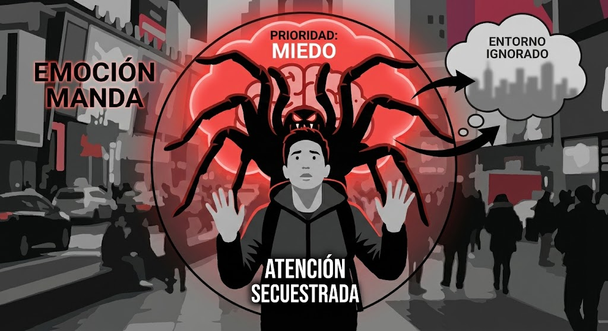
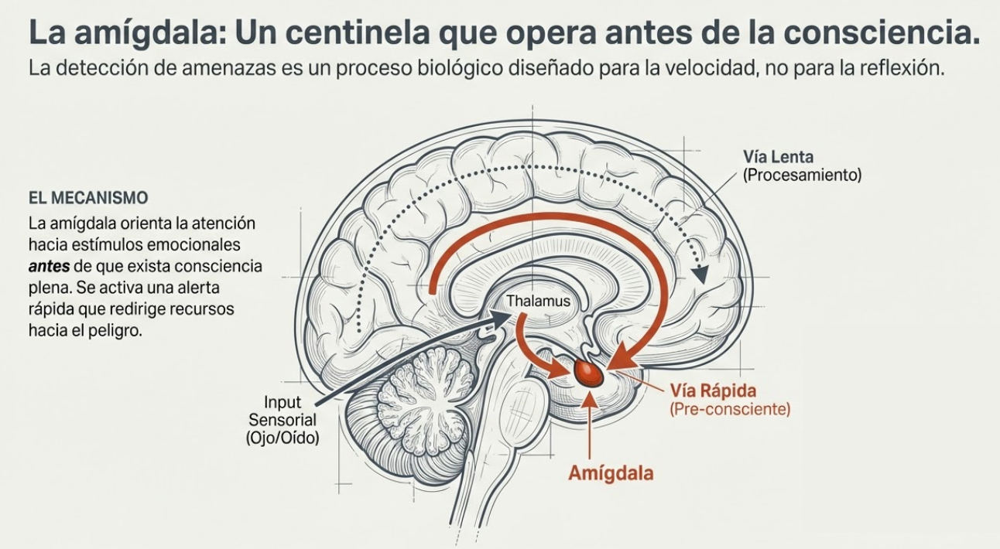
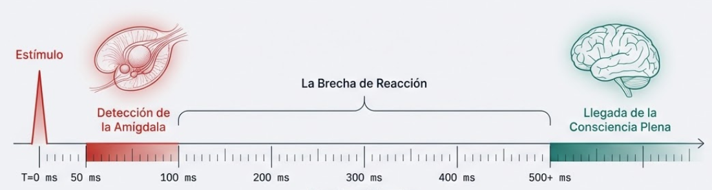
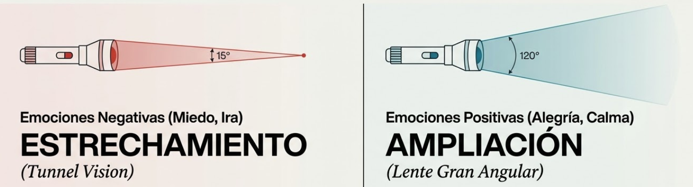
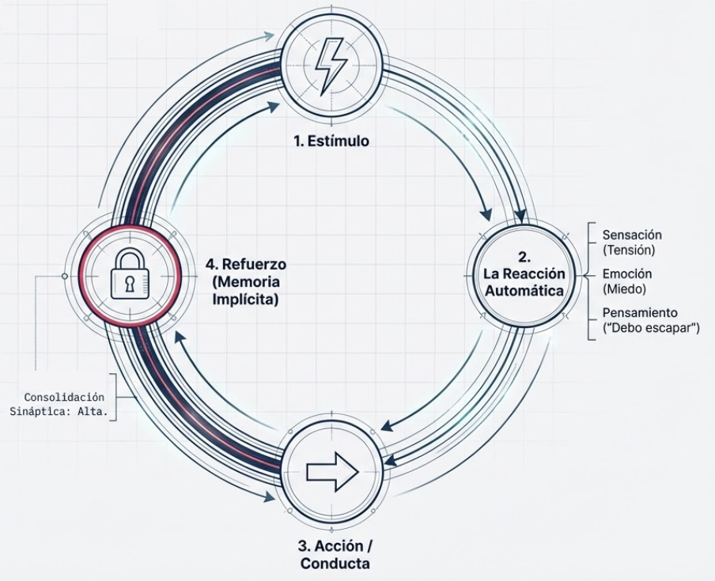
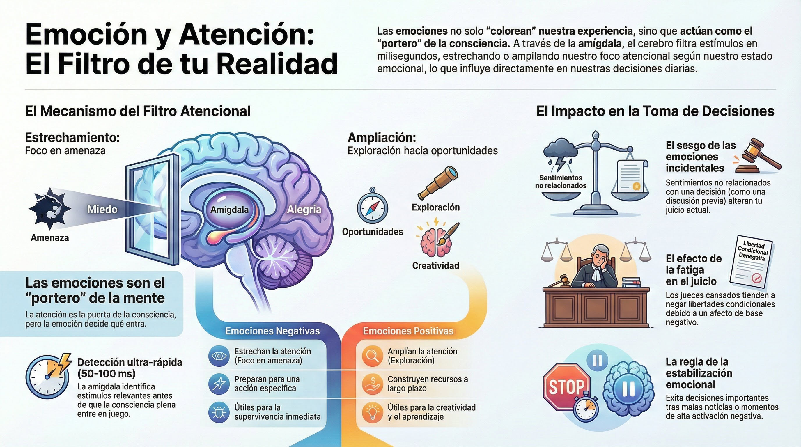

# Tema 4: Emoción y atención: el filtro de la relevancia

- [Por que este tema es necesario](#por-que-este-tema-es-necesario)
- [El filtro de la relevancia](#el-filtro-de-la-relevancia)
- [1. Las emociones como filtro atencional](#1-las-emociones-como-filtro-atencional)
- [2. La amigdala como detector](#2-la-amigdala-como-detector)
- [3. Estrechamiento vs. ampliacion de la atención](#3-estrechamiento-vs-ampliacion-de-la-atención)
- [4. La mente automática: hábitos y patrones de reacción](#4-la-mente-automática-hábitos-y-patrones-de-reacción)
- [Conexion con M1](#conexion-con-m1)
- [Conexion con M6](#conexion-con-m6)
- [Dimension experiencial](#dimension-experiencial)
- [Referencias incluidas](#referencias-incluidas)
- [Material adicional del tema](#material-adicional-del-tema)
	- [Infografías del tema](#infografías-del-tema)

## Por que este tema es necesario

## El filtro de la relevancia

**Pregunta que responde:**
Por que cuando estoy ansioso solo veo amenazas, y cuando estoy contento veo oportunidades?

Este tema conecta la cadena emocional (T3) con la atencion (M1). Descubriras que las emociones no solo colorean la experiencia; **determinan que informacion llega siquiera a la consciencia**.

Esto tiene implicaciones directas para la toma de decisiones.

#grafica  Ojo con lente emocional (miedo/ansiedad) que enfoca amenazas y difumina oportunidades y soluciones.

---

## 1. Las emociones como filtro atencional

Las emociones determinan:
- **Que capta la atencion** (hacia donde miras)
- **Como se procesa** (que significado das)

Las emociones actúan como filtro, determinando qué capta la atención y cómo se procesa. Las emociones fuertes —miedo, ira— capturan la atención de manera automática y priorizan la información relacionada con la fuente de la emoción, ignorando otros estímulos. El miedo genera enfoque intenso hacia cualquier posible amenaza, disminuyendo la capacidad de atención hacia otros detalles.

Recuerda M1: hay atencion de abajo-arriba (capturada) y atencion de arriba-abajo (dirigida). Las emociones operan sobre la primera.

#imagen  "Emoción Manda": persona con araña gigante (miedo) capturando toda la atención mientras el entorno es ignorado.

#grafica  Entorno caótico → filtro emocional (función 1: foco, función 2: significado) → percepción consciente.

---

## 2. La amigdala como detector

La amigdala orienta la atencion hacia estimulos emocionales **antes de que haya consciencia plena**. Un sonido repentino o una cara con expresión de miedo captan la atención automáticamente: la amígdala activa una respuesta rápida de alerta, redirigiendo los recursos atencionales hacia el posible peligro

Este proceso es esencial para la supervivencia y muestra cómo la atención está naturalmente predispuesta a reaccionar ante estímulos emocionales, especialmente aquellos que pueden implicar amenazas o recompensas. Damasio argumenta que esta interconexión entre sistemas emocionales y atencionales permite que el cerebro responda eficientemente a cambios en el entorno[^1].
1. Estimulo emocionalmente relevante aparece
2. Amigdala detecta (50-100 milisegundos)
3. Atencion se orienta hacia el estimulo
4. Consciencia plena llega despues

#ppt  Slide "La amígdala: un centinela que opera antes de la consciencia" con vía rápida y vía lenta.

#grafica  Timeline: estímulo (T=0) → detección amígdala (50ms) → brecha de reacción → consciencia plena (500+ms).

---

## 3. Estrechamiento vs. ampliacion de la atención

#grafica  Lentes comparativas: emociones negativas = estrechamiento (tunnel vision 15°) vs positivas = ampliación (gran angular 120°).

Las emociones afectan el ancho del foco atencional:

**Emociones negativas: estrechamiento

- El foco se reduce
- Atencion concentrada en la amenaza
- Util para sobrevivir
- Contraproducente para pensar creativamente

**Cuando estas ansioso, solo ves amenazas.**

**Emociones positivas: ampliacion

- El foco se expande
- Atencion abierta a multiples estimulos
- Exploracion, creatividad
- Receptividad a nueva informacion

**Cuando estas contento, ves oportunidades.**

#video Fotograma de vídeo mostrando dos hombres caminando por una calle urbana, uno con camisa blanca y otro con chaleco oscuro y pañuelo verde, aparentemente en conversación. Contexto relacionado con la interconexión entre emoción y atención.

---

## 4. La mente automática: hábitos y patrones de reacción

Un aspecto particular de esta interconexión entre emoción y atención es cómo se consolidan los patrones automáticos de respuesta.

**La mente automática y su enfoque en la supervivencia

La mente automática actúa como sistema de protección orientado a la supervivencia. Su función principal es reaccionar rápidamente a estímulos que percibe como amenazas o beneficios. Este sistema opera principalmente desde estructuras cerebrales primitivas, como la amígdala, que reaccionan de inmediato a señales de peligro. Las respuestas automáticas están diseñadas para actuar sin intervención consciente: garantizan reacción rápida, pero pueden llevar a repetir patrones reactivos sin cuestionarlos.

**Creación de patrones y hábitos de reacción

La mente automática establece conexiones rápidas y repetitivas entre sensaciones (tensión muscular), emociones (miedo, ansiedad) y pensamientos ("debo escapar", "esto es peligroso"). Con el tiempo, estas reacciones inmediatas se vuelven patrones automáticos. El cerebro, en su esfuerzo por ahorrar energía, almacena las respuestas que se repiten con frecuencia en la memoria implícita.

Estas asociaciones rápidas e inconscientes fortalecen los circuitos de hábito en el cerebro. Al operar en modo automático, el cerebro reacciona sin intervención de la mente consciente, generando una respuesta inmediata que se activa una y otra vez en situaciones similares.

**El refuerzo de reacciones automáticas: ciclo de perpetuación

Con cada repetición, los patrones automáticos se consolidan y fortalecen, formando un ciclo de perpetuación que hace que estas respuestas sean cada vez más rápidas y difíciles de interrumpir. Al no ser conscientes de estos patrones, la mente automática sigue respondiendo de la misma forma, reforzando la asociación entre ciertos estímulos y las respuestas de acción.

El cerebro anticipa futuras experiencias basándose en predicciones de patrones pasados, creando una autopista de hábitos en la que emociones, pensamientos y sensaciones se activan de forma automática. Esto perpetúa las reacciones sin que haya consciencia de cómo se originan o se fortalecen en cada repetición.

#grafica  Ciclo: estímulo → reacción automática → acción/conducta → refuerzo (memoria implícita).

#grafica  Circuito neural en wireframe con autopista roja iluminada representando la consolidación sináptica de hábitos.

---

## Conexiones

**Conexion con M1

M1 introdujo la atencion como "puerta de la consciencia".

M3 especifica: **las emociones controlan esa puerta**.

Deciden que pasa y que no pasa.

| M1 | M3 |
|----|----|
| La atencion es la puerta | Las emociones son el portero |
| Lo que no atiendas no existe | Lo que tu emocion filtre no llegara |
**Conexion con M6

Los "secuestradores de la atencion" de M6 operan a traves de este mecanismo emocional.

Bajo presion (alta activacion negativa), el foco se estrecha dramaticamente. M6 ensenara a recuperar amplitud.

---

## Dimension experiencial #insight 

Reflexiona:

- Has tomado una decision importante en un mal dia y luego la viste diferente?
- Que estado emocional incidental estaba operando?
- Notas como cambia tu percepcion de una situacion segun tu estado de animo?

El momento del dia, el estado colectivo del equipo, la carga emocional residual de reuniones previas —todo influye en las decisiones.

**Implicaciones practicas:**

- Decisiones importantes: no justo despues de malas noticias
- Reuniones largas: el estado del equipo se deteriora
- Viernes tarde: diferente de lunes manana
- Post-conflicto: no decidir hasta que el estado se estabilice

El lider consciente considera el estado emocional como variable de decision.

---

## Referencias incluidas
[^1]: Antonio Damasio. Investigación sobre sistemas emocionales y atencionales.
[^2]: Estudio sobre comercio de divisas y estado emocional.
[^3]: Estudio sobre decisiones de libertad condicional y fatiga.
[^4]: Estudio sobre abejas y afecto de base.

**Otras posibles referencias de interés
- Vuilleumier, P. (2005). *How brains beware: Neural mechanisms of emotional attention.* Trends in Cognitive Sciences.
- Fredrickson, B.L. (2001). *The role of positive emotions in positive psychology.* American Psychologist.
- Lerner, J.S. et al. (2015). *Emotion and decision making.* Annual Review of Psychology.

## Material adicional del tema #aux
### Infografías del tema 

#infografia  Infografía "Emoción y Atención: El Filtro de tu Realidad".