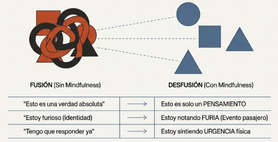
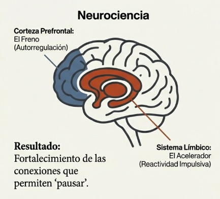

# Tema 6: Mindfulness para generar espacio

- [Por que este tema es necesario](#por-que-este-tema-es-necesario)
	- [Entre estimulo y respuesta](#entre-estimulo-y-respuesta)
- [1. Generar espacio de respuesta](#1-generar-espacio-de-respuesta)
- [2. Darse cuenta de los eventos mentales](#2-darse-cuenta-de-los-eventos-mentales)
- [3. Observar el flujo de relaciones](#3-observar-el-flujo-de-relaciones)
- [4. El mecanismo neural](#4-el-mecanismo-neural)
- [La practica especifica de M3](#la-practica-especifica-de-m3)
- [Conexiones](#conexiones)
- [Referencias incluidas](#referencias-incluidas)
- [Material adicional del tema](#material-adicional-del-tema)
	- [Infografías del tema](#infografías-del-tema)

---

## Por que este tema es necesario

#### Entre estimulo y respuesta

**Pregunta que responde:**
Como creo espacio entre lo que siento y lo que hago?

Este tema cierra el arco del modulo: despues de entender la cadena automatica (T3), el filtro atencional (T4) y la bidireccionalidad (T5), ahora recibes la herramienta central para intervenir.

**El mindfulness contrarresta la tendencia al modo automático** promoviendo un estado de observación consciente: detenerse, notar lo que surge, elegir cómo responder.

---

## 1. Generar espacio de respuesta
#grafica  Dos círculos (estímulo y respuesta) con espacio intermedio: modo automático (flecha directa) vs espacio de respuesta (pausa mindful).
El mindfulness crea una pausa entre emocion/sensacion y accion. El mindfulness crea un "espacio de respuesta" entre la emoción o sensación física y la acción. Este espacio interrumpe la cadena automática. A nivel neural, el mindfulness activa la corteza prefrontal —clave para la autorregulación— y disminuye la reactividad impulsiva del sistema límbico, donde operan las respuestas automáticas. El resultado: observar la emoción o sensación sin actuar de inmediato.

**A nivel neural:**
- Activa la corteza prefrontal
- Reduce la reactividad limbica
- Fortalece las conexiones que permiten "pausar"

**En la experiencia:**
- Notas el impulso antes de actuar
- Tienes un momento para elegir
- La respuesta automatica no es la unica opcion

#ejemplo
Alguien recibe una crítica en público y siente enojo. En modo automático, la respuesta sería defensiva o agresiva. Con mindfulness, nota el enojo sin responder de inmediato. Ese espacio permite decidir cómo actuar en lugar de reaccionar por impulso.

---

## 2. Darse cuenta de los eventos mentales

La mente automática procesa pensamientos, emociones y sensaciones como un conjunto indiferenciado. Mindfulness permite observar los eventos mentales mientras emergen y reconocer si se trata de un pensamiento, una emoción o una sensación física. Esta distinción consciente permite separar y analizar cada elemento en lugar de reaccionar impulsivamente.

#ejemplo
Antes de una reunión importante, aparece el nerviosismo y la mente genera el pensamiento "Voy a fallar". Sin mindfulness, ese pensamiento se convierte automáticamente en ansiedad y produce síntomas físicos —tensión muscular, respiración superficial. Con mindfulness, es posible identificar: "esto es un pensamiento de miedo" o "esto es tensión en los hombros". Ver cada elemento por separado evita que se fusionen en una emoción dominante.

La clave es observar pensamientos, emociones y sensaciones como **eventos separados**, no como un todo indiferenciado.

| Sin mindfulness | Con mindfulness |
|-----------------|-----------------|
| "Esto es verdad" | "Esto es un pensamiento" |
| "Estoy furioso" | "Estoy notando furia" |
| "Tengo que responder ya" | "Estoy sintiendo urgencia" |
#grafica  Fusión (sin mindfulness): pensamientos=verdad, vs desfusión (con mindfulness): pensamientos=eventos observables.
La diferencia parece sutil. Es transformadora.

---

## 3. Observar el flujo de relaciones

La mente automática establece cadenas reactivas entre pensamientos, emociones y sensaciones físicas, donde un elemento intensifica al siguiente sin intervención consciente. Mindfulness permite observar esta cadena: cómo los pensamientos activan emociones, cómo las emociones generan sensaciones físicas, cómo todo el proceso ocurre de manera automática. Al notar estas relaciones, es posible tomar distancia crítica y no identificarse con la cadena de reacciones.

Con practica, puedes ver como se encadenan los eventos mentales:

1. Surge un pensamiento
2. Activa una emocion
3. La emocion genera sensacion corporal
4. La sensacion impulsa hacia accion

**Ver la cadena completa permite no identificarse con ella.**

No eres el pensamiento. No eres la emocion. Eres quien observa.

#grafica  Ciclo pensamiento→emoción→sensación→acción con posición de observador. "No eres el pensamiento, eres quien observa."

#ejemplo
Un compañero hace una crítica y aparece un nudo en el estómago. En modo automático, surgen pensamientos de autocrítica ("No soy bueno en esto") que intensifican la ansiedad y el malestar físico. Con mindfulness, se puede observar la relación: "Siento ansiedad, que está generando pensamientos autocríticos y se refleja en mi cuerpo como un nudo en el estómago". Ver la cadena completa permite observar la experiencia sin actuar desde la reacción automática —comprendiendo que cada evento es parte de un flujo más amplio.

> "Entre estimulo y respuesta hay un espacio. En ese espacio esta nuestro poder de elegir nuestra respuesta. En nuestra respuesta reside nuestro crecimiento y nuestra libertad."
>
> — Viktor Frankl[^1]

Este espacio no es automatico. Se crea. Se entrena.

---

## 4. El mecanismo neural

La practica fortalece las conexiones prefrontales que modulan la reactividad automatica.

#grafica  Cerebro con corteza prefrontal (el freno) vs sistema límbico (el acelerador): mecanismo neural del espacio de respuesta.

Con el tiempo:
- El espacio se amplia
- La pausa se vuelve mas accesible
- Incluso bajo presion, hay un momento de eleccion

No es que las emociones desaparezcan. Es que ya no te arrastran automaticamente.

---

## La practica especifica de M3

Mientras M1 uso atencion focalizada (respiracion) y M2 uso Body Scan (sensaciones), M3 introduce la **meditacion de observacion de pensamientos y emociones**.

El objeto de atencion se expande: no solo el cuerpo, sino los eventos mentales.

**Que entrena

| Aspecto de la practica | Capacidad entrenada |
|------------------------|---------------------|
| Notar pensamientos como eventos | Desidentificacion cognitiva |
| Notar emociones como estados transitorios | Desidentificacion emocional |
| Etiquetar ("pensamiento", "emocion") | Claridad metacognitiva |
| Observar sin actuar | Espacio de respuesta |
| Notar la cadena pensamiento-emocion-sensacion | Consciencia del flujo |

---

## Conexiones 

**Conexion con M1

El mindfulness de M1 (atencion focalizada) entreno la capacidad basica de notar y volver.

M3 la aplica especificamente a pensamientos y emociones.

Es el mismo "musculo", aplicado a objetos mas complejos.

**Conexion con M2

El cuerpo (M2) sigue siendo anclaje. Pero ahora se anade la observacion de pensamientos y emociones.

El triangulo de la atencion esta completo: sensaciones, pensamientos, emociones.

**Conexion con el programa

Este espacio es la base de todo lo que viene:

| Modulo | Aplicacion del espacio |
|--------|----------------------|
| M4 | Pausa de 3 minutos ante el estres |
| M5 | No reaccionar automaticamente en relaciones |
| M6 | Metaconsciencia: observar donde esta la atencion |
| M7 | Espacio para elegir la accion etica |

---

## Referencias incluidas
[^1]: Viktor Frankl (1946). Man's Search for Meaning. Beacon Press.

**Otras posibles referencias de interés:
- Creswell, J.D. (2017). *Mindfulness interventions.* Annual Review of Psychology.
- Tang, Y.Y. et al. (2015). *The neuroscience of mindfulness meditation.* Nature Reviews Neuroscience.

---
## Material adicional del tema #aux
### Infografías del tema 

#infografia  Infografía "El Espacio de Libertad: Mindfulness entre el Estímulo y la Respuesta".
