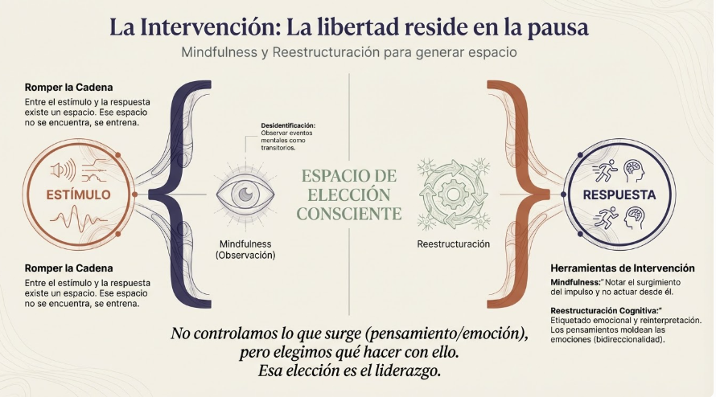
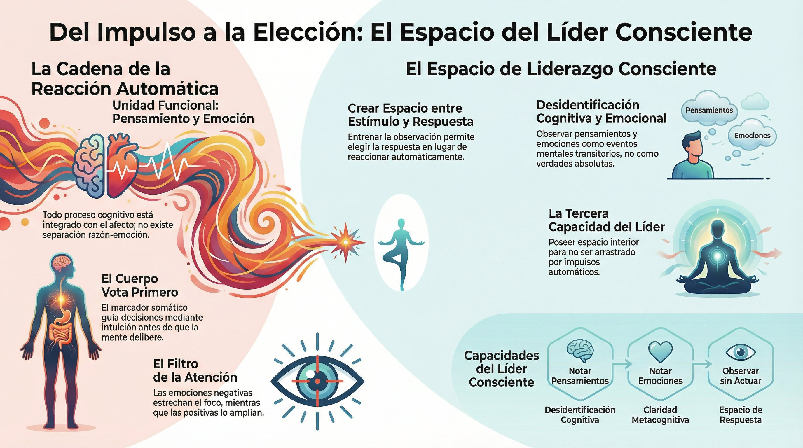

# Sintesis del Modulo 3

## Lo que hemos recorrido

M3 "Consciente de lo que pienso y siento" ha completado el triangulo de la atencion: sensaciones (M2), pensamientos y emociones (M3).

### Los seis temas

1. **Emocion y pensamiento — unidad funcional:** No hay separacion razon/emocion. Todo proceso cognitivo va acompanado de afecto. Pensamiento y emocion operan como unidad integrada.

2. **Las emociones como sistema de guia:** Las emociones no son ruido; son informacion. El marcador somatico de Damasio muestra que sin acceso emocional, la razon pura es insuficiente para decidir. La intuicion tiene base neurobiologica.

3. **La cadena automatica de reaccion:** Interocepcion → afecto de base → valencia → activacion → impulso hacia accion. El cuerpo "vota" antes de que la mente delibere. Con la repeticion, las cadenas se automatizan.

4. **Emocion y atencion:** Las emociones filtran que informacion llega a la consciencia. Emociones negativas estrechan el foco; emociones positivas lo amplian. Estados emocionales incidentales influyen sin que haya consciencia.

5. **Los pensamientos moldean las emociones:** La relacion es bidireccional. Reestructuracion cognitiva, etiquetado emocional, reinterpretacion y flexibilidad cognitiva permiten intervenir.

6. **Mindfulness para generar espacio:** Entre estimulo y respuesta hay un espacio. Ese espacio se crea, se entrena. Observar pensamientos y emociones como eventos mentales permite elegir en lugar de reaccionar.


#grafica  "La Intervención: La libertad reside en la pausa" — estímulo → espacio de elección consciente (mindfulness + reestructuración) → respuesta.

---

## La transformacion de M3

> "Puedo crear espacio antes de reaccionar. Pensamientos y emociones surgen automaticamente, pero no tengo que actuar desde ellos. Al observarlos como eventos mentales —no como verdades absolutas—, recupero la capacidad de elegir mi respuesta."

---

## Practica: Observacion de pensamientos y emociones

### Por que esta practica

Mientras M1 uso atencion focalizada y M2 uso Body Scan, M3 expande el objeto de atencion para incluir los eventos mentales.

### Que entrena

| Aspecto | Capacidad |
|---------|-----------|
| Notar pensamientos como eventos | Desidentificacion cognitiva |
| Notar emociones como estados transitorios | Desidentificacion emocional |
| Etiquetar | Claridad metacognitiva |
| Observar sin actuar | Espacio de respuesta |
| Ver la cadena completa | Consciencia del flujo |


---

## Preparacion para M4

### Lo que M3 ha establecido

- Pensamientos y emociones son una unidad funcional
- Las emociones guian decisiones (marcador somatico)
- La cadena automatica opera sin consciencia
- Las emociones filtran la atencion
- Se puede intervenir mediante pensamiento y mindfulness
- El espacio entre estimulo y respuesta es entrenable

### Lo que M4 desarrollara

- El autocuidado como fundamento del liderazgo
- La respuesta de estres como cadena especifica (intensificada)
- Por que el estres moderno no completa el ciclo
- Consecuencias del estres cronico
- La paradoja de la aceptacion
- Herramientas: pausa de 3 minutos

### La transicion

M3 revelo la cadena automatica y como crear espacio.

M4 aplicara ese conocimiento a una cadena especifica y critica: la respuesta de estres. Y anadira una dimension nueva: el autocuidado como necesidad, no lujo.

---

## El triangulo de la atencion: Completado

```
        SENSACIONES (M2)
             /\
            /  \
           / ** \
          /      \
         /________\
   PENSAMIENTOS    EMOCIONES
      (M3)           (M3)
```

Ahora puedes observar los tres vertices de tu experiencia interna.

---

## Capacidades adquiridas en M3

Al completar este modulo, tienes:

- [ ] Comprension de la unidad funcional emocion-pensamiento
- [ ] Conocimiento del marcador somatico y la intuicion
- [ ] Mapa de la cadena automatica de reaccion
- [ ] Comprension de como las emociones filtran la atencion
- [ ] Herramientas cognitivas para intervenir (etiquetado, reinterpretacion)
- [ ] Capacidad de observar pensamientos y emociones como eventos
- [ ] Primera experiencia del espacio entre estimulo y respuesta

---

## Tercera caracteristica del lider semilla: Confirmada

**Espacio interior:** Puede observar sus pensamientos y emociones sin ser arrastrado por ellos.

El lider que reacciona automaticamente pierde acceso a su capacidad de eleccion.

El espacio entre estimulo y respuesta es donde reside el liderazgo consciente.

#grafica  Líder Semilla M3: definición (observar pensamientos y emociones sin ser arrastrado) y capacidades adquiridas del módulo.

---

## El viaje continua

Has completado el triangulo de la atencion. Ahora puedes observar sensaciones, pensamientos y emociones.

Pero hay una pregunta pendiente: como te cuidas a ti mismo para poder sostener todo esto?

El estres cronico erosiona la capacidad que has desarrollado. M4 abordara esta cuestion crucial.

M4 te espera.

## Material adicional del tema #aux
### Infografías del tema 

#infografia  Infografía "Del Impulso a la Elección: El Espacio del Líder Consciente" — resumen completo del módulo.