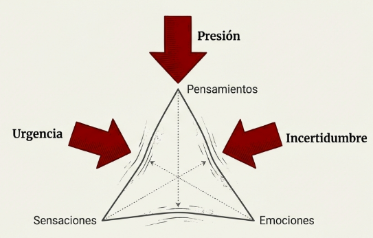

# Modulo 4: Consciente de lo que necesito

## Del autocuidado como lujo al autocuidado como necesidad del liderazgo

---

## Lo que traes de M1, M2 y M3

En los modulos anteriores descubriste:

**De M1 (Consciente de lo que soy):**
- Tu arquitectura mental: cerebro predictivo, Sistema 1/2, sesgos
- Que las emociones son parte integral del sistema de decision
- Que la atencion es la "puerta" de la consciencia

**De M2 (Consciente de como estoy):**
- El cuerpo como fuente de informacion, no mero contenedor
- Los tres sistemas perceptivos, especialmente la interocepcion
- El cuerpo como anclaje al presente

**De M3 (Consciente de lo que pienso y siento):**
- Pensamientos y emociones forman una unidad funcional
- La cadena automatica: interocepcion → afecto → valencia → activacion → accion
- El espacio entre estimulo y respuesta, y como crearlo mediante observacion

Has completado el triangulo de la atencion: sensaciones, pensamientos, emociones.

Ahora toca una pregunta crucial: como cuidas todo esto bajo la presion del liderazgo?

---

## Pregunta central

> Que necesito para funcionar bien bajo la presion del liderazgo, y como lo cuido?

#grafica  Triángulo de la atención (pensamientos, sensaciones, emociones) sometido a presión, urgencia e incertidumbre del liderazgo.

---

## Transformacion esperada

Al terminar este modulo, habras integrado:

> "El autocuidado no es lujo, es necesidad. La presion cronica distorsiona mi percepcion, mis decisiones y mis relaciones. Cuidarme no es egoismo; es condicion para liderar bien. Tengo herramientas concretas para regular mi respuesta de estres y mantener claridad bajo presion."

---

## La brecha que M4 cierra

Entiendes como funciona tu mente (M1-M3), pero aun no has aplicado ese conocimiento al fenomeno mas relevante para tu rol: **el estres sostenido del liderazgo**.

No sabes como la presion cronica distorsiona todo lo aprendido, ni tienes herramientas especificas para regularte en ese contexto.

---

## Lo que encontraras en este modulo

| Tema | Contenido | Pregunta que responde |
|------|-----------|----------------------|
| T1 | El autocuidado como fundamento | Por que el autocuidado es relevante para mi efectividad, no solo para mi bienestar? |
| T2 | La respuesta de estres | Que le pasa a mi cuerpo y mi mente cuando estoy bajo presion? |
| T3 | El ciclo que no se cierra | Por que el estres del trabajo no "se pasa"? |
| T4 | Consecuencias del estres cronico | Que me pasa si no cierro el ciclo de forma sostenida? |
| T5 | Aceptacion vs. lucha | Por que luchar contra el estres lo empeora? |
| T6 | Mindfulness y regulacion emocional | Como funciona el mindfulness a nivel cerebral, y que evidencia respalda su eficacia? |

---

## Practica de este modulo

**Pausa de 3 minutos**

La pausa de 3 minutos es la herramienta de regulacion en tiempo real. Disenada para interrumpir la cadena reactiva cuando el estres esta activo.

---

## Conexion con el programa

M4 es un modulo bisagra:

| Lo que cierra | Lo que abre |
|---------------|-------------|
| El arco de autoconocimiento (M1-M4) | La extension hacia el otro (M5-M7) |
| Consciencia DE (arquitectura, cuerpo, emociones) | Consciencia APLICADA (al estres, al otro, a la etica) |

No puedes cuidar a otros si no sabes cuidarte a ti mismo.
No puedes liderar bajo presion si la presion te domina.

---

## Cuarta caracteristica del lider semilla

**Sostenibilidad:** Cuida sus recursos para poder sostener el liderazgo en el tiempo.

El lider que se agota no puede liderar. El autocuidado no es debilidad; es sabiduria estrategica.

---

