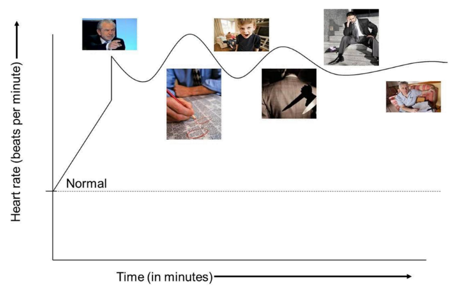
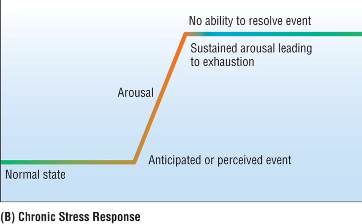
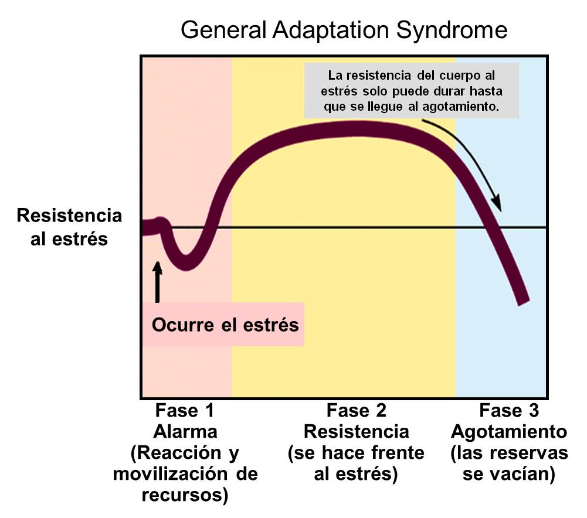

# El estrés como respuesta adaptativa

## ¿Qué es el estrés?

#teoria
"El estrés es una respuesta natural y automática del cuerpo y la mente ante demandas o amenazas percibidas como desafiantes o peligrosas."

El estrés es una **reacción adaptativa** que prepara al cuerpo para enfrentar situaciones de riesgo o desafío. Originalmente, esta respuesta estaba **orientada a la supervivencia** en situaciones extremas (como enfrentar un depredador). Sin embargo, hoy en día, los desencadenantes de estrés suelen ser psicológicos o de menor riesgo inmediato (trabajo, relaciones, presión social).

**Eustrés vs. Distrés: Dos caras del estrés**

#imagen
 León persiguiendo cebra en sabana africana.

#imagen
 Escena de oficina con ejecutivos en ambiente tenso/estresante.

---

## Eustrés y distrés: dos caras del estrés

#explicacion
El eustrés, también conocido como estrés positivo, es un tipo de estrés que nos motiva, nos energiza y nos ayuda a crecer. Se asocia con retos y experiencias que percibimos como positivas y emocionantes, aunque también pueden activar la respuesta de estrés del organismo.

El distrés, o estrés negativo, es el tipo de estrés que puede ser perjudicial para nuestra salud física y mental. Surge cuando percibimos las demandas como amenazas o cargas que superan nuestra capacidad de afrontamiento.

#teoria
**El estrés es subjetivo y depende de la percepción**

El estrés no es solo una respuesta a factores externos, sino una experiencia altamente personal influenciada por cómo interpretamos nuestras capacidades y recursos para manejar esos factores.

**La interpretación de la situación:** Tal como se menciona en, la interpretación que hacemos de una situación precede a la sensación de estrés. Si percibimos una situación como amenazante, nuestro cuerpo se prepara para la "lucha o huida", incluso si la amenaza no es real.

**Recursos internos y externos:** Estos recursos, como habilidades, apoyo social, tiempo disponible o experiencia previa, actúan como amortiguadores frente a las demandas.

#imagen
 Persona de pie en rascacielos mirando hacia abajo desde gran altura (vista aérea de ciudad).

#imagen
 Mujer en oficina con expresión de estrés/dolor de cabeza, manos en la frente.

---

## La respuesta de lucha o huida

#teoria
**La respuesta de "Lucha o Huida": Un Mecanismo de Supervivencia**

La respuesta de "lucha o huida", también conocida como respuesta de estrés, es una reacción fisiológica automática que se activa ante una amenaza o peligro percibido. Este mecanismo ha evolucionado a lo largo de millones de años para aumentar las posibilidades de supervivencia de los seres humanos y otros animales. Cuando el cerebro percibe una amenaza, ya sea real o imaginaria, activa el sistema nervioso simpático. Esto desencadena una serie de cambios fisiológicos, incluyendo:

- **Liberación de hormonas:** El hipotálamo, una región del cerebro, envía señales a las glándulas suprarrenales para que liberen adrenalina (epinefrina) y noradrenalina (norepinefrina), también conocidas como catecolaminas.
- **Aumento del ritmo cardíaco y la presión arterial:** Las catecolaminas provocan un aumento del ritmo cardíaco y la presión arterial, lo que permite que la sangre llegue más rápidamente a los músculos.
- **Respiración acelerada:** La respiración se acelera para aumentar la oxigenación de la sangre.
- **Movilización de energía:** El cuerpo libera glucosa de las reservas de energía para proporcionar combustible a los músculos.
- **Agudamiento de los sentidos:** Los sentidos se agudizan para estar más alerta al entorno.
- **Desactivación de funciones no esenciales:** El cuerpo desactiva funciones no esenciales para la supervivencia inmediata, como la digestión y el sistema inmunológico.

#imagen
 Diagrama anatómico "Fight-or-flight response" mostrando figura femenina con señalizaciones de los cambios fisiológicos: tunnel vision, hearing loss, fast breathing, acceleration, converts glycogen to glucose, produces hormones, slow digestion, muscle tension, relaxation.

---

## El ciclo del estrés: de la adaptación al agotamiento

#teoria
**La importancia de la gestión de la respuesta a los inputs estresores**

#imagen
 Secuencia de tres fotografías de cebras en sabana: 1) grupo de cebras en calma, 2) león persiguiendo cebra, 3) cebras pastando tranquilamente después del evento. A la derecha, gráfico de "Heart rate (beats per minute)" vs "Time (in minutes)" mostrando curva de respuesta al estrés con pico (Start-Finish) y retorno a nivel "Normal" con "Temporary recovery rate".

#imagen
 Gráfico de "Heart rate (beats per minute)" vs "Time (in minutes)" mostrando múltiples picos de estrés que no retornan al nivel normal. Incluye fotografías de situaciones estresantes cotidianas: ejecutivo enfadado, niño llorando, hombre preocupado en escaleras, manos con dinero escaso, persona corriendo tarde, persona agotada.

#teoria
**Respuesta Adaptativa vs Respuesta no adaptativa**

#imagen
 (A) Adaptive Stress Response: Gráfico mostrando ciclo Normal state → Event → Arousal → Action to resolve → Extreme relaxation → Normal state.

#imagen
 León persiguiendo cebra en la pradera - ejemplo de respuesta adaptativa al estrés en la naturaleza.

#imagen
 (B) Chronic Stress Response: Gráfico mostrando Normal state → Anticipated or perceived event → Arousal → Sustained arousal leading to exhaustion → No ability to resolve event.

#imagen
 Persona con manos en la cabeza en gesto de agobio - ejemplo de respuesta crónica al estrés.

---

## El síndrome de adaptación general

#teoria
**La importancia de la gestión de la respuesta a los inputs estresores**

#imagen
 Gráfico "General Adaptation Syndrome" mostrando las tres fases de la respuesta al estrés: Fase 1 Alarma (Reacción y movilización de recursos), Fase 2 Resistencia (se hace frente al estrés), Fase 3 Agotamiento (las reservas se vacían). Con nota: "La resistencia del cuerpo al estrés solo puede durar hasta que se llegue al agotamiento."

#imagen
 Gráfico "STRESS CURVE" mostrando curva de campana con Performance vs Stress Level. Zonas coloreadas: verde (too little stress/underload → inactive, laid back), amarillo-naranja (optimum stress), rojo (too much stress/overload → fatigue, exhaustion, anxiety/panic/anger, breakdown, burn-out).
