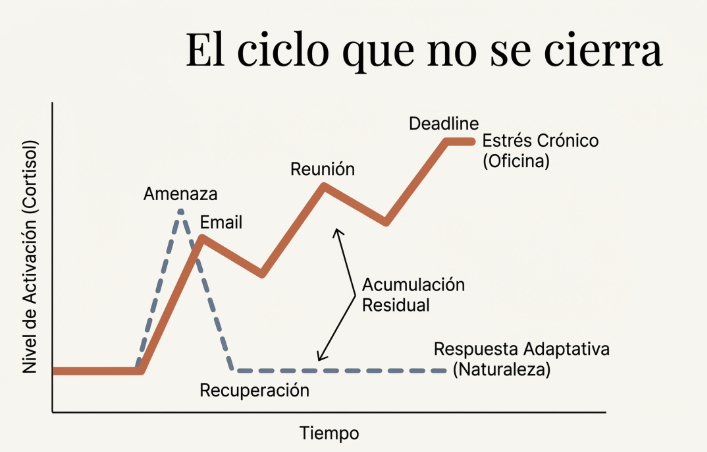
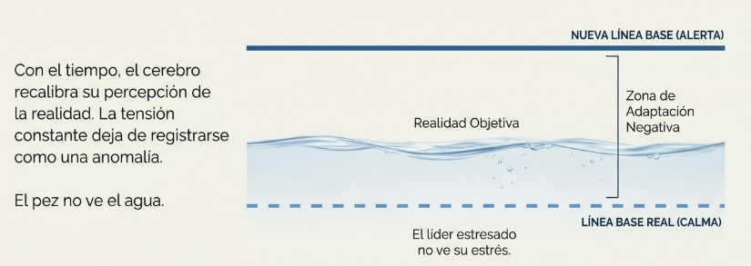

# Tema 3: El ciclo que no se cierra

- [Por que este tema es necesario](#por-que-este-tema-es-necesario)
	- [Por que el estres moderno se cronifica](#por-que-el-estres-moderno-se-cronifica)
- [1. El ciclo adaptativo completo](#1-el-ciclo-adaptativo-completo)
- [2. El ciclo interrumpido](#2-el-ciclo-interrumpido)
- [3. La normalizacion del estado de alerta](#3-la-normalizacion-del-estado-de-alerta)
- [4. La respuesta adaptativa vs no adaptativa](#4-la-respuesta-adaptativa-vs-no-adaptativa)
- [Conexiones](#conexiones)
- [Dimension experiencial](#dimension-experiencial)
- [Referencias incluidas](#referencias-incluidas)
- [Material adicional del tema](#material-adicional-del-tema)
	- [Infografías del tema](#infografías-del-tema)

---
## Por que este tema es necesario

#### Por que el estres moderno se cronifica

**Pregunta que responde:**
Por que el estres del trabajo no "se pasa" como el estres de la cebra que escapa del leon?

Este tema explica por que el estres del liderazgo tiende a cronificarse.

Los estresores psicosociales no se resuelven con accion fisica, el ciclo queda abierto, y la activacion se acumula.

Entenderas el mecanismo del agotamiento.


---

## 1. El ciclo adaptativo completo

La respuesta de estrés está diseñada para ser temporal. Activación, acción, resolución, recuperación. En la naturaleza, el ciclo se completa: la cebra huye del león, escapa, y minutos después pasta tranquilamente. El sistema retorna al equilibrio.

#ppt  "El sistema humano está diseñado para el estrés": curva de activación → amenaza → recuperación → homeostasis.

#grafica  Opción 1: "El Ciclo Adaptativo Completo" — reloj circular con la cebra: estado normal → evento → activación → acción → relajación → retorno.
#grafica  Opción 2: Comparativa La Cebra (ciclo cerrado, pico único) vs. El Líder Moderno (ciclo abierto, picos sin retorno).


---

## 2. El ciclo interrumpido

El problema surge cuando el ciclo no se cierra. Los estresores psicológicos y sociales no se resuelven con huir o luchar. La amenaza percibida persiste: el proyecto sin terminar, el conflicto sin resolver, la incertidumbre sin respuesta. El cuerpo mantiene la activación sin completar el ciclo. Pico tras pico, sin retorno a la línea base.

#grafica  Diagrama de flujo: estado normal → evento → activación → doble bloqueo (sin acción física, sin relajación) → activación sostenida.

En el liderazgo moderno:

```
ESTADO NORMAL
     |
     v
  EVENTO (email critico, conflicto, deadline)
     |
     v
  ACTIVACION (respuesta de estres)
     |
     v
  NO HAY ACCION RESOLUTIVA (no puedes huir ni luchar)
     |
     v
  NO HAY RELAJACION PROFUNDA (nuevo estresor llega)
     |
     v
  ACTIVACION SOSTENIDA
```

El ciclo no se completa. La activacion se mantiene.

#grafica  Opción 1: "El ciclo que no se cierra" — gráfica cortisol/tiempo comparando respuesta adaptativa (línea punteada) vs. estrés crónico (escalera ascendente).
Sin retorno a la linea base, cada nuevo estresor se suma sobre activacion residual:

#grafica  Opción 2: "La acumulación: Pico tras pico" — sin retorno a línea base, el estado de alerta se vuelve crónico.


---

## 3. La normalizacion del estado de alerta

Con el tiempo:

- El lider se habitua a estar activado
- Pierde la referencia del estado basal ("ya no se que es estar relajado")
- La tension cronica se convierte en "como soy"
- Las senales de alerta se ignoran porque son constantes

El pez no ve el agua. El lider estresado no ve su estres.

#grafica  Metáfora del agua: nueva línea base (alerta) vs. línea base real (calma). "El pez no ve el agua, el líder estresado no ve su estrés."

---
## 4. La respuesta adaptativa vs no adaptativa

La respuesta adaptativa y la respuesta no adaptativa ilustran esta diferencia fundamental. En la respuesta adaptativa, el ciclo se completa: estado normal, evento, activación, acción resolutiva, relajación profunda, retorno al estado normal. En la respuesta crónica, el ciclo se interrumpe: la activación se sostiene sin resolución, conduciendo al agotamiento.

#ppt  Respuesta adaptativa (círculo cerrado → recuperación) vs. respuesta crónica (espiral abierta → agotamiento).

---
## Conexiones

**Conexion con M2

El lider que ignora las senales corporales (M2) no detecta que el ciclo esta abierto hasta que es demasiado tarde.

Las senales estan ahi:
- Tension cronica
- Sueno alterado
- Fatiga persistente
- Malestar digestivo

Pero si no las escuchas, no las usas.

**Conexion con M3

El espacio entre estimulo y respuesta (M3) se estrecha bajo estres cronico.

```
Normal:         Estimulo ----[ESPACIO]---- Respuesta
Estres cronico: Estimulo --[]-- Respuesta
```

La capacidad de elegir se reduce. La reactividad aumenta.

**Conexion con el programa

M6 mostrara como la metaconsciencia se pierde bajo presion.

M4 explica por que: el sistema esta disenado para accion inmediata, no para observacion. Bajo estres cronico, observar es un lujo que el sistema no puede permitirse.

---

## Dimension experiencial #insight

Reflexiona:

- Cual es tu "nivel basal" actual? Es realmente tu nivel natural o es estres normalizado?
- Que haces para cerrar el ciclo?

---

## Referencias incluidas

**Otras posibles referencias de interés
- Nagoski, E. & Nagoski, A. (2019). *Burnout: The Secret to Unlocking the Stress Cycle.* Ballantine Books.
- Porges, S. (2011). *The Polyvagal Theory: Neurophysiological Foundations of Emotions.* W.W. Norton.
- Maslach, C. & Leiter, M.P. (2016). *Understanding the burnout experience.* World Psychiatry.

---
## Material adicional del tema #aux
### Infografías del tema 

#infografia  Ciclo adaptativo (cebra y león) vs. ciclo interrumpido (liderazgo moderno): comparativa de efectos corporales entre ciclo cerrado y abierto.