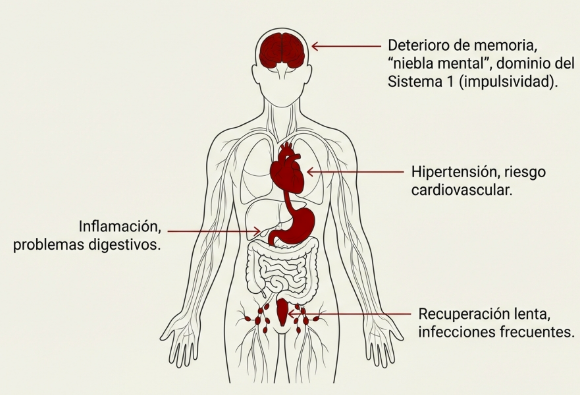
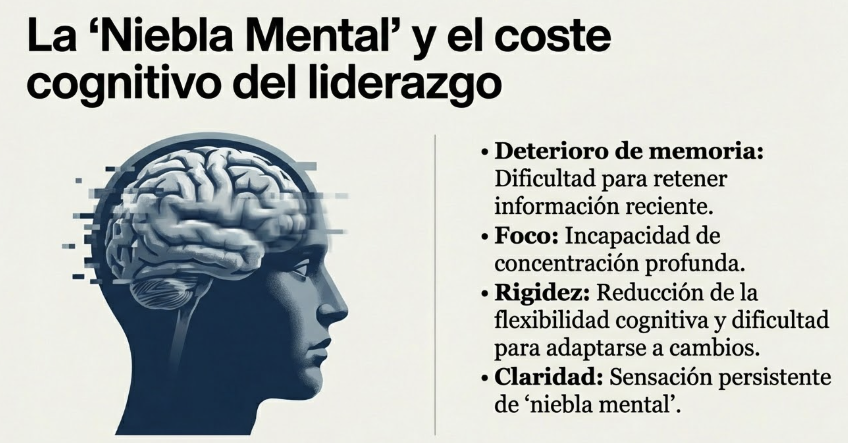
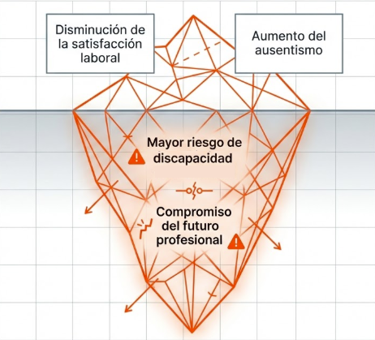
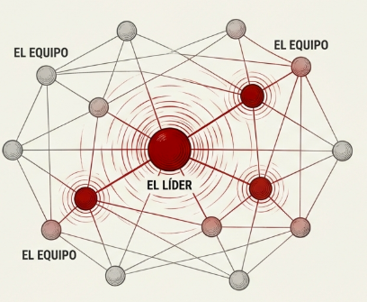
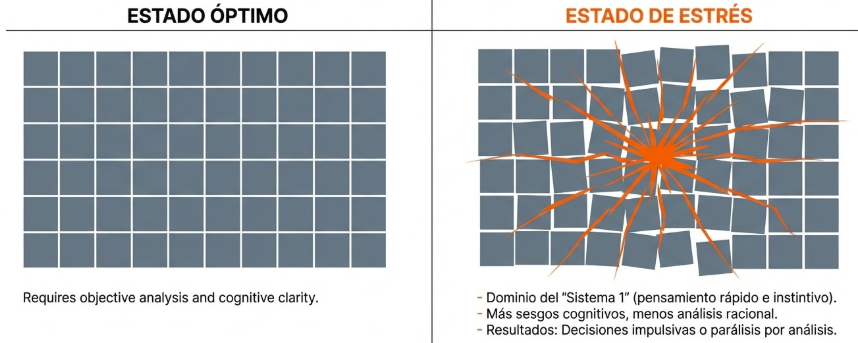
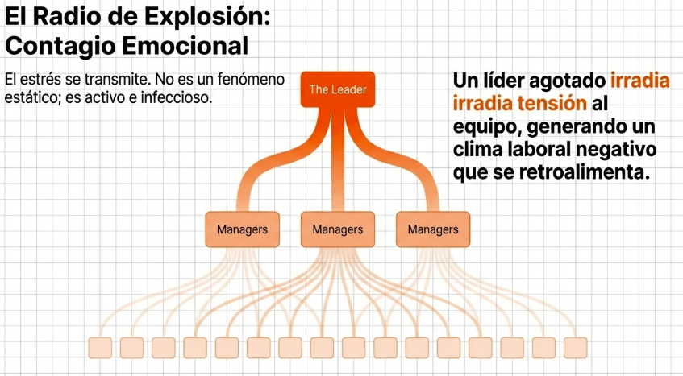
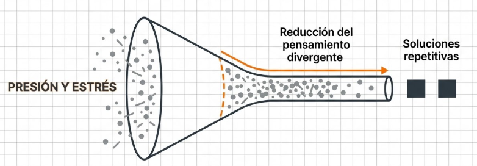
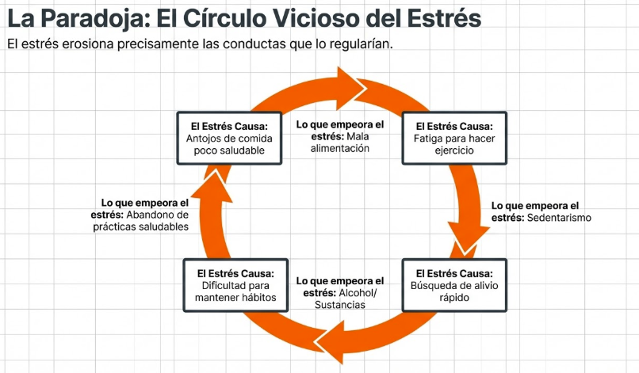
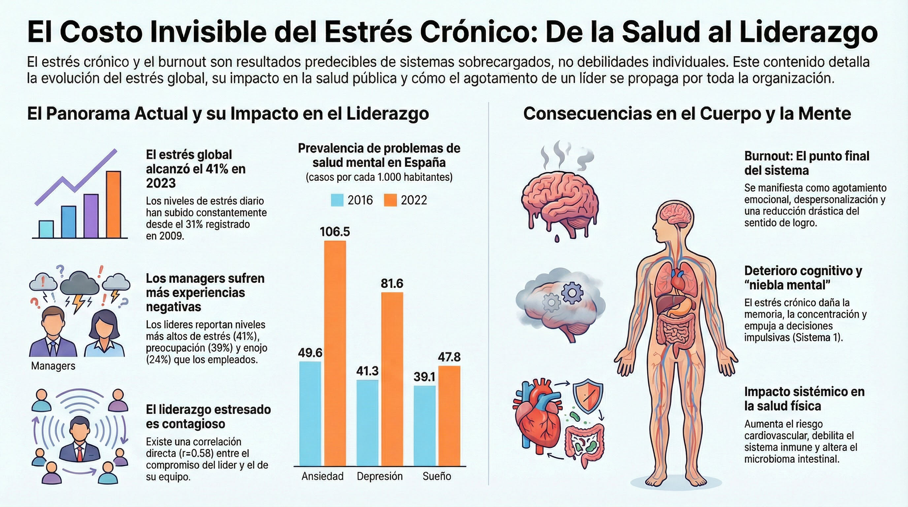

# Tema 4: Las consecuencias del estres cronico

- [Por que este tema es necesario](#por-que-este-tema-es-necesario)
	- [Lo que esta en juego](#lo-que-esta-en-juego)
- [1. El panorama actual: estrés y salud mental en datos](#1-el-panorama-actual-estrés-y-salud-mental-en-datos)
- [2. Consecuencias fisicas](#2-consecuencias-fisicas)
- [3. Consecuencias psicologicas](#3-consecuencias-psicologicas)
- [4. Consecuencias ocupacionales](#4-consecuencias-ocupacionales)
- [5. Consecuencias en el liderazgo](#5-consecuencias-en-el-liderazgo)
	- [5.1 En la gestión directiva](#51-en-la-gestión-directiva)
	- [5.2 En las personas de la organización](#52-en-las-personas-de-la-organización)
- [6. Consecuencias en comportamientos de autocuidado](#6-consecuencias-en-comportamientos-de-autocuidado)
- [7. El burnout como punto final](#7-el-burnout-como-punto-final)
- [Conexiones](#conexiones)
- [Dimension experiencial](#dimension-experiencial)
- [Referencias incluidas](#referencias-incluidas)
- [Material adicional del tema](#material-adicional-del-tema)
	- [Infografías del tema](#infografías-del-tema)

---
## Por que este tema es necesario

#### Lo que esta en juego

**Pregunta que responde:**
Que me pasa si no cierro el ciclo de estres de forma sostenida?

Este tema presenta las consecuencias del estres cronico con datos concretos.

Entenderas que el precio no es solo malestar subjetivo: hay deterioro medible en salud, cognicion, relaciones y efectividad profesional.

El burnout no es debilidad; es resultado predecible de un sistema sobrecargado.

---
## 1. El panorama actual: estrés y salud mental en datos

Antes de explorar qué ocurre cuando el ciclo de estrés no se cierra, conviene detenerse en la magnitud del problema. Los datos no son abstractos: describen el contexto en el que lideramos cada día.

**El estrés como experiencia cotidiana global

**

Según el informe _State of the Global Workplace_ de Gallup[^1], el 41% de los trabajadores a nivel mundial experimentaron estrés significativo el día anterior a ser encuestados. Esta cifra no es un pico puntual: representa una tendencia sostenida al alza desde 2009, cuando el porcentaje era del 31%. En poco más de una década, el estrés diario ha pasado de afectar a uno de cada tres trabajadores a afectar a casi la mitad.

#grafica  Gráfico Gallup "Daily Stress": evolución del % de trabajadores con estrés diario desde 2009 (31%) hasta 2023 (41%).

Pero el estrés no viaja solo. El mismo informe registra que un 21% de los trabajadores experimentó ira el día anterior, un 22% tristeza y un 20% soledad. Estas no son emociones aisladas: configuran un paisaje emocional cotidiano marcado por la negatividad sostenida.

#grafica
 Estadísticas "Daily Negative Emotions" del informe Gallup: Stress 41% (-3), Anger 21% (0), Sadness 22% (+1), Loneliness 20%.

**El dato que más importa para este curso: los managers lo viven peor**

Uno de los hallazgos más relevantes de Gallup para nuestro contexto es que los managers reportan experiencias emocionales más negativas que los no-managers. En los datos globales de 2023, los managers muestran niveles más altos de ira (24% vs. 19%), tristeza (24% vs. 21%) y preocupación (39% vs. 36%), con niveles de estrés prácticamente idénticos (41% vs. 40%). Además, los managers presentan menor engagement (30% vs. 18%) y menor sensación de bienestar general (40% vs. 30%).

#grafica  Comparativa experiencias emocionales negativas: managers reportan más ira (24%), tristeza (24%), preocupación (39%) y menor engagement.

La paradoja es clara: quienes tienen la responsabilidad de cuidar a otros están, en promedio, peor que aquellos a quienes cuidan. Y el problema se propaga: Gallup documenta una correlación positiva (r=0.58) entre el engagement de los managers y el de sus equipos. Cuando el líder está agotado, el equipo lo nota y lo absorbe.

**El contexto español: una tendencia alarmante**

El Informe Anual del Sistema Nacional de Salud 2023, publicado por el Ministerio de Sanidad, muestra una evolución preocupante en España entre 2016 y 2022. La prevalencia registrada de los problemas de salud mental más frecuentes por cada 1.000 habitantes ha crecido de forma sostenida en las tres categorías principales: los trastornos de ansiedad han pasado de 49,6 a 106,5 por mil (se han más que duplicado), los trastornos depresivos han crecido de 41,3 a 81,6 por mil (prácticamente se han duplicado), y los trastornos del sueño han aumentado de 39,1 a 47,8 por mil.

#grafica  Informe SNS 2023[^2]: indicadores de salud mental en España 2016-2022 (ansiedad 49.6→106.5, depresión 41.3→81.6, sueño 39.1→47.8 por 1000 hab.).

Estos datos no son solo estadísticas de salud pública. Son el contexto real en el que operan los líderes que asisten a este programa: un entorno donde el deterioro de la salud mental se ha normalizado y donde las señales de alarma se confunden con "lo normal".

**¿Por qué importan estos datos aquí?**

Porque establecen que el estrés crónico no es un problema individual de personas que "no pueden con la presión". Es una condición sistémica del entorno laboral contemporáneo, que afecta desproporcionadamente a quienes lideran, y cuyas consecuencias — como veremos a continuación — se extienden mucho más allá del malestar subjetivo.

---

## 2. Consecuencias fisicas

#grafica  Diagrama anatómico: deterioro de memoria, hipertensión, inflamación digestiva, recuperación lenta e infecciones frecuentes.

**Sistema cardiovascular
- Hipertension
- Mayor riesgo de enfermedad cardiaca
- Arritmias

**Sistema inmunitario
- Mayor frecuencia de infecciones
- Recuperacion mas lenta
- Mayor riesgo de enfermedades autoinmunes

**Sistema musculoesqueletico
- Dolor cronico de espalda, cuello, hombros
- Tension muscular persistente
- Bruxismo

**Sueno
- Dificultad para conciliar el sueno
- Despertares nocturnos
- Sueno no reparador
- Fatiga cronica

**Sistema digestivo
- Sindrome de intestino irritable
- Reflujo
- Alteraciones del apetito

---

## 3. Consecuencias psicologicas

#ppt  "La Niebla Mental y el coste cognitivo del liderazgo": deterioro de memoria, foco, rigidez cognitiva, falta de claridad.

**Estado de animo
- Sintomas depresivos
- Ansiedad generalizada
- Irritabilidad cronica

**Cognicion
- Deterioro de memoria
- Dificultad de concentracion
- Reduccion de flexibilidad cognitiva
- "Niebla mental"

**Agotamiento
- Agotamiento emocional (sensacion de vacio)
- Despersonalizacion (distancia cinica de los demas)
- Reduccion del sentido de logro
-
#grafica  "La tríada del Burnout": diagrama Venn con agotamiento emocional, despersonalización e ineficacia.

---
## 4. Consecuencias ocupacionales

Disminución de la satisfacción laboral, aumento del ausentismo y mayor riesgo de pensión por discapacidad. El burnout no solo deteriora la calidad de vida presente; compromete el futuro profesional.  *Artículo científico PLOS ONE: "Physical, psychological and occupational consequences of job burnout: A systematic review of prospective studies" (Salvagioni et al., 2017)[^3]. DOI: https://doi.org/10.1371/journal.pone.0185781

#grafica  Embudo descendente: disminución satisfacción laboral, aumento ausentismo, mayor riesgo de discapacidad, compromiso del futuro profesional.

---

## 5. Consecuencias en el liderazgo

#grafica  Opción 1: Red abstracta con el líder (centro) irradiando estrés hacia los nodos del equipo.

Los efectos del estrés trascienden lo individual. Cuando quien lidera está agotado, las consecuencias se propagan por toda la estructura organizacional.

#### 5.1 En la gestión directiva

- **Deterioro en la toma de decisiones.** El estrés crónico nubla la claridad mental y la capacidad de análisis. Las decisiones se vuelven impulsivas o basadas en el miedo, en lugar de surgir de un análisis objetivo.
		- Dominio del Sistema 1
		- Mas sesgos, menos analisis
		- Decisiones impulsivas o paralisis

- 
#grafica  Comparativa estado óptimo (cuadrícula ordenada, análisis objetivo) vs. estado de estrés (cuadrícula distorsionada, Sistema 1 domina).

- **Afectación del liderazgo.** Un líder estresado tiene dificultades para inspirar, motivar y guiar. La irritabilidad, la falta de paciencia y la comunicación deficiente generan un ambiente tenso y poco productivo.
		- Irritabilidad en interacciones
		- Menor paciencia
		- Comunicacion mas directiva, menos colaborativa

#grafica  Opción 2: "El Radio de Explosión: Contagio Emocional" — cascada jerárquica Leader → Managers → equipos.
- **Reducción de la creatividad e innovación.** El estrés limita la flexibilidad cognitiva y la capacidad de encontrar soluciones novedosas. La innovación requiere espacio mental; el agotamiento lo consume.
		- Reduccion de pensamiento divergente
		- Menos capacidad de innovacion
		- Soluciones repetitivas

#grafica  Embudo: presión y estrés → reducción del pensamiento divergente → soluciones repetitivas.

#### 5.2 En las personas de la organización

- **Contagio emocional.** El estrés se transmite. Un líder agotado irradia tensión al equipo, generando un clima laboral negativo que se retroalimenta.

- **Conflictos interpersonales.** La irritabilidad y la falta de paciencia —síntomas del estrés— aumentan la probabilidad de conflictos, afectando la colaboración y el trabajo en equipo.

- **Pérdida de motivación y rendimiento.** Un ambiente laboral estresante erosiona la motivación. El rendimiento colectivo cae cuando el estrés individual se convierte en cultura organizacional.

#imagen
 Gráfico de dispersión "Country-Level Relationship Between Manager and Non-Manager Engagement" (r=0.58) del informe Gallup, mostrando correlación positiva entre % Engaged-Manager y % Engaged-Non-Manager.

---

## 6. Consecuencias en comportamientos de autocuidado

- **Negligencia.** Dormir poco, abandonar el ejercicio, eliminar actividades placenteras. El autocuidado se convierte en lo primero que se sacrifica cuando la presión aumenta.

- **Comportamientos autodestructivos.** El exceso de trabajo, el consumo excesivo de alcohol, tabaco o drogas emergen como estrategias de escape. Alivian momentáneamente, pero agravan el ciclo.

- **Dificultad para cambiar hábitos.** El estrés dificulta adoptar hábitos saludables y abandonar los negativos. Cuando el sistema busca alivio inmediato, el bienestar a largo plazo pierde prioridad.

El estres cronico genera un circulo vicioso:

| Lo que el estres causa           | Lo que empeora el estres         |
| -------------------------------- | -------------------------------- |
| Antojos de comida poco saludable | Mala alimentacion                |
| Fatiga para hacer ejercicio      | Sedentarismo                     |
| Busqueda de alivio rapido        | Alcohol, sustancias              |
| Dificultad para mantener habitos | Abandono de practicas saludables |

El estres erosiona precisamente las conductas que lo regularian.

#grafica  "La Paradoja: El Círculo Vicioso del Estrés" — el estrés erosiona las conductas que lo regularían (alimentación, ejercicio, hábitos).

---

## 7. El burnout como punto final

El burnout no es:
- Debilidad de caracter
- Falta de compromiso
- "No poder con la presion"

El burnout **es** Resultado predecible de un sistema que opero demasiado tiempo sin recuperacion

---

## Conexiones

**Conexion con M1

El estres cronico deteriora todo lo que M1 describio:

| Capacidad M1 | Efecto del estres cronico |
|--------------|---------------------------|
| Sistema 2 | Desconectado |
| Control de sesgos | Amplificados |
| Percepcion equilibrada | Distorsionada hacia amenaza |
**Conexion con M2

El estres cronico desconecta del cuerpo (M2) justo cuando mas se necesita escucharlo.

Paradoja: cuando mas importante es notar las senales, menos capacidad hay de notarlas.

**Conexion con M3

El espacio entre estimulo y respuesta (M3) colapsa bajo estres cronico.

Lo que M3 enseno a crear, el estres cronico lo destruye.

**Conexion con T5 y T6

Despues de ver las consecuencias, la pregunta natural es: que puedo hacer?

Los siguientes dos temas responden:
- **T5 (Aceptacion vs. lucha):** Introduce el mecanismo central de regulacion: la aceptacion. Descubriras por que luchar contra el estres lo empeora.
- **T6 (Mindfulness y regulacion emocional):** Presenta la evidencia cientifica de que el mindfulness funciona a nivel cerebral.

---

## Dimension experiencial #insight

Reflexiona:

- Cuales de estas consecuencias reconoces en ti mismo?
- Cuales estas normalizando? ("Siempre he dormido mal")
- Que senales tempranas podriais estar ignorando?

---

## Referencias incluidas
[^1]: Gallup. "State of the Global Workplace" Report.
[^2]: Sistema Nacional de Salud. Informe Anual 2023.
[^3]: Salvagioni et al. (2017). "Physical, psychological and occupational consequences of job burnout: A systematic review of prospective studies". PLOS ONE.
[^4]: 20minutos SALUD (Jorge García, 16.10.2024). Noticia sobre estrés y cáncer de colon.

**Otras posibles referencias de interés:
- Salvagioni, D.A.J. et al. (2017). *Physical, psychological and occupational consequences of job burnout: A systematic review.* PLoS ONE.
- Maslach, C. et al. (2001). *Job burnout.* Annual Review of Psychology.
- Arnsten, A.F.T. (2009). *Stress signalling pathways that impair prefrontal cortex structure and function.* Nature Reviews Neuroscience.

---
## Material adicional del tema #aux
### Infografías del tema 

#infografia  Panorama del estrés global (41%), prevalencia salud mental en España, consecuencias en cuerpo y mente: burnout, deterioro cognitivo, impacto sistémico.