# Tema 5: Aceptacion vs. lucha

#imagen 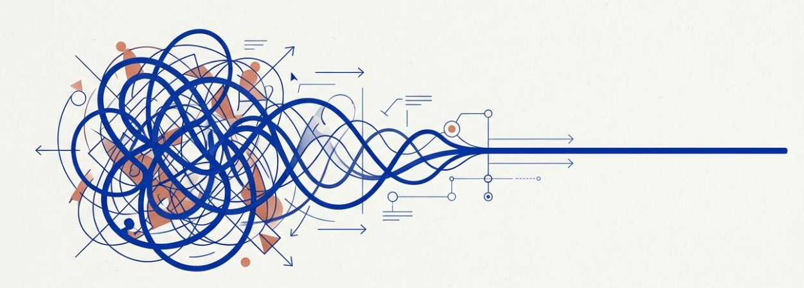 Opción 1: Ilustración abstracta de caos enredado que se transforma en línea de claridad.
- [Por que este tema es necesario](#por-que-este-tema-es-necesario)
	- [El mecanismo paradojico de la regulacion](#el-mecanismo-paradojico-de-la-regulacion)
- [1. La lucha interna como amplificador](#1-la-lucha-interna-como-amplificador)
- [2. El mecanismo de la aceptacion](#2-el-mecanismo-de-la-aceptacion)
- [3. Por que funciona](#3-por-que-funciona)
- [4. Aceptacion y resiliencia](#4-aceptacion-y-resiliencia)
- [5. La paradoja explicada](#5-la-paradoja-explicada)
- [Conexiones](#conexiones)
- [Dimension experiencial](#dimension-experiencial)
- [Referencias](#referencias)
- [Material adicional del tema](#material-adicional-del-tema)
	- [Infografías del tema](#infografías-del-tema)

#imagen 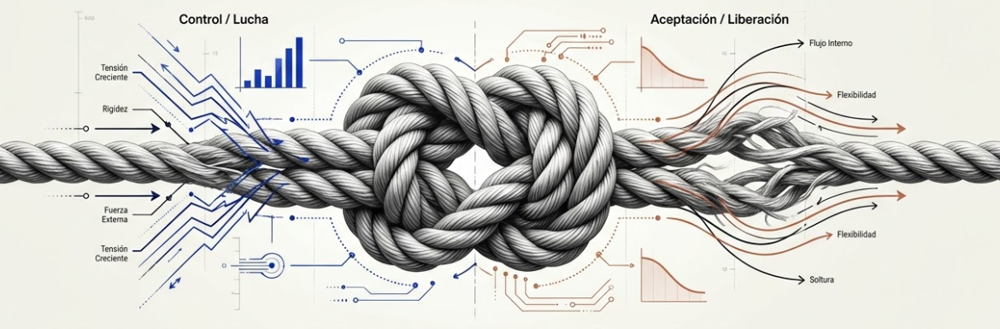 Opción 2: Metáfora del nudo: lado izquierdo (control/lucha, tensión creciente) vs. derecho (aceptación/liberación, flexibilidad).

---
## Por que este tema es necesario

#### El mecanismo paradojico de la regulacion

**Pregunta que responde:**
Por que luchar contra el estres lo empeora, y como la aceptacion lo regula?

Este tema introduce el mecanismo central de la regulacion basada en mindfulness: la aceptacion.

Descubriras que resistir las emociones las intensifica, mientras que observarlas sin lucha permite que se regulen naturalmente.

Es contraintuitivo pero esta respaldado por evidencia.

#grafica  Opción 1: Manos tirando cuerda trenzada — resistencia aprieta el tejido, aceptación lo afloja.

---

## 1. La lucha interna como amplificador

#grafica 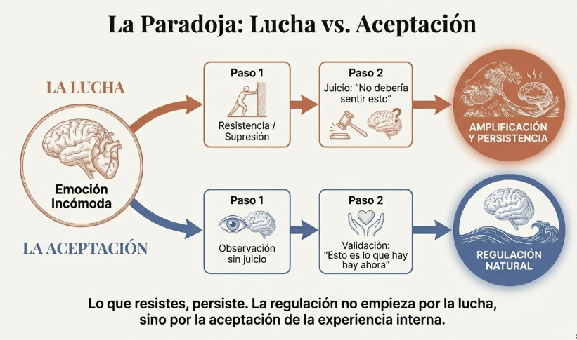 Opción 2: Diagrama de flujo: emoción incómoda → lucha (supresión → juicio → amplificación) vs. aceptación (observación → validación → regulación natural).

La reaccion natural ante el malestar es luchar:

#ppt 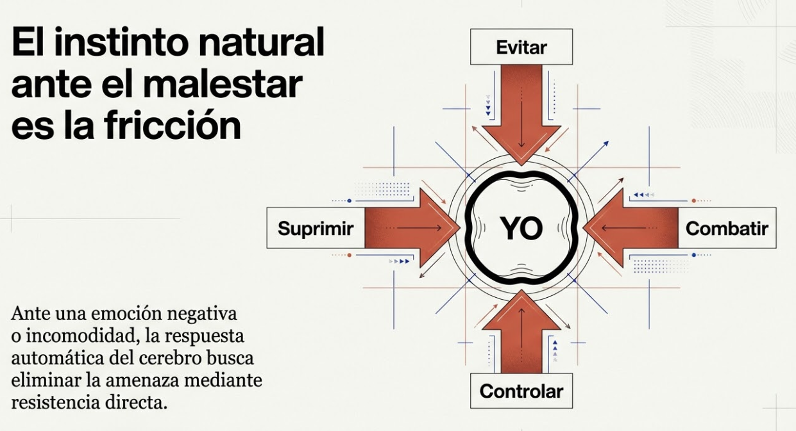 "El instinto natural ante el malestar es la fricción": YO rodeado de flechas — evitar, combatir, suprimir, controlar.

- Evitar la emocion
- Controlarla
- Suprimirla
- Combatirla

Pero esta lucha tiene un efecto paradojico:

#grafica  Tabla "Acción vs. Efecto": cada intento de supresión produce el resultado opuesto.

| Accion | Efecto |
|--------|--------|
| Intentar no pensar en algo | Piensas mas en ello |
| Suprimir una emocion | La emocion se intensifica |
| Resistir la tension | La tension aumenta |
| "No deberia sentir esto" | Anades culpa al malestar |

La resistencia consume energia y perpetua el problema.

---

## 2. El mecanismo de la aceptacion

La aceptacion es:
- Observar sin juzgar
- Reconocer lo que esta presente
- No intentar modificar inmediatamente
- Permitir que la experiencia sea como es
- 
#grafica 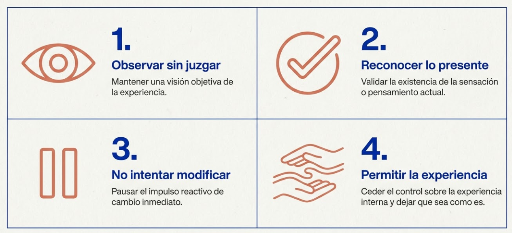 Cuatro pasos de la aceptación: 1. Observar sin juzgar, 2. Reconocer lo presente, 3. No intentar modificar, 4. Permitir la experiencia.

La aceptacion **no es**:
- Resignacion ("me rindo")
- Aprobacion ("esto esta bien")
- Pasividad ("no hare nada")
- Debilidad ("no puedo con esto")

#grafica  "Lo que la aceptación NO es": tachado de resignación, aprobación, pasividad y debilidad.

---

## 3. Por que funciona

**Las emociones tienen un ciclo natural

Toda emocion:
1. Surge
2. Alcanza un pico
3. Desciende
4. Se disipa

**La lucha interrumpe este ciclo.** Mantiene la emocion en el pico.

#grafica 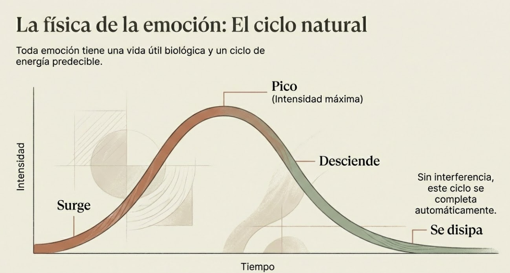 "La física de la emoción: El ciclo natural" — curva: surge → pico → desciende → se disipa.

#grafica 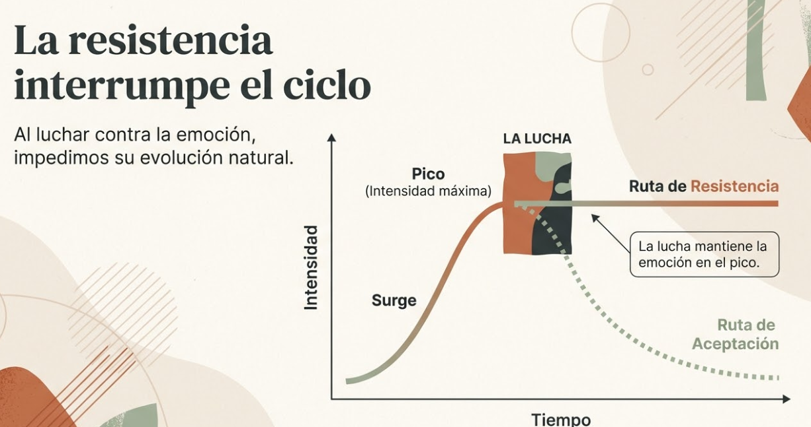 "La resistencia interrumpe el ciclo": la lucha mantiene la emoción en el pico vs. ruta de aceptación.

**La aceptacion permite que el ciclo se complete.**

#grafica  Cerebro: la lucha mantiene la amígdala encendida; la aceptación activa la corteza prefrontal (VMPFC/DLPFC).

---

## 4. Aceptacion y resiliencia

La aceptacion crea espacio mental:

| Con lucha                        | Con aceptacion                    |
| -------------------------------- | --------------------------------- |
| Energia gastada en resistir      | Energia disponible para responder |
| Atencion atrapada en el malestar | Atencion libre para evaluar       |
| Reaccion impulsiva               | Respuesta considerada             |

Desde el espacio de la aceptacion, las decisiones son mas calmadas y estrategicas.

#grafica  Opción 1: Círculos abstractos — con lucha (caótico, energía gastada) vs. con aceptación (despejado, respuesta considerada).

#grafica 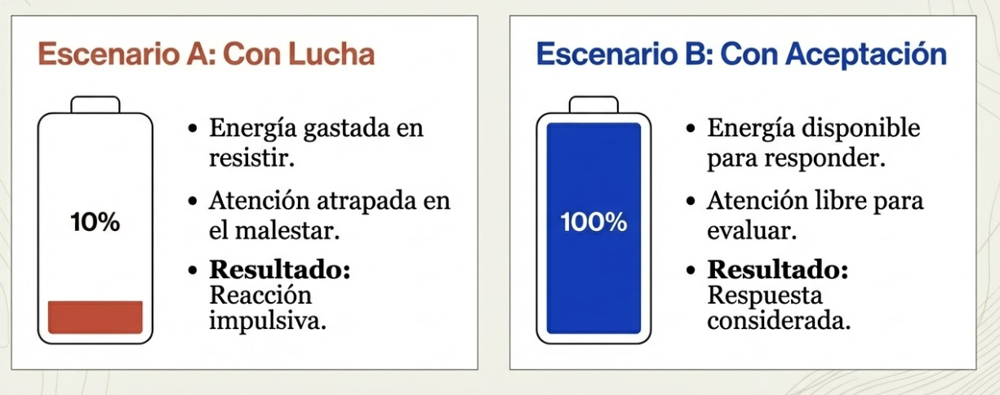 Opción 2: Baterías — con lucha (10%, reacción impulsiva) vs. con aceptación (100%, respuesta considerada).

---

## 5. La paradoja explicada

Parece contradictorio: si quiero sentirme mejor, no deberia luchar contra lo malo?

La paradoja se resuelve distinguiendo:

| Lucha contra | Resultado |
|--------------|-----------|
| La emocion en si | Amplificacion |
| La causa externa (si es modificable) | Puede ser util |
#grafica 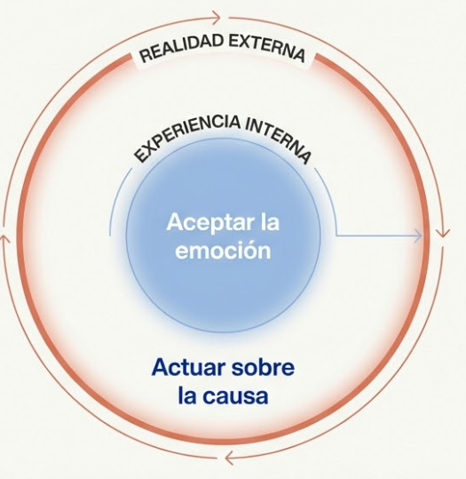 Círculos concéntricos: aceptar la emoción (experiencia interna) y actuar sobre la causa (realidad externa).
Aceptar la emocion no significa aceptar la situacion.

Puedes:
1. Aceptar que sientes estres (la emocion)
2. Actuar para cambiar la situacion (la causa)

La aceptacion es sobre la experiencia interna, no sobre la realidad externa.

#ppt 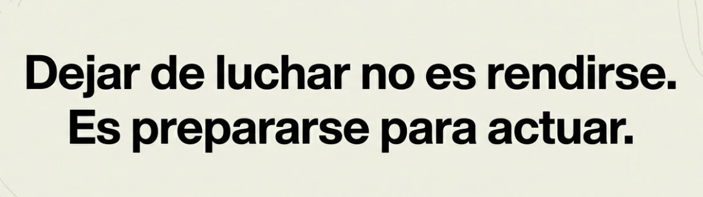 Cita: "Dejar de luchar no es rendirse. Es prepararse para actuar."

---

## Conexiones

**Conexion con M3

M3 introdujo el espacio entre estimulo y respuesta.

M4 especifica: **ese espacio se crea mediante aceptacion, no mediante lucha**.

| Metodo | Resultado |
|--------|-----------|
| Luchar contra la emocion | El espacio se cierra |
| Aceptar la emocion | El espacio se abre |

**Conexion con T6

El siguiente tema (Mindfulness y regulacion emocional) desarrollara la evidencia cientifica de por que la aceptacion funciona a nivel cerebral.

Veras que no es solo una actitud filosofica: tiene efectos medibles en el cerebro y el cuerpo.

**Conexion con el programa

Este mecanismo sera la base de:
- **M5:** Regulacion emocional interpersonal (aceptar lo que el otro genera en mi)
- **M6:** Recuperacion de metaconsciencia bajo presion (aceptar el estado para poder observarlo)

---

## Dimension experiencial #insight

Reflexiona:

- Cual es tu reaccion habitual ante emociones incomodas?
  - Lucha?
  - Evitacion?
  - Supresion?
- Has experimentado alguna vez que al dejar de luchar, el malestar disminuyo?
- Que te impide aceptar ciertas emociones?

---

## Referencias

- Hayes, S.C. et al. (2006). *Acceptance and Commitment Therapy: Model, processes and outcomes.* Behaviour Research and Therapy.

---
## Material adicional del tema #aux
### Infografías del tema 

#infografia 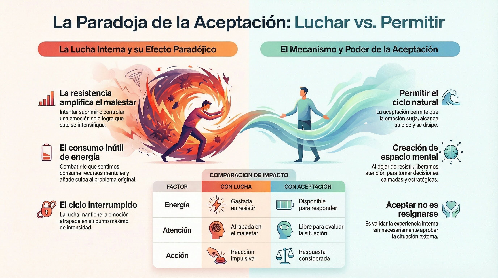 Paradoja de la aceptación: lucha interna (amplifica malestar) vs. permitir (ciclo natural), tabla comparativa energía-atención-acción.