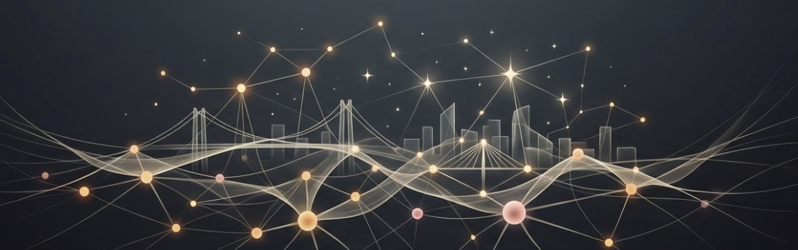
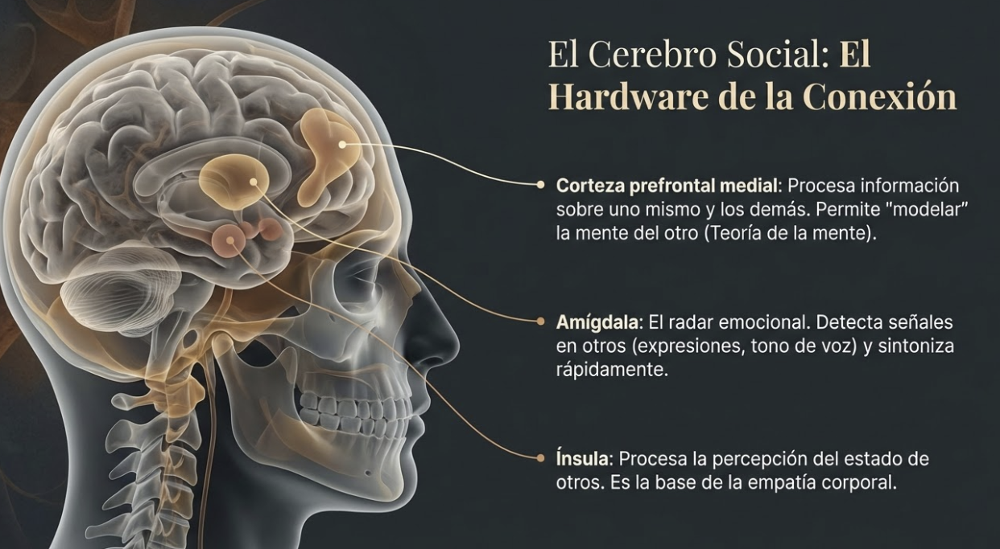
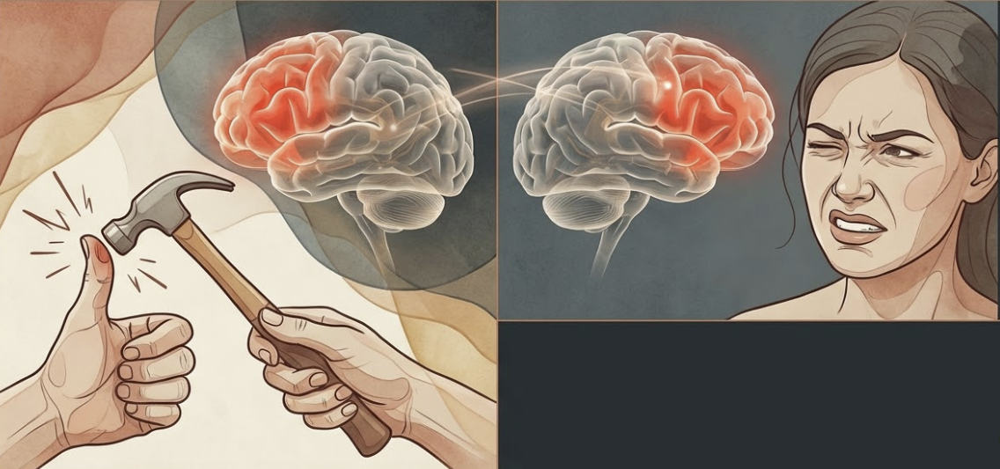
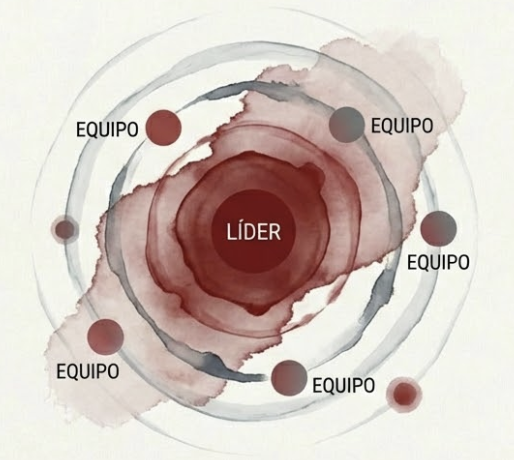
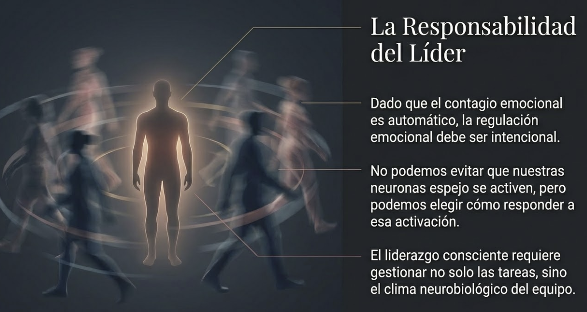
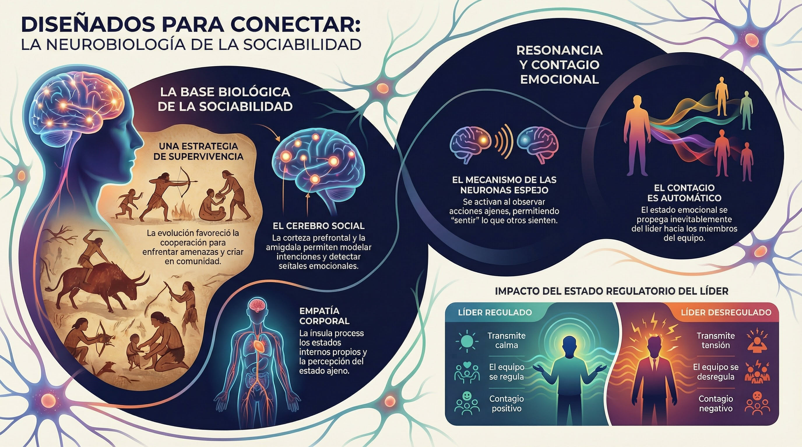

# Tema 1: Disenados para la conexion

- [Por que este tema es necesario](#por-que-este-tema-es-necesario)
	- [Las bases neurobiologicas de la sociabilidad humana](#las-bases-neurobiologicas-de-la-sociabilidad-humana)
- [1. La sociabilidad como estrategia de supervivencia](#1-la-sociabilidad-como-estrategia-de-supervivencia)
- [2. El cerebro social](#2-el-cerebro-social)
- [3. Neuronas espejo: el mecanismo de la resonancia](#3-neuronas-espejo-el-mecanismo-de-la-resonancia)
- [4. El contagio emocional](#4-el-contagio-emocional)
- [Conexiones](#conexiones)
- [Dimension experiencial](#dimension-experiencial)
- [Referencias incluidas](#referencias-incluidas)
- [Material adicional del tema](#material-adicional-del-tema)
	- [Infografías del tema](#infografías-del-tema)

#imagen  Imagen de cabecera: red de nodos luminosos con puente, metáfora visual de la interconexión humana

---
## Por que este tema es necesario

#### Las bases neurobiologicas de la sociabilidad humana

**Pregunta que responde:**
Estamos hechos para conectar? Cual es la base neurobiologica?

Este tema establece la base biologica de la conexion social. Descubriras que la necesidad de conexion no es debilidad ni preferencia personal; es diseno evolutivo codificado en el cerebro.

#grafica  Resumen en 4 cuadrantes: Supervivencia, Resonancia, Contagio y Elección como claves del tema

---

## 1. La sociabilidad como estrategia de supervivencia

La sociabilidad humana no es un lujo moderno; es una estrategia de supervivencia que se remonta a los primeros primates. La evolución ha favorecido el desarrollo de habilidades sociales —empatía, cooperación, cuidado— porque aumentan las posibilidades de supervivencia y reproducción en entornos grupales.

En los grupos de primates, la capacidad para establecer alianzas y colaborar resultó esencial para enfrentar amenazas, cazar, recolectar alimentos y criar a las crías. La selección natural favoreció a los individuos que desarrollaban comportamientos prosociales: vivir en comunidad aumentaba sus probabilidades de sobrevivir y protegerse. Este impulso evolutivo se reflejó en el desarrollo de estructuras cerebrales como la corteza prefrontal y la amígdala, asociadas con la regulación de emociones, la empatía y el reconocimiento de las intenciones de otros.

#imagen  Paralelo visual primates cooperando vs equipo profesional: la sociabilidad como estrategia evolutiva

---

## 2. El cerebro social

#grafica  "El Hardware de la Conexión": diagrama craneal con corteza prefrontal medial, amígdala e ínsula

Estructuras cerebrales especificas sustentan la conexion:

**Corteza prefrontal medial
- Procesa informacion sobre uno mismo y los demas
- Permite "modelar" la mente del otro
- Base de la teoria de la mente

**Amigdala
- Detecta senales emocionales en otros
- Responde a expresiones faciales, tono de voz
- Sintoniza rapidamente con el estado del otro

**Insula
- Ya conocida de M2
- Procesa no solo estados propios, sino tambien la percepcion del estado de otros
- Base de la empatia corporal

---

## 3. Neuronas espejo: el mecanismo de la resonancia

#grafica  Esquema actor-observador: activación cerebral simétrica que demuestra el mecanismo de neuronas espejo

#grafica  Ejemplo ilustrado de neuronas espejo: golpe en el dedo y observadora sintiendo dolor vicariamente

Descubiertas en los anos 90, las neuronas espejo se activan:
- Cuando realizas una accion
- Cuando observas a otra persona realizarla

Este sistema permite "sentir" lo que otros sienten. Es el fundamento neurologico de:
- La empatia
- La imitacion
- El aprendizaje social
- La conexion emocional

Cuando ves a alguien sufrir, parte de tu cerebro "sufre" tambien.

---

## 4. El contagio emocional

#imagen  Diagrama concéntrico: ondas emocionales del líder (centro) propagándose hacia el equipo

M4 menciono que el estado del lider se propaga. Ahora vemos el mecanismo:

1. Observas el estado emocional de otra persona
2. Neuronas espejo se activan
3. Tu propio estado se ajusta
4. Respondes (conscientemente o no) a ese ajuste

El contagio emocional es automatico. La pregunta es: lo usas conscientemente?

#grafica  Silueta del líder con equipo: la regulación emocional intencional como responsabilidad del liderazgo

---

## Conexiones

**Conexion con M1

M1 mostro que el cerebro construye la realidad mediante prediccion.

Parte de esa construccion incluye **modelar la mente de otros**:
- Que piensa el otro?
- Que siente?
- Que va a hacer?

El cerebro social es parte del sistema predictivo.

**Conexion con M2

M2 mostro que el cuerpo es fuente de informacion.

En las relaciones, el cuerpo tambien informa sobre el otro:
- Tension que sientes cuando alguien esta tenso
- Relajacion que sientes cuando alguien esta calmado
- Incomodidad que sientes cuando algo "no cuadra"

La interocepcion (M2) tambien opera en el espacio interpersonal.

**Conexion con M4

M4 mostro que el estado del lider se propaga.

Ahora entiendes por que: el contagio emocional esta cableado en el cerebro.

| Lider regulado | Lider desregulado |
|----------------|-------------------|
| Transmite calma | Transmite tension |
| El equipo se regula | El equipo se desregula |
| Contagio positivo | Contagio negativo |

El autocuidado (M4) tiene impacto sistemico porque el contagio es automatico.

---

## Dimension experiencial #insight

Reflexiona:

- Has sentido como el estado de alguien cambia el tuyo?
- En reuniones, notas como el "clima emocional" influye en ti?
- Cuando fue la ultima vez que sentiste una conexion genuina? Que lo hizo posible?

---

## Referencias incluidas

**Otras posibles referencias de interés
- Goleman, D. (2006). *Social Intelligence: The New Science of Human Relationships.* Bantam.
- Rizzolatti, G. & Craighero, L. (2004). *The mirror-neuron system.* Annual Review of Neuroscience.
- Iacoboni, M. (2008). *Mirroring People: The New Science of How We Connect with Others.* Farrar, Straus and Giroux.

---
## Material adicional del tema #aux
### Infografías del tema 

#infografia  Base biológica de la sociabilidad, neuronas espejo, contagio emocional e impacto del estado regulatorio del líder