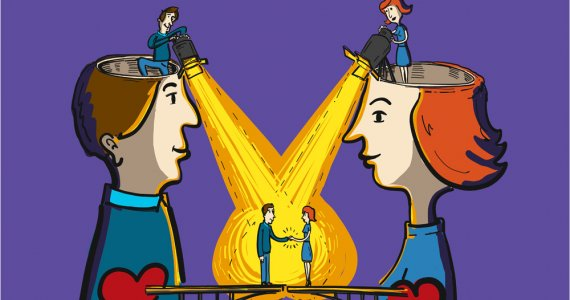

# La naturaleza relacional del liderazgo

## Las bases neurocientíficas de la conexión social

#cita
"Las relaciones interpersonales son el tejido esencial del liderazgo humano, y la consciencia es el hilo que las mantiene fuertes y flexibles"
— **Rasmus Hougaard**, *Compassionate Leadership*[^1]

Este módulo explora cómo reconocer y responder a las necesidades de los demás en el entorno laboral, utilizando prácticas de mindfulness para desarrollar empatía, comunicación y cohesión en los equipos.

#imagen
 Ilustración de dos cabezas de perfil enfrentadas sobre fondo morado. De sus cabezas abiertas emergen rayos amarillos que se conectan en el centro. Pequeñas figuras humanas interactúan sobre las cabezas. Ambas figuras tienen un corazón visible en el pecho.

#### La sociabilidad como estrategia de supervivencia

La sociabilidad humana no es un lujo moderno; es una estrategia de supervivencia que se remonta a los primeros primates. La evolución ha favorecido el desarrollo de habilidades sociales —empatía, cooperación, cuidado— porque aumentan las posibilidades de supervivencia y reproducción en entornos grupales.

En los grupos de primates, la capacidad para establecer alianzas y colaborar resultó esencial para enfrentar amenazas, cazar, recolectar alimentos y criar a las crías. La selección natural favoreció a los individuos que desarrollaban comportamientos prosociales: vivir en comunidad aumentaba sus probabilidades de sobrevivir y protegerse. Este impulso evolutivo se reflejó en el desarrollo de estructuras cerebrales como la corteza prefrontal y la amígdala, asociadas con la regulación de emociones, la empatía y el reconocimiento de las intenciones de otros.

#### Neuronas espejo: el mecanismo de la resonancia

Las neuronas espejo juegan un papel crucial en este vínculo. Descubiertas en los años 90, estas neuronas se activan tanto cuando realizamos una acción como cuando observamos a otra persona realizarla. El sistema permite "sentir" lo que otros sienten —fundamento de la empatía y la conexión emocional.

#### La amígdala y la respuesta emocional

La amígdala, región del cerebro encargada de procesar emociones intensas, responde a señales emocionales de los demás: expresiones faciales, tono de voz. Esta respuesta ocurre de manera casi automática y permite sintonizar rápidamente con el estado emocional de la otra persona.

#imagen
 Fotografía de un grupo numeroso de babuinos reunidos en un entorno natural rocoso. Los primates están en diversas posiciones, algunos sentados, otros de pie, mostrando la naturaleza grupal y social de estos animales.

---

## Relación Yo-Tú vs Yo-Ello

La manera en que se percibe y relaciona con los demás influye profundamente en la calidad de las conexiones. Dos modos fundamentales marcan esta diferencia.

#### Relación Yo-Ello

En la relación Yo-Ello, la otra persona es vista como un objeto o herramienta que existe para cumplir una función o satisfacer una necesidad específica. Esta visión reduce a la persona a su rol o a sus resultados, deshumanizando la relación. En lugar de valorarla como un ser humano completo, se percibe como un medio para alcanzar un objetivo.

#ejemplo
Un líder que interactúa con sus colaboradores únicamente desde el interés en los resultados que pueden aportar, sin interesarse en su bienestar o en sus motivaciones personales.

#### Relación Yo-Tú

En la relación Yo-Tú, el otro es visto como un individuo completo y valioso, con identidad propia, emociones y necesidades. Este tipo de relación implica respeto y empatía. Se basa en el reconocimiento mutuo y en una interacción auténtica, donde ambas partes se perciben y valoran como seres humanos.

#ejemplo
Un líder que conversa con un colaborador mostrando interés genuino en sus perspectivas y experiencias, sin reducirlo solo a su rol o a su productividad.

#imagen
 Ilustración conceptual de una figura humana con una caja de cartón abierta en lugar de cabeza, sobre fondo gris verdoso. Representa la despersonalización o cosificación del otro en las relaciones Yo-Ello.

---

[^1]: Rasmus Hougaard. *Compassionate Leadership*.
