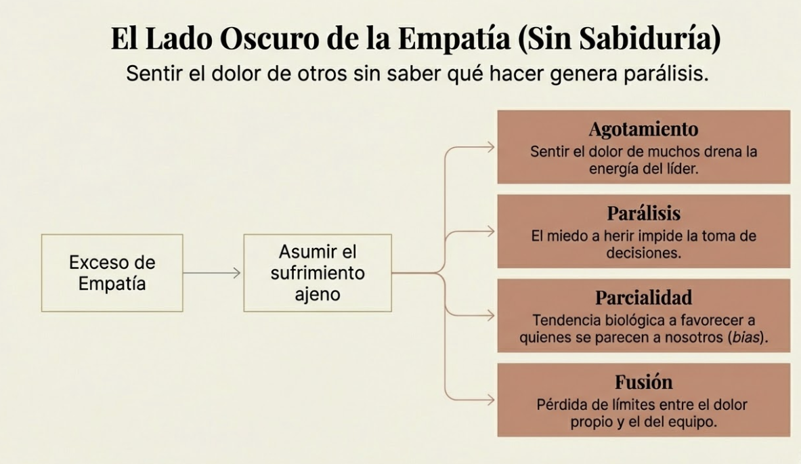
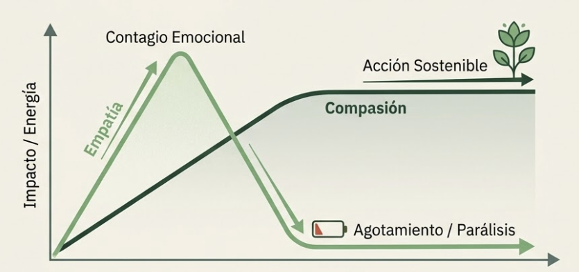
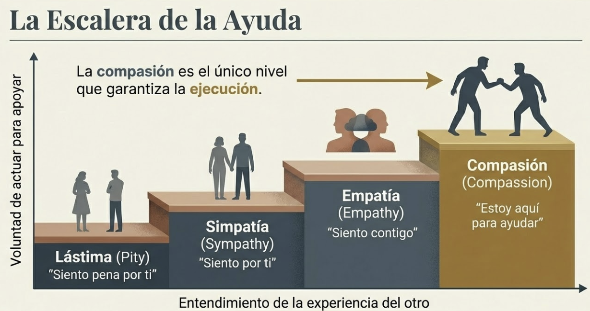
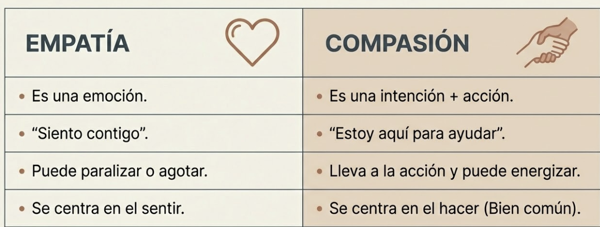
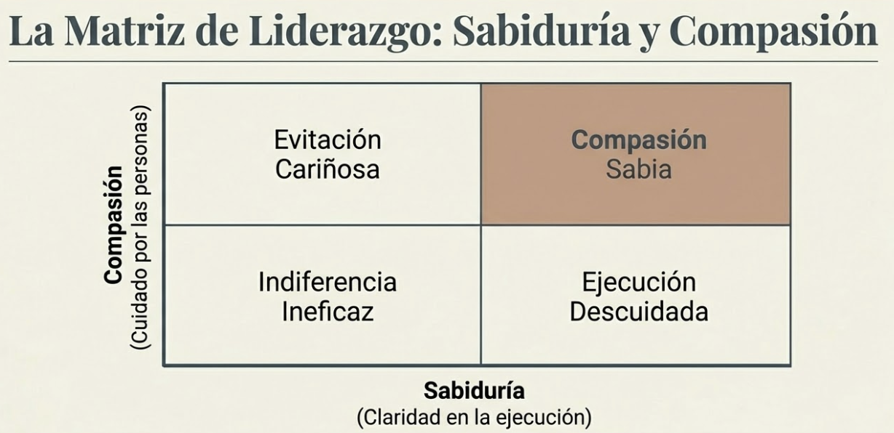
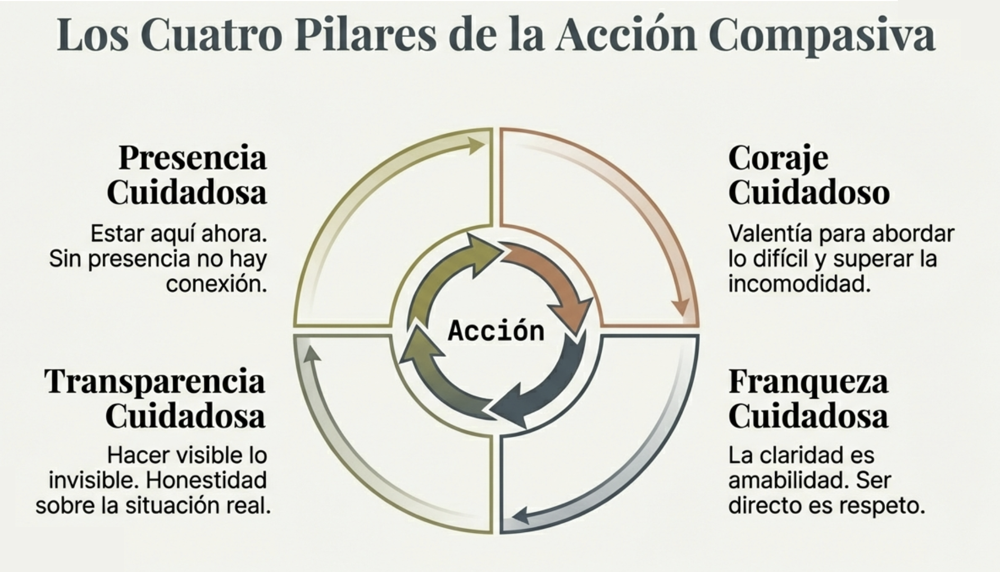
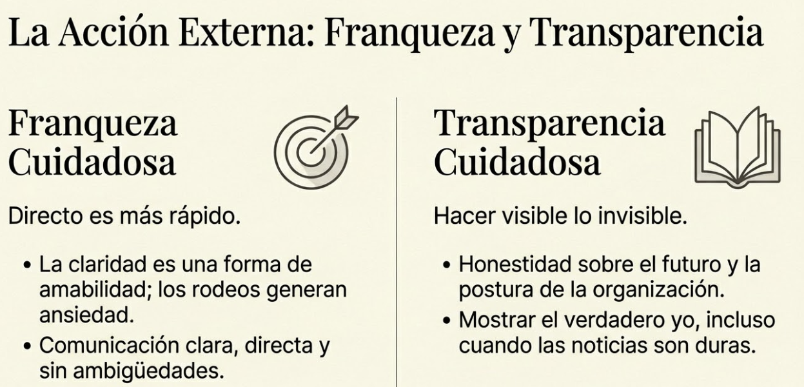

# Tema 5: Compasion sabia

- [Por que este tema es necesario](#por-que-este-tema-es-necesario)
	- [La diferencia entre empatia y compasion](#la-diferencia-entre-empatia-y-compasion)
- [1. Conectar con empatía, liderar con compasión](#1-conectar-con-empatía-liderar-con-compasión)
	- [1.1 Empatia: sentir con el otro](#11-empatia-sentir-con-el-otro)
	- [1.2 Compasion: sentir con el otro + actuar](#12-compasion-sentir-con-el-otro-actuar)
- [2. La matriz de la compasion sabia](#2-la-matriz-de-la-compasion-sabia)
- [3. El flywheel de la compasion](#3-el-flywheel-de-la-compasion)
- [4. Evidencia del impacto](#4-evidencia-del-impacto)
- [Conexiones](#conexiones)
- [Dimension experiencial](#dimension-experiencial)
- [Referencias incluidas](#referencias-incluidas)
- [Material adicional del tema](#material-adicional-del-tema)
	- [Infografías del tema](#infografías-del-tema)

---

## Por que este tema es necesario

#### La diferencia entre empatia y compasion

**Pregunta que responde:**
Cual es la diferencia entre empatia y compasion, y por que importa?

Este tema distingue empatia de compasion. La empatia sin sabiduria puede paralizar o agotar. La compasion sabia combina conexion emocional con accion efectiva.

#ppt  Diapositiva de título: "Compasión Sabia: Liderar con humanidad ejecutando lo difícil"

---
## 1. Conectar con empatía, liderar con compasión

La compasión no significa complacer ni dar siempre lo que se pide. Puede ser firme y directa —como cuando se aborda un comportamiento inapropiado—. La clave está en la intención: ayudar a la persona a cambiar para lograr mejores resultados para todos.

#### 1.1 Empatia: sentir con el otro

**Definicion

Empatia es la capacidad de sentir lo que otro siente. Resonar emocionalmente con su experiencia. Permite comprender y compartir las emociones de los demás. Es una cualidad humana valiosa, pero en el contexto del liderazgo puede tener desventajas.

**Valor

- Permite conectar
- Base de la comprension
- Humaniza al otro

**Limite

La empatia **sin mas** puede ser problematica:

#grafica  "El Lado Oscuro de la Empatía": exceso de empatía → agotamiento, parálisis, parcialidad y fusión

| Problema | Descripcion |
|----------|-------------|
| Agotamiento | Sentir el dolor de muchos agota |
| Paralisis | Sentir el dolor sin saber que hacer paraliza |
| Parcialidad | Sientes mas empatia por quienes se parecen a ti |
| Fusion | Perder los limites entre tu dolor y el del otro |

#### 1.2 Compasion: sentir con el otro + actuar

**Definicion

Compasion es:
1. Reconocer el sufrimiento del otro
2. Desear que ese sufrimiento disminuya
3. Actuar para ayudar

**La distincion clave

#grafica  Curvas de impacto/energía: empatía sube y cae (agotamiento) vs compasión sostiene acción

#grafica  "La Escalera de la Ayuda": lástima → simpatía → empatía → compasión (único nivel que garantiza ejecución)

**La compasión es una intención; la empatía es una emoción.** Sentir empatía por alguien que sufre puede llevar a asumir ese sufrimiento —no siempre beneficioso—. La compasión implica dar un paso atrás y preguntarse qué se puede hacer para apoyar a esa persona.

**La compasión lleva a la acción; la empatía puede paralizar.** La empatía sin acción conduce a la "evasión cariñosa": evitar decisiones difíciles por miedo a herir sentimientos. La compasión, orientada a la acción, permite tomar decisiones difíciles —incluso dolorosas— con el objetivo de beneficiar a todos.

**La compasión se centra en el bien común; la empatía puede ser divisiva.** La empatía puede llevar a favorecer a quienes generan mayor conexión personal, creando divisiones. La compasión busca el bienestar de todos, promoviendo unión e inclusión.

#grafica  Tabla comparativa: Empatía (emoción, puede paralizar) vs Compasión (intención+acción, puede energizar)

| Empatia | Compasion |
|---------|-----------|
| Es una emocion | Es una intencion + accion |
| "Siento contigo" | "Estoy aqui para ayudar" |
| Puede paralizar | Lleva a la accion |
| Puede agotar | Puede energizar |
| Se centra en el sentir | Se centra en el hacer |
Liderazgo compasivo: la capacidad de hacer cosas difíciles de manera humana. Combina la sabiduría de saber qué hacer con la compasión de cuidar a las personas impactadas por las decisiones. El éxito a largo plazo depende de crear entornos donde las personas se sientan valoradas, respetadas y seguras.

---

## 2. La matriz de la compasion sabia

**The Wise Compassion Leadership Matrix**
Compare this leadership style to three other common ones.

#grafica  Matriz 2x2 de Hougaard[^1]: Compasión × Sabiduría → evitación cariñosa, compasión sabia, indiferencia ineficaz, ejecución descuidada

Rasmus Hougaard propone una matriz de dos ejes:

**Eje vertical:** Compasion ↔ Indiferencia
**Eje horizontal:** Ignorancia ↔ Sabiduria

| | Alta compasion | Baja compasion |
|-|----------------|----------------|
| **Alta sabiduria** | COMPASION SABIA | EJECUCION DESCUIDADA |
| **Baja sabiduria** | EVITACION CARIÑOSA | INDIFERENCIA INEFICAZ |

**Los cuatro cuadrantes

#grafica  Versión ilustrada de la matriz con íconos y descripciones por cuadrante (adaptada de Compassionate Leadership)

**Compasion sabia (alta compasion + alta sabiduria)**
- Hace cosas dificiles de manera humana
- Combina cuidado con claridad
- El liderazgo ideal

**Evitacion carinosa (alta compasion + baja sabiduria)**
- Evita decisiones dificiles por miedo a herir
- La empatia se convierte en barrera para la accion
- "No le digo porque le va a doler"

**Ejecucion descuidada (baja compasion + alta sabiduria)**
- Pone resultados por encima del bienestar
- Eficiente pero deshumanizante
- "Solo importa el numero"

**Indiferencia ineficaz (baja compasion + baja sabiduria)**
- Falta de interes y de competencia
- El peor escenario

---

## 3. El flywheel de la compasion

#grafica  Rueda de los 4 pilares de la acción compasiva: Presencia, Coraje, Franqueza y Transparencia

Cuatro elementos que se refuerzan mutuamente[^2]:

#grafica  "La Base Interna": Presencia Cuidadosa (mindfulness) y Coraje Cuidadoso (superar la comodidad)

**1. Presencia cuidadosa (Caring Presence)

El liderazgo tiene que ver con la conexión, y no hay posibilidad de conexión si no estamos presentes. Cuando estamos presentes, estamos en el momento, prestando toda nuestra atención a las personas que nos rodean. La atención plena es una forma útil de contrarrestar esta tendencia, ya que nos ayuda a estar más presentes en lo que está sucediendo en este momento.

"Estar aqui ahora"
- Sin presencia no hay conexion
- Mindfulness es la base
- Curiosidad sin suposiciones

**2. Coraje cuidadoso (Caring Courage)

Como seres humanos, estamos programados para buscar la certeza y la seguridad y evitar el peligro y la incomodidad. Superar nuestra tendencia a buscar la comodidad requiere valentía: la fuerza interior para superar nuestros miedos o temores ante una situación, de modo que podamos tomar las medidas necesarias.

"Coraje sobre comodidad"
- Superar el miedo a la incomodidad
- Tener conversaciones dificiles
- Confiar en la intuicion
-
#grafica  "La Acción Externa": Franqueza Cuidadosa (claridad es amabilidad) y Transparencia Cuidadosa (hacer visible lo invisible)

**3. Franqueza cuidadosa (Caring Candour)

Como líderes, debemos encontrar el equilibrio entre la franqueza y el cuidado para crear una cultura que sea amable y directa. Ser directo y sincero es siempre la forma más rápida y eficaz de entablar una conversación.

"Directo es mas rapido"
- Comunicacion clara y directa
- Sin rodeos innecesarios
- La claridad es amabilidad

**4. Transparencia cuidadosa (Caring Transparency)

La transparencia solidaria significa expresar abiertamente las ideas y los pensamientos, haciendo visible lo invisible. Significa ser abierto y honesto sobre cuál es tu postura y qué le espera a la organización.

"La claridad es amabilidad"
- Hacer visible lo invisible
- Ser honesto sobre donde estas
- Mostrar tu verdadero yo

---

## 4. Evidencia del impacto

Investigacion de Potential Project:

**Beneficios para los líderes

- **Menos estrés y agotamiento:** La compasión permite afrontar situaciones difíciles con mayor ecuanimidad y resiliencia, evitando la sobrecarga emocional.

- **Mayor bienestar y felicidad:** Conectar con un sentido de propósito y significado en el trabajo genera mayor satisfacción personal.

- **Menor intención de renunciar:** La compasión fomenta mayor compromiso y lealtad hacia la organización.

- **Mayor eficacia:** Los líderes compasivos se sienten más seguros de su capacidad para liderar a otros.

**Beneficios para los equipos

- **Mayor satisfacción laboral:** La compasión crea un ambiente de trabajo más positivo y de apoyo, donde las personas se sienten valoradas y respetadas.

- **Mayor compromiso organizacional:** Genera un sentimiento de pertenencia y lealtad hacia la empresa, traducido en mayor esfuerzo y dedicación.

- **Mejor rendimiento:** El liderazgo compasivo fomenta motivación, colaboración e innovación. Crea un entorno donde las personas se sienten seguras para tomar riesgos y dar lo mejor de sí mismas.

- **Menor agotamiento:** La compasión crea un ambiente de trabajo más saludable y equilibrado, donde las personas se sienten apoyadas y protegidas.

**Datos de investigación

- Los líderes que se califican a sí mismos como altamente compasivos reportan un 66% menos de estrés y un 63% menos de agotamiento que sus contrapartes menos compasivos[^3].
- Los líderes compasivos tienen una intención 200% menor de renunciar a su organización.
- Los empleados que perciben a su líder como compasivo tienen un 34% más de satisfacción laboral.
- Los empleados que experimentan un liderazgo compasivo muestran un 36% más de compromiso con la organización.
- Los empleados que trabajan para líderes compasivos experimentan un 22% menos de agotamiento.
- Los colaboradores cuyos líderes muestran una preferencia por la compasión están un 25% más comprometidos con sus trabajos.
- Los colaboradores de líderes compasivos tienen un riesgo 11% menor de agotamiento.

---

## Conexiones

**Conexion con M4

M4 mostro que el autocuidado no es lujo.

La compasion sabia es sostenible porque:
- No te funde con el dolor del otro
- Incluye accion, que genera energia
- No depende de "salvarte sintiendo"

La compasion sabia **es** autocuidado extendido.

**Conexion con T3

T3 establecio la autocompasion como base.

La matriz de compasion sabia aplica primero a uno mismo:
- Evitar la "evitacion carinosa" contigo (no confrontar tus fallos)
- Evitar la "ejecucion descuidada" contigo (exigirte sin cuidarte)

---

## Dimension experiencial #insight

Reflexiona:

- En cual cuadrante tiendes a operar?
- Hay situaciones donde la empatia te paraliza?
- Cuando la compasion te ha llevado a actuar con claridad?

El lider compasivo no evita las decisiones dificiles. Las toma de manera humana.

---

## Referencias incluidas
[^1]: Rasmus Hougaard. The Wise Compassion Leadership Matrix. Harvard Business Review.
[^2]: Potential Project. The Wise Compassion Flywheel.
[^3]: Potential Project. Investigación sobre liderazgo compasivo y bienestar organizacional.

**Otras posibles referencias de interés
- Hougaard, R. & Carter, J. (2022). *Compassionate Leadership.* Harvard Business Review Press.
- Singer, T. & Klimecki, O.M. (2014). *Empathy and compassion.* Current Biology.
- Goetz, J.L., Keltner, D. & Simon-Thomas, E. (2010). *Compassion: An evolutionary analysis and empirical review.* Psychological Bulletin.

---
## Material adicional del tema #aux
### Infografías del tema 

#infografia  Compasión sabia vs empatía: matriz del liderazgo sabio, impacto en estrés, retención y satisfacción