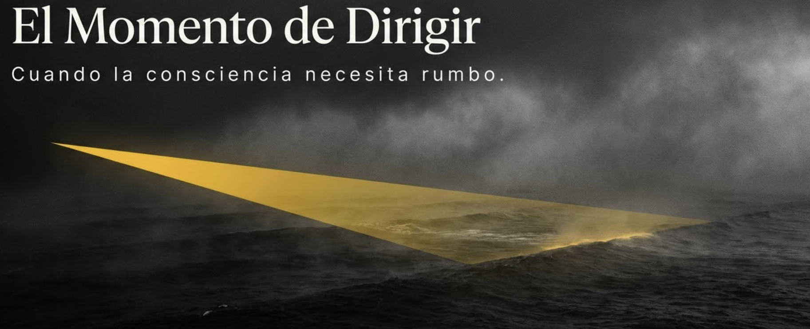
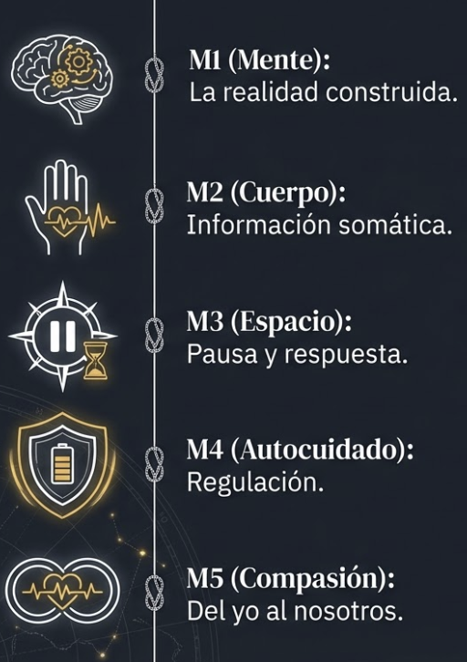
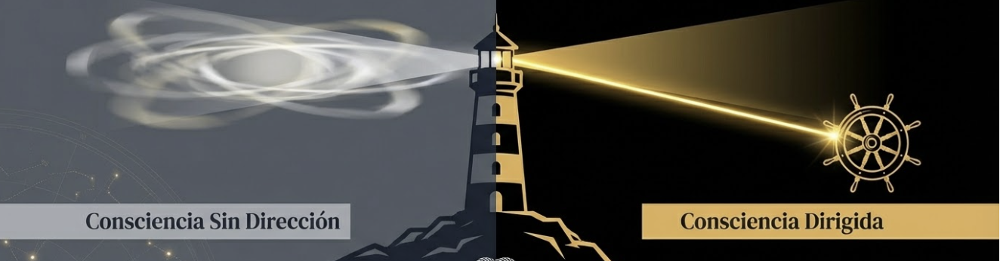
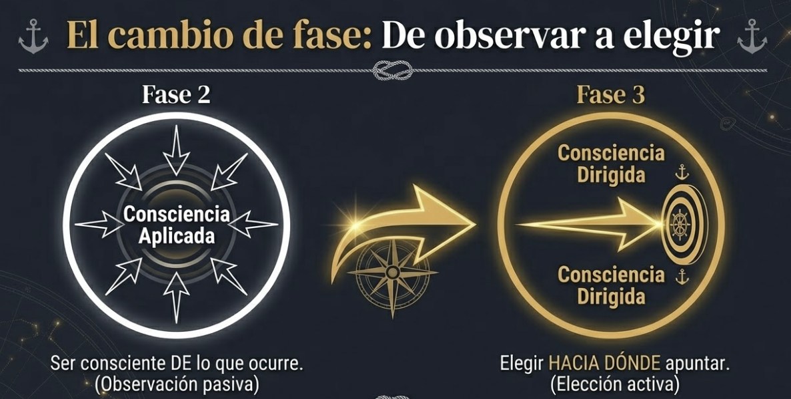
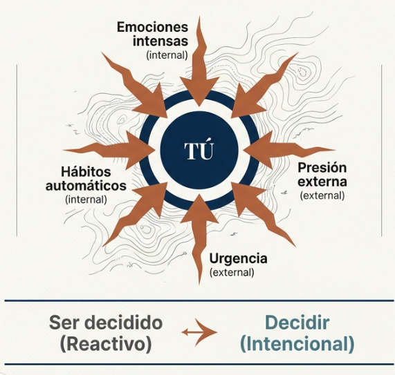
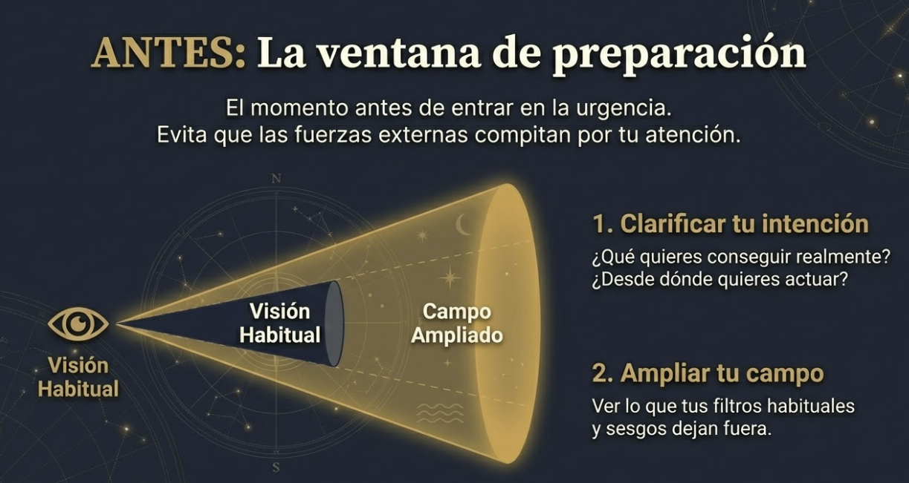
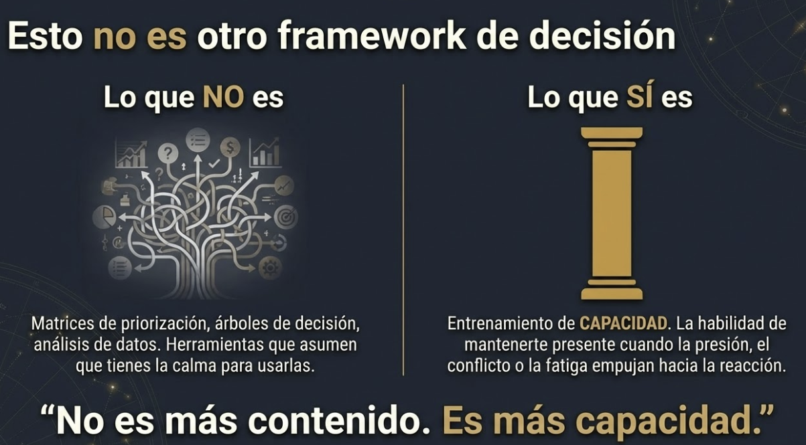
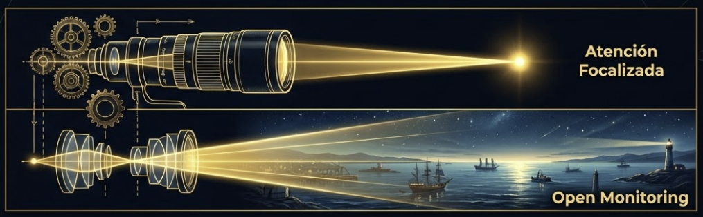
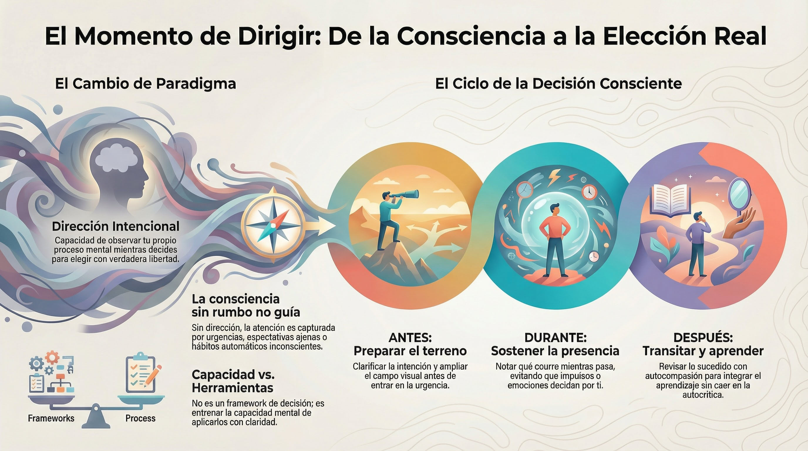

# Apertura: El momento de dirigir

## Cuando la consciencia necesita rumbo

#imagen  Faro con haz dorado sobre mar oscuro: "El Momento de Dirigir — Cuando la consciencia necesita rumbo"

**Pregunta que abre este módulo:**
¿Hacia dónde dirijo mi consciencia — y cómo sé que lo estoy eligiendo yo?

---

## Lo que traes hasta aquí

Has recorrido un camino. En M1 descubriste algo incómodo: tu mente construye la realidad más de lo que la percibe. No eres tan racional como creías. En M2 aprendiste a leer tu cuerpo como fuente de información — señales que antes ignorabas ahora te hablan. En M3 desarrollaste la capacidad de crear un espacio entre lo que te pasa y cómo respondes. Ya no reaccionas automáticamente a todo.

#grafica  Progresión vertical M1→M5 con iconos: mente, cuerpo, espacio, autocuidado, compasión — lo que traes hasta aquí
En M4 aplicaste esa consciencia a tu propio cuidado: regularte cuando el estrés aprieta, sostener tu recurso más valioso. En M5 extendiste la mirada hacia los demás: del yo al nosotros, compasión que incluye sabiduría.

Tienes herramientas. Sabes observar. Puedes regular. Conectas con otros.

**Pero hay algo que todo eso no resuelve.**

---

## La brecha que este módulo cubre

Puedes ser muy consciente y aun así:

#imagen  Faro dividido: "Consciencia Sin Dirección" (luz difusa) vs "Consciencia Dirigida" (haz enfocado con timón)

- Perseguir metas que nunca elegiste conscientemente
- Dejarte arrastrar por urgencias que no son tuyas
- Entrar en decisiones importantes sin saber qué quieres realmente
- Responder a lo que captura tu atención en lugar de actuar desde lo que importa

La consciencia sin dirección es como un faro que gira sin rumbo. Ilumina, pero no guía.

Los módulos anteriores desarrollaron tu capacidad de **ser consciente de**. Este módulo desarrolla tu capacidad de **dirigir** esa consciencia hacia donde tú elijas. No solo observar — elegir hacia dónde mirar y actuar desde ahí.

Esta es la diferencia entre Fase 2 (Consciencia Aplicada) y Fase 3 (Consciencia Dirigida). Ya no usas la consciencia solo como herramienta para regularte o relacionarte. Ahora eliges activamente hacia dónde apuntarla.

#grafica  "El cambio de fase": Fase 2 Consciencia Aplicada (observación pasiva) → Fase 3 Consciencia Dirigida (elección activa)

---

## Dónde se juega esta capacidad: la decisión

Hay un momento donde la dirección intencional se pone a prueba de verdad: cuando decides.

No hablamos de qué desayunar o qué ruta tomar al trabajo. Hablamos de las decisiones que importan: conversaciones difíciles, negociaciones con consecuencias, elecciones estratégicas, momentos donde lo que hagas ahora condiciona lo que venga después.

En esos momentos, la consciencia que has desarrollado se encuentra con fuerzas que quieren decidir por ti. Emociones intensas. Presión del entorno. Hábitos automáticos. Expectativas de otros. Urgencia que empuja.

#grafica  Opción 1: "TÚ" al centro rodeado de 4 fuerzas (emociones, presión externa, hábitos, urgencia); flecha reactivo → intencional

#grafica  Opción 2: Silueta cabeza con caos mental; emociones intensas, presión y urgencia, hábitos automáticos, expectativas de otros

Si no sabes hacia dónde dirigir tu consciencia, esas fuerzas tomarán el control. Decidirás — pero no serás tú quien decida realmente.

---

## El mapa del módulo: ANTES – DURANTE – DESPUÉS

Este módulo estructura el proceso de decisión consciente en tres momentos:

**ANTES: Preparar el terreno**

Antes de entrar en cualquier decisión importante hay una ventana de preparación. Un momento donde todavía no estás dentro del problema, la conversación o la urgencia.

La mayoría ignora esta ventana. Entra directamente. Y ahí, sin preparación, las fuerzas que operan empiezan a competir por su atención.

El ANTES incluye dos movimientos:
- **Clarificar tu intención**: Saber qué quieres conseguir y desde dónde quieres actuar.
- **Ampliar tu campo**: Ver lo que tus filtros habituales dejan fuera.
- 
#ppt  "ANTES: La ventana de preparación" — clarificar intención + ampliar campo visual

**DURANTE: Sostener la consciencia en el momento**

#ppt  "DURANTE: Sostenerse en el fuego" — meta-consciencia, sostener impulso, retorno al centro

Una vez dentro, la preparación se pone a prueba. Las fuerzas de captura no esperan. Emociones, impulsos, presiones — todo quiere decidir por ti.

El DURANTE trabaja:
- **Notar qué está pasando mientras pasa** (meta-consciencia).
- **Sostener el impulso sin actuar automáticamente**.
- **Volver cuando te has desviado**.

**DESPUÉS: Transitar lo que ha pasado**

#ppt  "DESPUÉS: Integración y aprendizaje" — cuidarte, estar con lo que pasó, aprender sin flagelarte

La decisión no termina cuando eliges. Las consecuencias se despliegan, aparece el material para aprender — o para destruirte con autocrítica.

El DESPUÉS trabaja:
- **Cuidarte antes de revisar**.
- **Estar con lo que ha pasado** sin huir ni quedarte atrapado.
- **Aprender sin flagelarte** (autocompasión como base del aprendizaje).

---

## Lo que no es este módulo

#grafica  "Esto no es otro framework de decisión": Lo que NO es (matrices, árboles) vs Lo que SÍ es (entrenamiento de capacidad)

Este módulo no te dará un framework de toma de decisiones. No encontrarás aquí matrices de priorización, árboles de decisión ni técnicas de análisis.

Esas herramientas tienen su lugar. Pero asumen algo que no siempre es verdad: que puedes aplicarlas con claridad cuando más importa.

La formación tradicional enseña **qué hacer**. Este módulo entrena **la capacidad de hacerlo** — precisamente cuando la presión, el conflicto o la fatiga emocional empujan hacia la reacción automática.

No es más contenido. Es más capacidad.

---

## La transformación esperada

Al final de este módulo, la transformación no es "ahora sé decidir mejor". Es algo más sutil y más potente:

> **"Puedo observar dónde está mi atención mientras decido."**

Esa capacidad de observarte mientras actúas — notar qué te captura, qué evitas, hacia dónde te lleva el impulso — es lo que hace posible elegir de verdad. Sin ella, decides. Con ella, eres tú quien decide.

---

## La característica que este módulo desarrolla

Cada módulo cultiva una característica del líder semilla. La de M6 es:

> **Dirección intencional:** Sabe lo que quiere porque observa su proceso.

No es claridad porque ha pensado mucho. Es claridad porque puede ver cómo opera su propia mente mientras decide — y desde ahí, elegir.

---

## Conexión con la práctica

La práctica que acompaña este módulo es **Open Monitoring** (Monitorización Abierta).

#grafica  Comparativa visual: Atención Focalizada (telescopio) vs Open Monitoring (lente panorámica sobre bahía)

A diferencia de la atención focalizada que has practicado antes — mantener la atención en un objeto como la respiración —, Open Monitoring observa el flujo completo de la experiencia sin engancharse con nada específico.

Esta práctica entrena exactamente lo que el módulo requiere:
- Ver qué aparece en tu campo de consciencia (ANTES).
- Notar qué te captura sin dejarte arrastrar (DURANTE).
- Observar lo que emerge después sin huir ni quedarte atrapado (DESPUÉS).

El Tema 4 desarrollará en profundidad cómo el mindfulness hace posible cada capacidad que trabajarás aquí.

---

## Lo que viene

El **Tema 1** entrará en el ANTES: cómo preparar el terreno antes de decidir — clarificando tu intención y ampliando tu campo para ver lo que normalmente no ves.

El **Tema 2** trabajará el DURANTE: cómo sostener la consciencia en el momento de decidir sin ser arrastrado por las fuerzas que quieren decidir por ti.

El **Tema 3** abordará el DESPUÉS: cómo transitar lo que ha pasado, aprender sin destruirte, y preparar el próximo ciclo.

El **Tema 4** cerrará el módulo mostrando cómo el entrenamiento en mindfulness hace posible todo lo anterior.

El viaje empieza en el ANTES. Vamos.

---

## Dimensión experiencial

- Piensa en una decisión importante reciente. ¿Sentiste que la dirigías tú, o que fuerzas externas o internas decidían por ti?

- ¿Cuántas de las metas que ocupan tu energía ahora mismo las elegiste conscientemente? ¿Cuántas simplemente "llegaron"?

- ¿Qué diferencia habría si pudieras observar tu proceso mientras decides, en lugar de solo ver el resultado después?

---
## Material adicional del tema #aux
### Infografías del tema 

#infografia  Cambio de paradigma: de consciencia sin rumbo a dirección intencional; ciclo ANTES-DURANTE-DESPUÉS de la decisión consciente