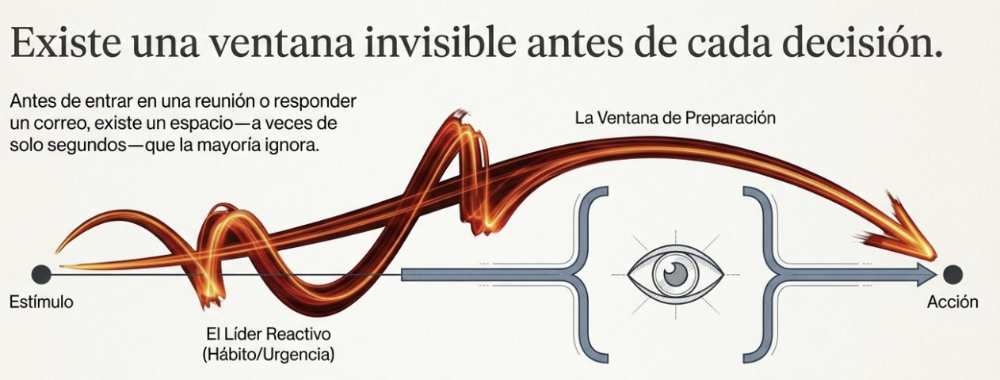
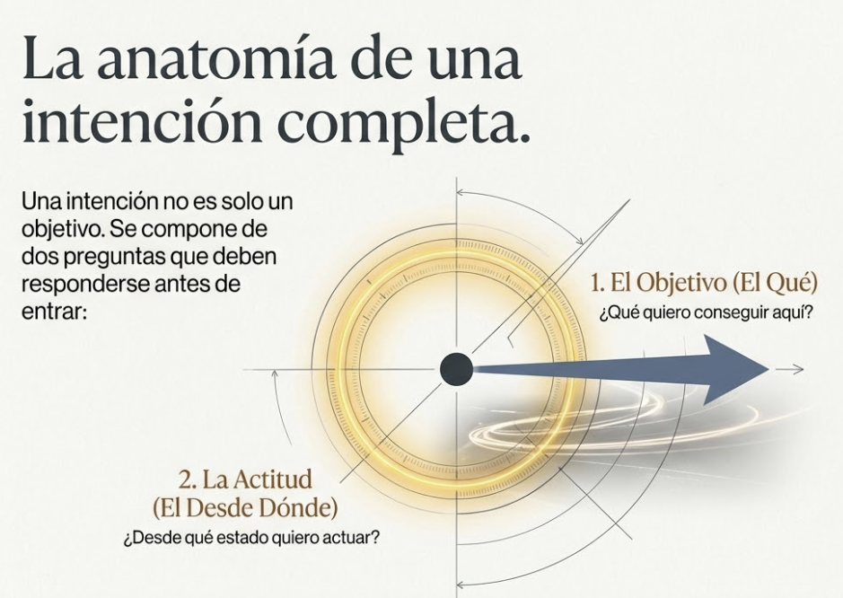
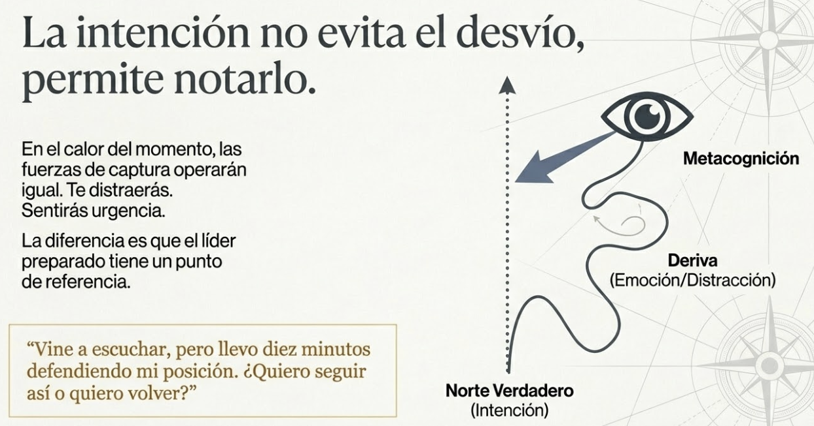
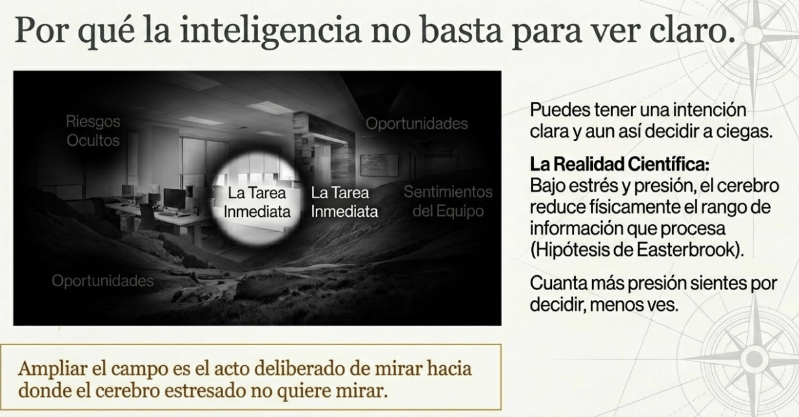
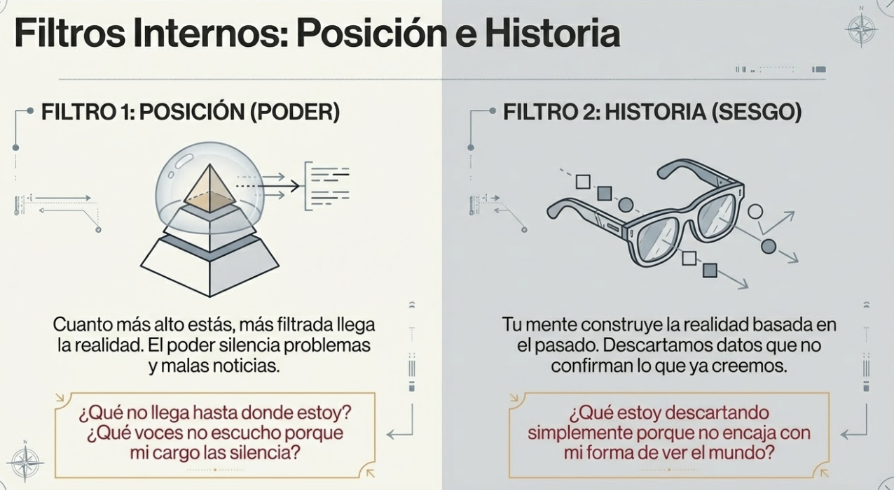
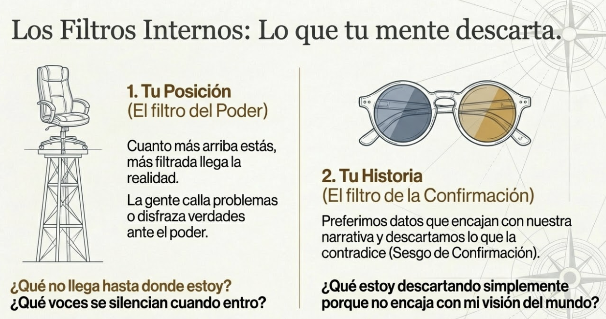
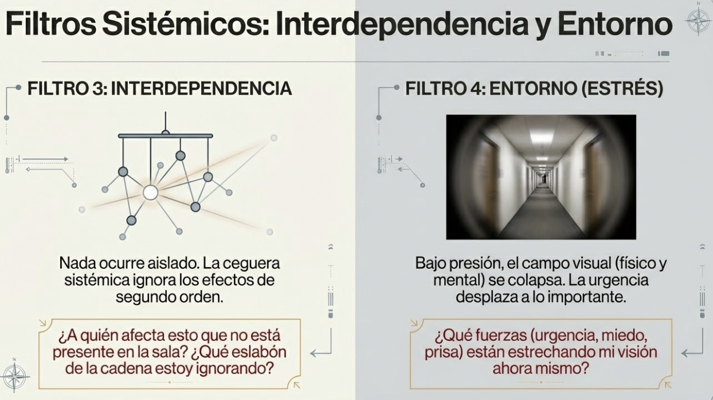
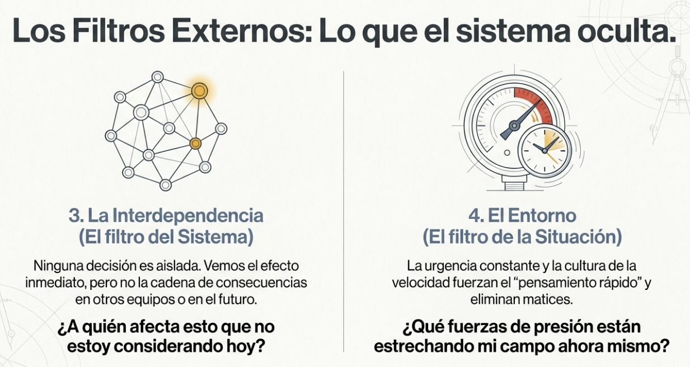
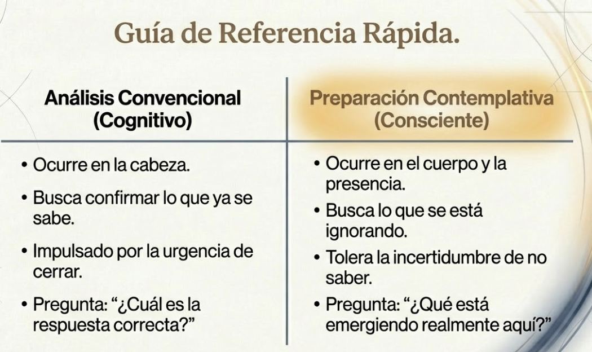

# Tema 1: Preparar la decisión

- [Por que este tema es necesario](#por-que-este-tema-es-necesario)
	- [Clarificar intencion y ampliar campo antes de decidir](#clarificar-intencion-y-ampliar-campo-antes-de-decidir)
- [1. La ventana que casi nadie usa](#1-la-ventana-que-casi-nadie-usa)
- [2. PARTE 1: CLARIFICAR LA INTENCIÓN](#2-parte-1-clarificar-la-intención)
	- [2.1 Desear no es lo mismo que elegir](#21-desear-no-es-lo-mismo-que-elegir)
	- [2.2 Qué quiero conseguir, desde dónde quiero actuar](#22-qué-quiero-conseguir-desde-dónde-quiero-actuar)
	- [2.3 La intención como brújula](#23-la-intención-como-brújula)
- [3. PARTE 2: AMPLIAR EL CAMPO](#3-parte-2-ampliar-el-campo)
	- [3.1 Saber qué quieres no es suficiente](#31-saber-qué-quieres-no-es-suficiente)
	- [3.2 Los filtros internos](#32-los-filtros-internos)
	- [3.2 Los filtros externos](#32-los-filtros-externos)
- [4. INTEGRACIÓN: PREPARAR COMO PRÁCTICA CONTEMPLATIVA](#4-integración-preparar-como-práctica-contemplativa)
	- [4.1 No es pensar más, es estar presente](#41-no-es-pensar-más-es-estar-presente)
	- [4.2 Lo diferencial de este enfoque](#42-lo-diferencial-de-este-enfoque)
- [Práctica: Preparación contemplativa](#práctica-preparación-contemplativa)
- [Práctica breve: Ancla de intención (30 segundos)](#práctica-breve-ancla-de-intención-30-segundos)
- [Conexiones](#conexiones)
- [Dimensión experiencial](#dimensión-experiencial)
- [Referencias](#referencias)
- [Material adicional del tema](#material-adicional-del-tema)
	- [Infografías del tema](#infografías-del-tema)

---

## Por que este tema es necesario

#### Clarificar intencion y ampliar campo antes de decidir

**Pregunta que responde:**
Que quiero realmente aqui — y que no estoy viendo que necesito ver?

Este tema establece el primer movimiento del proceso de decision consciente: la preparacion. Antes de cada decision importante hay una ventana que la mayoria ignora — un momento donde todavia puedes clarificar tu intencion y ampliar lo que ves.

Sin preparacion, lo que aparezca te arrastra. Con preparacion, puedes responder *desde* una intencion clara en lugar de *reaccionar a* lo que aparece.

---

## 1. La ventana que casi nadie usa

#ppt  Existe una ventana invisible antes de cada decisión: Estímulo → Líder Reactivo vs Ventana de preparación → Acción consciente

Antes de cada decisión importante hay una ventana de preparación. Un momento — a veces solo unos segundos — en el que todavía no estás dentro del problema, la conversación o la urgencia.

La mayoría de las personas ignoran esa ventana. Entran directamente en el momento. Y ahí, las fuerzas que operan — la presión, el hábito, las expectativas de otros, la urgencia de resolver — empiezan a competir por su atención.

Sin preparación, lo que aparezca te arrastra.

**El líder reactivo** entra sin preparación. Su agenda la definen las urgencias del momento: el correo que acaba de llegar, la queja que estalló, lo que otros esperan de él. Responde a lo que captura su atención.

**El líder con dirección intencional** usa la ventana de preparación. Antes de entrar, se detiene — aunque sea treinta segundos — para hacer dos cosas: clarificar qué quiere y ampliar lo que ve.

La diferencia no está en ignorar las demandas externas. Eso sería irresponsable. La diferencia está en poder responder *desde* una intención clara en lugar de *reaccionar a* lo que aparece.

---

## 2. PARTE 1: CLARIFICAR LA INTENCIÓN

#### 2.1 Desear no es lo mismo que elegir

#ppt  Desear no es lo mismo que elegir: Wanting vs Liking, Goal Contagion — metas que "pillamos" del entorno

Hay una distinción sutil pero importante que la neurociencia ha clarificado: el sistema cerebral que genera el impulso de perseguir algo (*wanting*) es diferente del sistema que genera satisfacción cuando lo obtienes (*liking*).[^1]

Puedes desear intensamente algo que, cuando lo consigues, no te satisface. Y puedes perseguir metas con mucha energía sin haberlas elegido nunca conscientemente.

**¿Cómo llegan esas metas?**

- Por lo que la organización hace visible y celebra
- Por lo que se espera de alguien en tu posición
- Por lo que persiguen las personas a tu alrededor
- Por lo que siempre has hecho

La investigación muestra que adoptamos metas del entorno de forma automática, sin ser conscientes de ello.[^2] No las elegimos; las "pillamos" como quien pilla un resfriado.

**La pregunta incómoda:** ¿Cuántas de las metas que ocupan tu energía ahora mismo las elegiste conscientemente, y cuántas simplemente llegaron?

La ventana de preparación es donde puedes hacer esa distinción. Una vez dentro del momento, es mucho más difícil preguntarse: *¿esto es lo que yo quiero, o es lo que me está arrastrando?*

#### 2.2 Qué quiero conseguir, desde dónde quiero actuar

#ppt  Opción 1: Anatomía de una intención completa — brújula con objetivo + actitud

Clarificar la intención tiene dos partes:

#grafica  Opción 2: Los dos pilares de la intención — diana (objetivo) + ojo (actitud)

**1. El objetivo:** ¿Qué quiero conseguir aquí?
Cerrar un acuerdo. Dar feedback. Tomar una decisión. Resolver un conflicto.

**2. La actitud:** ¿Desde dónde quiero actuar?
Con apertura. Con firmeza. Con curiosidad. Con voluntad de escuchar antes de hablar.

Puedes tener el mismo objetivo con intenciones muy diferentes. "Dar feedback a un colaborador" puede hacerse desde la intención de ayudarle a mejorar, o desde la intención de demostrar que tenías razón.

El objetivo es el mismo. La actitud cambia cómo te preparas, cómo escuchas, cómo respondes a lo que aparece.

Clarificar antes de entrar incluye ambas preguntas:
- ¿Qué quiero conseguir?
- ¿Desde dónde quiero actuar?

#### 2.3 La intención como brújula

#ppt  Opción 1: La intención no evita el desvío, permite notarlo — metacognición, deriva vs norte

#grafica  Opción 2: La intención como brújula — notar desviación en la niebla
La intención clara no evita que te desvíes. Las fuerzas de captura operarán igualmente en el momento (eso lo verás en el Tema 2).

Pero te da algo a lo que volver.

Sin intención clara, no tienes forma de saber si te has desviado. Con intención clara, puedes notar: "Vine a escuchar y llevo diez minutos defendiendo mi posición. ¿Quiero seguir por aquí o quiero volver?"

Esa capacidad de **notar la desviación** conecta directamente con la transformación del módulo: "Puedo observar dónde está mi atención mientras decido."

Solo puedes observar una desviación si tenías un rumbo inicial.

---

## 3. PARTE 2: AMPLIAR EL CAMPO

#### 3.1 Saber qué quieres no es suficiente

#ppt  Opción 1: La ceguera inevitable — cono 45°, 4 filtros que limitan la visión

#ppt  Opción 2: Por qué la inteligencia no basta para ver claro — Easterbrook, tarea inmediata

Puedes tener una intención impecable y aun así decidir con un campo incompleto. No por falta de inteligencia ni de voluntad, sino porque hay fuerzas que limitan lo que eres capaz de percibir — y la mayoría operan sin que te des cuenta.

Ampliar el campo antes de decidir es el segundo movimiento del ANTES: reconocer qué te limita y dirigir deliberadamente tu atención hacia donde no iría sola.

#### 3.2 Los filtros internos 

**Lo que tu posición te impide ver

#ppt  Opción 1: Filtros Internos — Posición (Filtro 1) e Historia (Filtro 2)

#ppt  Opción 2: Lo que tu mente descarta — posición + historia como filtros invisibles

Ocupas un lugar en el sistema. Ese lugar te da acceso a ciertas cosas y te ciega a otras.

Como líder, hay información que no te llega. Nadie te cuenta ciertos problemas porque temen tu reacción, porque no quieren parecer incompetentes, o simplemente porque asumen que ya lo sabes. Hay conversaciones que se detienen cuando entras en la sala. Perspectivas que callan ante ti precisamente porque tienes poder.

No es conspiración. Es la dinámica natural del poder: cuanto más arriba estás, más filtrada llega la realidad.

También hay territorios que no visitas porque tu agenda no te lleva ahí. El día a día del equipo operativo. La experiencia real del cliente que no se queja. Los efectos de tus decisiones tres niveles más abajo.

**Pregunta para el ANTES:** ¿Qué no llega hasta donde estoy? ¿Qué voces no escucho porque mi posición las silencia?

**Lo que tu historia te lleva a filtrar

En M1 exploraste algo incómodo: tu mente construye la realidad más de lo que la percibe. Esa construcción no es neutral. Está moldeada por tu historia, tus experiencias, lo que has aprendido a valorar.

Tienes preferencias que operan como filtros. Ciertas soluciones te resultan más atractivas — no porque sean mejores, sino porque encajan con tu forma de pensar. Ciertos datos te parecen más relevantes — no porque lo sean, sino porque confirman lo que ya crees. Ciertas personas te resultan más creíbles — no porque tengan razón, sino porque piensan como tú.

El líder con humildad epistemológica — la capacidad que trabajaste en M1 — sabe que su percepción no es la realidad. Y antes de una decisión importante se pregunta: ¿qué estoy dejando fuera porque no encaja con mi forma de ver?

**Pregunta para el ANTES:** ¿Qué descarto antes de considerarlo porque no encaja con mi historia, mis preferencias, mi forma de entender las cosas?

#### 3.2 Los filtros externos

#ppt  Opción 1: Filtros Sistémicos — Interdependencia (Filtro 3) y Entorno (Filtro 4)

#ppt  Opción 2: Lo que el sistema oculta — interdependencia + entorno como filtros

**Lo que la interdependencia hace invisible

Ninguna decisión ocurre aislada. Operas en un sistema de relaciones donde todo está conectado — aunque las conexiones no siempre sean visibles.

En M5 trabajaste la consciencia del "nosotros": extender tu atención hacia lo que otros necesitan. Aquí esa consciencia se aplica a la decisión: ver que lo que haces aquí afecta allá, que lo que decides hoy condiciona lo de mañana.

Implementas un cambio en un área → genera carga de trabajo en otra área que no consultaste → eso afecta la moral de un equipo → que empieza a perder talento → que impacta proyectos que ni siquiera conocías. No viste la cadena porque cada eslabón estaba fuera de tu campo inmediato. Ampliar el campo incluye ver las conexiones. No todas — eso es imposible. Pero sí preguntarte: ¿qué relaciones estoy ignorando? ¿A quién afecta esto que no está presente en mi consideración?

**Pregunta para el ANTES:** ¿Qué conexiones estoy pasando por alto? ¿Quién se verá afectado que ahora no estoy considerando?

**Lo que el entorno estrecha adicionalmente

Además de tu posición, tu historia y las interdependencias que no ves, hay fuerzas situacionales que reducen aún más tu campo.

La investigación lo documenta: bajo estrés y presión, el rango de información que somos capaces de procesar se reduce.[^3] No es metáfora; es cómo funciona el sistema nervioso. Cuanta más presión, menos ves — justo cuando más necesitarías ver.

El día a día del líder está saturado de estas fuerzas:

- **La urgencia constante** que empuja tu atención hacia lo inmediato y desplaza lo importante.
- **La presión por decidir rápido** que hace que consideres menos alternativas.[^4]
- **El estrés sostenido** que mantiene tu sistema en activación reduciendo continuamente lo que procesas.
- **Las expectativas del rol** que te presionan a parecer seguro en lugar de explorar.

**Pregunta para el ANTES:** ¿Qué fuerzas están operando ahora mismo que pueden estar estrechando mi campo más de lo habitual?

---

## 4. INTEGRACIÓN: PREPARAR COMO PRÁCTICA CONTEMPLATIVA

#### 4.1 No es pensar más, es estar presente
#ppt  Opción 1: No es pensar, es estar — Análisis Cognitivo vs Práctica Contemplativa

#ppt  Opción 2: No es pensar más, es sentir la realidad — inteligencia somática + espacio

Preparar la decisión no es hacerse preguntas y responderlas mentalmente. Eso sería análisis — puedes hacerlo perfectamente mientras permaneces capturado por tus preferencias sin darte cuenta.

Lo que proponemos es diferente: **preparar como práctica contemplativa**. No se trata de verlo todo. Eso es imposible y paralizante. Se trata de hacer una exploración deliberada antes de entrar en la decisión, sabiendo que sin ese esfuerzo consciente decidirás con un campo más reducido del que crees tener.

No se trata de pensar sobre tu intención o tus puntos ciegos. Se trata de estar con ellos. Detenerte de verdad — no mientras sigues corriendo — y permitir que emerja lo que no aparece cuando solo piensas.

Esto requiere integrar lo que ya has desarrollado:

**El cuerpo como fuente de información (M2).** Cuando consideras una opción, ¿qué sientes? ¿Dónde hay tensión? ¿Dónde hay apertura? El cuerpo sabe cosas antes de que la mente las racionalice. Esa opción que "te gusta" — ¿qué sensación la acompaña? Esa alternativa que descartas rápidamente — ¿qué incomodidad hay ahí que prefieres no mirar?

**El espacio entre estímulo y respuesta (M3).** No saltar inmediatamente a conclusiones. Quedarte en la pregunta sin forzar una respuesta. Tolerar la incertidumbre de no saber todavía. En ese espacio aparecen cosas que el pensamiento rápido no deja ver.

**La atención abierta (práctica OM).** No atención focalizada en buscar algo específico, sino atención receptiva a lo que emerge cuando te detienes con la decisión. Hay información que aparece cuando te quedas en silencio que nunca aparece cuando "piensas".

Esta es la diferencia entre saber que tienes puntos ciegos (intelectual) y experimentar cómo operan en ti ahora mismo (consciencia encarnada). La primera te da información. La segunda te transforma.

#### 4.2 Lo diferencial de este enfoque

La mayoría de la formación en liderazgo trata "ampliar perspectivas" como un ejercicio cognitivo: considera otros puntos de vista, piensa en las consecuencias, haz de abogado del diablo. Todo eso ocurre en la cabeza, y puedes hacerlo perfectamente mientras permaneces capturado por tus preferencias sin darte cuenta.

Liderar con consciencia es otra cosa. Es traer presencia al proceso. Es notar — no solo pensar — qué te atrae y qué evitas. Es sentir en el cuerpo la diferencia entre una opción que exploras con apertura y una que descartas con alivio. Es quedarte el tiempo suficiente para que emerja lo que el análisis rápido no muestra.

Esto no es más lento necesariamente. Es más honesto. Y produce decisiones de otra calidad — no porque hayas pensado más, sino porque has estado más presente con lo que realmente ocurre en ti mientras decides.

---

## Práctica: Preparación contemplativa #practica

#ppt  Práctica: La Preparación Contemplativa — 5 pasos: Detente, Clarifica, Amplía, Sostén, Lleva

**Antes de una decisión importante, crea un espacio real — no un momento de "pensar rápido".**

**1. Detente de verdad.**
No mientras caminas a la reunión. No entre correos. Siéntate. Respira. Llega al momento presente.

**2. Clarifica tu intención.**
- *¿Qué quiero conseguir aquí?* Formula el objetivo en una frase.
- *¿Desde dónde quiero actuar?* Elige la actitud: apertura, firmeza, curiosidad, escucha...
- Nota qué sientes en el cuerpo cuando formulas esta intención. ¿Hay coherencia o tensión?

**3. Amplía tu campo — sintiendo, no solo pensando.**
Recorre las cuatro direcciones:

*Posición:* ¿Qué no me llega desde donde estoy? Cuando te haces esta pregunta, ¿qué notas? ¿Hay algo incómodo en reconocer que hay voces que no escuchas?

*Historia:* ¿Qué estoy descartando porque no encaja con mi forma de ver? Nota qué opciones te atraen — ¿qué sensación acompaña esa atracción? Nota qué alternativas evitas — ¿qué incomodidad hay ahí?

*Interdependencia:* ¿A quién afecta esto que no estoy considerando? Deja que aparezcan rostros, nombres, equipos.

*Entorno:* ¿Qué fuerzas están operando ahora? Siente si hay urgencia, presión, estrés en tu cuerpo. Nota cómo eso puede estar estrechando lo que ves.

**4. Permanece un momento más.**
Antes de pasar a la acción, quédate en silencio unos instantes. A veces lo más importante emerge justo cuando crees que ya has terminado.

**5. Lleva algo concreto.**
Formula tu intención y lo que has visto al ampliar el campo. Esto será tu brújula durante el momento.

---

## Práctica breve: Ancla de intención (30 segundos) #practica

#grafica  El Ancla de 30 Segundos — cronómetro con Objetivo, Actitud, Campo

Para decisiones menores o cuando no hay tiempo para la práctica completa:

1. Detente 30 segundos antes de entrar.
2. Pregúntate: *¿Qué quiero conseguir aquí?*
3. Pregúntate: *¿Desde dónde quiero actuar?*
4. Nota una cosa que podrías estar dejando fuera.
5. Entra.

Durante la interacción, nota cuando te hayas alejado de esa intención. No para juzgarte, sino para poder elegir: ¿vuelvo a mi intención original, o elijo conscientemente un rumbo diferente?

La clave no es nunca desviarte. Es darte cuenta cuando ha pasado.

---

## Conexiones

#grafica  El ecosistema de la decisión consciente — M1-M5 alrededor de La Decisión

**Conexión con lo que viene

Has preparado el terreno: sabes qué quieres y has ampliado lo que ves.

Ahora viene el momento donde todo se pone a prueba.

El **Tema 2** entrará en el DURANTE: qué fuerzas operan cuando estás dentro de la decisión, cómo mantener la consciencia cuando todo empuja hacia la reacción, y qué hacer cuando te das cuenta de que te han capturado.

La intención que has clarificado aquí será tu brújula. El campo que has ampliado será tu mapa. Pero en el momento, necesitarás algo más: la capacidad de observarte mientras actúas.

**Conexion con M1

M1 mostro que tu mente construye la realidad mas de lo que la percibe. Esa construccion no es neutral — esta moldeada por tu historia, tus experiencias, lo que has aprendido a valorar.

| Concepto de M1                     | Como se conecta aqui                                     |
| ---------------------------------- | -------------------------------------------------------- |
| El cerebro como maquina predictiva | Tus predicciones determinan lo que ves y lo que ignoras  |
| Sesgos cognitivos                  | Operan en el ANTES estrechando tu campo sin que lo notes |
| Humildad epistemologica            | Base para preguntarte "que no estoy viendo"              |
|                                    |                                                          |

El ANTES es donde aplicas la humildad epistemologica: sabes que tu percepcion no es la realidad, y antes de una decision importante te preguntas que estas dejando fuera.

**Conexion con M2

M2 mostro que el cuerpo es fuente de informacion. En el ANTES, el cuerpo te dice cosas que la mente todavia no ha procesado.

| Concepto de M2 | Como se conecta aqui |
|----------------|---------------------|
| Interocepcion | Cuando consideras una opcion, que sientes? Donde hay tension? |
| Senales somaticas | La opcion que "te gusta" — que sensacion la acompana? |
| El cuerpo sabe antes | Alternativas que descartas rapido — que incomodidad hay ahi? |

Preparar contemplativamente significa escuchar al cuerpo, no solo pensar.

**Conexion con M3

M3 mostro que puedes crear espacio entre estimulo y respuesta. Ese espacio es exactamente lo que el ANTES cultiva.

| Concepto de M3 | Como se conecta aqui |
|----------------|---------------------|
| Espacio entre estimulo y respuesta | El ANTES es ese espacio antes de entrar en la decision |
| Observar sin reaccionar | Quedarte en la pregunta sin forzar una respuesta |
| Tolerar la incertidumbre | No saber todavia y permitirlo |

El ANTES es practica de M3 aplicada a la decision.

**Conexion con M4

M4 mostro que el estado del lider afecta su capacidad de decidir. El estres cronico reduce el campo perceptivo.

| Concepto de M4 | Como se conecta aqui |
|----------------|---------------------|
| Estres y campo atencional | Bajo presion, ves menos — justo cuando mas necesitarias ver |
| Autocuidado como base | Si llegas agotado al ANTES, tu campo ya esta estrechado |
| Ventana de tolerancia | Fuera de ella, la preparacion contemplativa no funciona |

El autocuidado de M4 es prerequisito para un ANTES efectivo.

**Conexion con M5

M5 mostro que la consciencia se extiende hacia el otro. En el ANTES, eso significa considerar a quienes afecta tu decision.

| Concepto de M5 | Como se conecta aqui |
|----------------|---------------------|
| Del yo al nosotros | Ampliar el campo incluye ver quien se vera afectado |
| Perspectiva del otro | Que voces no escuchas porque tu posicion las silencia? |
| Interdependencia | Ver las conexiones que tu decision activa |

El ANTES integra la consciencia relacional de M5: no decides solo para ti.

#grafica  Guía de Referencia Rápida — Análisis Convencional vs Preparación Contemplativa

---

## Dimensión experiencial #insight

- ¿Recuerdas una decisión donde, mirando hacia atrás, te das cuenta de que fuiste capturado por algo en lugar de elegir conscientemente?

- ¿Cuál de los cuatro filtros (posición, historia, interdependencia, entorno) crees que más te afecta habitualmente?

- ¿Cómo sería usar la ventana de preparación — aunque sea 30 segundos — antes de tus próximas tres decisiones importantes?

- Cuando una opción te atrae mucho, ¿puedes identificar qué sensación corporal acompaña esa atracción?

---

## Referencias

[^1]: Berridge, K.C., & Robinson, T.E. (2016). Liking, wanting, and the incentive-sensitization theory of addiction. *American Psychologist*, 71(8), 670-679.

[^2]: Aarts, H., Gollwitzer, P.M., & Hassin, R.R. (2004). Goal contagion: Perceiving is for pursuing. *Journal of Personality and Social Psychology*, 87(1), 23-37.

[^3]: Easterbrook, J.A. (1959). The effect of emotion on cue utilization and the organization of behavior. *Psychological Review*, 66(3), 183-201.

[^4]: Wu, C.M., et al. (2022). Time pressure changes how people explore and respond to uncertainty. *Scientific Reports*, 12, 4122.

---
## Material adicional del tema #aux
### Infografías del tema 

#infografia  La ventana de preparación: clarificar intención (objetivo vs actitud, brújula) y ampliar campo (posición, historia, interdependencia, estrés)