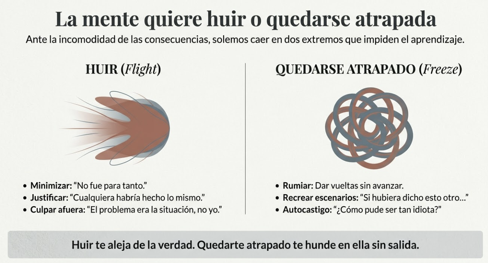
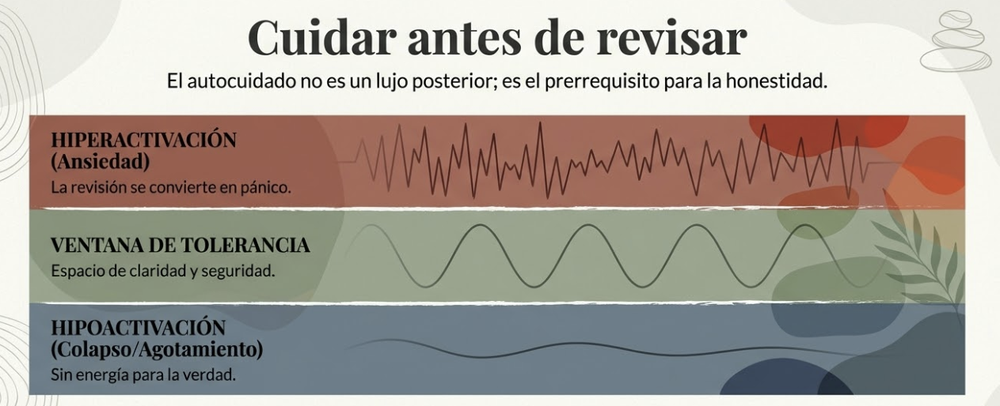
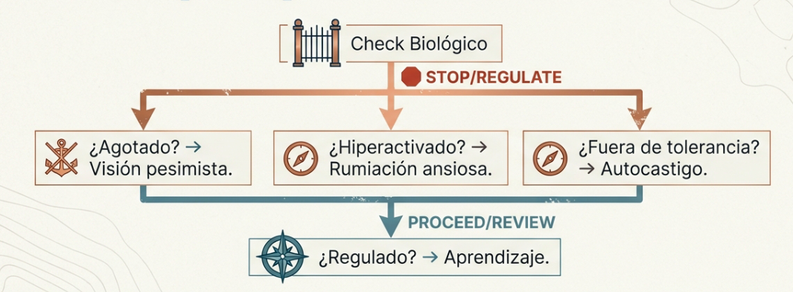
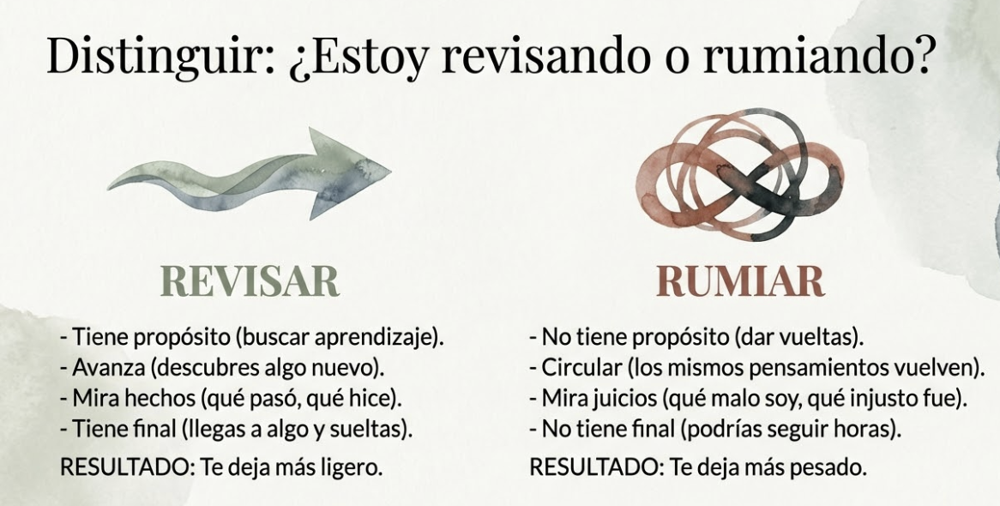
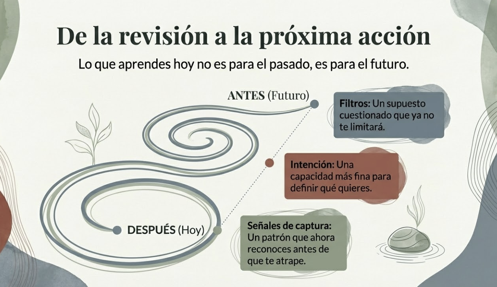

# Tema 3: Transitar la decisión tomada

- [Por que este tema es necesario](#por-que-este-tema-es-necesario)
	- [DESPUÉS: Estar con lo que ha pasado](#después-estar-con-lo-que-ha-pasado)
- [1. El DESPUÉS como continuación del proceso](#1-el-después-como-continuación-del-proceso)
- [2. Cuidarte antes de revisar](#2-cuidarte-antes-de-revisar)
- [3. El cuerpo después de decidir](#3-el-cuerpo-después-de-decidir)
- [4. Estar con lo que ha pasado](#4-estar-con-lo-que-ha-pasado)
- [5. Revisar con honestidad y sin destrucción](#5-revisar-con-honestidad-y-sin-destrucción)
- [5. La diferencia entre revisar y rumiar](#5-la-diferencia-entre-revisar-y-rumiar)
- [6. Autocompasión como base para aprender](#6-autocompasión-como-base-para-aprender)
- [7. Desde la revisión hacia la acción](#7-desde-la-revisión-hacia-la-acción)
- [8. Lo diferencial de este enfoque](#8-lo-diferencial-de-este-enfoque)
- [Práctica: Revisión contemplativa](#práctica-revisión-contemplativa)
- [Conexiones](#conexiones)
- [Dimensión experiencial](#dimensión-experiencial)
- [Referencias](#referencias)
- [Material adicional del tema](#material-adicional-del-tema)
	- [Infografías del tema](#infografías-del-tema)

---

## Por que este tema es necesario

#### DESPUÉS: Estar con lo que ha pasado

**Pregunta que responde:**
Como estoy con lo que ha pasado — y como aprendo sin destruirme?

Este tema completa el ciclo ANTES-DURANTE-DESPUES. El DESPUES no es cierre — es donde se prepara el proximo ANTES. La forma en que transitas las consecuencias de tus decisiones determina tu capacidad de aprender y crecer.

Sin autocompasion, la revision se convierte en autocastigo que cierra en lugar de abrir. Con autocompasion, puedes mirar con honestidad lo que paso y extraer aprendizaje real.

---

## 1. El DESPUÉS como continuación del proceso

#ppt  El DESPUÉS no es un cierre, es una continuación — espiral ANTES-DURANTE-DESPUÉS

Has clarificado tu intención y ampliado tu campo (T1). Has sostenido la consciencia durante el momento de decidir (T2). Ahora estás al otro lado: la decisión está tomada, las consecuencias empiezan a desplegarse.

El DESPUÉS no es un momento puntual. Es un territorio que también se extiende en el tiempo — a veces días, a veces meses, a veces años. Y requiere la misma consciencia sostenida que el DURANTE.

Aquí es donde ves qué pudiste mantener y dónde te perdiste. Dónde la intención se sostuvo y dónde hubo fugas. Qué fuerzas te capturaron sin que lo notaras. Qué viste y qué quedó fuera de tu campo.

Y aquí es donde se prepara el próximo ANTES. Lo que aprendas en este territorio — cómo lo transites, qué integres, cómo te trates — configura quién serás cuando llegue la siguiente decisión importante.

El DESPUÉS no es cierre. Es continuación.

#ppt  La mente quiere huir (Flight) o quedarse atrapada (Freeze): dos extremos que impiden aprender

---

## 2. Cuidarte antes de revisar

#grafica  Cuidar antes de revisar — ventana de tolerancia: hiperactivación, espacio de claridad, hipoactivación

Después de momentos de tensión — una negociación difícil, una conversación confrontativa, una decisión con consecuencias pesadas — el sistema necesita recuperarse.

En M4 trabajaste la regulación del estrés. Aquí ese aprendizaje se aplica de forma específica: antes de revisar lo que ha pasado, asegúrate de que no estás todavía en estado de activación.

Si revisas desde el agotamiento, verás todo más negro de lo que es. Si revisas desde la hiperactivación, convertirás la revisión en rumiación ansiosa. Si revisas desde el colapso, no tendrás la energía para mirar con honestidad.

**Antes de revisar, pregúntate:**

- ¿Cómo está mi cuerpo ahora? ¿Hay tensión residual, agotamiento, activación?
- ¿Estoy dentro de mi ventana de tolerancia o todavía fuera?
- ¿Necesito primero descansar, moverme, respirar, antes de poder mirar lo que pasó?

El autocuidado no es un lujo que viene después de la revisión. Es lo que hace posible una revisión honesta sin que se convierta en autocastigo.

---

## 3. El cuerpo después de decidir

#ppt  La firma somática del DESPUÉS — silueta con 4 señales: alivio, tensión residual, agotamiento, activación

El DESPUÉS tiene su propia firma somática. Antes de entrar en la revisión mental, nota qué te dice el cuerpo:

**¿Hay alivio?** ¿Dónde lo sientes? ¿Es alivio de haber decidido bien, o alivio de que simplemente terminó?

**¿Hay tensión residual?** ¿En qué zona? La tensión que no se suelta puede indicar algo no resuelto, algo que el cuerpo sabe pero la mente todavía no ha procesado.

**¿Hay agotamiento?** ¿Cómo se manifiesta? El agotamiento post-decisión es normal, pero si es profundo, es señal de que necesitas recuperarte antes de revisar.

**¿Hay activación que no baja?** ¿Qué la mantiene? A veces el sistema sigue en modo alerta porque hay algo pendiente — una conversación no tenida, una consecuencia temida, un cabo suelto.

Estas señales te dicen si estás en condiciones de revisar o si primero necesitas regularte. El cuerpo no miente sobre tu estado.

#grafica  Check Biológico: STOP/REGULATE → agotado, hiperactivado, fuera de tolerancia → regulado → aprendizaje

---

## 4. Estar con lo que ha pasado

#ppt  Presencia Contemplativa: estar con lo que ha pasado — piedra multicolor, reconocer sin analizar

Hay un paso que la mayoría se salta: antes de evaluar, simplemente estar con lo que ocurrió.

No analizar todavía. No juzgar. No buscar lecciones. Solo estar presente con la realidad de lo que ha pasado.

Esto es más difícil de lo que parece. La mente quiere huir o quedarse atrapada:

**Huir** se manifiesta como:

- Minimizar: "No fue para tanto."
- Justificar: "Cualquiera habría hecho lo mismo."
- Olvidar rápido: "Ya pasó, a otra cosa."
- Culpar afuera: "El problema era la situación, no yo."

**Quedarse atrapado** se manifiesta como:

- Rumiar: Dar vueltas sobre lo mismo sin avanzar.
- Recrear escenarios: "Si hubiera dicho esto otro..."
- Autocastigarse: "¿Cómo pude ser tan idiota?"
- Sobre-identificarse: "Soy un desastre."

Ninguna de estas respuestas te permite aprender. Huir te aleja de la verdad. Quedarte atrapado te hunde en ella sin salida.

La alternativa es presencia contemplativa: estar con lo que es, sin huir ni rumiar. Como hiciste en T1 cuando ampliaste el campo — sintiendo, no solo pensando — ahora aplicas esa misma calidad de atención a lo que ha pasado.

**Estar con lo que ha pasado significa:**

- Reconocer lo que ocurrió, tal como ocurrió.
- Notar qué sientes en el cuerpo cuando lo recuerdas.
- Permitir que las emociones estén — decepción, alivio, frustración, orgullo, vergüenza — sin empujarlas ni engancharte.
- No forzar conclusiones todavía. Solo presencia.

Este paso crea la base para todo lo que sigue. Sin él, la revisión se contamina de defensividad o de autocrítica. Con él, puedes mirar desde un lugar más amplio.

---

## 5. Revisar con honestidad y sin destrucción

#ppt  Aprendizaje de Doble Bucle: Supuestos → Acción → Resultado, bucle simple vs doble (Argyris)

Ahora sí: mirar lo que pasó para aprender.

Pero hay una distinción importante: **revisar el proceso, no solo el resultado**.

El resultado depende de muchos factores que no controlas — información que no tenías, circunstancias que cambiaron, acciones de otros, azar. Puedes decidir bien y que salga mal. Puedes decidir mal y tener suerte.

Lo que sí puedes revisar es tu proceso:

- ¿Clarifiqué mi intención antes de entrar? ¿La mantuve?
- ¿Amplié el campo o decidí desde un campo estrecho?
- ¿Dónde mantuve la consciencia durante el proceso? ¿Dónde la perdí?
- ¿Qué fuerzas me capturaron? ¿Las noté en el momento o solo ahora?
- ¿Hubo fugas — pequeñas desviaciones que se acumularon?

Esta revisión requiere honestidad. No la honestidad brutal que destruye, sino la honestidad compasiva que ilumina.

- **Revisar desde la intención

Vuelve a la intención que clarificaste en el ANTES:

**¿Conseguí lo que quería conseguir?** (el objetivo)
**¿Actué desde donde quería actuar?** (la actitud)

Si la respuesta es no, la siguiente pregunta no es "¿por qué fallé?" sino:

- ¿Qué me desvió?
- ¿Lo noté en el momento o solo ahora?
- ¿Hubo un punto donde pude haber vuelto y no lo hice?
- ¿La intención original era la correcta, o la situación reveló algo que no había visto?

Si la respuesta es sí, la pregunta es:

- ¿Qué me ayudó a mantenerme?
- ¿Hubo momentos donde casi me desvío? ¿Qué hice?
- ¿Qué puedo aprender de lo que funcionó?

No se trata de juzgar. Se trata de ver el proceso con claridad para la próxima vez.

- **Revisar los supuestos

Chris Argyris[^1] distinguió entre dos tipos de aprendizaje. El bucle simple ajusta la acción: "Esto no funcionó, probaré otra cosa." El doble bucle revisa los supuestos detrás de la acción: "¿Por qué asumí que esto funcionaría? ¿Qué creencia mía no me está sirviendo?"

La mayoría de las revisiones se quedan en el bucle simple. Pero el aprendizaje profundo requiere cuestionar los supuestos — las creencias sobre ti, sobre los otros, sobre cómo funciona el mundo — que generaron las acciones que ahora revisas.

Preguntas de doble bucle:

- ¿Qué asumí que resultó no ser cierto?
- ¿Qué creencia sobre mí mismo operó en esta decisión?
- ¿Qué creencia sobre los otros influyó en cómo actué?
- ¿Hay un patrón aquí que he visto antes?

---

## 5. La diferencia entre revisar y rumiar

#grafica  Opción 1: RUMIAR (espiral negra circular) vs REVISAR (espiral dorada que avanza)

#ppt  Opción 2: Distinguir ¿estoy revisando o rumiando? — comparativa con iconos

#ppt  Opción 3: ¿Revisar o Rumiar? — tabla comparativa 5 criterios sobre fondo oceánico

Revisar tiene propósito y final. Miras, aprendes, sueltas.

Rumiar es circular. Vuelves una y otra vez sin avanzar. Reproches repetidos, escenarios imaginarios, autocrítica que no lleva a ningún lado.

**Cómo saber si estás revisando o rumiando:**

| Revisar | Rumiar |
|---------|--------|
| Tiene propósito: buscar aprendizaje | No tiene propósito: dar vueltas |
| Avanza: descubres algo nuevo | Circular: los mismos pensamientos vuelven |
| Mira hechos: qué pasó, qué hice | Mira juicios: qué malo soy, qué injusto fue |
| Tiene final: llegas a algo y sueltas | No tiene final: podrías seguir horas |
| Te deja más ligero | Te deja más pesado |

Si llevas más de 10 minutos con el mismo pensamiento sin descubrir nada nuevo, estás rumiando. La práctica es soltar — no porque no importe, sino porque seguir no ayuda.

Si notas que llevas un rato dando vueltas sin aprender nada nuevo, es señal de que has pasado de revisar a rumiar. En ese momento, la práctica es soltar. No porque no importe, sino porque seguir dando vueltas no ayuda.

---

## 6. Autocompasión como base para aprender

Aquí está la paradoja que la formación tradicional no entiende: **la dureza contigo mismo te cierra; la compasión te abre**.

Cuando te castigas por un error, el sistema se defiende. Minimiza, justifica, evita mirar. La autocrítica brutal no produce mejores líderes; produce líderes más ansiosos, más defensivos, menos capaces de examinar sus errores con honestidad.

La autocompasión no es lo contrario de la exigencia. Es lo que hace posible una exigencia sostenible.[^2]

**Autocompasión con intención de acción

La autocompasión que proponemos no es "bueno, no pasa nada". Es tratarte bien para poder mirar con honestidad.

La compasión te permite ver lo que la dureza oculta. Te permite reconocer el error sin que el sistema se cierre en defensividad. Te permite aprender de verdad porque no estás gastando energía en protegerte de ti mismo.

Y desde ahí, la compasión se convierte en base para la acción. No te quedas en "pobrecito yo". Miras, aprendes, y preguntas: ¿qué ajusto? ¿qué hago diferente?

La secuencia es:

1. **Reconocer** el dolor sin huir de él.
2. **Acompañarte** con amabilidad mientras lo sientes.
3. **Mirar** con honestidad qué pasó.
4. **Aprender** qué ajustar.
5. **Soltar** lo que ya no sirve cargar.

---

## 7. Desde la revisión hacia la acción

#ppt  De la revisión a la próxima acción — espiral DESPUÉS→ANTES con filtros, intención, señales de captura

La revisión no es un fin en sí misma. Es preparación para lo que viene.

**Preguntas que conectan el DESPUÉS con el próximo ANTES:**

- ¿Qué aprendí sobre mi proceso que quiero recordar?
- ¿Qué señales de captura ahora reconozco que antes no veía?
- ¿Qué supuesto he cuestionado que quiero seguir observando?
- ¿Hay algo que quiero hacer diferente la próxima vez — no como autocrítica, sino como intención?
- ¿Hay alguna acción correctiva que este aprendizaje requiere — una conversación, un ajuste, una reparación?

El DESPUÉS alimenta el ANTES. Cada revisión consciente fortalece tu capacidad de clarificar intención, ampliar campo, y sostener consciencia la próxima vez.

No porque te hayas vuelto perfecto, sino porque has integrado lo vivido.

**El DESPUÉS prepara el próximo ANTES

Lo que aprendes aquí no es para el pasado — el pasado ya pasó. Es para el próximo ANTES.

Cada revisión consciente deposita algo:

- Una señal de captura que ahora reconoces.
- Un patrón tuyo que ahora ves.
- Una pregunta que ahora sabes hacerte.
- Una intención que ahora sabes formular mejor.
- Un filtro que ahora puedes cuestionar.

El ciclo ANTES-DURANTE-DESPUÉS no es lineal. Es espiral. Cada vuelta te encuentra con más capacidad de observar tu proceso mientras decides.

Esa es la transformación del módulo: **"Puedo observar dónde está mi atención mientras decido."**

No es un logro puntual. Es una práctica que se fortalece con cada ciclo. Cada DESPUÉS que transitas con honestidad y compasión te prepara para un ANTES con más claridad, un DURANTE con más presencia, y un DESPUÉS con más capacidad de aprender.

---

## 8. Lo diferencial de este enfoque

La formación tradicional trata el post-decisión como "gestión del error" o "lecciones aprendidas" — un ejercicio cognitivo de análisis y conclusiones.

Liderar con consciencia propone otra cosa: **transitar el DESPUÉS como proceso contemplativo**.

Esto significa:

- Cuidarte antes de revisar, no después.
- Notar la firma somática del DESPUÉS antes de entrar en la mente.
- Estar con lo que ha pasado antes de analizarlo.
- Revisar desde la intención que clarificaste, no desde un juicio genérico.
- Revisar desde honestidad compasiva, no desde dureza que cierra.
- Distinguir revisar de rumiar — y soltar cuando corresponde.
- Integrar el aprendizaje en el cuerpo, no solo en la mente.
- Convertir la revisión en preparación para lo que viene.

No es más lento. Es más honesto. Y produce un aprendizaje que realmente transforma — no solo conclusiones que se olvidan.

---

## Práctica: Revisión contemplativa #ejercicio

Esta práctica integra los elementos del tema. No es un checklist; es una forma de estar con el proceso.

1. Llega antes de revisar

Nota cómo estás. ¿Hay agotamiento, activación, tensión residual? Si no estás en condiciones de revisar, primero cuídate. Descansa, respira, muévete. La revisión puede esperar.

2. Nota la firma somática del DESPUÉS

Antes de pensar, siente:
¿Hay alivio? ¿Dónde?
¿Hay tensión residual? ¿En qué zona?
¿Hay agotamiento? ¿Cómo se manifiesta?
¿Hay activación que no baja? ¿Qué la mantiene?

3. Está con lo que ha pasado

Antes de analizar, simplemente recuerda lo que ocurrió. No lo que debería haber pasado; lo que pasó. Nota qué sientes en el cuerpo cuando lo traes a la mente. Permite que las emociones estén sin empujarlas ni engancharte. Quédate aquí unos momentos.

4. Revisa el proceso desde la intención

Vuelve a la intención que clarificaste:
¿Conseguí lo que quería conseguir?
¿Actué desde donde quería actuar?

Luego mira el proceso:
¿Dónde mantuve la consciencia? ¿Dónde la perdí?
¿Qué fuerzas me capturaron?
¿Hubo fugas — pequeñas desviaciones que se acumularon?
¿Qué supuestos operaron que quizás no me sirven?

Mira con curiosidad, no con fiscalía. Si notas que aparece autocrítica destructiva, reconócela: "Estoy siendo duro conmigo." Vuelve a la compasión: "Puedo mirar esto sin destruirme."

5. Siente el aprendizaje en el cuerpo

Lo que has visto, ¿dónde lo sientes? No solo "qué concluyo" sino "cómo me queda esto en el cuerpo". A veces el aprendizaje se integra mejor cuando lo sientes que cuando lo piensas.

6. Lleva algo hacia adelante

¿Qué te llevas de esta revisión? No una lista de diez cosas; una o dos que realmente importen. Formúlalas como intención, no como reproche: "Quiero..." más que "Debería haber..."

7. Suelta

Cuando hayas revisado, suelta. No porque no importe, sino porque ya has hecho el trabajo. Si la mente vuelve a dar vueltas, recuérdale: "Ya lo revisé. Aprendí lo que pude. Ahora, ¿qué sigue?"

---

## Conexiones 

**Conexión con lo que viene

Este tema cierra el ciclo ANTES-DURANTE-DESPUÉS. Pero el ciclo no es lineal; es espiral. Lo que aprendes aquí configura cómo llegarás al próximo ANTES.

El **Tema 4** cerrará el módulo explorando cómo el entrenamiento en mindfulness hace posible todo lo que has trabajado — no como técnica añadida, sino como la práctica que sostiene la capacidad de dirigir tu consciencia con intención.

Verás cómo la práctica de Open Monitoring entrena específicamente las capacidades que cada fase requiere: ver qué te captura (ANTES), notar sin ser arrastrado (DURANTE), estar con lo que ha pasado sin huir ni quedarte atrapado (DESPUÉS).

**Conexion con M1

M1 mostro que puedes cuestionar tus supuestos. En el DESPUES, eso se convierte en aprendizaje de doble bucle.

| Concepto de M1 | Como se conecta aqui |
|----------------|---------------------|
| Supuestos no examinados | El DESPUES es donde los examinas |
| Sesgos que distorsionan | Ahora puedes ver cuales operaron |
| Humildad epistemologica | Base para reconocer el error sin defenderte |

El DESPUES usa la humildad de M1 para aprender de verdad, no solo ajustar la accion.

**Conexion con M2

M2 mostro que el cuerpo informa. En el DESPUES, el cuerpo te dice si estas en condiciones de revisar.

| Concepto de M2 | Como se conecta aqui |
|----------------|---------------------|
| Firma somatica | El DESPUES tiene su propia firma: alivio, tension residual, agotamiento |
| El cuerpo sabe | Antes de revisar mentalmente, nota como estas |
| Interocepcion | La incomodidad que apartas puede indicar algo no resuelto |

Cuidarte antes de revisar significa escuchar al cuerpo primero.

**Conexion con M3

M3 mostro que puedes observar sin ser arrastrado. En el DESPUES, eso es la diferencia entre revisar y rumiar.

| Concepto de M3 | Como se conecta aqui |
|----------------|---------------------|
| Observar pensamientos | Estar con lo que paso sin huir ni quedarte atrapado |
| Espacio para elegir | Puedes elegir soltar cuando la revision ya no ayuda |
| Presencia contemplativa | Estar con lo que es, antes de analizarlo |

El DESPUES aplica la practica de M3 al territorio post-decision.

**Conexion con M4

M4 mostro que el autocuidado es base. En el DESPUES, eso significa cuidarte antes de revisar.

| Concepto de M4        | Como se conecta aqui                                              |
| --------------------- | ----------------------------------------------------------------- |
| Regulacion            | Si revisas desde el agotamiento, todo parece peor                 |
| Ventana de tolerancia | Fuera de ella, la revision se convierte en autocastigo            |
| Autocuidado           | No es lujo que viene despues; es lo que hace posible revisar bien |

El autocuidado de M4 es prerequisito para un DESPUES que enseña en lugar de destruir.

**Conexion con M5

M5 mostro la autocompasion como practica. En el DESPUES, la autocompasion es lo que permite aprender.

| Concepto de M5 | Como se conecta aqui |
|----------------|---------------------|
| Autocompasion de Neff | Amabilidad, humanidad comun, mindfulness del dolor |
| Compasion que abre | La dureza cierra; la compasion permite mirar |
| Del yo al nosotros | Incluye tratarte a ti mismo con la consideracion que das a otros |

La autocompasion de M5 es la base del DESPUES que transforma.

---

## Dimensión experiencial #insight

- ¿Cómo te tratas habitualmente cuando te equivocas en una decisión importante? ¿Es un trato que le darías a alguien que respetas?

- ¿Tiendes más a huir (minimizar, justificar, olvidar rápido) o a quedarte atrapado (rumiar, recrear escenarios, autocastigarte)?

- Piensa en una decisión reciente. Si aplicaras la revisión desde la intención — ¿conseguí lo que quería? ¿actué desde donde quería? — ¿qué aparecería?

- ¿Qué cambia cuando te das permiso para aprender del error sin destruirte en el proceso?

- ¿Puedes identificar algo que aprendiste en un DESPUÉS que te sirvió en un ANTES posterior?

---

## Referencias

[^1]: Argyris, C. (1977). Double loop learning in organizations. *Harvard Business Review*, 55(5), 115-125.

[^2]: Neff, K. (2011). *Self-Compassion: The Proven Power of Being Kind to Yourself.* William Morrow.

---
## Material adicional del tema #aux
### Infografías del tema 

#infografia  Transitar la decisión: cuidarse antes de revisar, firma somática, doble bucle de Argyris, revisar vs rumiar, autocompasión como motor