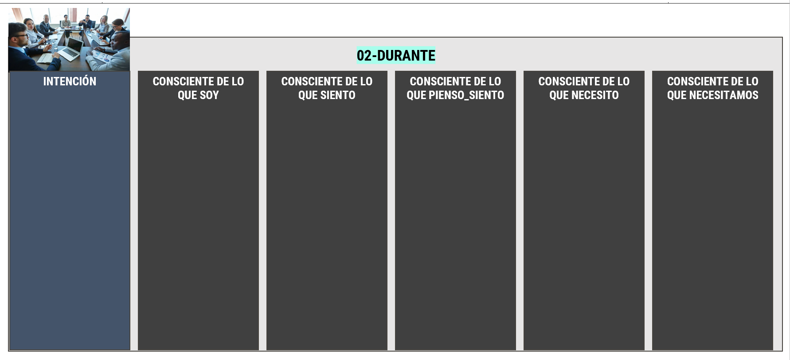

# Modelo para orientar acciones y decisiones con consciencia - Plantillas de aplicación

## Visión integrada del modelo

#imagen #modelo
 Diagrama completo del modelo sobre fondo azul: óvalo con niveles Conductual/Profesional/Personal, línea temporal Propósito→Objetivos→Intención, área central de Contexto y Atención con los 5 módulos de consciencia alrededor, indicadores de fase 01 Antes, 02 Durante, 03 Después, e iconos de Reuniones, Planning, Mails.

#imagen
 Ilustración de personas colaborando ensamblando piezas de puzzle gigantes en colores naranja y azul, representando el trabajo en equipo y la integración de elementos.

---

## Plantilla 01-ANTES

#ejercicio

#imagen #modelo
 Plantilla 01-ANTES con encabezado verde. Fotografía de reunión de trabajo con etiqueta "INTENCIÓN". Columnas: "Consciente de lo que soy", "Consciente de lo que siento", "Consciente de lo que pienso_siento", "Consciente de lo que necesito", "Consciente de lo que necesitamos".

---

## Plantilla 02-DURANTE

#ejercicio

#imagen #modelo
 Plantilla 02-DURANTE con encabezado cian. Fotografía de reunión de trabajo con etiqueta "INTENCIÓN". Columnas: "Consciente de lo que soy", "Consciente de lo que siento", "Consciente de lo que pienso_siento", "Consciente de lo que necesito", "Consciente de lo que necesitamos".

---

## Plantilla 03-DESPUÉS

#ejercicio

#imagen #modelo
 Plantilla 03-DESPUÉS con encabezado coral/rosa. Fotografía de reunión de trabajo con etiqueta "INTENCIÓN". Columnas: "Consciente de lo que soy", "Consciente de lo que siento", "Consciente de lo que pienso_siento", "Consciente de lo que necesito", "Consciente de lo que necesitamos".

---

## Notas para revisión

- **Tipo de archivo:** Plantillas de ejercicio visual
- **Contenido teórico transformable:** Ninguno
- **Acción realizada:** Preservación íntegra de estructura, imágenes y tags; añadido campo `ultima_actualizacion` en frontmatter
- **Observación:** Este archivo funciona como soporte visual para las plantillas del modelo. No contiene bloques #teoria ni #explicacion que requieran aplicación del Tono LcC
