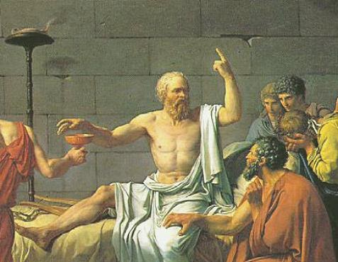

# El liderazgo ético: fundamentos y rasgos

## Un nuevo paradigma de liderazgo

El contexto actual demanda un paradigma de liderazgo centrado en la ética, la humanidad y el bienestar integral de las personas. Este liderazgo ético se fundamenta en valores como la transparencia, la ejemplaridad, la justicia, la compasión y el servicio a los demás.

Un liderazgo con esta orientación escucha las necesidades de quienes lo siguen, inspira a través del ejemplo y actúa con integridad y coherencia. No se trata de un ideal abstracto sino de una práctica concreta que se manifiesta en cada decisión y en cada interacción.

#imagen
 Ilustración estilizada mostrando dos figuras de empresarios en una escalera ascendente. El que está más arriba extiende la mano para ayudar al siguiente a subir. Al fondo, una bandera verde marca la meta. Fondo en tonos beige claro.

---

## De la ética a la virtud

La "belleza del actuar recto" constituye un elemento esencial del liderazgo ético. Esta belleza no se reduce a la apariencia: emana de la coherencia entre el ser y el actuar. Se manifiesta en acciones concretas que buscan el bien común y se guían por principios morales sólidos. Este ideal se alcanza a través de una disciplina consciente que busca la perfección del carácter y se refleja en un actuar recto y virtuoso.

La virtud, entendida como un hábito que se cultiva a través de la práctica constante, permite actuar con facilidad y naturalidad de acuerdo con el bien. No es un estado que se alcanza una vez, sino una disposición que se fortalece con cada elección coherente.

La prudencia se destaca como la virtud cardinal para el liderazgo ético. Esta virtud permite discernir el bien en cada situación y resulta fundamental para tomar decisiones sabias, guiar a otros con rectitud y actuar con justicia y equilibrio. Sin prudencia, las demás virtudes carecen de brújula.

#imagen
 Reproducción del cuadro "La muerte de Sócrates" de Jacques-Louis David. Escena clásica mostrando a Sócrates en el centro, semidesnudo con túnica blanca, brazo alzado señalando hacia arriba mientras con la otra mano alcanza la copa de cicuta. Rodeado de discípulos afligidos.

---

## Los ocho rasgos del líder ético

El liderazgo ético se articula en ocho rasgos fundamentales que, en conjunto, configuran un perfil coherente de conducta y valores.

**Integridad**
Los líderes éticos dan prioridad a la honestidad, la transparencia y la coherencia en sus acciones y decisiones. Defienden principios morales elevados y actúan con sinceridad y equidad en todas las situaciones.

**Equidad**
Los líderes éticos defienden la equidad, la diversidad y la inclusión en sus organizaciones. Promueven la justicia y la igualdad garantizando que todas las personas tengan acceso a oportunidades, recursos y apoyo, independientemente de su origen o identidad.

**Seguridad**
Los líderes éticos dan prioridad a la seguridad física y psicológica de los miembros de su equipo. Crean un entorno de apoyo en el que las personas se sienten seguras para expresarse, asumir riesgos e innovar sin temor a repercusiones.

**Transparencia**
Los líderes éticos son transparentes en sus procesos de comunicación y toma de decisiones. Comparten la información abiertamente, solicitan la opinión de las partes interesadas y explican las razones de su actuación.

**Predicar con el ejemplo**
Los líderes éticos marcan la pauta del comportamiento ético demostrándolo ellos mismos. Se adhieren a las normas éticas en sus acciones, decisiones e interacciones, sirviendo de modelo a imitar por los demás.

**Empatía-Compasión**
Los líderes éticos comprenden y tienen en cuenta las necesidades, sentimientos y perspectivas de los demás. Demuestran empatía escuchando activamente, mostrando comprensión y prestando apoyo cuando es necesario, creando una cultura de compasión y respeto mutuo.

**Confiabilidad**
Los líderes éticos generan confianza a través de su fiabilidad, credibilidad y coherencia. Cumplen sus promesas, mantienen la confidencialidad y actúan en el mejor interés de sus interlocutores, ganándose la confianza de los miembros de su equipo.

**Responsabilidad Social**
Los líderes éticos reconocen su responsabilidad de contribuir positivamente a la sociedad y a la comunidad en general. Se esfuerzan por tomar decisiones éticas que beneficien no solo a su organización, sino también a la sociedad en su conjunto.

#imagen
 Infografía circular con ocho segmentos de colores (amarillo, rojo, verde, azul). Cada segmento con un icono representando los 8 rasgos del líder ético: Integridad, Equidad, Seguridad, Transparencia, Predicar con el ejemplo, Empatía-Compasión, Confiabilidad y Responsabilidad Social.

