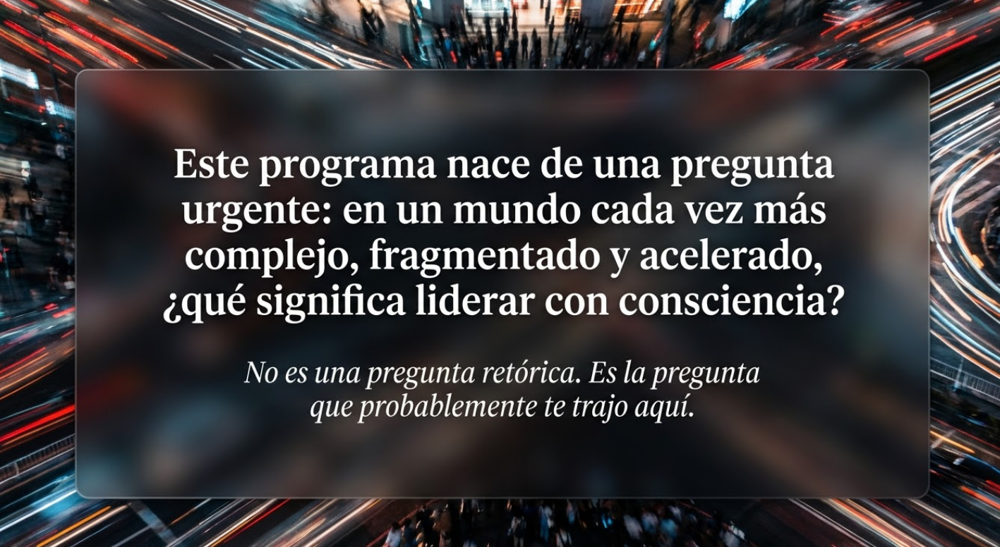
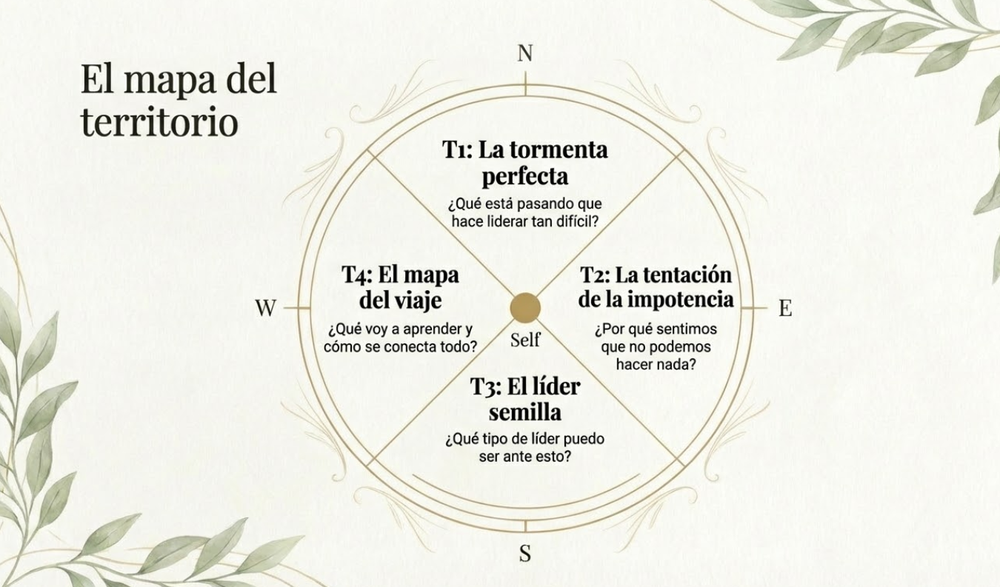
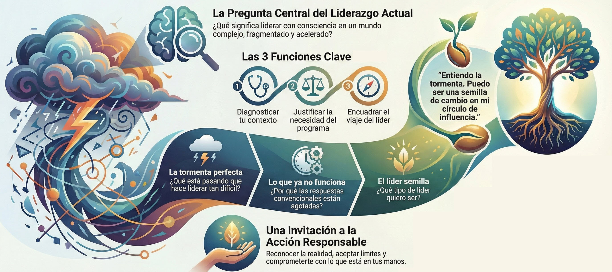

# Modulo 0: El momento que nos convoca

- [Bienvenida al programa](#bienvenida-al-programa)
- [La función de este módulo](#la-función-de-este-módulo)
- [Lo que M0 propone](#lo-que-m0-propone)
- [Pregunta central](#pregunta-central)
- [Transformación esperada](#transformación-esperada)
- [Lo que encontrarás en este módulo](#lo-que-encontrarás-en-este-módulo)
- [Conexión con el programa](#conexión-con-el-programa)
- [Material adicional del tema](#material-adicional-del-tema)
	- [Infografías del tema](#infografías-del-tema)

#imagen  Figura solitaria ante muros monumentales y olas turbulentas. Metáfora visual del líder enfrentando fuerzas que lo superan.

---
## Bienvenida al programa

Este programa nace de una pregunta urgente: en un mundo cada vez más complejo, fragmentado y acelerado, ¿qué significa liderar con consciencia?

No es una pregunta retórica. Es la pregunta que probablemente te trajo aquí.
#ppt  Diapositiva de bienvenida: "¿Qué significa liderar con consciencia?" - la pregunta fundacional del programa.

---

## La función de este módulo

M0 no es un módulo más. Es el pórtico del programa —el espacio donde situamos el contexto antes de empezar el trabajo interior.

Cumple tres funciones:

**Diagnóstico.** Nombrar la realidad del contexto en el que lideras. No como información abstracta, sino como reconocimiento de lo que probablemente ya sientes.

**Transición.** Explorar las respuestas naturales ante esa realidad —y abrir la posibilidad de otra forma de estar.

**Compromiso.** Introducir la figura del líder semilla y el mapa del viaje que vas a emprender.

#imagen  Diagrama de círculos concéntricos: círculo de preocupación (tormenta externa) vs círculo de influencia (mi ámbito de poder).

---

## Lo que M0 propone

- Una invitación a **reconocer** la tormenta sin negarla ni exagerarla
- Una invitación a **examinar** cómo respondes ante lo que te desborda
- Una invitación a **comprometerte** con otra forma de liderar —y con el entrenamiento que eso requiere

#imagen  El Líder Semilla: brote emergiendo del suelo. "Acción responsable en el ámbito de lo posible."

---

## Pregunta central

> ¿Qué tipo de líder puedo ser en medio de esta tormenta, y qué estoy dispuesto a trabajar en mí para conseguirlo?

#ppt  Contraste visual tormenta/hoja verde con la pregunta central: qué tipo de líder puedo ser y qué estoy dispuesto a trabajar.

---

## Transformación esperada

Al terminar este módulo, habrás integrado algo fundamental:

> _"El mundo es difícil, pero yo tengo impacto real en las personas que lidero. Puedo ser una semilla de cambio en mi entorno. Ese compromiso exige desarrollar capacidades que no se improvisan —y estoy dispuesto a entrenarlas."_

#imagen  Árbol joven vigoroso vs árbol caído. "El viaje comienza reconociendo dónde estamos."

---
## Lo que encontrarás en este módulo

| Tema | Contenido                     | Pregunta que responde                           |
| ---- | ----------------------------- | ----------------------------------------------- |
| T1   | La tormenta perfecta          | ¿Qué está pasando que hace liderar tan difícil? |
| T2   | La tentación de la impotencia | ¿Por qué sentimos que no podemos hacer nada?    |
| T3   | El líder semilla              | ¿Qué tipo de líder puedo ser ante esto?         |
| T4   | El mapa del viaje             | ¿Qué voy a aprender y cómo se conecta todo?     |
#ppt  Brújula con los 4 temas del módulo: Tormenta perfecta, Tentación impotencia, Líder semilla, Mapa del viaje.

---

## Conexión con el programa

M0 abre el camino que M7 cerrará.

La metáfora del líder semilla que introducimos aquí la completaremos al final del programa, cuando tengas todas las herramientas para encarnarla. El círculo se cerrará con la misma imagen, pero tú habrás cambiado.

#imagen  Arco del programa M0→M7: "La promesa del Líder Semilla". Visualiza el recorrido completo. 

---
## Material adicional del tema #aux
### Infografías del tema 

#infografia  Infografía resumen del módulo de apertura.