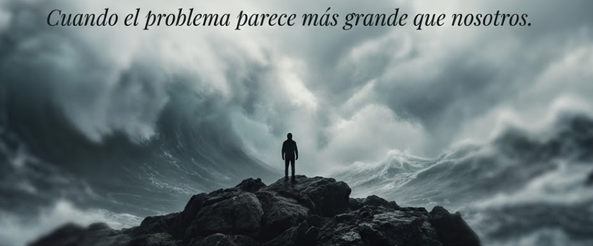
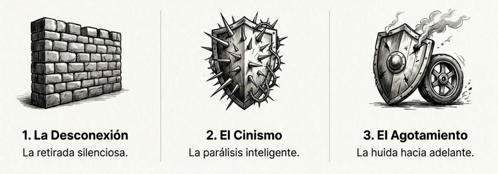
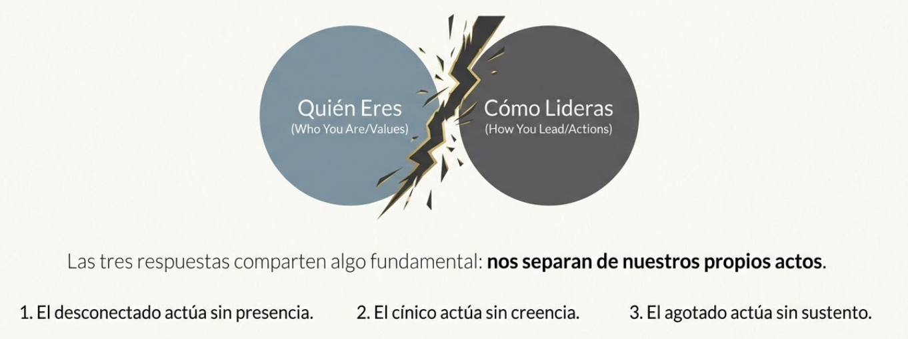
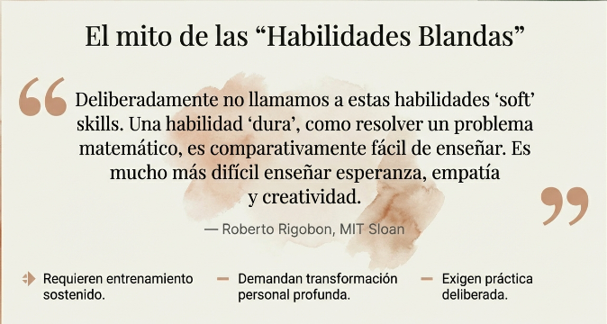
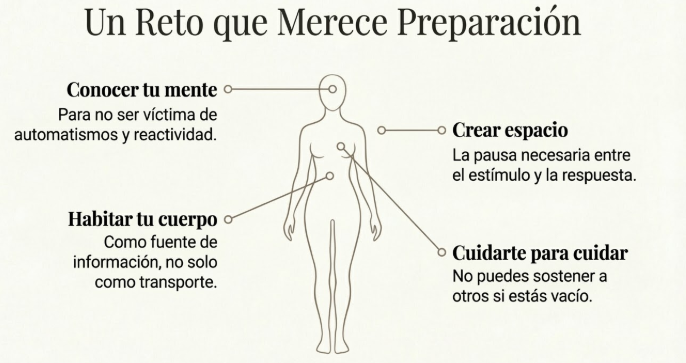

# Tema 2: La tentación de la impotencia

- [Por qué este tema es necesario](#por-qué-este-tema-es-necesario)
	- [Cuando el problema parece más grande que nosotros](#cuando-el-problema-parece-más-grande-que-nosotros)
- [1. Las respuestas naturales ante lo que nos desborda](#1-las-respuestas-naturales-ante-lo-que-nos-desborda)
	- [1.1 La desconexión](#11-la-desconexión)
	- [1.2 El cinismo](#12-el-cinismo)
	- [1.3 El agotamiento autoimpuesto](#13-el-agotamiento-autoimpuesto)
- [2. Lo que tienen en común](#2-lo-que-tienen-en-común)
- [3. Otra forma de mirar](#3-otra-forma-de-mirar)
- [4. El compromiso que esto implica](#4-el-compromiso-que-esto-implica)
- [5. Salir del cinismo sin caer en la ingenuidad](#5-salir-del-cinismo-sin-caer-en-la-ingenuidad)
- [6. Un reto que merece preparación](#6-un-reto-que-merece-preparación)
- [Dimensión experiencial](#dimensión-experiencial)
- [Lo que viene](#lo-que-viene)
- [Referencias](#referencias)
- [Material adicional del tema](#material-adicional-del-tema)

#imagen  Figura solitaria ante olas gigantes. "Cuando el problema parece más grande que nosotros."

---

## Por qué este tema es necesario

#### Cuando el problema parece más grande que nosotros

**Pregunta que responde:** ¿Qué hacemos con la sensación de que no podemos hacer nada?

El Tema 1 ha descrito una tormenta de cuatro fuerzas convergentes. Si esa descripción fue honesta, es probable que ahora sientas algo incómodo: una mezcla de reconocimiento y desaliento.

Este tema no pretende disolver esa incomodidad con fórmulas fáciles. Pretende atravesarla para encontrar, del otro lado, una forma diferente de estar en el mundo como líder.

---

## 1. Las respuestas naturales ante lo que nos desborda

Cuando el contexto parece exceder nuestra capacidad de acción, hay respuestas predecibles. No son defectos de carácter; son formas humanas de protegerse. Pero todas tienen un coste.

#imagen  Las 3 respuestas naturales: Desconexión (muro), Cinismo (escudo con púas), Agotamiento (escudo con rueda).
### 1.1 La desconexión

_"Esto no va conmigo. Hago mi trabajo y ya."_

Es la retirada silenciosa. Cumplir con lo mínimo, no involucrarse más de lo necesario, mantener una distancia prudente entre quién eres y lo que haces.

Funciona como protección: si no me implico, no me pueden herir. Pero el coste es alto. Con el tiempo, el trabajo se vacía de sentido. Te conviertes en alguien que ejecuta tareas, no en alguien que lidera personas. La desconexión protege, pero también aísla —de los demás y de ti mismo.

### 1.2 El cinismo

_"No tiene sentido intentarlo. El sistema está roto."_

El cinismo se siente como lucidez. "Yo veo lo que otros no ven." Y en cierto modo es verdad: el cínico suele tener razón en su diagnóstico. El sistema _tiene_ problemas estructurales. Las iniciativas de cambio _suelen_ fracasar. La retórica corporativa _está_ llena de vacío.

Pero el cinismo convierte esa verdad parcial en excusa total. Si nada tiene sentido, nada merece esfuerzo. Y así, la inteligencia del diagnóstico se transforma en parálisis de la acción. El cínico observa con razón y no actúa con ella.

### 1.3 El agotamiento autoimpuesto

_"Si me esfuerzo más, podré con todo."_

Es la respuesta que el sistema recompensa. El líder que siempre está disponible, que trabaja más horas, que absorbe la presión sin quejarse. Parece compromiso; en realidad es huida hacia adelante.

Esta respuesta confunde movimiento con dirección, intensidad con efectividad. Y alimenta directamente la epidemia de agotamiento descrita en el Tema 1. El líder que se quema no solo se daña a sí mismo; modela para su equipo que el sacrificio permanente es el precio del liderazgo.

---

## 2. Lo que tienen en común

Las tres respuestas —desconexión, cinismo, agotamiento— comparten algo fundamental: **nos separan de nuestros propios actos**.

El desconectado actúa sin estar presente en lo que hace. El cínico actúa sin creer en lo que hace. El agotado actúa sin poder ya sostener lo que hace.

En los tres casos, se pierde algo esencial: la conexión entre quién eres y cómo lideras. Entre tus valores y tus acciones cotidianas. Entre tu intención y tu impacto real.

Y esa desconexión, aunque protege a corto plazo, erosiona a largo plazo. Erosiona el sentido, la energía, la capacidad de estar de verdad con las personas que lideras.

#ppt  "Quién Eres vs Cómo Lideras" separados por un rayo. Las 3 respuestas nos separan de nuestros propios actos.

---

## 3. Otra forma de mirar

Hay otra respuesta posible. No es más fácil —de hecho, es más exigente. Pero conduce a un lugar diferente.

Comienza con una pregunta: **¿Qué pasa si, en lugar de mirar hacia el sistema que no puedo cambiar, miro hacia el espacio donde sí puedo actuar?**
No como resignación ("me conformo con lo pequeño"), sino como reconocimiento: hay un lugar donde tu acción tiene impacto real, verificable, directo. Ese lugar es tu equipo. Las personas que lideras. Las interacciones cotidianas donde se juega, de verdad, la calidad de la experiencia laboral de otros seres humanos.

El dato del 70% (la varianza en engagement que depende del líder directo) no es una estadística abstracta. Es una declaración sobre tu relevancia. Las personas que trabajan contigo tienen una experiencia radicalmente distinta según cómo tú estés presente —o ausente— para ellas.

---

## 4. El compromiso que esto implica

Reconocer este espacio de impacto no es un consuelo; es una responsabilidad.

Porque una cosa es saber que importas, y otra muy distinta es **estar a la altura de ese impacto**. Liderar de verdad —con presencia, con claridad, con capacidad de sostener a otros— requiere algo que la mayoría de nosotros no hemos desarrollado suficientemente.

Esto no se logra con buenas intenciones. Estar presente bajo presión, mantener la empatía cuando el poder la erosiona, actuar desde tus valores cuando sería más fácil no hacerlo — nada de eso se improvisa. Son capacidades que se desarrollan con el mismo rigor con el que un atleta entrena su cuerpo. Y todas comparten algo en común: requieren un tipo de trabajo interior que la mayoría de líderes nunca ha hecho de forma deliberada.

Este programa existe para ese trabajo.

---

## 5. Salir del cinismo sin caer en la ingenuidad

El camino que proponemos no es optimismo ingenuo. No pretendemos que "todo saldrá bien" ni que tu actitud positiva cambiará el sistema.

Es algo más sobrio y más exigente: **comprometerte con hacer bien lo que sí está en tus manos, porque es lo correcto, porque las personas que lideras lo merecen, y porque ahí puedes actuar con integridad.**

No se trata de esperar resultados grandiosos. No se trata de buscar reconocimiento. Se trata de refugiarte —en el mejor sentido— en la dignidad de tu trabajo como líder. Estar ahí, de verdad, para las personas que dependen de ti.

Este refugio no es escapismo. Es lo contrario: es volver a conectar tus actos con tus valores. Es dejar de flotar en el cinismo o en la desconexión y plantar los pies en un lugar donde tu presencia importa.
#imagen  Cita de Rigobon (MIT Sloan): "Es más difícil enseñar esperanza, empatía y creatividad" que habilidades técnicas.

---

## 6. Un reto que merece preparación

Aceptar este compromiso no es conformarse con poco. Es asumir un reto enorme.

Porque el contexto sigue siendo el que es: fragmentación, desconfianza, disrupción, agotamiento. No desaparece por el hecho de que hayas decidido actuar diferente. Liderar con consciencia en medio de esta tormenta requiere capacidades que no se improvisan.

Requiere conocer cómo funciona tu propia mente, para no ser víctima de sus automatismos. Requiere habitar tu cuerpo como fuente de información, no solo como vehículo que te transporta a reuniones. Requiere crear espacio entre lo que te pasa y cómo respondes. Requiere cuidarte para poder cuidar. Requiere ver al otro como un "tú" y no como un instrumento.

Este programa existe para desarrollar esas capacidades. No como teoría que se aprende, sino como práctica que se entrena.

#ppt  "Un Reto que Merece Preparación": conocer tu mente, habitar tu cuerpo, crear espacio, cuidarte para cuidar.

---
## Dimensión experiencial #insight

Antes de continuar, una pausa para la honestidad:

- ¿Cuál de las tres respuestas (desconexión, cinismo, agotamiento) reconoces más en ti últimamente?
- ¿Qué te ha costado esa respuesta?
- ¿Cómo sería volver a conectar tus actos con tus valores en tu liderazgo cotidiano?
- ¿Qué necesitarías desarrollar en ti para poder hacerlo?

---
## Lo que viene

El siguiente tema introducirá la metáfora que guiará este viaje: **el líder semilla**.

Una semilla no controla el clima ni el suelo. Pero hace lo que está en su naturaleza: germinar, echar raíces, crecer hacia la luz, crear condiciones para que otras semillas crezcan.

El líder semilla es alguien que ha elegido este camino: trabajar en sí mismo no como ejercicio narcisista, sino como preparación para poder estar de verdad con los otros. Para liderar de verdad en el espacio donde su presencia importa.

---

## Referencias

- Gallup (2024). _State of the Global Workplace Report._
- Han, B.C. (2010). _La sociedad del cansancio._ Herder.
- Maslach, C. & Leiter, M.P. (2022). _The Burnout Challenge._ Harvard University Press.
---

## Material adicional del tema #aux
