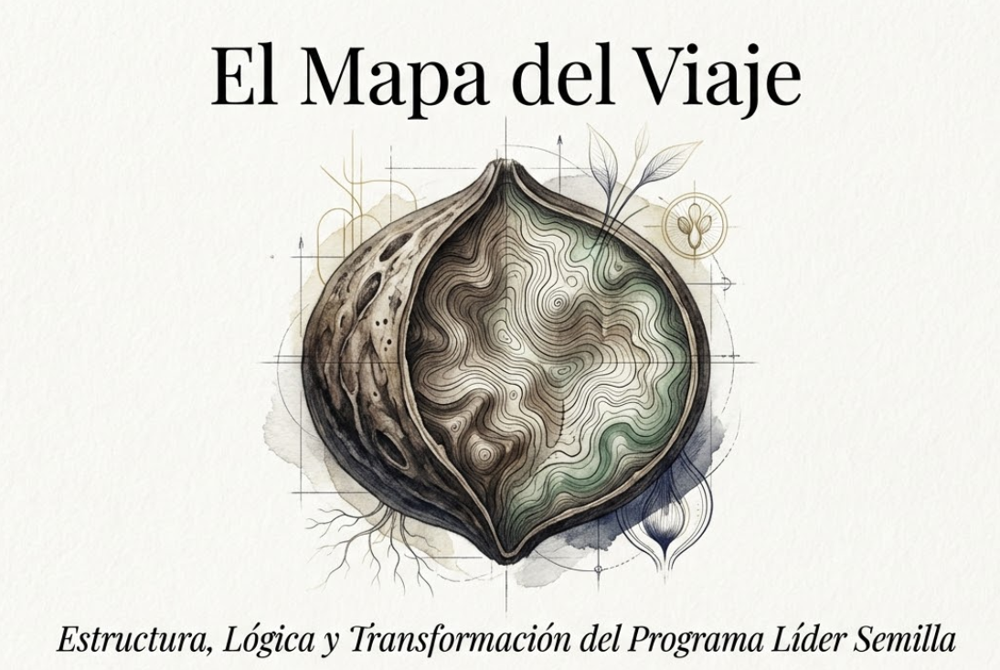
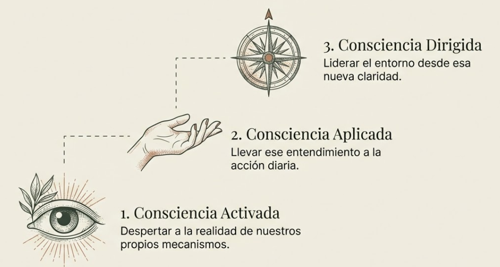
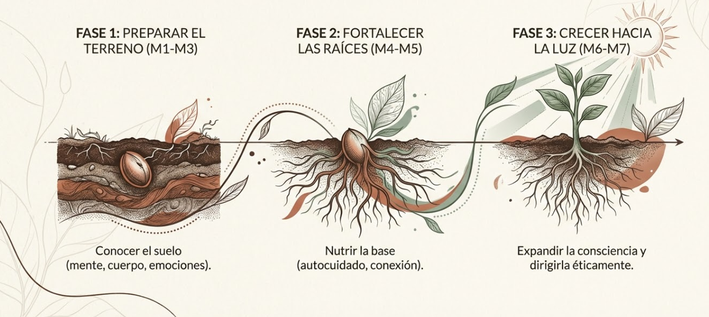
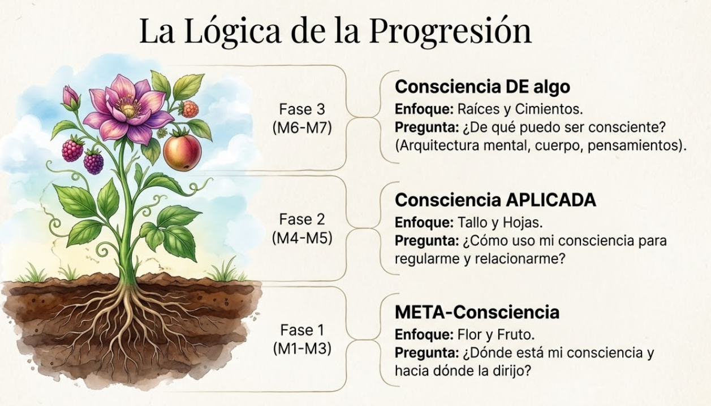
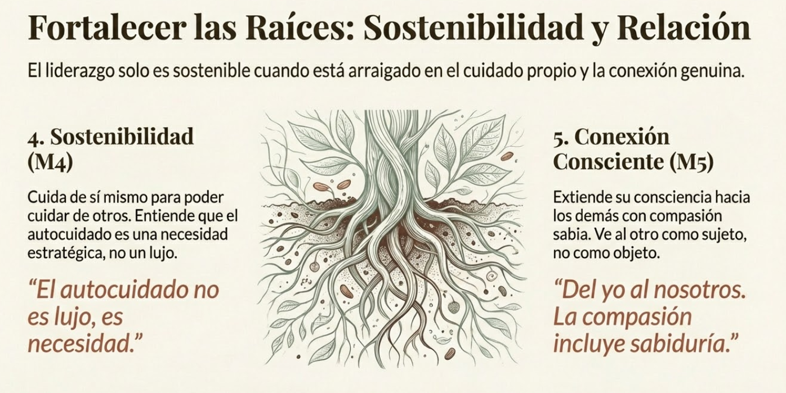
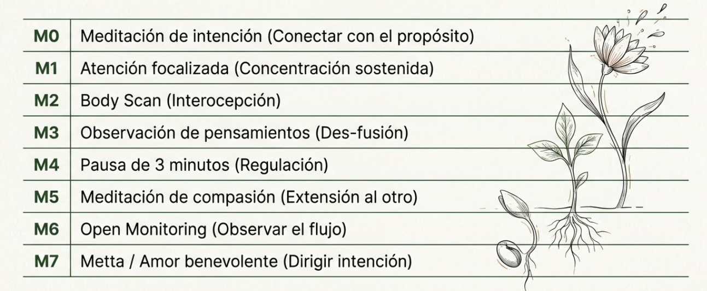
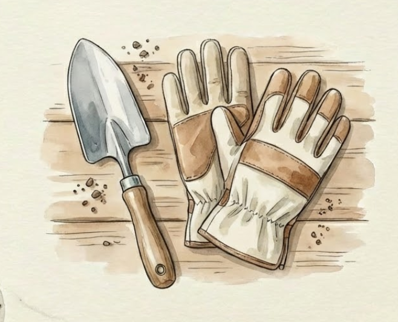
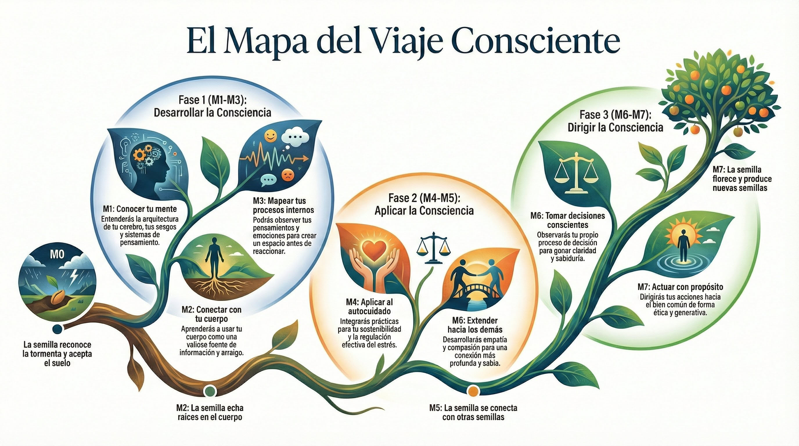

# Tema 6: El mapa del viaje

- [Por que este tema es necesario](#por-que-este-tema-es-necesario)
	- [Que encontraras en el programa](#que-encontraras-en-el-programa)
- [1. La progresion del programa](#1-la-progresion-del-programa)
- [2. El arco completo: de M0 a M7](#2-el-arco-completo-de-m0-a-m7)
- [3. La logica de la progresion](#3-la-logica-de-la-progresion)
	- [Fase 1 (M1-M3): Consciencia DE algo](#fase-1-m1-m3-consciencia-de-algo)
	- [Fase 2 (M4-M5): Consciencia APLICADA](#fase-2-m4-m5-consciencia-aplicada)
	- [Fase 3 (M6-M7): META-consciencia y consciencia DIRIGIDA](#fase-3-m6-m7-meta-consciencia-y-consciencia-dirigida)
- [4. Las practicas del programa](#4-las-practicas-del-programa)
- [5. El compromiso necesario](#5-el-compromiso-necesario)
- [6. Lo que NO es este programa](#6-lo-que-no-es-este-programa)
- [Dimension experiencial](#dimension-experiencial)
- [Proximo paso](#proximo-paso)
- [Material adicional del tema](#material-adicional-del-tema)
	- [Infografías del tema](#infografías-del-tema)

#ppt  "El Mapa del Viaje" - Estructura, Lógica y Transformación del Programa Líder Semilla.

#imagen  Semilla con brújula interior. El mapa interno que guía el crecimiento.

---

## Por que este tema es necesario

#### Que encontraras en el programa

**Pregunta que responde:**
Que voy a aprender y como se conecta todo?

Necesitas ver el mapa completo antes de empezar el viaje. Este tema presenta la estructura del programa mostrando la logica de la progresion y anticipando las transformaciones de cada modulo.

---

## 1. La progresion del programa

| Modulo | Titulo                               | Pregunta central                          | Transformacion                                           |
| ------ | ------------------------------------ | ----------------------------------------- | -------------------------------------------------------- |
| M0     | El momento que nos convoca           | Por que ahora?                            | "Entiendo la tormenta y acepto mi circulo de influencia" |
| M1     | Consciente de lo que soy             | Que tipo de sistema soy?                  | "No soy tan racional como creia"                         |
| M2     | Consciente de como estoy             | Que me dice mi cuerpo?                    | "Mi cuerpo es fuente de informacion"                     |
| M3     | Consciente de lo que pienso y siento | Como funcionan mis procesos internos?     | "Puedo crear espacio antes de reaccionar"                |
| M4     | Consciente de lo que necesito        | Que necesito para sostenerme?             | "El autocuidado no es lujo, es necesidad"                |
| M5     | Consciente de lo que necesitamos     | Como extiendo mi consciencia hacia otros? | "Del yo al nosotros. La compasion incluye sabiduria"     |
| M6     | Consciente de lo que quiero          | Como decido?                              | "Puedo observar mi proceso mientras decido"              |
| M7     | Consciente de lo que esta bien       | Hacia donde dirijo mi consciencia?        | "Cada accion consciente es una semilla de cambio"        |

---
## 2. EL ARCO COMPLETO: DE M0 A M7

|Módulo|Metáfora de la semilla|Capacidad del líder semilla|
|---|---|---|
|M0|La semilla reconoce la tormenta y acepta el suelo donde está|Realismo y compromiso|
|M1|La semilla conoce su propia naturaleza|Humildad epistemológica|
|M2|La semilla echa raíces en el cuerpo|Arraigo corporal|
|M3|La semilla aprende a no ser arrastrada por el viento|Espacio interior|
|M4|La semilla se nutre para poder crecer|Sostenibilidad|
|M5|La semilla se conecta con otras semillas|Conexión consciente|
|M6|La semilla observa su propio proceso de crecimiento|Decision consciente (ANTES-DURANTE-DESPUES)|
|M7|La semilla florece y produce nuevas semillas|Acción ética generativa|
#grafica  Opción 1: "El ADN del liderazgo consciente" - 7 características en espiral.
#grafica  Opción 2: "Una Progresión Orgánica" - crecimiento de semilla a fruto con los 7 módulos.

---
## 3. La logica de la progresion

#grafica  Opción 1: Las 3 fases en escalera vertical (ojo, mano, brújula).

#grafica  Opción 2: Las 3 fases horizontales con semilla creciendo.

#grafica  Opción 3: "La Lógica de la Progresión" - planta floreciendo con las 3 fases.
### Fase 1 (M1-M3): Consciencia DE algo

**Pregunta:** De que puedo ser consciente?

- **M1:** Conocer la arquitectura de tu mente (cerebro predictivo, sistemas de pensamiento, sesgos)
- **M2:** Conectar con tu cuerpo como fuente de informacion (interocepcion, sensaciones)
- **M3:** Mapear tus procesos de pensamiento y emocion (la cadena automatica, el espacio de respuesta)

#grafica  Fase 1 "Preparar el Terreno": M1 Humildad Epistemológica, M2 Arraigo Corporal, M3 Espacio Interior.

### Fase 2 (M4-M5): Consciencia APLICADA

**Pregunta:** Como uso mi consciencia para regularme y relacionarme?

- **M4:** Aplicar la consciencia al autocuidado (estres, regulacion, sostenibilidad)
- **M5:** Extender la consciencia hacia los demas (empatia, compasion, conexion)

#grafica  Fase 2 "Fortalecer las Raíces": M4 Sostenibilidad, M5 Conexión Consciente.

### Fase 3 (M6-M7): META-consciencia y consciencia DIRIGIDA

#grafica  Fase 3 "Crecer hacia la Luz": M6 Dirección Intencional, M7 Acción Ética.

**Pregunta:** Donde esta mi consciencia y hacia donde la dirijo?

- **M6:** Decision consciente — observar el proceso de decidir con el modelo ANTES (clarificar intencion, ampliar campo), DURANTE (sostener sin ser arrastrado), DESPUES (transitar y aprender)
- **M7:** Dirigir conscientemente la consciencia hacia el bien (etica, proposito, accion)

---

## 4. Las practicas del programa

Cada modulo incluye una practica meditativa que entrena experiencialmente el contenido:

| Modulo | Practica                    | Que entrena                                      |
| ------ | --------------------------- | ------------------------------------------------ |
| M0     | Meditacion de intencion     | Conectar con el proposito del viaje              |
| M1     | Atencion focalizada         | Concentracion sostenida (respiracion como ancla) |
| M2     | Body Scan                   | Consciencia corporal e interocepcion             |
| M3     | Observacion de pensamientos | Ver eventos mentales sin fusionarse              |
| M4     | Pausa de 3 minutos          | Regulacion y nutricion positiva                  |
| M5     | Meditacion de compasion     | Extension hacia el otro                          |
| M6     | Open Monitoring             | Observar el flujo sin dirigir                    |
| M7     | Metta (amor benevolente)    | Dirigir intencion benevolente                    |
#grafica  Tabla de prácticas meditativas por módulo: desde meditación de intención hasta Metta.

---

## 5. El compromiso necesario

Este programa no es informacion que se consume; es transformacion que se practica.

Requiere:

- **Presencia regular:** Asistir a las sesiones con atencion plena
- **Practica entre sesiones:** 10-15 minutos diarios de meditacion
- **Reflexion personal:** Aplicar el contenido a tu experiencia real
- **Apertura:** Disposicion a cuestionar supuestos sobre ti mismo y sobre el liderazgo

#imagen  Herramientas del jardinero: pala y guantes. El compromiso práctico del trabajo interior.

---

## 6. Lo que NO es este programa

- No es un conjunto de "tips" para ser mejor lider
- No es teoria que se memoriza
- No es una lista de comportamientos a imitar
- No es una solucion rapida

Es un proceso de transformacion gradual que requiere tiempo, practica y compromiso.

---

## Dimension experiencial #insight 

Reflexiona:

- Que modulo te atrae mas?
- Cual te genera mas resistencia?
- (La resistencia suele senalar donde esta el trabajo mas necesario)
- Que compromiso estas dispuesto a asumir?

---
## Proximo paso

Ahora que tienes el mapa, estas listo para comenzar el viaje.

M1 te espera con una pregunta fundamental: "Que tipo de sistema soy?"

La respuesta te sorprendera.

---
## Material adicional del tema #aux
### Infografías del tema

#infografia  Opción 1: Infografía del mapa del viaje.
#infografia  Opción 2: Variante de la infografía del mapa.
