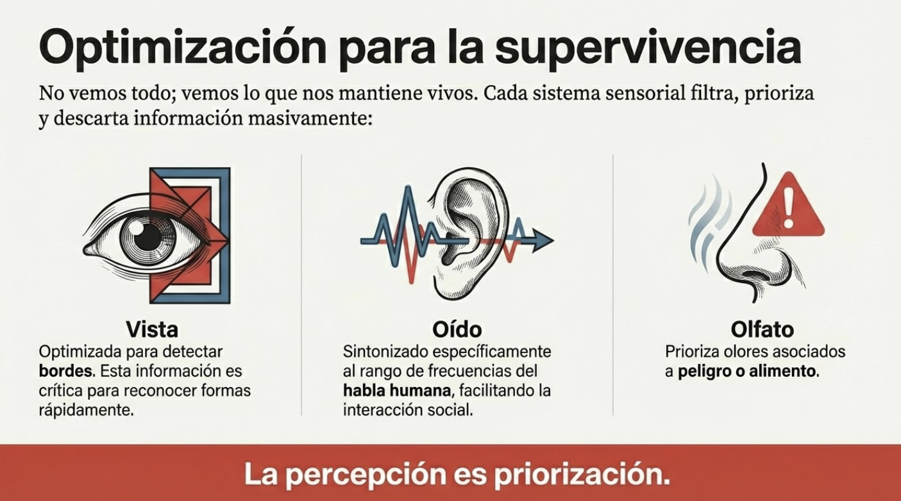
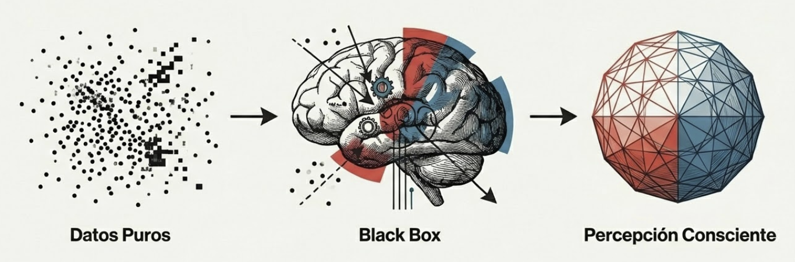
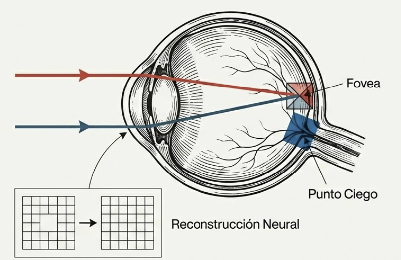

# Tema 2: Los sentidos ajustando la realidad

- [Por que este tema es necesario](#por-que-este-tema-es-necesario)
		- [Experimentando la construccion](#experimentando-la-construccion)
- [1. Los sentidos como puente con el modelo interno](#1-los-sentidos-como-puente-con-el-modelo-interno)
- [2. La percepcion como construccion](#2-la-percepcion-como-construccion)
- [3. Implicaciones para el lider](#3-implicaciones-para-el-lider)
- [Referencias incluidas](#referencias-incluidas)
- [Material adicional del tema](#material-adicional-del-tema)
	- [Infografías del tema](#infografías-del-tema)

---
## Por que este tema es necesario
#### Experimentando la construccion

**Pregunta que responde:**
Como construye mi cerebro lo que percibo como "realidad"?

En T1 establecimos que el cerebro no percibe la realidad sino que la construye mediante predicciones. Pero esto puede sonar abstracto.

Este tema permite **experimentar directamente** esa construccion a traves de los sentidos. Los ejercicios revelan que lo que "ves" no es lo que hay, sino lo que tu cerebro decide mostrarte.

La experiencia directa genera una comprension visceral que la teoria sola no consigue.

---

## 1. Los sentidos como puente con el modelo interno

Los sentidos son la entrada principal de informacion externa al cerebro. Pero su funcion no es capturar el mundo tal cual es —es **medir contraste**. Detectan cambios: lo que varia respecto al instante anterior, lo que difiere del fondo esperado.

**No buscan representacion completa

Cada sistema sensorial filtra, prioriza, descarta:
- El sistema visual esta optimizado para detectar **bordes** —informacion critica para reconocer formas
- El oido es especialmente sensible al rango de frecuencias del **habla humana** facilitando comunicación e interacción social. 
- El olfato prioriza olores asociados a **peligro o alimento**

Esta especializacion no es accidental: responde a lo relevante para la supervivencia.

#imagen
 Diagrama de cerebro en el centro rodeado por iconos de los 5 sentidos en círculos: mano (tacto), ojo (vista), oreja (oído), nariz (olfato), boca (gusto)

#ppt  "Optimización para la supervivencia" - Vista, oído, olfato filtran lo esencial.

#imagen  Cabeza con señales crudas transformadas en modelo interno proyectado.

---

## 2. La percepcion como construccion

#grafica  Diagrama: Datos Puros → Black Box (cerebro) → Percepción Consciente.

Los sentidos actúan como puentes entre el "teatro mental" del cerebro y el mundo exterior. Su función central: **medir contraste**, los cambios en la información del entorno. Esta información diferencial permite al cerebro actualizar y refinar constantemente su modelo interno, manteniéndolo alineado con una realidad en cambio permanente.

La percepción sensorial no es copia de la realidad —es construcción. El cerebro toma datos sensoriales fragmentarios y genera una interpretación propia: rellena vacíos, hace inferencias, crea una experiencia perceptiva coherente. Lo que experimentas como "ver" o "escuchar" es el resultado de este proceso constructivo, no una transmisión directa del exterior.

El cerebro no espera pasivamente informacion —la anticipa, la completa, la interpreta. Tres fenomenos ilustran este mecanismo:

**El punto ciego de la retina** #ejemplo 

Existe una zona sin fotorreceptores donde el nervio optico conecta con el ojo. El cerebro "rellena" esa informacion ausente, creando la ilusion de una imagen visual continua.

#imagen  Anatomía del ojo: fóvea y punto ciego con reconstrucción neural.

#ejercicio  Ejercicio visual: cruz y círculo para demostrar la reconstrucción neural.

Este tema incluye ejercicios practicos que demuestran la construccion perceptiva:

- Ejercicios de lectura automatica (textos desordenados que puedes leer)
- Ejercicios de numeros-letras
- Demostraciones del punto ciego

#ejercicio
 Video demostrativo: percepción sensorial y construcción de realidad.

#ejercicio
*texto en español con letras desordenadas sobre fondo negro: "no lees letras, reconoces formas. El cerebro corrige los errores en tiempo real para dar sentido al todo.

#ejercicio
*Texto en español con números sustituyendo letras sobre fondo negro: muestra cómo el contexto domina al dato; ves caracteres sin sentido pero eres capaz de leer una historia.

Estos ejercicios no son curiosidades: son **evidencia directa** de que tu cerebro completa, corrige e inventa lo que percibes.

---
## 3. Implicaciones para el lider

**Lo que "veo claramente" puede ser construccion

Si el cerebro inventa el punto ciego y corrige colores sin que lo sepas, que mas esta "completando" en situaciones complejas?

**Diferentes cerebros, diferentes construcciones

Cada persona tiene un sistema sensorial calibrado de forma unica por su experiencia. Lo que tu "ves claramente" otro puede percibirlo de forma radicalmente diferente.

#imagen  Dos cabezas viendo el mismo evento con percepciones diferentes.

**La humildad perceptiva

Antes de afirmar "esto es asi", conviene preguntarse: esto es asi, o asi lo construye mi cerebro?

#imagen  De la certeza a la curiosidad perceptiva.

---
## Referencias incluidas

**Otras posibles referencias a valorar:

---
## Material adicional del tema #aux
### Infografías del tema 

#infografia  Infografía: "Tu Cerebro, el Arquitecto de Tu Realidad".