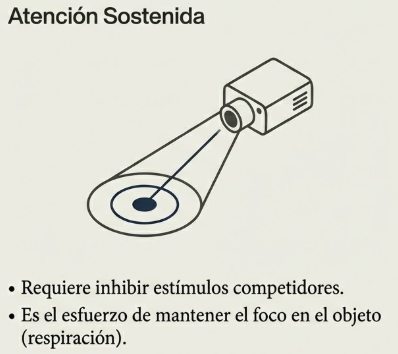
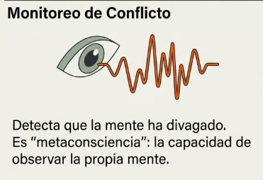
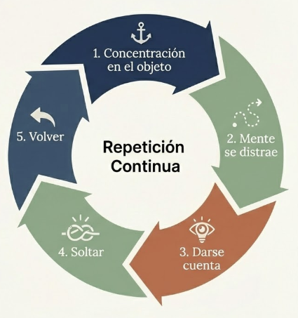
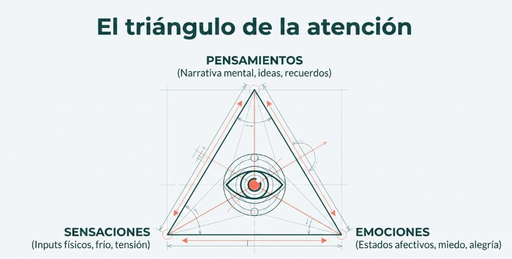
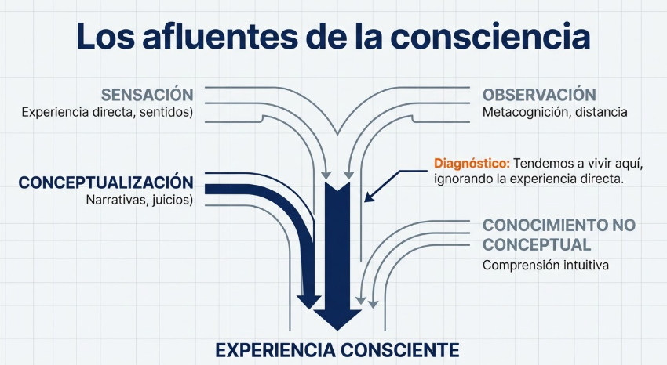
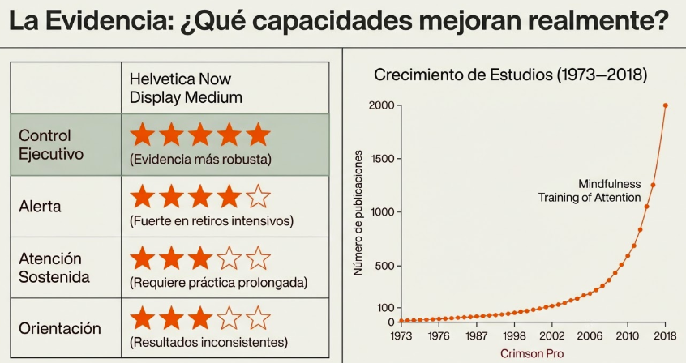
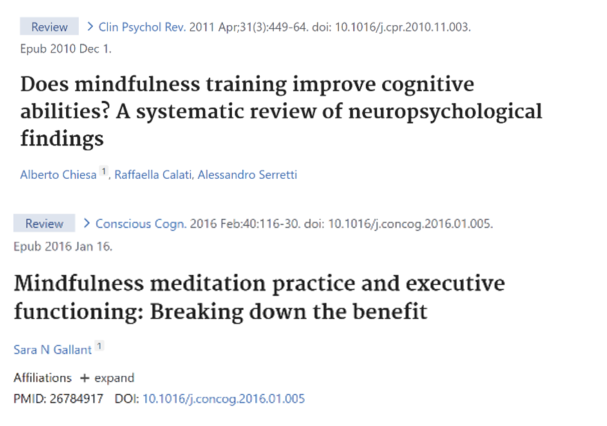
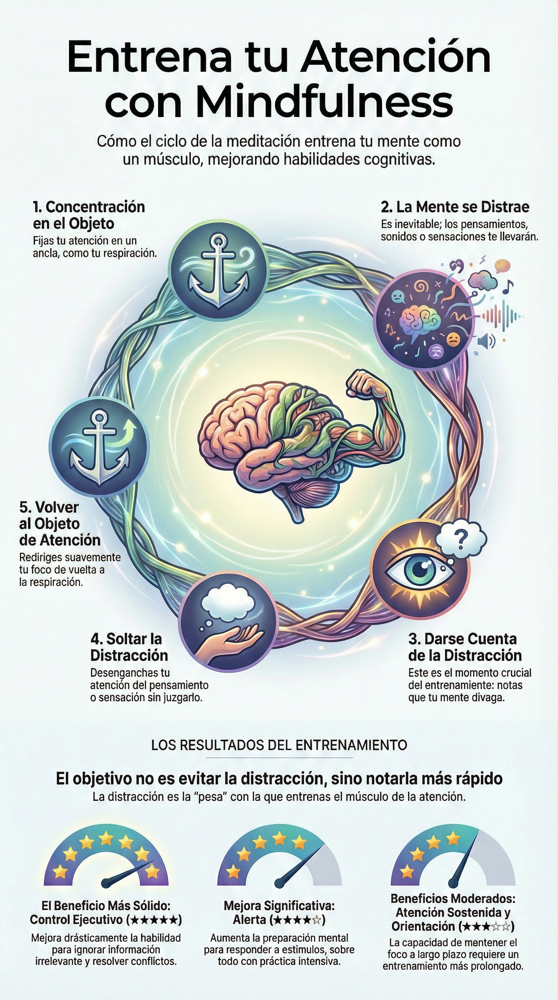

# Tema 10: Entrenando la atencion a traves del mindfulness

- [Por que este tema es necesario](#por-que-este-tema-es-necesario)
		- [La practica que fortalece la capacidad](#la-practica-que-fortalece-la-capacidad)
- [1. El circulo de la meditacion](#1-el-circulo-de-la-meditacion)
- [2. Redes cerebrales implicadas](#2-redes-cerebrales-implicadas)
- [3. El triangulo de la atencion](#3-el-triangulo-de-la-atencion)
- [4. Los afluentes de la consciencia](#4-los-afluentes-de-la-consciencia)
- [5. Efectos del mindfulness en las habilidades atencionales](#5-efectos-del-mindfulness-en-las-habilidades-atencionales)
- [Integracion con M1](#integracion-con-m1)
- [Conexion con el programa](#conexion-con-el-programa)
- [Referencias incluidas](#referencias-incluidas)
- [Material adicional del tema](#material-adicional-del-tema)
	- [Infografías del tema](#infografías-del-tema)

---
## Por que este tema es necesario

#### La practica que fortalece la capacidad

**Pregunta que responde:**
Como puedo entrenar mi capacidad de atencion consciente?

Este tema cierra el arco del modulo. T1-T7 revelaron la arquitectura mental. T8 establecio que la atencion es la puerta de la consciencia. T9 presento el mindfulness como metodo de entrenamiento.

Ahora el participante aprende **como practicar concretamente**: el ciclo de la meditacion, las redes cerebrales que se activan, y la practica de atencion focalizada en la respiracion.

---

## 1. El circulo de la meditacion

La meditación mindfulness opera mediante un ciclo que se repite continuamente:

1. **Concentración en el objeto** — Foco inicial en el objeto de meditación (respiración, sensación corporal)

#grafica  "Atención Sostenida": cámara enfocando objeto, requiere inhibir estímulos competidores.

2. **Mente se distrae** — La mente divaga. Esto no es un fallo; es inevitable

#grafica  "El Vagabundeo Mental": red de nodos dispersos, activación de la Red por Defecto.
2. **Darse cuenta de la mente distraída** — Reconocer que la atención se ha desplazado
#grafica  "Monitoreo de Conflicto": ojo con señal de alerta, metaconsciencia detectando divagación mental.

3. **Soltar el objeto de la distracción** — Desengancharse del pensamiento que capturó la atención

#grafica  "Cambio Atencional": engranaje con flechas de desenganche y redirección.
2. **Volver al objeto de la atención** — Redirigir el foco al objeto original

Cada iteración de este ciclo fortalece la capacidad atencional. **El entrenamiento no consiste en evitar la distracción —imposible— sino en acortar el tiempo entre divagar y notarlo.**

#grafica  Diagrama circular de 5 etapas del ciclo meditativo: Concentración en el objeto → Mente se distrae → Darse cuenta → Soltar la distracción → Volver al objeto. Repetición continua.

**Por que funciona?

Cada iteracion de este ciclo fortalece la capacidad atencional. **El entrenamiento no consiste en evitar la distraccion (imposible) sino en acortar el tiempo entre divagar y notarlo.**

- La distraccion no es el enemigo; es el peso con el que entrenas
- El momento de "darse cuenta" es el mas valioso: es metaconsciencia en accion
- Volver es el ejercicio: cada vuelta fortalece el "musculo"

#ppt  "La distracción no es el enemigo, es el peso que levantas": cerebro con pesas. El mito ("no puedo meditar"), la realidad (acortar el tiempo entre divagar y notarlo), la acción (metaconsciencia).
#ppt  "El Gimnasio de la Mente: El Círculo de la Meditación": 4 pasos circulares con "Darse cuenta (Insight)" destacado como momento clave del entrenamiento.

---

## 2. Redes cerebrales implicadas

Cada fase del ciclo meditativo activa redes cerebrales especificas (Malinowski, 2013):

#grafica  "Neurobiología del Ciclo: Redes Cerebrales en Acción" - diagrama de Malinowski (2013): ciclo meditativo de 5 fases conectado con las redes cerebrales implicadas (Atención Sostenida, Red por Defecto, Monitoreo de Conflicto, Atención Ejecutiva, Orientación).[^1]

#ppt  "Las tres capacidades cognitivas que estamos entrenando": Atención Sostenida, Monitoreo de Conflicto y Cambio Atencional con iconos descriptivos.

**Atencion sostenida

Mantener el foco en el objeto elegido requiere inhibir estimulos competidores.

**Monitoreo de conflicto o atencion ejecutiva

Detecta el vagabundeo mental y prioriza entre pensamientos, sensaciones y respuestas en competencia.

**Cambio atencional

Dos capacidades distintas operan aqui:
- **Desenganche:** soltar la distraccion sin engancharse en elaboracion adicional
- **Redireccion:** mover el foco de vuelta al objeto seleccionado con agilidad

**Atencion selectiva o inhibicion cognitiva

Capacidad de inhibir el procesamiento elaborativo secundario de pensamientos, sensaciones y emociones.

La autorregulacion atencional cultiva una **consciencia no elaborativa**: en lugar de quedar atrapado en cadenas de pensamiento rumiativo (origenes, implicaciones, asociaciones), el mindfulness implica experiencia directa de los eventos mentales y corporales.

---
## 3. El triangulo de la atencion

La experiencia consciente fluye por tres canales principales que interactuan constantemente:

- **Pensamientos** (vertice superior): El flujo narrativo interno, juicios, planes, memoria
- **Sensaciones** (vertice inferior izquierdo): Informacion corporal: tension, temperatura, propiocepcion
- **Emociones** (vertice inferior derecho): Estados afectivos que colorean la experiencia

Estos tres canales no operan aislados. Un pensamiento catastrofista genera tension corporal; la tension corporal intensifica la emocion; la emocion sesga el pensamiento.

**Notar en que vertice se encuentra la atencion en un momento dado, y reconocer como alimenta a los otros, constituye el primer paso para intervenir conscientemente en el ciclo.**

#grafica  Opción 1: Triángulo de la atención con iconos: Pensamientos (narrativa, juicios), Sensaciones (cuerpo, tensión), Emociones (clima interno, afecto).
#grafica  Opción 2: "El triángulo de la atención" con ojo central: Pensamientos, Sensaciones, Emociones con flechas bidireccionales mostrando su interrelación.

---

## 4. Los afluentes de la consciencia

#grafica  "Los afluentes de la consciencia": 4 canales (Sensación, Observación, Conceptualización, Conocimiento no conceptual) convergiendo hacia la experiencia consciente.

La metafora de los afluentes describe cuatro canales que alimentan el rio de la consciencia:

**Sensacion

Experiencia sensorial directa: vista, oido, tacto, gusto, olfato, propiocepcion. El mindfulness cultiva atencion plena a las sensaciones del momento presente sin anadir juicio.

**Observacion

Capacidad de observar pensamientos, emociones y experiencias sin identificarse con ellos. Proporciona distancia y claridad. Se cultiva mediante metacognicion: atencion a la atencion misma.

**Conceptualizacion

La mente crea conceptos y narrativas a partir de las experiencias sensoriales. El mindfulness permite observar esta tendencia sin aferrarse a los juicios, reconociendo que estas construcciones mentales no son la realidad absoluta.

**Conocimiento no conceptual

Comprension intuitiva y directa que emerge de la integracion de los otros afluentes. No depende del lenguaje. Se cultiva prestando atencion plena a la experiencia presente.

---

## 5. Efectos del mindfulness en las habilidades atencionales

#ppt  "La Evidencia: ¿Qué capacidades mejoran realmente?": tabla de estrellas (Control Ejecutivo 5/5, Alerta 4/5, Atención Sostenida 3/5, Orientación 3/5) + curva de crecimiento de estudios 1973-2018.

| Componente             | Evidencia |
| ---------------------- | --------- |
| **ALERTA**             | ★★★★☆     |
| **ATENCIÓN SOSTENIDA** | ★★★☆☆     |
| **ORIENTACIÓN**        | ★★★☆☆     |
| **CONTROL EJECUTIVO**  | ★★★★★     |

#imagen  Artículo de Prakash et al. (2020) "Mindfulness and Attention" con gráfico de dispersión mostrando el crecimiento de estudios sobre "Mindfulness Training of Attention" (1973-2018) y resumen de evidencia por componente atencional.[^2]

#imagen  Referencias a artículos científicos clave: Chiesa et al. (2011) sobre habilidades cognitivas y Gallant (2016) sobre funciones ejecutivas.[^3][^4]

**Alerta

Preparación mental para responder a estímulos entrantes. Se divide en dos modalidades:

**-Alerta fásica**: fluctuaciones momentáneas de atención en respuesta a señales. El mindfulness intensivo (retiros) mejora esta capacidad, especialmente en tareas de detección y discriminación visual.

**-Alerta tónica**: vigilancia o mantenimiento de un estado de atención sostenida. Estudios de retiros a largo plazo muestran mejoras en atención sostenida y reducción en divagación mental. Los estudios a corto plazo ofrecen resultados mixtos —la mejora de la vigilancia parece requerir entrenamiento prolongado.

**Orientación

Dirigir la atención hacia estímulos internos o externos. Opera en dos direcciones:

-**De arriba hacia abajo**: atención dirigida según objetivos internos o autogenerados.

-**De abajo hacia arriba**: atención capturada automáticamente por estímulos externos.

La investigación sobre efectos del mindfulness en orientación es limitada y los resultados inconsistentes.

**Control ejecutivo

Mecanismo que resuelve conflictos entre información competidora: fortalece la respuesta a estímulos relevantes y suprime los irrelevantes.

Estudios con tareas Flanker (capacidad de atención frente a distracciones) y Stroop (habilidad para ignorar información irrelevante) muestran mejoras en control de conflictos tras entrenamiento en mindfulness. Estos beneficios aparecen incluso después de entrenamientos cortos, y algunos estudios indican que pueden mantenerse hasta seis meses.

En síntesis, **el mindfulness muestra beneficios más robustos en control ejecutivo y alerta fásica.** Los efectos en orientación y alerta tónica requieren más investigación. El control de conflictos —mantener atención en lo relevante y reducir distracciones— representa el área con evidencia más sólida.

---

## Integracion con M1

**Respuesta al problema planteado

T1-T9 revelaron el problema:
- El cerebro construye la realidad (T1)
- Los sentidos alimentan una construccion, no una copia (T2)
- La memoria genera automatismos que operan sin supervision (T3)
- Las emociones amplifican el aprendizaje (T4)
- Las estructuras cerebrales integran el procesamiento (T5)
- El Sistema 1 domina (T6)
- Los sesgos son estructurales (T7)
- La atencion es la puerta de la consciencia (T8)
- El mindfulness es el metodo de entrenamiento (T9)

T10 ofrece la practica concreta:
- Puedes entrenar la capacidad de observar todo esto
- Cada ciclo de meditacion es una repeticion del entrenamiento
- Con practica, la capacidad de "pillar" al piloto automatico aumenta

---

## Conexion con el programa

**Practica transversal: Cada modulo profundizara un aspecto:

| Modulo | Practica | Foco |
|--------|----------|------|
| M1 | Atencion focalizada | Respiracion como ancla |
| M2 | Body Scan | Sensaciones corporales |
| M3 | Observacion de pensamientos | Eventos mentales |
| M4 | Pausa de 3 minutos | Regulacion rapida |
| M5 | Compasion | El otro como foco |
| M6 | Open Monitoring | El flujo de consciencia |
| M7 | Metta | Intencion benevolente |

---
## Referencias incluidas

[^1]: Malinowski, Peter. (2013). Neural mechanisms of attentional control in mindfulness meditation. Frontiers in Neuroscience. 7. 8. 10.3389/fnins.2013.00008.
[^2]: Prakash, R.S. et al. (2020). Mindfulness and Attention: Current State-of-Affairs and Future Considerations. J Cogn Enhanc.
[^3]: Chiesa, A. et al. (2011). Does mindfulness training improve cognitive abilities? A systematic review of neuropsychological findings. Clinical Psychology Review.
[^4]: Gallant, S.N. (2016). Mindfulness meditation practice and executive functioning: Breaking down the benefit. Consciousness and Cognition.

**otras posibles referencias de interés

- Kabat-Zinn, J. (1990). *Full Catastrophe Living.* Delacorte.
- Segal, Z.V., Williams, J.M.G., & Teasdale, J.D. (2013). *Mindfulness-Based Cognitive Therapy for Depression.* Guilford Press.
- Malinowski, P. (2013). *Neural mechanisms of attentional control in mindfulness meditation.* Frontiers in Neuroscience.
- Jha, A. (2021). *Peak Mind.* HarperOne.
- Lutz, A. et al. (2008). *Attention regulation and monitoring in meditation.* Trends in Cognitive Sciences.
- Prakash, R.S. et al. (2020). *Mindfulness and Attention: Current State-of-Affairs and Future Considerations.* J Cogn Enhanc.
- Chiesa, A. et al. (2011). *Does mindfulness training improve cognitive abilities?* Clinical Psychology Review.
- Gallant, S.N. (2016). *Mindfulness meditation practice and executive functioning.* Consciousness and Cognition.

---

## Material adicional del tema #aux
### Infografías del tema 

#infografia  Infografía síntesis: "Entrena tu Atención con Mindfulness" - ciclo de meditación, habilidades cognitivas entrenadas y niveles de evidencia.