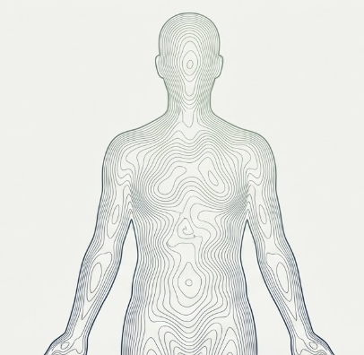

# Modulo 2: Consciente de como estoy

- [El cuerpo como fuente de informacion y anclaje al presente](#el-cuerpo-como-fuente-de-informacion-y-anclaje-al-presente)
- [Lo que traes de M1](#lo-que-traes-de-m1)
- [Pregunta central](#pregunta-central)
- [Transformacion esperada](#transformacion-esperada)
- [La brecha que M2 cierra](#la-brecha-que-m2-cierra)
- [Lo que encontraras en este modulo](#lo-que-encontraras-en-este-modulo)
- [Practica de este modulo](#practica-de-este-modulo)
- [Conexion con el programa](#conexion-con-el-programa)
- [Segunda caracteristica del lider semilla](#segunda-caracteristica-del-lider-semilla)
- [El triangulo de la atencion](#el-triangulo-de-la-atencion)


#imagen  Silueta humana con líneas topográficas que representan el mapa de sensaciones corporales, metáfora del cuerpo como territorio por explorar.

## El cuerpo como fuente de informacion y anclaje al presente

---

## Lo que traes de M1

En el modulo anterior descubriste:

- Que tu cerebro construye la realidad, no la percibe pasivamente
- Que el Sistema 1 (rapido, automatico) domina la mayoria de decisiones
- Que los sesgos son caracteristicas de diseno, no errores puntuales
- Que las emociones son parte integral del sistema de decision
- Que la atencion es la "puerta" de la consciencia
- Que el mindfulness entrena la capacidad de observar la mente

Has desmontado la ilusion del agente racional.

Ahora toca descubrir una fuente de informacion que probablemente has ignorado durante anos: tu cuerpo.

---

## Pregunta central

> Que me esta diciendo mi cuerpo ahora mismo, y por que deberia escucharlo?

M2 amplía el foco: de la arquitectura mental (M1) al vehículo corporal. El participante descubre que "cómo estoy" no es una pregunta abstracta —tiene respuestas concretas en el cuerpo, accesibles en tiempo real.

---

## Transformacion esperada

Al terminar este modulo, habras integrado:

> "Mi cuerpo es fuente de informacion, no solo contenedor de mi cerebro. Puedo acceder a datos sobre mi estado emocional, mi nivel de estres y mis necesidades a traves de sensaciones corporales. El cuerpo siempre esta en el presente —es mi anclaje mas fiable."

#grafica  Contraste entre "La Ilusión" (cuerpo como contenedor de transporte) y "La Realidad" (cuerpo como fuente de datos en tiempo real).


---

## La brecha que M2 cierra

Entiendes como funciona tu mente (M1), pero aun no reconoces que el cuerpo informa continuamente sobre tu estado.

Esa informacion es esencial para decidir, regular emociones y mantener el bienestar.

---

## Lo que encontraras en este modulo

| Tema | Contenido | Pregunta que responde |
|------|-----------|----------------------|
| T1 | Tres sistemas perceptivos | Cuantas formas tengo de percibir, y cuales he ignorado? |
| T2 | La revolucion interoceptiva | Por que hemos ignorado el cuerpo, y que nos dice la ciencia ahora? |
| T3 | El mapa interoceptivo en el cerebro | Donde y como procesa el cerebro la informacion del cuerpo? |
| T4 | El cuerpo como anclaje | Por que todas las tradiciones contemplativas usan el cuerpo? |
| T5 | Evidencia y beneficios | Que cambia con la practica de consciencia corporal? |

---

## Practica de este modulo

**Body Scan (Exploracion corporal)**

Mientras M1 uso la respiracion como objeto focal, M2 expande la atencion a todo el cuerpo, entrenando especificamente la capacidad interoceptiva.

No se trata de relajarte forzosamente, sino de notar que hay.

---

## Conexion con el programa

| M2 establece | Modulos que desarrollan |
|--------------|------------------------|
| El cuerpo como fuente de informacion | M3: emociones tienen sede corporal |
| La interocepcion | M4: estres como fenomeno corporal |
| El cuerpo como anclaje | M6: recuperar metaconsciencia |

---

## Segunda caracteristica del lider semilla

**Arraigo corporal:** Esta conectado con su cuerpo como fuente de informacion y anclaje al presente.
#imagen  Silueta de líder con traje cuyos pies se extienden en raíces, metáfora del arraigo corporal como segunda característica del líder semilla.
El lider que ignora su cuerpo pierde acceso a informacion crucial para decidir y regular su estado.


#grafica  Infografía "El Cuerpo como Anclaje" con pies-raíces y cita: "El cuerpo siempre está en el presente. Es mi anclaje más fiable."

---

## El triangulo de la atencion

M2 completa el segundo vertice del triangulo que M3 cerrara:

#grafica  Triángulo de la atención (Sensaciones, Pensamientos, Emociones) con el foco del M2 destacado en el vértice Sensaciones.


```
        SENSACIONES (M2) <-- Aqui estamos
             /\
            /  \
           /    \
          /      \
         /________\
   PENSAMIENTOS    EMOCIONES
      (M3)           (M3)
```

#infografia  Infografía de síntesis del módulo: el cuerpo como fuente de información y anclaje al presente, con los temas clave por explorar.
