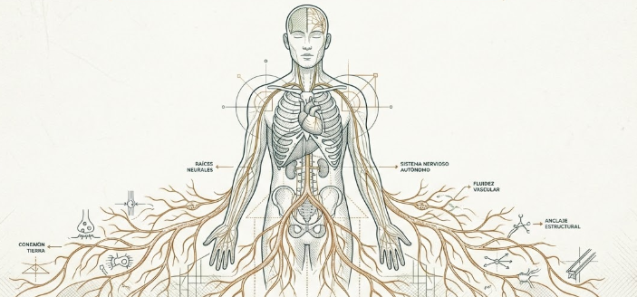
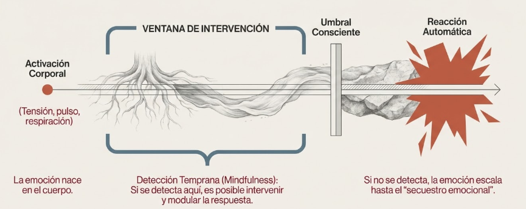
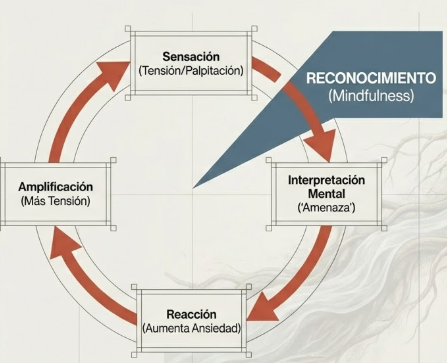
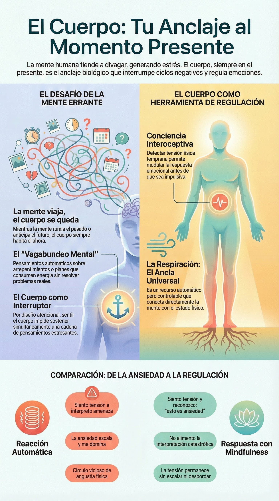

# Tema 4: El cuerpo como anclaje

#imagen  Figura humana anatómica con raíces neurales, sistema nervioso autónomo, fluidez vascular y anclaje estructural extendiéndose como raíces de árbol.

- [Por que este tema es necesario](#por-que-este-tema-es-necesario)
		- [Por que el mindfulness usa el cuerpo](#por-que-el-mindfulness-usa-el-cuerpo)
- [1. El cuerpo siempre esta en el presente](#1-el-cuerpo-siempre-esta-en-el-presente)
- [2. El cuerpo como interruptor](#2-el-cuerpo-como-interruptor)
- [3. Conciencia interoceptiva y deteccion temprana](#3-conciencia-interoceptiva-y-deteccion-temprana)
- [4. El circulo vicioso de la ansiedad](#4-el-circulo-vicioso-de-la-ansiedad)
- [5. Por que la respiracion es el ancla universal](#5-por-que-la-respiracion-es-el-ancla-universal)
- [Conexion con M1](#conexion-con-m1)
- [Conexion con el programa](#conexion-con-el-programa)
- [Dimension experiencial](#dimension-experiencial)
- [Referencias incluidas](#referencias-incluidas)
- [Material adicional del tema](#material-adicional-del-tema)
	- [Infografías del tema](#infografías-del-tema)

---

## Por que este tema es necesario

#### Por que el mindfulness usa el cuerpo

**Pregunta que responde:**
Por que todas las tradiciones contemplativas usan el cuerpo como punto de atencion?

Este tema conecta la teoria (T1-T4) con la practica. Entenderas por que el cuerpo es el anclaje privilegiado del mindfulness: **porque siempre esta en el presente**.

Esta comprension transforma la practica de ejercicio tecnico a necesidad logica.

---

## 1. El cuerpo siempre esta en el presente

#grafica  Figura meditando sobre un ancla en el "Aquí y Ahora", con flechas hacia Pasado (rumiación, arrepentimiento) y Futuro (anticipación, ansiedad).

En el mindfulness y en numerosas tradiciones meditativas, el cuerpo funciona como anclaje primario de la atención. La razón es simple y poderosa: **el cuerpo siempre está en el presente**. Mientras la mente puede vagar hacia el pasado o anticipar el futuro, el cuerpo permanece anclado en el ahora. Dirigir la atención hacia él inhibe el vagabundeo mental —esas rumiaciones que consumen energía sin resolver nada.

La forma más directa de regresar al presente cuando la mente divaga: llevar la atención al cuerpo. Por eso todas las prácticas contemplativas utilizan algún aspecto corporal como punto focal: la respiración, el body scan, la atención al movimiento. No es casualidad; es diseño basado en cómo funciona la atención humana.

La mente puede vagar:

- **Al pasado:** Rumiacion, arrepentimiento, nostalgia
- **Al futuro:** Anticipacion, ansiedad, planificacion

El cuerpo no puede. **Siempre esta aqui y ahora.**

Tu cuerpo no puede respirar en el pasado. No puede sentir tension en el futuro. Solo puede existir en el presente.

#grafica  Triángulo de la atención con el foco en Sensaciones: "Al enfocar el vértice de las sensaciones, estabilizamos los pensamientos y las emociones."

---

## 2. El cuerpo como interruptor

Cuando la mente se pierde en rumiacion o ansiedad, dirigir la atencion al cuerpo **interrumpe la cadena de pensamientos**.

No por fuerza de voluntad ("deja de pensar en eso").

Por diseno atencional: cuando atiendas al cuerpo, no puedes simultaneamente sostener la cadena de pensamiento.

#grafica  Metáfora de vías de tren: la atención como cambio de agujas que desvía de la rumiación mental hacia la sensación somática.

---

## 3. Conciencia interoceptiva y deteccion temprana

#imagen  Silueta humana con círculos concéntricos emanando del pecho, representando las señales interoceptivas que irradian desde el cuerpo.

Atender al cuerpo permite detectar emociones en etapas iniciales:

1. Una emocion comienza como activacion corporal
2. Si la detectas temprano, tienes mas opciones
3. Si no la detectas, la emocion crece hasta dominar

**Ejemplo:**
- Tension en hombros + respiracion superficial = inicio de ansiedad
- Detectada temprano: puedo intervenir
- No detectada: ansiedad escala hasta "secuestro" emocional

Prestar atención a las sensaciones corporales permite detectar las emociones en etapas tempranas, antes de que se hagan plenamente conscientes y disparen reacciones automáticas. La tensión muscular, los cambios en la respiración, las alteraciones del ritmo cardíaco —son señales que anticipan lo que viene. Reconocerlas crea una ventana de intervención: es posible modular la respuesta antes de que se vuelva impulsiva.

En lugar de alimentar la espiral con nuevos pensamientos que generan más emociones, la atención al cuerpo interrumpe el procesamiento automático que sostiene los patrones rumiativos. La ansiedad ilustra este mecanismo: se asocia con una mayor atención a las señales interoceptivas, lo que puede crear un círculo vicioso. La persona ansiosa percibe con mayor intensidad las palpitaciones, la dificultad para respirar —y esa percepción amplificada aumenta la preocupación, intensificando la experiencia de ansiedad. Reconocer el patrón es el primer paso para interrumpirlo.

#grafica  Opción 1: Línea temporal desde activación corporal hasta reacción automática, mostrando la "ventana de intervención" donde el mindfulness permite modular la respuesta.

#grafica  Opción 2: Silueta femenina con ondas concéntricas, mostrando señal física → detección temprana (intervenir y modular) vs. no detección (secuestro emocional).

---

## 4. El circulo vicioso de la ansiedad

#grafica  Opción 1: Círculo vicioso de la ansiedad: Sensación → Interpretación mental ('amenaza') → Reacción (aumenta ansiedad) → Amplificación (más tensión).

La ansiedad amplifica la atencion a senales corporales:

1. Siento tension
2. La interpreto como amenaza
3. Aumenta la ansiedad
4. Aumenta la tension
5. Aumenta la atencion a la tension
6. (Escalada)

**Reconocer el patron permite interrumpirlo:**

#grafica  Opción 2: Mismo círculo vicioso con la intervención del Reconocimiento (Mindfulness) que interrumpe el ciclo entre sensación e interpretación.

1. Siento tension
2. Reconozco: "esto es ansiedad en el cuerpo"
3. No alimento la interpretacion catastrofica
4. La tension puede permanecer sin escalar

---

## 5. Por que la respiracion es el ancla universal

Todas las tradiciones contemplativas usan la respiracion:

- Siempre esta disponible
- Es automatica pero puede controlarse
- Conecta cuerpo y mente
- Responde inmediatamente a cambios de estado

La practica de M1 (atencion a la respiracion) es el primer paso. M2 expande: todo el cuerpo es ancla.
#ppt  Diapositiva "¿Por qué la respiración?" con cuatro propiedades: Disponibilidad, Dualidad (automática/controlable), Conexión mente-cuerpo y Sensibilidad emocional.

---

## Conexion con M1

M1 uso la respiracion como objeto focal, pero sin explicar profundamente por que.

M2 proporciona la fundamentacion:

| M1 | M2 |
|----|----|
| "Atiende a la respiracion" | "Porque el cuerpo es tu anclaje al presente" |
| Instruccion practica | Comprension del por que |
#grafica  Triángulo Sensaciones (Ancla) — Pensamientos (Narrativa) — Emociones (Energía) con flechas de interacción circular.

---

## Conexion con el programa

El cuerpo como anclaje reaparecera:

| Modulo | Aplicacion |
|--------|-----------|
| M4 | Pausa de 3 minutos: anclarse para regularse |
| M5 | Presencia corporal en conversaciones dificiles |
| M6 | Recuperar metaconsciencia bajo presion |

---

## Dimension experiencial #insight 

Reflexiona:

- Usas conscientemente el cuerpo para "volver" cuando tu mente divaga?
- Que sensacion corporal usarias como ancla personal?
- Cuando fue la ultima vez que una sensacion corporal te "desperto" de un pensamiento rumiativo?

Las pausas corporales en reuniones largas no son lujo:

- Son necesidad cognitiva basada en como funciona la atencion
- Permiten "resetear" y volver al presente
- Mejoran la calidad de la atencion posterior

El lider que ignora el cuerpo pierde acceso a su mejor herramienta de regulacion.

---

## Referencias incluidas

**Otras posibles referencias de interés:
- Kabat-Zinn, J. (1990). *Full Catastrophe Living.* Delacorte.
- Farb, N.A.S. et al. (2015). *Interoception, contemplative practice, and health.* Frontiers in Psychology.
- Mehling, W.E. et al. (2012). *The Multidimensional Assessment of Interoceptive Awareness (MAIA).* PLoS ONE.

---
## Material adicional del tema #aux
### Infografías del tema 

#infografia  Infografía "El Cuerpo: Tu Anclaje al Momento Presente" — mente errante vs. cuerpo como herramienta de regulación, conciencia interoceptiva, respiración como ancla, y comparación ansiedad vs. respuesta mindfulness. 