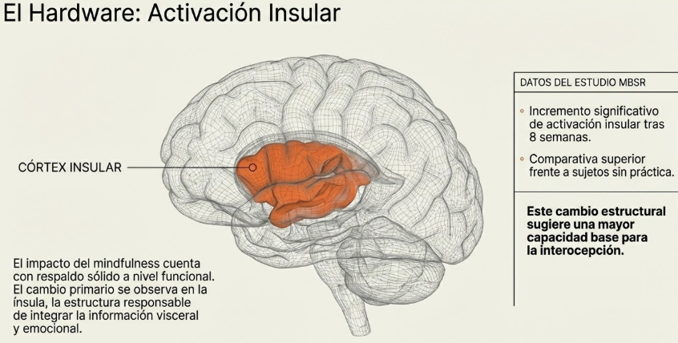
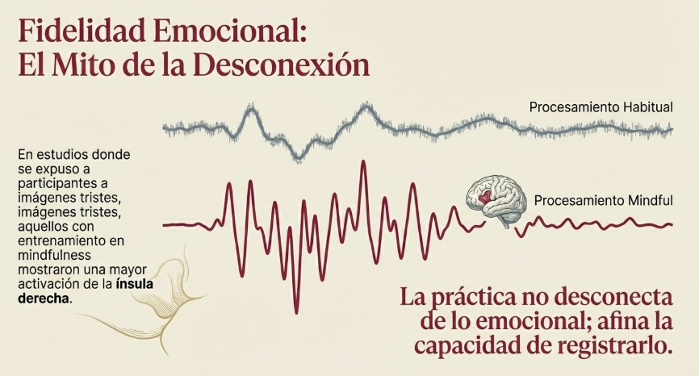
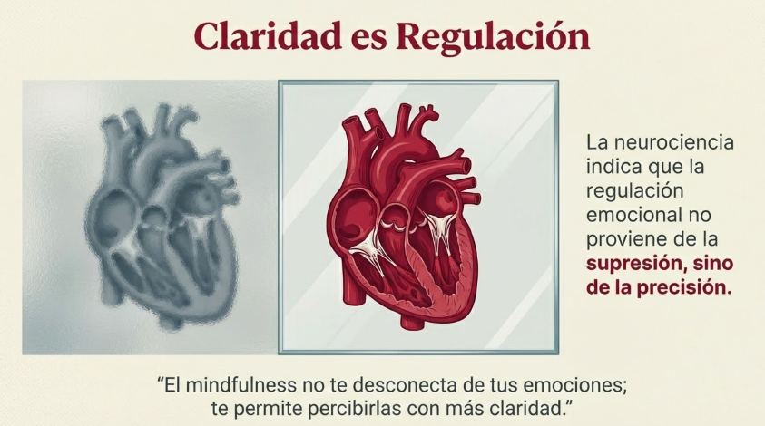
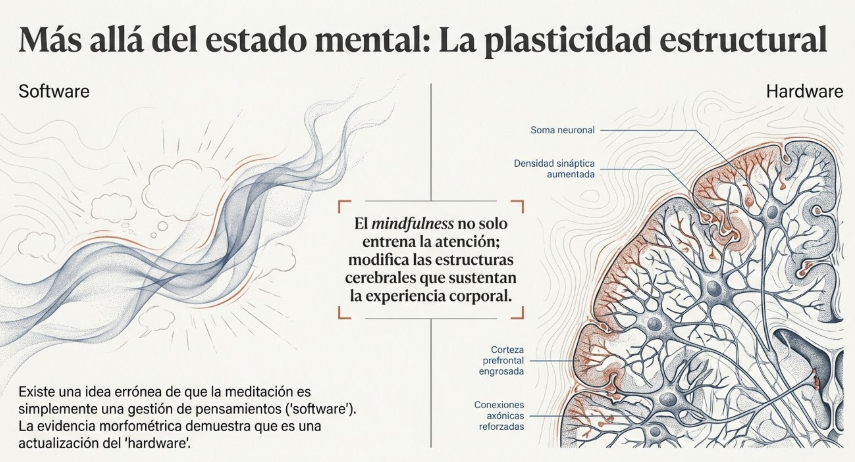
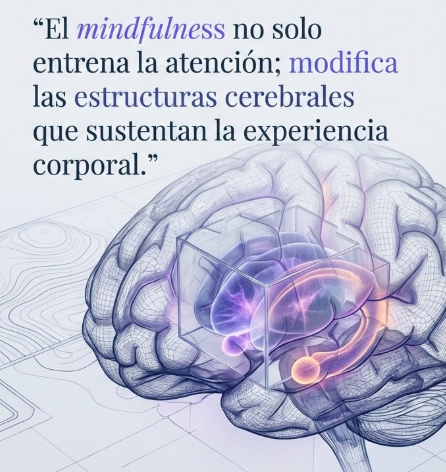
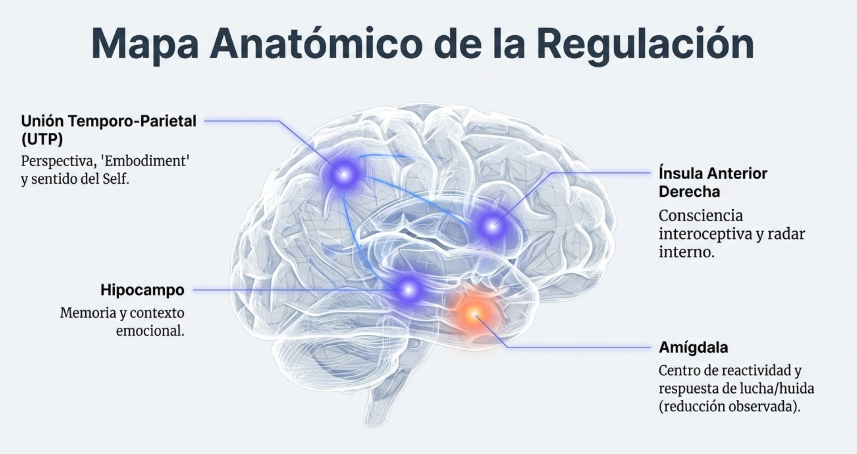
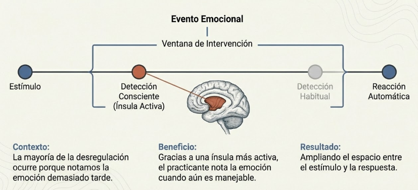
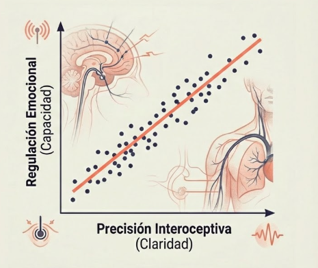
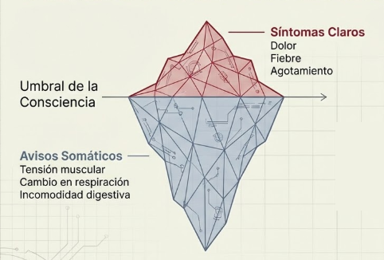
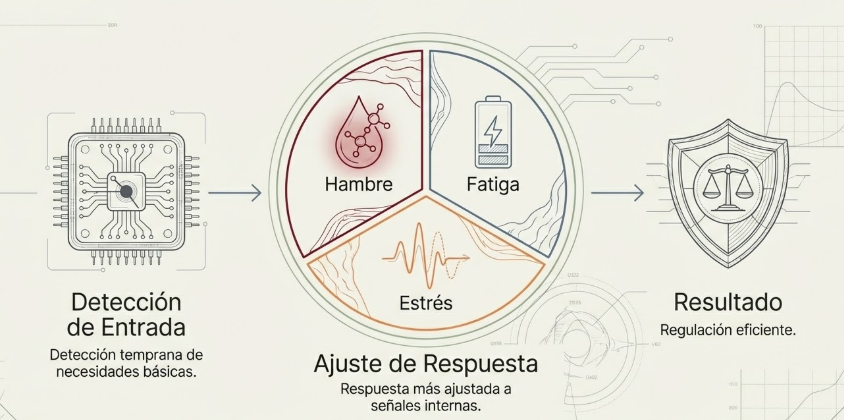

# Tema 5: Evidencia y beneficios del mindfulness en la interocepción

- [Por que este tema es necesario](#por-que-este-tema-es-necesario)
		- [Lo que cambia con la practica](#lo-que-cambia-con-la-practica)
- [1. Cambios funcionales](#1-cambios-funcionales)
- [2. Cambios estructurales](#2-cambios-estructurales)
- [3. Beneficios en regulacion emocional](#3-beneficios-en-regulacion-emocional)
- [4. Beneficios en toma de decisiones](#4-beneficios-en-toma-de-decisiones)
- [5. Beneficios en bienestar general](#5-beneficios-en-bienestar-general)
- [Conexion con M1](#conexion-con-m1)
- [Conexion con el programa](#conexion-con-el-programa)
- [Dimension organizacional](#dimension-organizacional)
- [Referencias incluidas](#referencias-incluidas)
- [Material adicional del tema](#material-adicional-del-tema)
	- [Infografías del tema](#infografías-del-tema)

#imagen  Silueta humana como red geométrica de nodos y conexiones, representando el cuerpo como sistema integrado de información.

---

## Por que este tema es necesario

#### Lo que cambia con la practica

**Pregunta que responde:**
Que evidencia hay de que mejorar la consciencia corporal produce beneficios reales?

Este tema cierra el modulo con evidencia cientifica y beneficios concretos. Entenderas que la practica no es solo experiencial; tiene correlatos neurobiologicos medibles y beneficios funcionales documentados.

---
El impacto del mindfulness en la interocepción cuenta con respaldo neurocientífico sólido, tanto a nivel funcional como estructural.
## 1. Cambios funcionales

#ppt  Diapositiva "El Hardware: Activación Insular" con cerebro mostrando córtex insular resaltado y datos del estudio MBSR (incremento tras 8 semanas).

Se ha encontrado un incremento de la activación de la ínsula en individuos tras un curso MBSR, comparado con sujetos sin práctica de mindfulness[^1]. El mismo estudio detectó mayor activación de la corteza somatosensorial secundaria —estructura relevante para el procesamiento de eventos sensoriales exteroceptivos.
#grafica  Cerebro con ínsula y corteza somatosensorial secundaria señaladas, mostrando co-activación funcional tras mindfulness.

En otro estudio, participantes que habían completado entrenamiento mindfulness mostraron mayor activación de la ínsula derecha ante imágenes tristes[^4]. La práctica no desconecta de lo emocional; afina la capacidad de registrarlo.

#grafica  "Fidelidad Emocional: El Mito de la Desconexión" — ondas de procesamiento habitual vs. mindful, mostrando mayor activación de ínsula derecha ante estímulos tristes.
Esta línea se confirma en estudios sobre dolor. Ante estímulos desagradables durante estado mindful, meditadores mostraron mayor activación en la ínsula posterior y el córtex somatosensorial secundario[^5]. Resultados similares: meditadores mindfulness activaron con mayor intensidad la ínsula izquierda —anterior, posterior y media— así como el tálamo[^6].

El fortalecimiento del procesamiento sensorial representa un incremento del procesamiento bottom-up de los estímulos: consciencia de la sensación actual tal como es, sin filtros interpretativos añadidos.

#ppt  Diapositiva "Procesamiento Bottom-Up vs. Filtros Interpretativos" — consciencia de la sensación tal como es, libre de juicios añadidos.

**Mayor activacion de la insula

Estudios con fMRI muestran que practicantes de MBSR (Mindfulness-Based Stress Reduction) tienen:

- Mayor activacion de la insula ante estimulos emocionales
- No desconexion, sino **registro mas preciso**
- Mejor discriminacion de senales interoceptivas

**Implicacion:** El mindfulness no te desconecta de tus emociones; te permite percibirlas con mas claridad.

**Mejor precision interoceptiva

Estudios de "heartbeat detection" (detectar el propio latido sin tomarse el pulso) muestran:

- Meditadores tienen mayor precision interoceptiva
- La precision mejora con la practica
- Correlaciona con mejor regulacion emocional
-
#ppt  Diapositiva "La Arquitectura de la Presencia" con tres pilares: Hardware Potenciado, Procesamiento Directo y Alta Resolución interoceptiva.
#ppt  Diapositiva "Claridad es Regulación" con corazones comparando supresión vs. precisión: "El mindfulness te permite percibirlas con más claridad."

---

## 2. Cambios estructurales

#ppt  Opción 1: "La plasticidad estructural" — Software (gestión de pensamientos) vs. Hardware (actualización neuronal real con densidad sináptica y corteza engrosada).

#ppt  Opción 2: Cerebro wireframe con cita: "El mindfulness no solo entrena la atención; modifica las estructuras cerebrales que sustentan la experiencia corporal."

#grafica  Panel "Cortical areas thicker in meditators" con fMRI cerebral, ínsula y corteza prefrontal señaladas, y gráficos de dispersión comparando grosor cortical entre meditadores y controles.[^2][^3]

#grafica  Opción 1: "La Ínsula Anterior: El Grosor de la Experiencia" — cerebro con comparación Normal/Meditador y hallazgos de Lazar et al. (2005).

#grafica  Opción 2: Gráfico de dispersión de Lazar et al. (2005) — grosor cortical (mm) vs. años de práctica de meditación, mostrando correlación positiva.

Desde un punto de vista estructural, dos estudios comparando la morfometría de la materia gris entre meditadores expertos y grupos de control revelaron que los meditadores tenían mayor grosor cortical[^7] y mayor concentración de materia gris[^3] en ínsula anterior derecha.

Aunque ocho semanas de práctica mindfulness no revelaron cambios en la concentración de materia gris en la ínsula[^8], el mismo estudio encontró que ese período de práctica produjo un incremento de materia gris en la unión temporal-parietal. Esta estructura se considera crucial para la generación de la perspectiva personal de los estados corporales[^9] —el "embodiment"— y para la experiencia de uno mismo como habitando un cuerpo[^10]. El procesamiento inadecuado en esta zona explicaría experiencias patológicas del self, incluyendo experiencias extracorporales[^11].

Los cambios morfológicos en la unión temporo-parietal se asocian con mayor consciencia sobre la experiencia de uno mismo dentro del cuerpo. **El mindfulness no solo entrena la atención; modifica las estructuras cerebrales que sustentan la experiencia corporal.**

**Mayor grosor cortical en la insula

Lazar et al. (2005) encontraron:

- Meditadores tienen mayor grosor cortical en la insula anterior derecha
- El grosor correlaciona con anos de practica
- Diferencias visibles incluso en meditadores no monjes

**Cambios en otras estructuras

Holzel et al. (2011) documentaron cambios tras solo 8 semanas de MBSR:

- Aumento de materia gris en hipocampo (memoria)
- Aumento en union temporo-parietal (perspectiva)
- Reduccion en amigdala (reactividad)
#grafica  "Mapa Anatómico de la Regulación" — cerebro con cuatro estructuras señaladas: Unión Temporo-Parietal, Hipocampo, Ínsula Anterior Derecha y Amígdala (reducción).

---

## 3. Beneficios en regulacion emocional

La consciencia corporal mejorada permite:

**Deteccion temprana

- Notar la emocion cuando aun es manejable
- Antes de que dispare reacciones automaticas
- Ampliando la "ventana de intervencion"
#grafica  Opción 1: Línea temporal del evento emocional — estímulo → detección consciente (ínsula activa) → ventana de intervención → reacción automática.

**Modulacion de respuestas

- Capacidad de "estar con" emociones dificiles
- Sin suprimirlas ni ser arrastrado
- El espacio entre estimulo y respuesta

#grafica  Contraste entre "Reactividad sin filtrar" (ondas caóticas rojas) y "Respuesta Modulada" (ondas suaves azules) con cerebro procesando.

**Interrupcion de espirales

- Reconocer patrones de escalada
- Usar el cuerpo para interrumpir el ciclo
- Prevenir "secuestros" emocionales

#grafica  Opción 2: Cerebro estándar (ventana corta, segundos) vs. cerebro consciente (ventana ampliada), con radar, timing y resultado explicados.

---

## 4. Beneficios en toma de decisiones

#grafica  Gráfico de dispersión: correlación positiva entre Precisión Interoceptiva (claridad) y Regulación Emocional (capacidad).

**Mayor sensibilidad a senales de riesgo/beneficio

Bechara y Damasio mostraron que:

- Las senales corporales preceden a las decisiones conscientes
- Personas con buena interocepcion detectan mejor el riesgo
- La "intuicion" tiene base en senales corporales procesadas

**Acceso a "sabiduria intuitiva"

El cuerpo integra informacion de forma rapida y holistica. Escucharlo da acceso a:

- Procesamiento que no llega a la consciencia verbal
- Patrones aprendidos de la experiencia
- Senales de alarma o confirmacion

---

## 5. Beneficios en bienestar general

#grafica  Opción 1: Dos paneles — Sin Consciencia (carga alostática escalando hasta crisis) vs. Con Consciencia (micro-correcciones manteniendo estabilidad).

#grafica  Opción 2: Curvas superpuestas de malestar: Sin Conciencia (acumulación creciente) vs. Con Conciencia (micro-ajustes que previenen acumulación).

**Mejor homeostasis

#grafica  Gráfico de homeostasis con línea de equilibrio, límites superior/inferior, oscilaciones normales (gris) y picos de desregulación (rojo).

- Deteccion temprana de necesidades basicas
- Respuesta mas ajustada a senales de hambre, fatiga, estres
- Prevencion de acumulacion de malestar

**Mayor resiliencia

- Capacidad de tolerar malestar sin reaccionar impulsivamente
- Recuperacion mas rapida de estados de estres
- Mayor "flexibilidad" ante cambios

**Deteccion temprana de problemas

#grafica  Opción 1: Círculos concéntricos de Consciencia con "Señal Débil (Aviso Temprano)" detectada en la periferia.

#grafica  Opción 2: Iceberg — sobre el umbral: Síntomas Claros (dolor, fiebre, agotamiento); bajo el umbral: Avisos Somáticos (tensión muscular, cambio respiratorio, incomodidad digestiva).

#grafica  Flujo: Detección de Entrada (temprana) → Ajuste de Respuesta (hambre, fatiga, estrés) → Resultado (regulación eficiente).

- El cuerpo suele avisar antes de que haya sintomas claros
- Escucharlo permite intervencion temprana
- Prevencion de cronificacion

---

## Conexion con M1

M1 introdujo el mindfulness como entrenamiento atencional.

M2 especifica: ese entrenamiento modifica estructuras cerebrales relacionadas con la consciencia corporal.

La practica no es "solo psicologica". Tiene correlatos neurobiologicos medibles.

---

## Conexion con el programa

La evidencia fundamenta la confianza en la practica para el resto del programa:

| Modulo | Lo que la evidencia respalda |
|--------|------------------------------|
| M3 | Observar emociones sin ser arrastrado |
| M4 | Regulacion del estres |
| M5 | Presencia en relaciones |
| M6 | Metaconsciencia bajo presion |

---

## Dimension organizacional

La evidencia justifica la inversion organizacional en programas de mindfulness:

- No es "soft skill" vaga
- Es entrenamiento con correlatos neurobiologicos
- Los beneficios son medibles y documentados

El lider que practica no esta haciendo algo "alternativo". Esta entrenando capacidades con base cientifica.

---

## Referencias incluidas
[^1]: Farb et al, 2007.
[^2]: Lazar et al, 2007.
[^3]: Holzel et al, 2008.
[^4]: Farb et al, 2010.
[^5]: Gard et al, 2010.
[^6]: Grant, Courtemanche & Rainville, 2010.
[^7]: Lazar et al, 2005.
[^8]: Holzel et al, 2011.
[^9]: Blanke et al, 2005.
[^10]: Arzy, Thut, Mohr, Michel & Blanke, 2006.
[^11]: Blanke & Arzy, 2005.

**Otras posibles referencias de interés
- Farb, N.A.S. et al. (2007). *Attending to the present: Mindfulness meditation reveals distinct neural modes of self-reference.* Social Cognitive and Affective Neuroscience.
- Lazar, S.W. et al. (2005). *Meditation experience is associated with increased cortical thickness.* Neuroreport.
- Holzel, B.K. et al. (2011). *Mindfulness practice leads to increases in regional brain gray matter density.* Psychiatry Research: Neuroimaging.
- Farb, N.A.S. et al. (2015). *Interoception, contemplative practice, and health.* Frontiers in Psychology.
- Bechara, A. & Damasio, A. (2005). *The somatic marker hypothesis: A neural theory of economic decision.* Games and Economic Behavior.

---
## Material adicional del tema #aux
### Infografías del tema 

#infografia  Infografía "La Ciencia detrás del Mindfulness: Evidencia y Beneficios en la Interocepción" — cambios neurobiológicos, procesamiento bottom-up, regulación emocional, toma de decisiones, homeostasis y resiliencia.