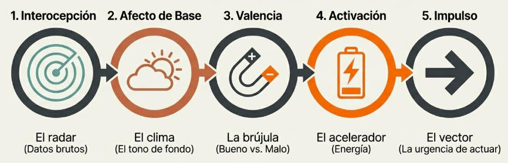
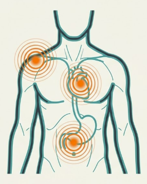
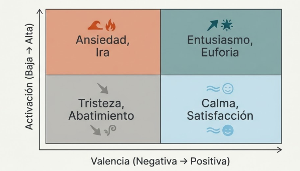
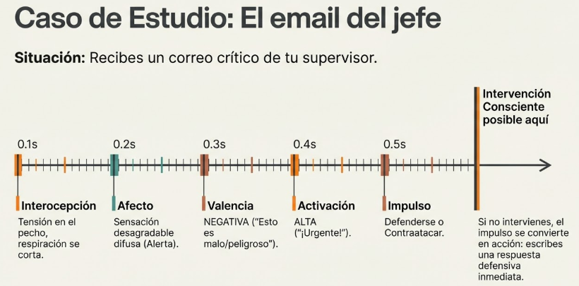

# Tema 3: La cadena automatica de la reaccion

- [Por que este tema es necesario](#por-que-este-tema-es-necesario)
	- [Del cuerpo a la accion](#del-cuerpo-a-la-accion)
- [1. La cadena completa](#1-la-cadena-completa)
	- [1.1 Interocepcion: el punto de partida](#11-interocepcion-el-punto-de-partida)
	- [1.2 Afecto de base: el clima emocional de fondo](#12-afecto-de-base-el-clima-emocional-de-fondo)
	- [1.3 Valencia: la evaluacion automatica](#13-valencia-la-evaluacion-automatica)
	- [1.4 Activacion: el nivel de energia](#14-activacion-el-nivel-de-energia)
	- [1.5 Impulso hacia la accion](#15-impulso-hacia-la-accion)
- [2. La automatizacion con la repeticion](#2-la-automatizacion-con-la-repeticion)
- [Conexiones](#conexiones)
- [Dimension experiencial](#dimension-experiencial)
- [Referencias](#referencias)
- [Material adicional del tema](#material-adicional-del-tema)
	- [Infografías del tema](#infografías-del-tema)

---
## Por que este tema es necesario

#### Del cuerpo a la accion

**Pregunta que responde:**
Como se encadena lo que siento en el cuerpo con lo que hago?

Este tema mapea el mecanismo completo: interocepcion → afecto de base → valencia → activacion → impulso hacia la accion.

Entenderas como el cuerpo "vota" antes de que la mente delibere, y como este proceso se automatiza con la repeticion.

#grafica  Engranajes mecánicos procesando estímulo → percepción → integración sensorial → decisión precognitiva → reacción física.

#ppt  Slide "El cuerpo vota antes de que la mente delibere": mito vs realidad del procesamiento corporal.
#grafica  Línea temporal comparativa: tiempo neural (milisegundos) vs tiempo consciente (~1s).

---

## 1. La cadena completa

#grafica  Los 5 eslabones: interocepción → afecto de base → valencia → activación → impulso.
**Cada decisión tiene un antecedente corporal.** Antes de que la mente consciente evalúe opciones, el cuerpo ya ha emitido su veredicto. Veamos cada eslabon.

#### 1.1 Interocepcion: el punto de partida

La interocepción permite percibir las señales internas del organismo: ritmo cardíaco, respiración, temperatura, tensión muscular. Estas señales actúan como indicadores tempranos del estado emocional. Ese nudo en el estómago antes de un evento social importante es interocepción en acción: el cuerpo comunica algo que la mente aún no ha formulado.

#imagen  Silueta corporal con puntos de señales interoceptivas (pecho, estómago, hombros).

M2 entreno la capacidad de notar estas senales. Ahora vemos que inician una cadena.

---

#### 1.2 Afecto de base: el clima emocional de fondo

El cerebro combina informacion interoceptiva con datos del entorno y la memoria para generar una sensacion general. Este determina si, en un momento dado, la experiencia se tiñe de bienestar, malestar o neutralidad.

No es una emocion nombrada todavia. Es un "clima emocional de fondo".

**El mismo sintoma fisico adquiere significados distintos segun contexto:**

| Corazon acelerado + examen | = Ansiedad |
| Corazon acelerado + cita romantica | = Excitacion |
| Corazon acelerado + ejercicio | = Esfuerzo |

El cuerpo da la senal; el contexto da el significado. El afecto de base opera como un filtro perceptivo: no solo influye en cómo se interpreta la información, sino en qué información llega siquiera a ser relevante.

#grafica  Corazón acelerado + contexto = significado diferente (examen=ansiedad, cita=excitación, ejercicio=esfuerzo).

#### 1.3 Valencia: la evaluacion automatica

La valencia determina si el afecto de base es positivo (placer) o negativo (displacer). Es una respuesta automática que orienta hacia lo que beneficia y aleja de lo que amenaza. Este proceso de placer/displacer genera emociones que impulsan a actuar: acercarse a lo que nutre, alejarse de lo que daña. El cerebro evalua automaticamente: **esto es bueno o malo para mi?**

| Valencia positiva | Valencia negativa |
|-------------------|-------------------|
| Placentero | Displacentero |
| Atrayente | Aversivo |
| Hacia | Lejos |

Esta evaluacion ocurre en milisegundos, sin deliberacion.

Orienta hacia lo que beneficia y aleja de lo que amenaza. Cuando la valencia es negativa, la motivación para reducir el malestar se activa. Puedes decidir evitar el evento social para escapar de la incomodidad, o bien prepararte emocionalmente buscando recursos que reduzcan la tensión.

#grafica  Bifurcación de vías: valencia positiva (placentero→atrayente→"hacia") vs negativa (displacentero→aversivo→"lejos").

#### 1.4 Activacion: el nivel de energia

La activación mide el nivel de energía o urgencia asociado a la emoción. Una activación alta impulsa respuesta rápida y fuerte; una activación baja permite respuesta más calmada.

Si la activación es alta —corazón acelerado, estado de alerta— la urgencia por actuar se intensifica. Si es baja, el margen para respuestas más mesuradas se amplía.

Ademas de valencia, el cerebro evalua: **cuanta energia requiere esto?**

| Alta activacion | Baja activacion |
|-----------------|-----------------|
| Urgente | No urgente |
| Energia alta | Energia baja |
| Respuesta rapida | Respuesta mesurada |

La combinacion de valencia y activacion produce diferentes "sabores" emocionales:

| | Alta activacion | Baja activacion |
|-|-----------------|-----------------|
| **Valencia positiva** | Entusiasmo, euforia | Calma, satisfaccion |
| **Valencia negativa** | Ansiedad, ira | Tristeza, abatimiento |
#grafica  Termómetro de activación: alta (urgente, respuesta rápida) vs baja (no urgente, respuestas mesuradas).

#### 1.5 Impulso hacia la accion

Valencia y activación combinadas guían la decisión final. La valencia indica qué buscar o evitar; la activación determina con qué urgencia. Alta activación y valencia negativa pueden llevar a evitar la situación. Baja activación y valencia negativa pueden permitir asistir al evento, pero con estrategias de manejo preparadas. Valencia + activacion guian la decision:

| Combinacion              | Impulso                          |
| ------------------------ | -------------------------------- |
| Alta activacion negativa | Evitacion urgente (huir, atacar) |
| Baja activacion negativa | Cautela sin urgencia (retirarse) |
| Alta activacion positiva | Busqueda activa (perseguir)      |
| Baja activacion positiva | Mantenimiento (quedarse)         |

Este impulso **precede** a la decision consciente.

#grafica  Cuadrante 2x2: valencia × activación produciendo ansiedad/ira, entusiasmo/euforia, tristeza/abatimiento, calma/satisfacción.

---

## 2. La automatizacion con la repeticion

Con la repeticion, las cadenas se automatizan:

1. La primera vez, la cadena es lenta y consciente
2. Con repeticion, se vuelve rapida e inconsciente
3. El cerebro crea "autopistas de habito"
4. Las autopistas se activan sin intervencion consciente
5. **Cada repeticion fortalece el patron**

Por eso las reacciones habituales son tan dificiles de cambiar: son autopistas bien pavimentadas.

#grafica  Opción 1: Progresión primera vez (camino pedregoso) → repetición (carretera) → hábito (autopista).

#grafica  Opción 2: Primera vez (sentir→camino sinuoso→actuar) vs hábito formado (sentir→autopista rápida→actuar).

#ejemplo
**Situacion:** Recibes un email critico de tu jefe.

1. **Interocepcion:** Tension en el pecho, respiracion superficial
2. **Afecto de base:** Sensacion desagradable difusa
3. **Valencia:** Negativa (esto es malo)
4. **Activacion:** Alta (urgente)
5. **Impulso:** Defenderse/contraatacar

Todo esto ocurre en segundos, antes de que "pienses" que hacer.

#ejemplo  Caso de estudio "El email del jefe": línea temporal 0.1-0.5s mostrando los 5 eslabones hasta la intervención consciente posible.

Si has repetido este patron muchas veces, la respuesta sera automatica: responder inmediatamente, defensivo.

El estado corporal no es ruido de fondo, es información. La interocepción actúa como sistema de monitoreo constante que alimenta el afecto de base, que a su vez tiñe la percepción y orienta las decisiones.

Un afecto de base positivo tiende a promover un enfoque más exploratorio y optimista. Un afecto de base negativo fomenta precaución, evitación y decisiones más conservadoras. Reconocer esta influencia permite distinguir cuánto de una reacción proviene del análisis de la situación y cuánto del estado corporal transitorio.

Esa tensión antes de una conversación difícil, esa irritabilidad residual de una mañana complicada: son datos, no ruido. Lo visible se puede gestionar.

---

## Conexiones

**Conexion con M1

Esta cadena es el Sistema 1 (M1) en accion:

- Opera rapido
- Sin esfuerzo consciente
- El Sistema 2 suele ratificar sin cuestionar

**Conexion con M2

La interocepcion (M2) es el primer eslabon de la cadena.

El cuerpo inicia el proceso. Por eso la consciencia corporal es crucial: permite detectar la cadena temprano.

**Conexion con el programa

Entender esta cadena es prerequisito para:

- **M4:** La respuesta de estres como cadena especifica (la misma estructura, mayor intensidad)
- **M6:** Los "secuestradores" de la atencion operan a traves de estas cadenas

---

## Dimension experiencial #insight

Reflexiona:

- Puedes identificar tu cadena tipica ante una critica?
- Ante una amenaza a tu estatus?
- Ante una decepcion?
- En que eslabon sueles "darte cuenta" de que estas reaccionando?

---

## Referencias

**Otras posibles referencias de interés
- Russell, J.A. (2003). *Core affect and the psychological construction of emotion.* Psychological Review.
- Barrett, L.F. & Bliss-Moreau, E. (2009). *Affect as a psychological primitive.* Advances in Experimental Social Psychology.
- Dolan, R.J. (2002). *Emotion, cognition, and behavior.* Science.

---
## Material adicional del tema #aux
### Infografías del tema 

#infografia  Infografía resumen "La Cadena Automática de la Reacción: Del Cuerpo a la Acción".