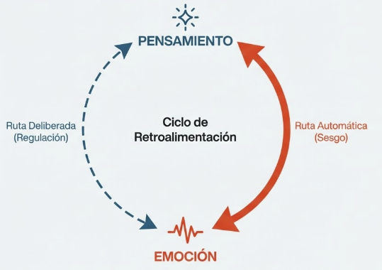

# Tema 5: Los pensamientos moldean las emociones

- [Por que este tema es necesario](#por-que-este-tema-es-necesario)
	- [Bidireccionalidad e intervencion](#bidireccionalidad-e-intervencion)
- [1. La bidireccionalidad](#1-la-bidireccionalidad)
- [2. Estrategias de intervencion](#2-estrategias-de-intervencion)
	- [2.1 Reestructuracion cognitiva](#21-reestructuracion-cognitiva)
	- [2.2 Etiquetado emocional](#22-etiquetado-emocional)
	- [2.3 Reinterpretacion](#23-reinterpretacion)
	- [2.4 Flexibilidad cognitiva](#24-flexibilidad-cognitiva)
- [Conexiones](#conexiones)
- [Dimension experiencial](#dimension-experiencial)
- [Referencias incluidas](#referencias-incluidas)
- [Material adicional del tema](#material-adicional-del-tema)
	- [Infografías del tema](#infografías-del-tema)

---
## Por que este tema es necesario

#### Bidireccionalidad e intervencion

**Pregunta que responde:**
Puedo cambiar lo que siento cambiando lo que pienso?

Este tema introduce la bidireccionalidad: si las emociones influyen en los pensamientos, **tambien los pensamientos pueden moldear las emociones**.

Esta comprension abre posibilidades de intervencion que preparan para T6 (mindfulness).

---

## 1. La bidireccionalidad

Si las emociones influyen en los pensamientos y decisiones, también es cierto que **los pensamientos tienen el poder de moldear y modificar las emociones**. Esta bidireccionalidad abre posibilidades de intervención.

T1-T4 mostraron como las emociones afectan la cognicion:
- Filtran la atencion
- Sesgan la percepcion
- Guian decisiones

Pero la relacion es bidireccional:

#grafica  Ciclo de retroalimentación: pensamiento ↔ emoción, con ruta automática (sesgo) y ruta deliberada (regulación).

Lo que piensas afecta lo que sientes.

Esto no es magia. Es neurobiologia: la corteza prefrontal puede modular la actividad limbica.

#grafica  "Biología, no magia": corteza prefrontal (Sistema 2) modulando top-down al sistema límbico/amígdala (Sistema 1).

---

## 2. Estrategias de intervencion

#ppt  Las 4 estrategias: reestructuración cognitiva, etiquetado emocional, reinterpretación, flexibilidad cognitiva.

#### 2.1 Reestructuracion cognitiva

La reestructuración cognitiva es el proceso de observar y modificar patrones de pensamiento que intensifican o generan emociones negativas. En vez de permitir que la emoción arrastre hacia una reacción inmediata, esta técnica ayuda a desafiar y reformular las ideas que disparan la emoción, generando una perspectiva emocional más equilibrada.

#ejemplo
Alguien recibe un correo ambiguo de su jefe y, sin pensarlo mucho, lo interpreta como desaprobación o enojo. Esta interpretación inicial genera ansiedad o preocupación. Con la reestructuración cognitiva, puede desafiar este pensamiento inicial, considerando otras posibilidades: que su jefe esté ocupado o simplemente haya escrito un mensaje breve. Al cambiar el pensamiento, la emoción de ansiedad se reduce, promoviendo una reacción más calmada.

#grafica  Ejemplo "El Correo Ambiguo": detonante → pensamiento automático (ansiedad) vs pensamiento reestructurado (calma).

#### 2.2 Etiquetado emocional

Nombrar la emocion reduce su intensidad. El etiquetado emocional es el proceso de identificar y nombrar las emociones de manera precisa. Según investigaciones, el acto de poner un nombre a las emociones ayuda a reducir su intensidad y evita reacciones impulsivas. Etiquetar una emoción facilita la autoconciencia y permite observar la emoción sin dejarse llevar por ella.

**Por que funciona:**
- "Estoy sintiendo enojo" activa la corteza prefrontal
- La prefrontal modula la reactividad de la amigdala
- La intensidad disminuye

Lieberman et al. lo demostraron con neuroimagen: verbalizar reduce activacion limbica[^1].

#grafica  "El efecto Lieberman (2007)": reducción de actividad de la amígdala al etiquetar verbalmente la emoción.

#grafica  Tacómetro: de activación alta (sin nombre) a regulación (etiquetado). Distinción lingüística: identidad vs distancia.

#ejemplo
Ante una crítica constructiva, una persona puede sentir una mezcla de emociones: vergüenza y enojo. Etiquetar la emoción ("Estoy sintiendo enojo y vergüenza") activa la corteza prefrontal, lo que ayuda a reducir la reacción inmediata y permite reflexionar sobre la situación sin actuar de manera defensiva o impulsiva.

**Nota:** "Estoy sintiendo enojo" es diferente de "Estoy enojado". La primera formula crea distancia.

#### 2.3 Reinterpretacion

La reinterpretación emocional consiste en cambiar la forma en que se interpreta la fuente de una emoción. Este proceso permite transformar una emoción intensa en una menos negativa o incluso positiva, impactando directamente en las acciones que se toman.

#grafica  Sensación fisiológica como energía bruta: narrativa A (amenaza/miedo) vs narrativa B (recurso/preparación).

#ejemplo 
- La ansiedad pre-presentacion puede reinterpretarse como:
  - "Senal de que me importa"
  - "Energia para rendir"
  - "Preparacion del cuerpo para actuar"

- En lugar de:
  - "Senal de que voy a fracasar"
  - "Evidencia de que no estoy preparado"

La misma activacion fisiologica, diferente significado, diferente experiencia.

#### 2.4 Flexibilidad cognitiva

#grafica  Prisma refractando un evento en múltiples perspectivas: "qué otra explicación", "cómo lo vería alguien de fuera".

La flexibilidad cognitiva es la capacidad de adoptar diferentes perspectivas y adaptar la interpretación de las emociones en función del contexto. Junto con la creación de un espacio entre la emoción y la acción, esta habilidad permite que la emoción no desencadene una respuesta inmediata, sino que abra la oportunidad de decidir la mejor manera de actuar.

#ejemplo
Alguien se siente herido después de un comentario de un compañero de trabajo. La reacción inicial podría ser responder de forma defensiva o resentida. Sin embargo, al practicar flexibilidad cognitiva, puede darse un espacio para reinterpretar la situación: "Quizá no fue personal, solo expresó una opinión diferente". Este cambio de perspectiva reduce la emoción de enojo y permite una respuesta más mesurada.

**Preguntas utiles:**
- "Quiza no fue personal"
- "Que otra explicacion hay?"
- "Como lo veria alguien de fuera?"
- "Como lo vere en un ano?"

La rigidez cognitiva amplifica; la flexibilidad amortigua.

**Ejemplo integral: aplicando el proceso completo

#grafica  "Ejemplo Integral: La Reunión" — escalera paso a paso: detonante → etiquetar → pausa/flexibilidad → reinterpretar → resultado.

#ejemplo
Situación: Una persona debe liderar una reunión importante y siente intenso nerviosismo, acompañado del pensamiento "No estoy suficientemente preparado; voy a fallar".

1. **Etiquetado de la emoción:** Identifica la emoción como ansiedad y nerviosismo. Al nombrarla, empieza a reducir su intensidad, dándose un primer momento de control.

2. **Flexibilidad cognitiva y espacio entre emoción y acción:** En lugar de reaccionar impulsivamente (cancelar o postergar la reunión), se da un momento para observar y cuestionar el pensamiento inicial, considerándolo desde otra perspectiva.

3. **Reinterpretación de la ansiedad:** Al analizar la situación, reinterpreta la ansiedad como señal de que le importa hacer un buen trabajo. Este cambio de enfoque transforma la emoción en motivación positiva.

4. **Resultado:** Se siente más tranquila y enfocada, lista para llevar adelante la reunión con confianza en lugar de paralizarse por la ansiedad.

**Precaucion importante

Moldear pensamientos para regular emociones **no significa**:
- Negar las emociones
- "Pensar positivo" forzado
- Reprimir lo que sientes
- Racionalizar todo

Significa:
- Notar el pensamiento
- Examinar si es preciso
- Considerar alternativas
- Elegir conscientemente

La emocion sigue siendo informacion valida. El punto es no ser arrastrado automaticamente.

#ppt  Slide "Precaución: Regulación ≠ Represión". Lo que NO es vs lo que SÍ es.

---

## Conexiones

**Conexiones con M1

El Sistema 2 (M1) puede intervenir sobre el Sistema 1.

Pero requiere:
- Esfuerzo (recursos cognitivos)
- Practica (fortalece conexiones)
- Consciencia (notar que hay un pensamiento a examinar)

La intervencion no es automatica. Se entrena.

**Conexion con el programa

- **M4:** Usara estas herramientas para regular la respuesta de estres
- **M5:** Las aplicara a emociones interpersonales
- **M6:** Requerira notar los pensamientos antes de poder intervenir

---

## Dimension experiencial #insight

Reflexiona:

- Cuales son tus patrones de pensamiento habituales ante el fracaso?
- Ante el rechazo?
- Los has cuestionado alguna vez?
- Que alternativas podrias considerar?

Las narrativas organizacionales moldean emociones colectivas:

| Narrativa | Emocion colectiva | Capacidad de accion |
|-----------|-------------------|---------------------|
| "Somos victimas del mercado" | Impotencia | Reducida |
| "Somos agentes de cambio" | Empoderamiento | Ampliada |
| "El fracaso es inaceptable" | Miedo | Paralisis |
| "El fracaso es aprendizaje" | Seguridad | Experimentacion |

El lider consciente nota que narrativas fomenta.

---

## Referencias incluidas
[^1]: Lieberman, M.D. et al. (2007). Putting feelings into words: Affect labeling disrupts amygdala activity. Psychological Science.

**Otras posibles referencias de interés
- Gross, J.J. (2015). *Emotion regulation: Current status and future prospects.* Psychological Inquiry.
- Lieberman, M.D. et al. (2007). *Putting feelings into words: Affect labeling disrupts amygdala activity.* Psychological Science.
- Beck, A.T. (1976). *Cognitive Therapy and the Emotional Disorders.* International Universities Press.

## Material adicional del tema #aux
### Infografías del tema 

#infografia  Infografía "El Poder del Pensamiento: Cómo Moldear tus Emociones".