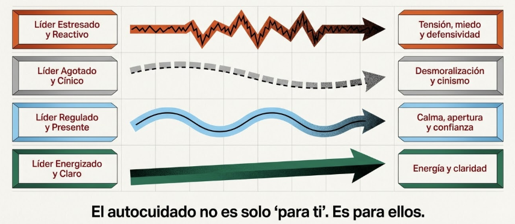
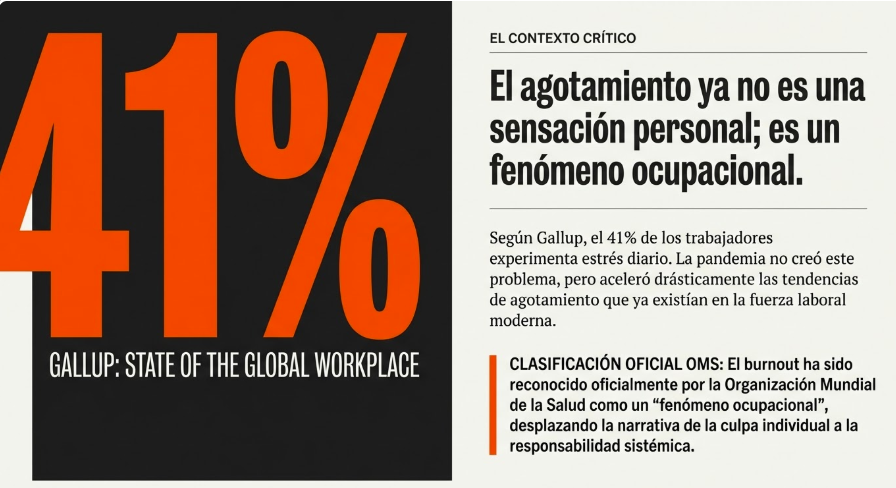

# Tema 1: El autocuidado como fundamento del liderazgo

- [Por que este tema es necesario](#por-que-este-tema-es-necesario)
	- [No es lujo, es necesidad](#no-es-lujo-es-necesidad)
- [1. La falsa narrativa del sacrificio](#1-la-falsa-narrativa-del-sacrificio)
- [2. Autocuidado como competencia de liderazgo](#2-autocuidado-como-competencia-de-liderazgo)
- [3. El contagio emocional](#3-el-contagio-emocional)
- [4. Reencuadre del autocuidado](#4-reencuadre-del-autocuidado)
- [Conexiones](#conexiones)
- [Dimension experiencial](#dimension-experiencial)
- [Referencias incluidas](#referencias-incluidas)
- [Material adicional del tema](#material-adicional-del-tema)
	- [Infografías del tema](#infografías-del-tema)

## Por que este tema es necesario

#### No es lujo, es necesidad

**Pregunta que responde:**
Por que el autocuidado es relevante para mi efectividad como lider, no solo para mi bienestar personal?

Este tema establece la premisa central del modulo: el autocuidado no es indulgencia personal sino requisito funcional del liderazgo efectivo.

Desmonta la narrativa del lider que se sacrifica, reemplazandola por la del lider que se cuida para poder cuidar.

---

## 1. La falsa narrativa del sacrificio

La cultura del liderazgo heroico glorifica el agotamiento:

- "El primero en llegar, el ultimo en irse"
- "Dormir es para los debiles"
- "Mi equipo me necesita disponible siempre"
- "Ya descansare cuando me jubile"

Pero el lider agotado:
- Toma peores decisiones
- Dana relaciones
- Contagia su estado al equipo
- Erosiona su propia salud

El sacrificio no es heroismo. Es insostenibilidad.

#grafica  Metáfora visual de batería corroída: superficie glorificada (frases del liderazgo heroico) y costo oculto (peores decisiones, relaciones dañadas, erosión de salud).

---

## 2. Autocuidado como competencia de liderazgo

#ppt  Tabla comparativa "Lo que NO es" (extra, recompensa, debilidad) vs. "Lo que SÍ es" (claridad mental, regulación emocional, efectividad sostenida).
En el entorno empresarial actual, donde la presión y el ritmo frenético son la norma, el autocuidado se asocia casi exclusivamente al bienestar personal. Esta dimensión es real, pero incompleta. Existe otra que va más allá: el autocuidado **impacta directamente en la efectividad del liderazgo, la calidad de la gestión y la eficacia del equipo**.

El autocuidado no es:
- Un extra
- Una recompensa por haber trabajado mucho
- Tiempo "robado" al trabajo
- Senal de debilidad

El autocuidado **es**:
- Condicion para la claridad mental
- Requisito para la regulacion emocional
- Base de la capacidad de inspirar
- Inversion en efectividad sostenida

---

## 3. El contagio emocional

#grafica  Cuatro estados del líder (estresado, agotado, regulado, energizado) y su efecto propagado al equipo mediante ondas/flechas.

El estado del lider se propaga.

| Estado del lider    | Efecto en el equipo          |
| ------------------- | ---------------------------- |
| Estresado, reactivo | Tension, miedo, defensividad |
| Regulado, presente  | Calma, apertura, confianza   |
| Agotado, cinico     | Desmoralizacion, cinismo     |
| Energizado, claro   | Energia, claridad            |
|                     |                              |

El autocuidado tiene impacto sistemico. No es solo "para ti".

**Datos del contexto actual

#ppt  "41% Gallup: State of the Global Workplace" — el agotamiento como fenómeno ocupacional (OMS).

Los numeros son alarmantes:

- **41%** de trabajadores experimenta estres diario (Gallup)
- Los managers reportan **mas emociones negativas** que los no-managers
- El burnout ha sido reconocido por la OMS como fenomeno ocupacional
- La pandemia acelero tendencias de agotamiento que ya existian

El problema es epidemico. Y los lideres estan en el centro.

---

## 4. Reencuadre del autocuidado

#ppt  Opción 1: Tabla visión tradicional vs. propuesta (tiempo para mí → inversión en capacidad, egoísta → responsable).

| Vision tradicional | Vision propuesta |
|--------------------|------------------|
| "Tiempo para mi" | Inversion en capacidad |
| Robado al trabajo | Condicion para trabajar bien |
| Egoista | Responsable |
| Opcional | Necesario |
| Recompensa | Fundamento |
#ppt  Opción 2: Pirámide de productividad con autocuidado como fundamento → liderazgo/toma de decisiones → resultados.

---

## Conexiones

**Conexion con M1-M3

Todo lo aprendido sobre arquitectura mental, cuerpo y emociones **se deteriora bajo estres cronico**:

| Lo que aprendiste                      | Lo que el estres hace           |
| -------------------------------------- | ------------------------------- |
| M1: Sistema 2 puede modular al 1       | El estres colapsa el Sistema 2  |
| M2: El cuerpo informa                  | El estres desconecta del cuerpo |
| M3: Espacio entre estimulo y respuesta | El estres cierra el espacio     |

M4 muestra como proteger esas capacidades.

**Conexion con el programa

M4 prepara para M5: **no puedo extender consciencia hacia el otro si mi propia consciencia esta colapsada por la presion**.

El orden importa: primero cuido de mi para poder cuidar de otros.

---

## Dimension experiencial #insight

Reflexiona:

- Cuando fue la ultima vez que priorizaste tu recuperacion?
- Que narrativa tienes sobre el autocuidado? (lujo? debilidad? recompensa?)
- Que le dirias a un miembro de tu equipo que estuviera agotado? Te dices lo mismo a ti?

Las organizaciones que penalizan implicitamente el autocuidado:

- Cultura de "siempre disponible"
- Recompensa a quien sacrifica mas
- Silencio sobre el agotamiento
- Expectativas de respuesta inmediata

Estan erosionando la efectividad de sus lideres.

Las organizaciones inteligentes cultivan el autocuidado como competencia estrategica.

---

## Referencias incluidas

**Otras posibles referencias de interés:
- Gallup. *State of the Global Workplace Report.*
- Boyatzis, R. & McKee, A. (2005). *Resonant Leadership: Renewing Yourself and Connecting with Others Through Mindfulness, Hope, and Compassion.* Harvard Business School Press.
- Goleman, D. et al. (2002). *Primal Leadership: Unleashing the Power of Emotional Intelligence.* Harvard Business School Press.

---
## Material adicional del tema #aux
### Infografías del tema 

#infografia  Visión tradicional (mito del sacrificio) vs. propuesta (inversión): contagio emocional, reencuadre del liderazgo y pirámide del autocuidado como condición básica.