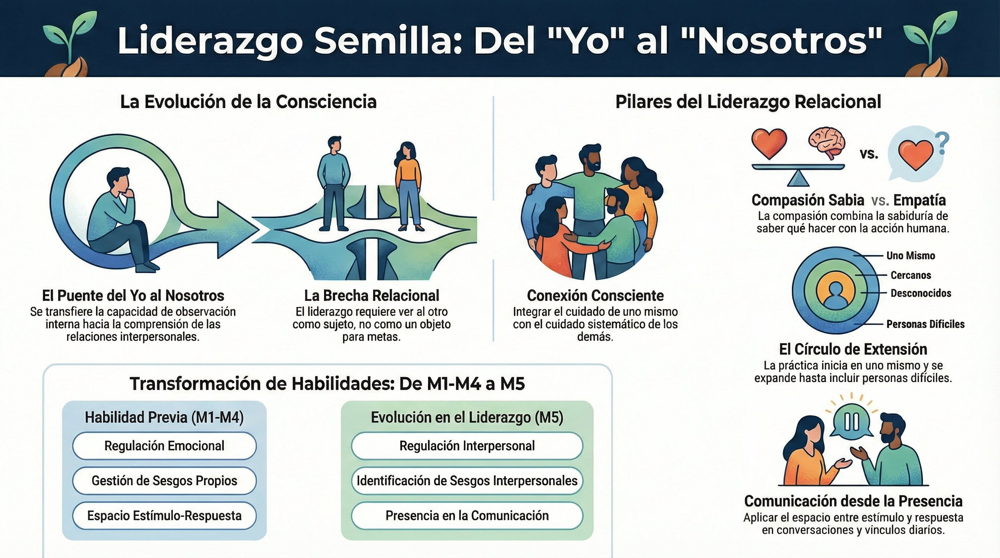

# Modulo 5: Consciente de lo que necesitamos

## Del yo al nosotros: La extension de la consciencia hacia el otro

---

## Lo que traes de M1-M4

Tras los cuatro primeros módulos, el participante:

- Entiende su arquitectura mental: cerebro predictivo, Sistema 1/2, sesgos (M1)
- Reconoce el cuerpo como fuente de información, no mero contenedor (M2)
- Sabe que pensamientos y emociones forman una unidad funcional (M3)
- Ha mapeado la cadena automática: interocepción → afecto → valencia → activación → acción (M3)
- Puede crear espacio entre estímulo y respuesta mediante observación consciente (M3)
- Entiende la respuesta de estrés y por qué se cronifica (M4)
- Conoce herramientas de regulación: pausa de 3 minutos (M4)
- Ha integrado que el autocuidado no es lujo sino necesidad del liderazgo (M4)

**Lo que aún no tiene:** La extensión de esa consciencia hacia el otro. Sabe observarse a sí mismo, pero aún no ha aplicado esa capacidad a las relaciones interpersonales. No tiene un marco para entender cómo los mismos mecanismos (sesgos, reactividad, patrones automáticos) operan en la percepción del otro, ni herramientas específicas para liderar desde la compasión y comunicarse conscientemente.

---

## Pregunta central

_¿Cómo extiendo mi consciencia hacia los demás para liderar con compasión sabia y comunicarme conscientemente?_

---

## Transformacion esperada

Al terminar este modulo, habras integrado:

>> "Del yo al nosotros. La misma consciencia que he cultivado hacia mí mismo se extiende ahora hacia el otro. La compasión no es debilidad ni complacencia; combina sabiduría (saber qué hacer) y acción (hacerlo de manera humana). Puedo escuchar profundamente y comunicarme desde la presencia."

---

## La brecha que M5 cierra

Sabes cuidarte (M4), pero aun no has extendido sistematicamente esa capacidad hacia los demas.

El liderazgo requiere consciencia relacional: ver al otro como sujeto, no como objeto; conectar sin fusionarse; actuar con compasion sin perderse.

---

## Lo que encontraras en este modulo

| Tema | Contenido | Pregunta que responde |
|------|-----------|----------------------|
| T1 | Disenados para la conexion | Estamos hechos para conectar? Cual es la base neurobiologica? |
| T2 | Sesgos interpersonales | Que filtros distorsionan mi percepcion del otro? |
| T3 | La autocompasion como base | Por que debo empezar por mi antes de conectar con otros? |
| T4 | Yo-Tu vs. Yo-Ello | Como veo al otro: como sujeto o como objeto? |
| T5 | Compasion sabia | Cual es la diferencia entre empatia y compasion? |
| T6 | Comunicacion consciente | Como aplico todo esto en las conversaciones? |

---

## Practica de este modulo

**Meditacion de compasion (extension hacia otros)**

La practica central de M5 extiende la consciencia cultivada en M1-M4 hacia otras personas:
- Comenzando por uno mismo (autocompasion)
- Extendiendose a seres queridos
- Incluyendo personas neutras
- Finalmente, personas dificiles

---

## Conexion con el programa

| M5 extiende | Hacia |
|-------------|-------|
| La regulacion emocional (M4) | Regulacion emocional interpersonal |
| La aceptacion (M4) | Aceptacion del otro |
| El espacio estimulo-respuesta (M3) | Espacio en las relaciones |
| Los sesgos (M1) | Sesgos interpersonales |

---

## Quinta caracteristica del lider semilla

**Conexion consciente:** Extiende su consciencia hacia los demas sin perderse a si mismo.

El lider que solo se cuida a si mismo se aisla.
El lider que solo cuida a otros se agota.
El lider consciente integra ambos.

---

## El arco del programa

```
M1-M4: AUTOCONOCIMIENTO (completado)
  |
  v
M5-M7: EXTENSION
     M5: Consciencia del otro  <-- Aqui estamos
     M6: Metaconsciencia
     M7: Direccion etica
```

M5 abre el segundo arco: la consciencia se extiende mas alla de uno mismo.


#infografia  Mapa del módulo: evolución del "yo" al "nosotros", pilares del liderazgo relacional y transformación de habilidades M1-M4 → M5